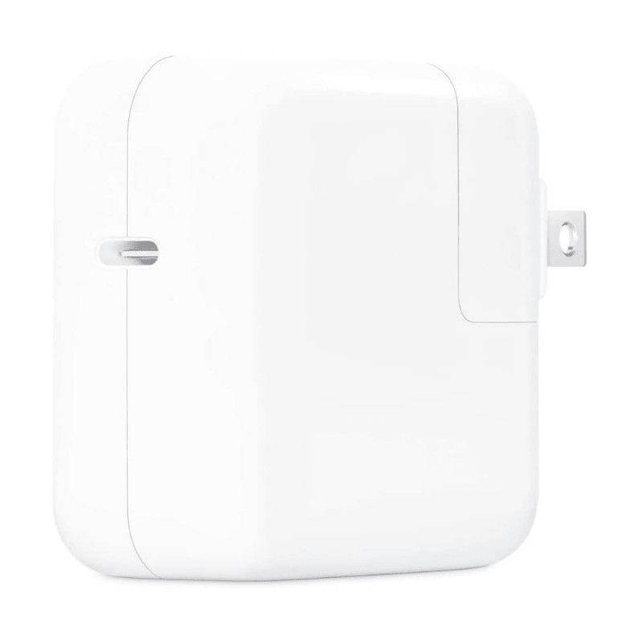
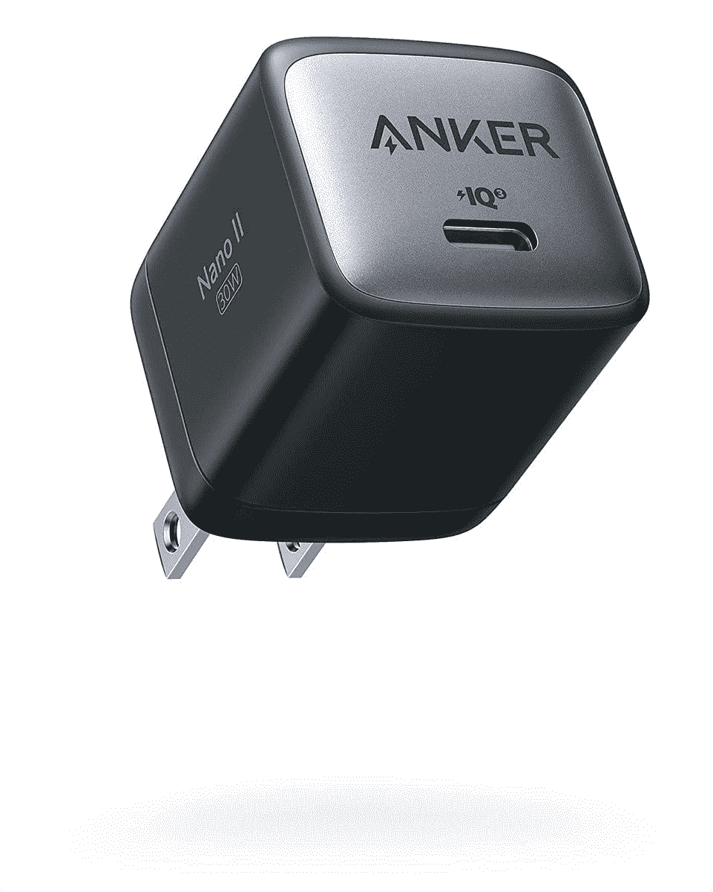
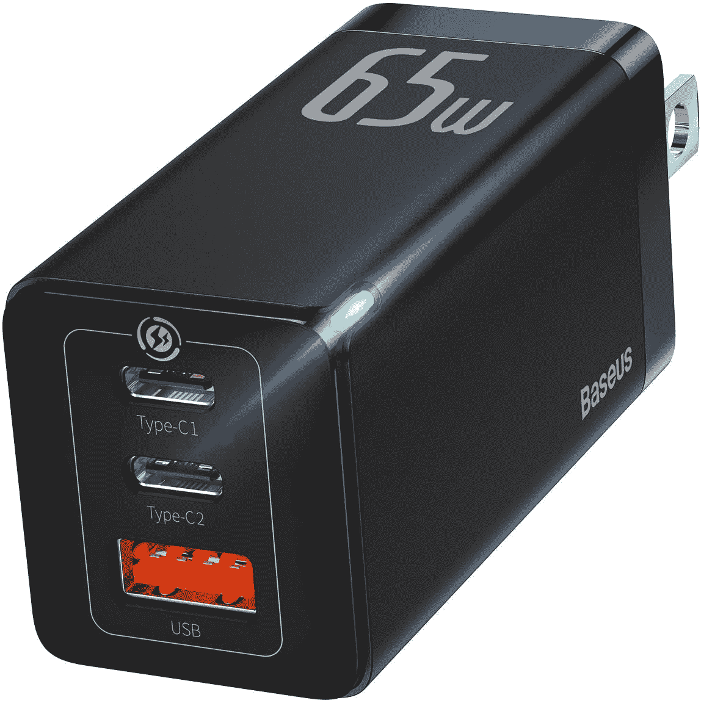
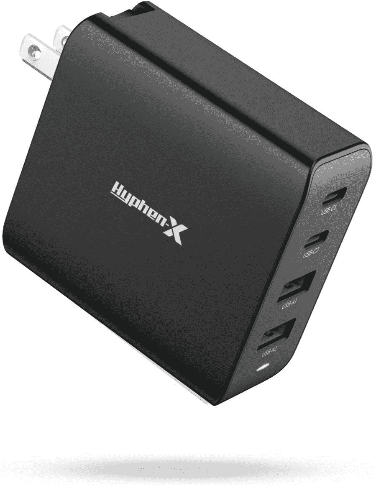
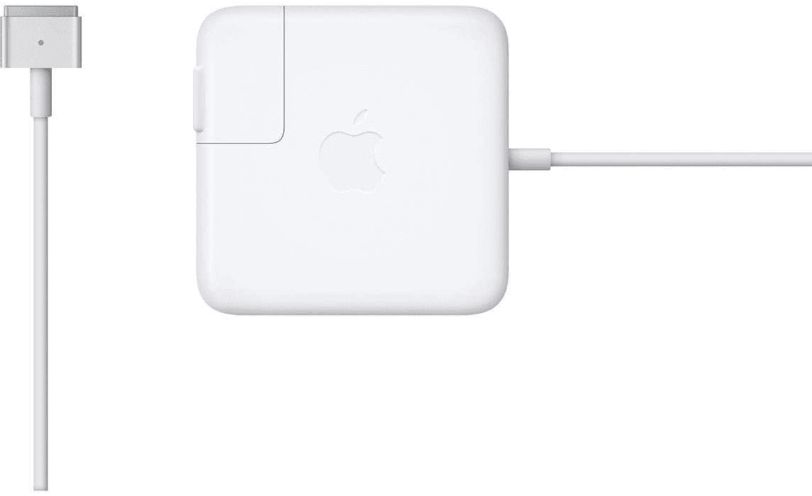
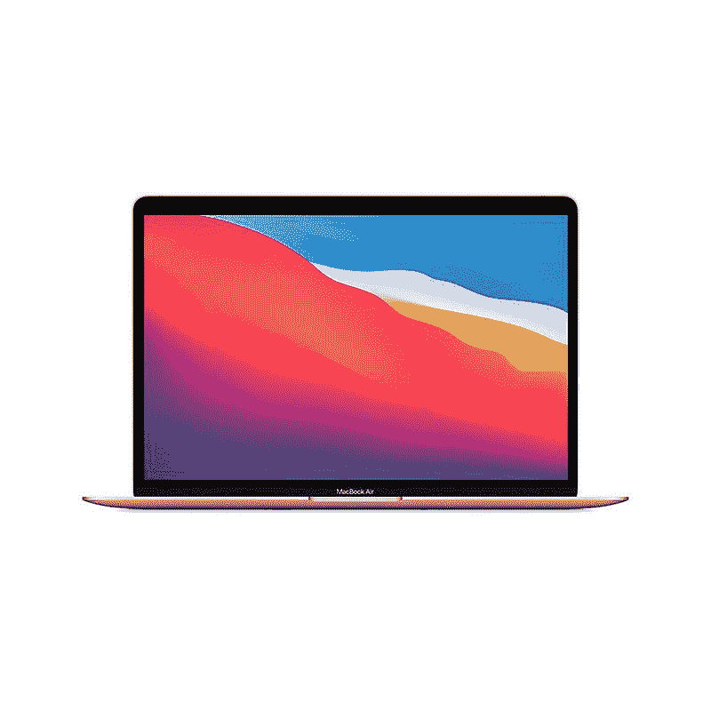

# 2023 年最佳 MacBook Air 替代充电器

> 原文：<https://www.xda-developers.com/best-chargers-macbook-air/>

MacBook Air 是世界上最受欢迎的笔记本电脑之一。它可能不再是周围最轻的笔记本电脑，但特别是因为它在 2020 年更新了苹果 M1 芯片组——现在是 2022 年推出的 M2 型号——它是最强大的超极本之一，当然也是苹果[最好的 MAC 电脑](https://www.xda-developers.com/best-macs/)之一。总的来说，[苹果产品在学生中很受欢迎](https://www.xda-developers.com/best-apple-products-for-students/)，最新的 MacBook Air 也是如此，但这也可能意味着它们会遭遇一些不幸的事件。无论您是丢失了原来的 MacBook Air 充电器还是不知何故损坏了它，您都可能会发现自己需要更换一个。

为了帮助你，我们收集了一些你能为 MacBook Air 找到的最好的替代充电器，无论你是在摇一个最新的型号还是一个旧型号。MacBook Air 最近的大部分迭代都是通过 USB Type-C 充电，但 2022 款也支持新的 MagSafe 3 充电器。旧型号仍然使用 MagSafe 2，甚至旧型号可能仍然使用原始的 MagSafe 设计，但对于这么旧的东西，你可能只想考虑[购买一台新的笔记本电脑](https://www.xda-developers.com/best-laptops/)。也就是说，这里有一些你能为你的 MacBook Air 买到的最好的充电器。

*   <picture></picture>

    苹果 30W USB-C 电源适配器

    ##### 苹果 30W USB-C 电源适配器

    这是苹果为 MacBook Air 准备的基本型 30W 充电器，就像包装盒里的那个一样。它有一个 USB-C 端口，你可以使用 USB-C 到 USB-C 电缆或 MagSafe 3 电缆。

*   <picture></picture>

    苹果 67W USB-C 电源适配器

    ##### 苹果 67W USB-C 电源适配器

    2022 款 MacBook Air 自带快速充电支持，如果你想使用它，你会需要这个电源适配器。它还有一个 USB-C 端口，你必须单独购买一根电缆，无论是 USB-C 电缆还是 MagSafe 3 电缆。

*   <picture></picture>

    Anker Nano II 30W

    ##### Anker 711 Nano II 30W 充电器

    想在旅行时节省包里的空间？Anker Nano II 是一款超紧凑的氮化镓充电器，可以提供 MacBook Air 所需的 30W 功率，但封装更小。

*   <picture></picture>

    Spigen 40W 双 USB C 壁式充电器

    ##### Spigen 40W arc station Pro 双 USB-C 充电器

    当您需要为笔记本电脑以外的设备充电时，这款 Spigen 充电器带有两个 USB Type-C 端口，总共 40W。如果你插上两个设备，它的充电速度不会那么快，但它仍然可以工作。

*   <picture></picture>

    亚马逊基本款 30W GaN USB-C 壁式充电器

    ##### 亚马逊基本款 30W GaN USB-C 壁式充电器

    如果你想要一个尽可能便宜的新充电器，亚马逊基本款 30W 充电器就能满足你的需求，而且是这个列表中最便宜的选择。它也很小巧，有两种颜色。

*   <picture></picture>

    Baseus 65W GaN 充电器

    ##### Baseus 65W GaN 3 端口充电器

    如果你想同时给多个设备充电，这款 Baseus 充电器有三个端口，包括一个 USB Type-A 输出，用于兼容更多设备。凭借 65W 的功率，它可以轻松为您的笔记本电脑、手机和平板电脑充电。

*   ##### Anker 747 电源组

    Anker 747 电源组包括一个壁式充电器，因此您可以在家中或外出时为您的笔记本电脑充电。

    T34
*   <picture></picture>

    Hyphen-X 100 w 4 口 USB 充电器

    ##### Hyphen-X 100 w 4 口 PD GaN 充电器

    说你要去旅行，带上一堆设备你想带走你所有的电源适配器吗？这款 Hyphen-X 充电器共有四个端口，可为您的笔记本电脑、平板电脑、手机或任何您需要的东西充电。

*   <picture></picture>

    苹果 45W MagSafe 2 电源适配器

    ##### 苹果 45W MagSafe 2 电源适配器

    还在摇一摇基于 MagSafe 2 的 MacBook Air？别担心，你仍然可以直接从苹果公司获得原装的 45W MagSafe 2 充电器，它可以让你的笔记本电脑顺利充电。

就是这样！无论你使用的是最新的 MacBook Air 型号还是旧型号，丢失或损坏充电器都不一定是世界末日。你可以直接从苹果公司获得官方替代品，尽管你也需要一根电缆，比如这条直接从苹果公司购买的 [USB-C 到 MagSafe 3 的电缆](https://www.amazon.com/Apple-MLYV3AM-A-USB-C-Magsafe/dp/B09JR6YFQT?tag=xda-2eagpci-20&ascsubtag=UUxdaUeUpU5820&asc_refurl=https%3A%2F%2Fwww.xda-developers.com%2Fbest-chargers-macbook-air%2F&asc_campaign=Commerce)。许多第三方选项更便宜，包括 USB-C 到 USB-C 电缆，如果你想要最紧凑的解决方案，你甚至可以得到像 [Hyphen-X 100W 充电器](https://www.amazon.com/Charger-Hyphen-X-Compatible-MacBook-Devices/dp/B08LNPCLD3/?tag=xda-2eagpci-20&ascsubtag=UUxdaUeUpU5820&asc_refurl=https%3A%2F%2Fwww.xda-developers.com%2Fbest-chargers-macbook-air%2F&asc_campaign=Commerce)这样你就可以轻松地保留你的所有设备，而不占用你墙上的一堆插座。

由于 USB Type-C 是一个如此常见的标准，其中一些充电器也可以在其他设备上工作。当今许多最好的笔记本电脑也支持 USB Type-C 充电，因此购买一个强大的充电器是一个好方法，以备您更换笔记本电脑时使用。如果你目前没有 MacBook Air 或者你正在寻求升级，你可以购买下面的最新型号，或者如果你需要更多的功能，可以看看 [MacBook Pro 2021](https://www.xda-developers.com/macbook-pro-2021/) 型号。

##### 苹果 MacBook Air (2022)

2022 款 MacBook Air 提供 M2 芯片、13.6 英寸显示屏和支持 MagSafe 3 的重新设计的机箱。它功能强大，几乎可以处理任何类型的工作。

 <picture></picture> 

MacBook Air (Apple M1)

##### 苹果 MacBook Air (M1，2020 年)

由于苹果 M1 芯片的功能，最新的 MacBook Air 是一款轻便而强大的笔记本电脑。