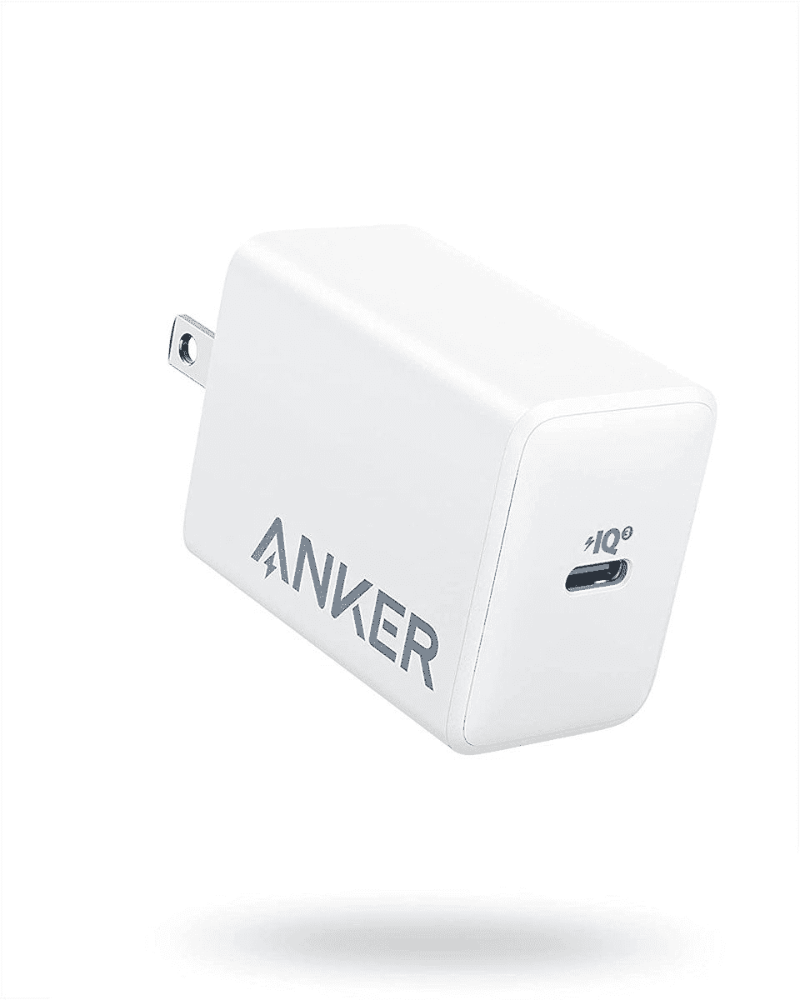
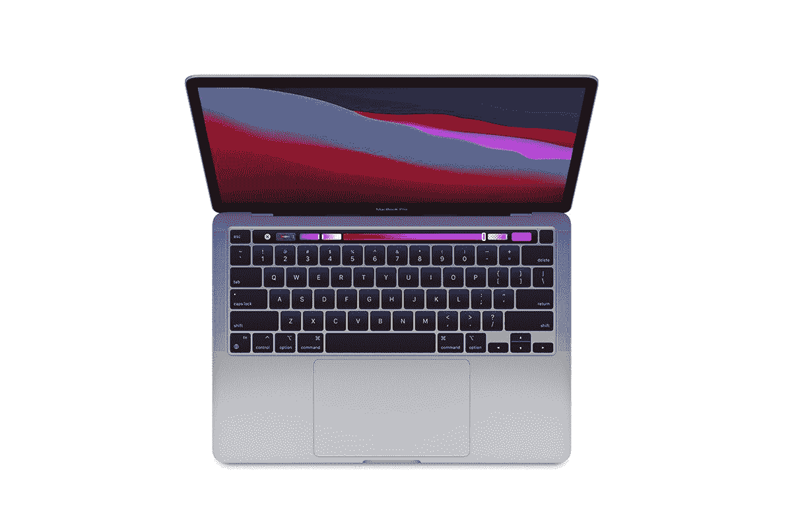

# MacBook Pro 的最佳替代充电器

> 原文：<https://www.xda-developers.com/best-chargers-macbook-pro/>

当你花 1000 多美元买一台像 MacBook Pro 这样的高端笔记本电脑时，很自然地你会希望它尽可能地耐用，这包括充电器。当然，意外确实会发生，你仍然可能会弄坏或丢失充电器，但这不是停止使用笔记本电脑的理由。市面上有很多替代充电器，所以你可以很容易地找到一个适合你的 MacBook Pro 的充电器。

找到 MacBook Pro 充电器其实很容易，因为苹果公司多年来一直使用 USB Type-C。该行业的其他公司花了更长一点的时间来实现这一转变，但绝大多数(如果不是所有的话)今天最好的 Windows 笔记本电脑都使用 USB 供电。这意味着这些充电器无处不在，而且不缺乏选择。2021 年以后发布的新型号也支持新的 MagSafe 3 充电连接器，但你可以选择你喜欢的任何一种方法，大多数充电器都不包括电缆，所以电源适配器本身可以是一样的，你只需要合适的电缆。

如果你还在用 MagSafe 2 摇一摇旧的 MacBook Pro，我们最后也有一些选项。

*   <picture></picture>

    苹果 67W USB-C 电源适配器

    ##### 苹果 67W USB-C 电源适配器

    苹果官方的 67W 充电器足以为 13 英寸的 MacBook Pro 充电，也可以处理更大的 14 英寸型号，采用 8 核 GPU。如果你有一个更强大的模型，虽然，你可能会想要更多的权力。

*   ##### 苹果 96W USB-C 电源适配器

    对于 MacBook Pro 那些更强大的型号，你会想要一个强大的充电器，它不会比苹果自己的 96W 电源适配器好多少。这将为您提供 MacBook Pro 所需的所有功能。

*   <picture></picture>

    Anker power port III Pod Lite

    ##### Anker power port III 65W Pod Lite

    Anker power port III Lite 是 13 英寸 MacBook Pro 的另一个伟大选择，提供 65W 的功率，足以为如此高效的机器供电。它非常紧凑，但仍然非常快。

*   ##### Nekteck 100W GaN USB-C 充电器

    没有多少 USB-C 充电器像 Nekteck 的这款一样快，而且价格也相当实惠。凭借 100W 的功率，它可以处理所有的 MacBook Pro 型号，这款实际上包括一根电缆，所以你不需要担心这一点。

*   <picture></picture>

    Anker 735 GaN 充电器

    ##### Anker 735 GaN prime 65W 充电器

    Anker 735 GaN 充电器共有三个端口，可以用来为手机或其他设备充电，让您的功能更加丰富。它更适合 13 英寸的 MacBook Pro，但如果你同时使用多个端口，它的充电速度会更慢。

*   ##### Hyphen-X 100W 4 端口 PD GaN 充电器

    如果给多个设备充电是你的优先选择，那么 Hyphen-X 的这款充电器是更好的选择。它的价格实际上很合理，但它有四个端口，总功率为 100W，因此即使插上其他设备，它也可以为你的 MacBook Pro 充电。不过，你需要有自己的电缆。

*   ##### Belkin boost charge Pro 108 w GaN 4 端口充电器

    Belkin 的这款充电器更好，但价格更高。它的功率略高，为 108 瓦，但更重要的是，它从主端口提供了更多的功率。主 USB-C 端口本身支持 96W 的功率，但即使你使用其他端口，它也将始终支持 65W，因此它始终足以为 MacBook Pro 供电。

    T17
*   <picture></picture>

    可插拔的 Thunderbolt 坞站

    ##### 可插拔的雷电 3 坞站

    充电器不仅仅具有充电功能，可插拔的雷电 3 坞站是扩展 MacBook Pro 功能的绝佳方式。它有大量的端口，包括 USB Type-A、HDMI、DisplayPort 和以太网，除了为您的笔记本电脑提供 96W 的电源之外，所有这些都只有一个端口。

*   <picture></picture>

    苹果 85W MagSafe 2 电源适配器

    ##### 苹果 85W MagSafe 2 电源适配器

    如果你还在摇晃一台 2016 年之前的 MacBook Pro，并且对它很满意，你可能只是想得到一个不错的旧 MagSafe 充电器。和往常一样，苹果官方的适配器你真的不会错，而且 85W 的功率，应该可以适用于所有尺寸的 MacBook Pro。

如果你有 MacBook Pro，这应该会给你提供很多充电器选择。你有一些官方的，但价格昂贵的，以及许多第三方的选择，更便宜或更强大(或两者兼而有之)。可以说，使用官方选项总是最好的，但由于像 USB 供电这样的标准，你应该可以使用这些选项。例如，如果你想减少插座上的杂乱，Hyphen-X 或 Belkin 充电器可能会特别有趣。

苹果电脑长期以来在大学生中相当流行，这是因为它们是他们的最佳选择之一。如果你正在考虑购买一台苹果电脑，你可以随时查看我们的[最佳苹果电脑](https://www.xda-developers.com/best-macs/)列表。如果你是 MacBook Pro，你可以在下面找到 [MacBook Pro 13](https://www.xda-developers.com/apple-macbook-pro-13-inch-m2-2022-review/) ，MacBook Pro 14 和 [MacBook Pro 16](https://www.xda-developers.com/apple-macbook-pro-2021-m1-max-review/) 。

*   <picture></picture>

    MacBook Pro(2022)

    ##### 苹果 MacBook Pro 13 英寸(2022)

    2022 款 MacBook Pro 13 英寸配备了苹果 M2 处理器，承诺在高效的同时提供更高的性能，因此您可以获得出色的电池续航时间。

*   <picture></picture>

    MacBook Pro 16

    ##### 苹果 MacBook Pro 14 英寸(2021)

    最新的 MacBook 14 英寸由苹果 M1 Pro 或 M1 Max 驱动，在提供惊人性能的同时仍然拥有出色的电池续航时间。

*   ##### 苹果 MacBook Pro 16 英寸(2021)

    16 英寸的 MacBook Pro 与 14 英寸的型号类似，尽管配备了更大的显示屏和电池。由于更大的设计中更好的冷却，它甚至更快，同时效率也一样高。

    T34