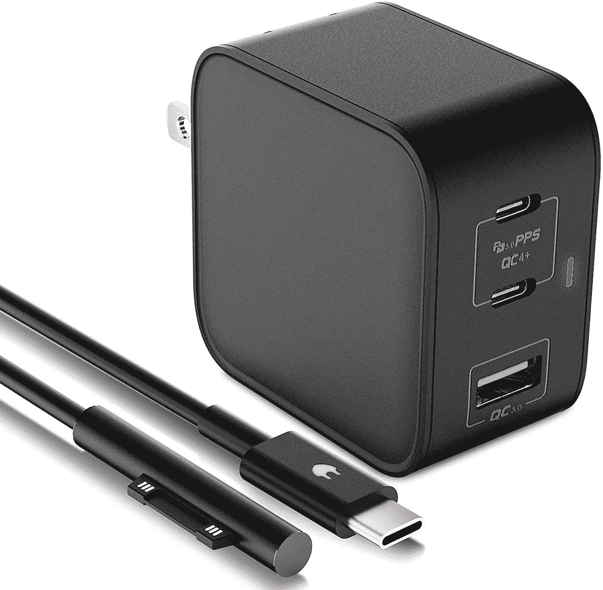

# 微软 Surface Laptop 4 的最佳替代充电器

> 原文：<https://www.xda-developers.com/best-chargers-microsoft-surface-laptop-4/>

[Surface Laptop 4](https://www.xda-developers.com/microsoft-surface-laptop-4-review/) 是目前微软[最好的 Surface PC](https://www.xda-developers.com/best-microsoft-surface-pcs/)之一。它拥有传统的笔记本电脑外形，但它配有触摸屏支持和其他地方找不到的高级设计。由于其高端规格，它还具有顶级的性能。但即使是高端产品也会出现问题，你可能会发现自己出于任何原因需要一个新的充电器。为了帮助你，我们为微软 Surface Laptop 4 收集了一些最好的充电器。

与其他微软 Surface 设备类似，Surface Laptop 4 支持两种充电方式。你可以使用 Surface 连接器，就像盒子里的充电器一样，或者你可以走 USB Type-C 路线。表面连接器是磁性的，这是它最大的优点。如果你被充电电缆绊倒，它只会断开连接，而不是把你的笔记本电脑拖到地板上或拧动插头。另一方面，USB Type-C 适用于所有类型的设备，所以你可以为你的手机或未来的笔记本电脑使用相同的充电器。这两种方法都有几种充电器可供选择。

*   ##### Surface 65W 电源

    如果你只能相信原装品牌，微软出售一款 65W 的替换充电器，它提供的功率与 Surface Laptop 4 自带的充电器完全相同。这是一个昂贵的选择，但你会得到官方产品的可靠性和保修。

*   ##### 微软 Surface Dock 2

    Surface Dock 2 不仅可以以非常高的速度为你的微软 Surface 笔记本电脑 4 充电，还可以帮助你在办公桌上连接大量的外设。它有两个 USB Type-C 显示输出、USB Type-A 端口和以太网。

*   ##### E EGOWAY Surface Pro 充电器

    如果微软官方充电器对你来说有点太贵，E EGOWAY 的这款替代品可以以低得多的价格为你提供相同的功率。这是一个评价很高的替代品，可以与大多数现代 Surface 设备配合使用。

*   <picture></picture>

    TOMSENN 65W 充电器适用于 Surface

    ##### TOMSENN 65W PD 充电器

    如果你想给你的 Surface Go 3 等设备充电，这款来自 TOMSENN 的 65W 充电器是一个很棒的选择。它有标准的 USB 端口，但包括一根 Surface Connect 电缆，所以你可以通过磁力为 Surface Go 3 充电，并插入其他 USB 充电器。

*   <picture></picture>

    bat Power ProE 2 电源组和充电器

    ##### bat Power ProE 2 ES7B 电源组

    想在外出时为您的 Microsoft Surface 笔记本电脑 4 充电吗？BatPower ProE 2 是为数不多的配有表面连接器电缆用于充电的电源组之一，此外，如果你想直接插入插座，它还包括一个 DC 适配器。它提供高达 95 瓦的功率，远远超过您的需求。

*   ##### Hyphen-X 100W 4 口 PD GaN 充电器

    这款 Hyphen-X USB Type-C 充电器不仅可以通过一个 USB Type-C 口输出高达 100W 的功率，而且可以同时为多个设备充电。这将是你所有设备唯一需要的充电器。

*   ##### Anker 715 充电器(Nano II 65W)

    这是 Anker 的一款微型充电器，但它可以提供 65W 的额定功率，对于 Surface Laptop 4 来说绰绰有余。它也比官方充电器更实惠，而且它有一个 USB-C 端口，因此它可以与大多数设备配合使用。

    T17
*   ##### Anker 747 电源组

    Anker 747 套装包括一个 26，000mAh 的电源组，可为您的笔记本电脑提供高达 87W 的功率，外加一个 65W 的壁式充电器，可为电源组备份充电，或自行为笔记本电脑充电。

*   ##### Baseus 160 w USB PD 3.0 车载充电器

    如果你需要在乘车期间为笔记本电脑充电，这款 Baseus 充电器可以从其主端口提供高达 100W 的功率，此外还可以为你的手机或其他设备充电。

    T37

无论您的使用情况如何，这些充电器选项都应该可以覆盖您和您的 Surface Laptop 4。无论您是需要在办公室充电，在机场等候，还是在开车时充电，这里都有适合每个人的东西。如果你想更换一个坏了的充电器，微软的[原装充电器绝对不会错。然而，像](https://www.amazon.com/Microsoft-Surface-Power-Supply-Laptop/dp/B01698T1TC?tag=xda-i3n60u6-20&ascsubtag=UUxdaUeUpU31600&asc_refurl=https%3A%2F%2Fwww.xda-developers.com%2Fbest-chargers-microsoft-surface-laptop-4%2F&asc_campaign=Commerce) [E EGOWAY](https://www.amazon.com/Adapter-Charger-Microsoft-Surface-Charging/dp/B07GH9H1CY?tag=xda-i3n60u6-20&ascsubtag=UUxdaUeUpU31600&asc_refurl=https%3A%2F%2Fwww.xda-developers.com%2Fbest-chargers-microsoft-surface-laptop-4%2F&asc_campaign=Commerce) 充电器这样的廉价替代品也非常诱人。如果你想在路上充电， [BatPower ProE 2](https://www.amazon.com/dp/B076P4P93T?tag=xda-i3n60u6-20&ascsubtag=UUxdaUeUpU31600&asc_refurl=https%3A%2F%2Fwww.xda-developers.com%2Fbest-chargers-microsoft-surface-laptop-4%2F&asc_campaign=Commerce) 电源组非常独特，因为它包括一个表面连接器。

如果你更看重跨设备兼容性，你也可以选择 USB Type-C。如果你最终更换了笔记本电脑，你可以继续使用它们，或者用它们给手机充电。例如，Anker 715 充电器是一个很好的选择，可以轻松带到任何地方。然而，这些充电器无法与没有 USB Type-C 的旧款 Surface 设备配合使用。

如果你对 Surface Laptop 4 感兴趣，可以从下面的链接购买。，不过如果可以的话，我们还是建议你试试新款的 Surface Laptop 5。主要有两种型号——一种是 13.5 英寸显示屏，一种是 15 英寸显示屏。两者使用的都是同类型的充电器，所以不需要担心兼容性问题。也有 AMD 和 Intel 处理器的变体，AMD 型号提供更好的电池寿命，但 Intel 型号性能更好。尽管如此，AMD 变种是你能买到的最好的高级 AMD 笔记本电脑之一，所有型号都将支持升级到 Windows 11。如果你还在寻找其他选择，你也可以查看我们的[最佳笔记本电脑](https://www.xda-developers.com/best-laptops/)列表。

 <picture></picture> 

Surface Laptop 4 (Ryzen 7/512GB)

##### 微软 Surface Laptop 4

微软 Surface Laptop 4 是一款高端笔记本电脑，采用英特尔和 AMD 处理器选项，设计出众，性能卓越。