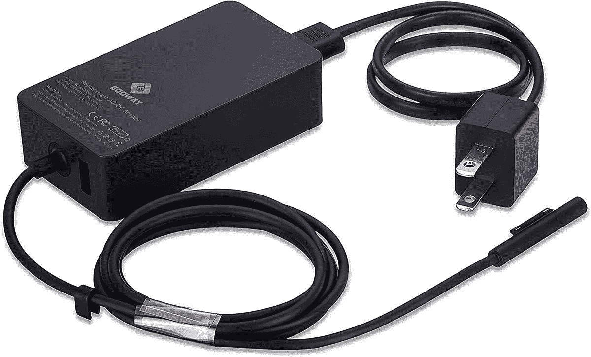

# Surface Pro 7 的最佳替代充电器

> 原文：<https://www.xda-developers.com/best-chargers-surface-pro-7/>

Surface Pro 7 是一款出色的高级笔记本电脑，采用可拆卸设计，性能高端。这是你今天能买到的最好的笔记本电脑之一，但这并不意味着它完全没有问题。有时候，事情只是在一段时间后停止工作，这可能包括你的 Surface Pro 7 附带的充电器。这些事情可能会发生，但谢天谢地，你总能找到替换充电器。

现在，Surface Pro 7 的一个很酷的地方是它实际上支持两种充电方法。它默认使用 Surface 连接器充电，但它也是第一款配备 USB Type-C 端口的 Surface Pro。如果你正在寻找一个充电器，这给了你一些额外的选择，这意味着你可以为多种设备找到一个充电器。

*   ##### Surface 65W 电源

    如果你只能相信原厂品牌，微软确实出售一款 65W 的替换充电器，它提供的功率与 Surface Pro 7 自带的充电器完全相同。这是一个昂贵的选择，但你会得到一个官方产品的可靠性。

*   ##### 微软 Surface 127W 电源

    这款微软品牌的充电器提供的电量远远超过你的 Surface Pro 7 所需的电量，但这意味着如果你有一台 Surface Book 之类的东西，你也可以使用这些额外的电量。通过这种方式，你还可以更快地为 Surface pro 充电。

*   <picture></picture>

    Surface Dock 2

    ##### 微软 Surface Dock 2

    Surface Dock 2 可以提供比你的 Surface Pro 需要更多的功能，但它也可以帮助你在办公桌前连接一堆外设。它有两个 USB Type-C 显示输出、USB Type-A 端口和以太网。

*   <picture></picture>

    E EGOWAY Surface Pro 充电器

    ##### E EGOWAY Surface Pro 充电器

    如果你无法理解微软对充电器的要价，E EGOWAY 的这款替代品可以以低得多的价格为你提供相同的功率。这是一个评价很高的替代品，可以与大多数现代 Surface 设备配合使用。

*   <picture></picture>

    TOMSENN 65W Surface 充电器

    ##### TOMSENN 65W PD 充电器

    这款充电器是一款罕见的采用 USB Type-C 端口并将其变成 Surface 连接器端口的适配器的例子你可以用它以 65W 的功率给 Surface Pro 7 充电，但如果你有一根 USB Type-C 到 Type-C 电缆，你也可以用它给任何兼容的设备充电。它还有一个 USB 型端口，如果你还有那种电缆的话。

*   <picture></picture>

    bat Power ProE 2 电源组和充电器

    ##### bat Power ProE 2 ES7B 电源组

    想要一个可以随时随地为 Surface Pro 7 充电的东西吗？BatPower ProE 2 是为数不多的配有表面连接器电缆用于充电的电源组之一，此外，如果你想直接插入插座，它还包括一个 DC 适配器。

*   ##### Nekteck 100W GaN USB-C 充电器

    如果你宁愿用 USB Type-C 充电，这款充电器可以提供高达 100W 的功率输送。你可以用它给 Surface Pro 7 充电，也可以给其他任何支持 USB Type-C 的设备充电，比如你的手机和其他笔记本电脑。这对互操作性很好。

*   <picture></picture>

    ZMI zPower Turbo

    ##### ZMI zPower Turbo 65W 充电器

    这款充电器可以提供与 Surface Pro 7 自带的适配器相同的 65W 功率，但通过 USB Type-C。你也可以使用它为其他设备充电，而且比官方选项便宜得多。此外，由于氮化镓的使用，它非常紧凑。

*   ##### Anker 747 电源板

    Anker 747 电源板可以以高达 87W 的功率为你的 Surface Pro 7 充电，它包括一个壁式充电器，可以以高达 65W 的功率为你的电源板或笔记本电脑充电。

这为你的 Surface Pro 7 提供了几个不错的充电器选择。如果你碰巧放错了你原来的充电器或者它坏了，这些将让你很容易恢复速度。使用 Surface 连接器的充电器可能更方便，因为它们是磁性的。这意味着如果你被它们绊倒，它们会更容易被拔掉，而不是把你的笔记本拖到地板上。微软的[原装充电器不会错，但是](https://www.amazon.com/Microsoft-Surface-Power-Supply-Laptop/dp/B01698T1TC?tag=xda-48fgii7-20&ascsubtag=UUxdaUeUpU3210&asc_refurl=https%3A%2F%2Fwww.xda-developers.com%2Fbest-chargers-surface-pro-7%2F&asc_campaign=Commerce) [E EGOWAY](https://www.amazon.com/Adapter-Charger-Microsoft-Surface-Charging/dp/B07GH9H1CY?tag=xda-48fgii7-20&ascsubtag=UUxdaUeUpU3210&asc_refurl=https%3A%2F%2Fwww.xda-developers.com%2Fbest-chargers-surface-pro-7%2F&asc_campaign=Commerce) 考虑到其更合理的价格点，提供了一个令人信服的案例。

另一方面，USB Type-C 充电器的兼容性更广。例如，如果你最终更换了笔记本电脑，你可以继续使用它们，或者用它们给手机充电。Nekteck 100W USB-C 充电器提供 100W 的功率，这意味着如果你需要的话，它可以处理比 Surface Pro 7 更强大的笔记本电脑。然而，它们无法与没有 USB Type-C 端口的旧 Surface 设备配合使用。

如果你想升级笔记本电脑本身，你可能想看看微软的其他[伟大的 Surface 设备](https://www.xda-developers.com/best-microsoft-surface-pcs/)，其中大部分也支持这个列表中的充电器。有比 Surface Pro 7 更新的型号，但它们都支持这些充电器。