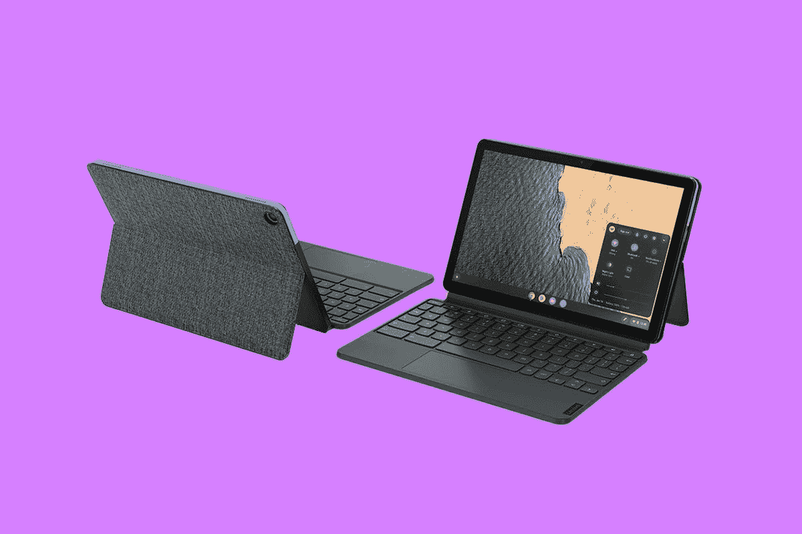
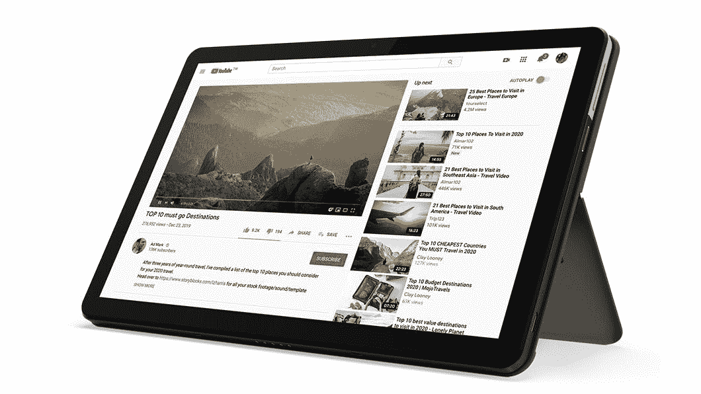
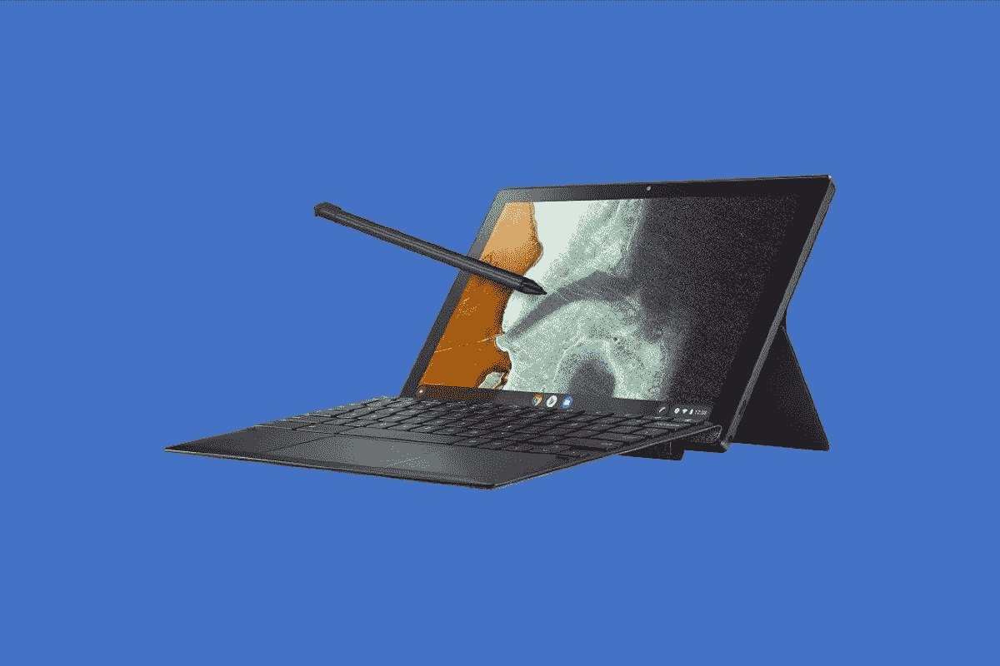

# 2023 年最佳 ChromeOS 平板电脑

> 原文：<https://www.xda-developers.com/best-chrome-os-tablets/>

当你想到目前在许多零售商处出售的平板电脑时，你可能会想到 iPad 或 Android 设备，但不要觉得仅限于这些设备。虽然 chrome book 过去只是传统的翻盖式笔记本电脑，但许多最好的 chrome book 现在也被视为平板设备。这包括可以分离屏幕的平板电脑外形，以及可以转换 Chromebook 以在各种模式下使用的 2 合 1 外形。

这正是我们制作这份购物指南的原因。我们将会看到来自[惠普](https://www.xda-developers.com/best-hp-chromebooks/)以及[宏基、](https://www.xda-developers.com/best-acer-chromebooks/)和三星的一些最好的 ChromeOS 平板电脑。为了您的方便，我们还将设备分为不同的类别。查看并按照下面的指南进行导航。

## 最佳传统平板电脑:联想 Chromebook Duet 5

 <picture></picture> 

Lenovo Chromebook Duet 5

我们的第一款 Chromebook 平板电脑受到了很多人的欢迎。它类似于 iPad Pro 或 Surface Pro。这是[联想 Chromebook Duet 5](https://www.xda-developers.com/lenovo-ideapad-duet-5-chromebook-review/) 。这款 Chromebook 平板电脑包含一些非常好的规格，令人惊叹的显示屏，便携性和扬声器。最重要的是，它在大多数零售商那里都很容易买到，这些零售商也销售像 iPads 这样的竞争产品。这里有一些关于我们为什么如此喜欢联想 Chromebook Duet 5 的更多信息。

我们先来了解一下这款 Chromebook 平板的技术规格。在联想 Chromebook Duet 5 的引擎盖下是第二代高通骁龙 7c 处理器。如果你不熟悉 Chromebook 的规格，那么当你考虑我们在这个列表中选择的其他处理器时，这是一个特殊的处理器。虽然大多数 Chromebooks 都配有英特尔或 AMD 芯片，但这是一款来自高通的基于 Arm 的 Soc。虽然功能不如 M1 iPad，甚至安卓平板电脑，但有了这款平板电脑，你可以无忧无虑地运行安卓应用，享受游戏和流媒体。您还可以毫无问题地浏览网页和进行多任务处理。在我们的复习期间，我们真的很享受。

这款平板电脑的另一个特殊之处与这款显示屏有很大关系。这款 Chromebook 平板电脑没有使用 LCD 或 IPS 面板，而是采用了有机发光二极管显示屏。有机发光二极管显示器可以产生更鲜艳的色彩，达到更高的亮度水平。无论你最终在这款平板电脑的显示屏上看到什么，都会非常逼真，可能比你最终购买的 iPad Air 或类似的 500 美元平板电脑更好。哦，显示器旁边是令人惊叹的四阵列扬声器。这只会让电影听起来更好。

请注意，这款平板电脑附带一个键盘。对于 iPad 或 Surface，这些通常是额外的购买，但有了 Chromebook，你就可以在盒子里得到它。您可以将键盘连接到屏幕底部，并从外壳中拉出支架，将其支撑在膝盖上。然后你可以打印你最喜欢的文件，或者尽情享受浏览网页的乐趣。这也不是一个便宜的键盘，因为当我们评测这款设备时，我们可以毫无问题地开始工作和打字。

就便携性和电池寿命而言，这款平板电脑也很棒。我们不喜欢它只有两个 USB-C 端口，但这仍然比你在 iPad 甚至三星平板电脑上看到的多一个。我们也喜欢电池的续航时间，因为尽管 OLED 面板很耗电，我们还是完成了一整天的工作。

##### 联想 Chromebook Duet 5

联想 Chromebook Duet 拥有充满活力的有机发光二极管显示屏和宽敞的键盘，是 ChromeOS 平板电脑的出差族

## 最佳整体 14 英寸可转换机型:华硕 Chromebook Flip CX5 CX5400

 <picture></picture> 

Asus Chromebook Flip CX5400

正如我们在本文开头所说，Chromebook 二合一设备也可以算作平板电脑。这些现在有各种形状和尺寸，从 11 英寸到 14 英寸和 15 英寸。我们选择了目前我们能找到的最好的 14 英寸，它就是华硕 Chromebook Flip CX5400。它拥有现代的英特尔 CPU，支持手写笔，价格接近 1000 美元，非常时尚。这是关于为什么这个设备吸引我们眼球的独家新闻。

首先从设计开始，这款平板电脑非常坚固，非常时尚。时尚的外观得益于“全蓝”的颜色，与你可能随处可见的黑色和银色 iPads 相比，这种颜色非常突出。此外，平板电脑会经历更多的磨损，尤其是当你考虑到板上的 360 度铰链可以转换时。嗯，这款平板电脑实际上被评为军用级耐用性。它也非常高级，并且具有全金属底盘。但是在这些苛刻的规格下，它仍然非常便携。这款平板电脑厚 0.62 英寸，重 3.09 磅。我们喜欢的另一个设计方面？这是新的“升降铰链”这种铰链可以将键盘倾斜到更舒适的打字角度，这样可以减轻手腕的压力。

现在是最重要的部分，也就是性能。你可能想要最新最好的 Chromebook，在这方面，华硕 Chromebook Flip CX5400 不会让人失望。它采用第 11 代英特尔酷睿处理器。现在是最后一代，但有两种选择，英特尔酷睿 i3-1115G4 或英特尔酷睿 i7-1165G7。这两个 CPU 都非常快。你可以在 Google Workspace 中轻松完成简单的事情，在 Chrome 中轻松进行多任务处理。请注意，这款二合一设备拥有 8GB 内存和传统的 128GB 固态硬盘。这种组合有助于使系统感觉更有效率。

当然，在 2 合 1 平板电脑上，显示屏很重要。你不想要低分辨率的屏幕，你想支持像手写笔这样的东西。在这些情况下，这个华硕通过了我们的标准。它有一个 1920 x 1080 分辨率的全高清显示屏。它还有一个 garaged 手写笔，可以塞进设备的侧面，用于绘图应用程序或笔记应用程序。您将能够享受网页上的每一个清晰细节，将设备翻转到帐篷或平板电脑模式，然后坐下来欣赏您最喜爱的电影和其他内容。

即使作为平板电脑，也仍然有很多端口。这台华硕配备了 USB 3.1 Gen 1 Type-A、Thunderbolt 4、MicroSD 读卡器和耳机插孔。这是一个很棒的现代组合，但你最终还是需要使用加密狗来连接显示器。

##### 华硕 Chromebook Flip CX5 (CX5400)

华硕 Chromebook Flip CX5 采用研究设计、第 11 代英特尔 CPU 和一支带车库的笔，是 2022 年你可以买到的最好的华硕 Chromebook。

## 最适合年幼儿童的可拆卸产品:联想 Chromebook Duet

 <picture></picture> 

Lenovo Chromebook Duet

我们重点介绍了你能买到的最好的 Chromebook 平板电脑，但我们还想提一下第二个选择。它是联想 Chromebook Duet 5 的小兄弟，是年幼儿童的完美设备。这个叫做[联想 Chromebook Duet](https://www.xda-developers.com/lenovo-ideapad-duet-3-chromebook-review/) 。这款 Chromebook 平板电脑很小巧，配有键盘，有可选的笔支持，真的很便携。它也非常适合运行 Android 应用程序。

先说整体设计。这款设备可以搭配全尺寸、舒适、反应灵敏的键盘使用，也可以拆卸下来用作 10.1 英寸的平板电脑。五点弹簧针和磁铁设计使其易于连接和拆卸，在任何模式下都很轻薄，平板电脑的厚度为 0.29 英寸，不到 1 磅，键盘的厚度为 0.71 英寸，2.03 磅。我们认为小巧紧凑的设计非常适合手比较小的孩子。作为一个有孩子的成年人，它也很棒，因为你可以将这款平板电脑放在包里或婴儿车中，在你认为合适的时候交给孩子。没那么重！除此之外，这款平板电脑还采用了独特的冰蓝色和铁灰色双色调设计，支架盖上有精致的织物纹理。它看起来比普通的铝制 iPads 时尚多了。

至于这款平板电脑的动力是什么，在内部，Duet 由联发科 Helio P60T 处理器驱动。作为一款基于 Arm 的 Soc，这款处理器还算不错。它的运行频率为 2.00 GHz，拥有 8 个内核和 8 个线程。板载还焊接了 4 GB LPDDR4 RAM 和 64 GB eMMC 存储。这是一大堆技术术语，但是请相信我们。我们认为这些基于 Arm 的 Soc 非常适合运行 Android 应用程序和玩 Android 游戏。这是典型的孩子最终可能会做的事情。此外，由于附带了键盘套，您的孩子也可以用它来做作业和浏览谷歌浏览器，以使用谷歌工作区等教育应用程序。

在这款平板电脑的显示屏上，我们发现很难抱怨。是的，显示屏只有 10 英寸，非常小，但对于孩子来说，这是完美的。无论如何，他们不会做太多的多任务处理，更有可能的是，他们只想看电影或观看流媒体内容。凭借 1920 x 1080 FHD 分辨率，这是伟大的。

 <picture></picture> 

Lenovo Chromebook Duet

##### 联想 Chromebook Duet

如果你想要一台可以转换成真正的平板电脑体验的 Chromebook，联想 Chromebook Duet 是一个很好的选择。与其他 2 合 1 设计不同，键盘完全可拆卸，带来轻薄的平板电脑体验。

## 最适合企业:惠普蜻蜓 Chromebook

 <picture></picture> 

HP Elite Dragonfly Chromebook

现在，我们来看看商务版 Chromebook 平板电脑。是的，没错。Chromebook 平板电脑也可以用于商务。惠普最近推出了一款花钱能买到的最好的 Chromebooks，我们认为它是最好的商务平板电脑。从屏幕到规格，这款惠普蜻蜓 Chromebook 很难让人错过，尽管它的价格相当高。但这是一款 Chromebook 平板电脑，可以与苹果甚至微软的最佳产品相抗衡。请听我们说说是什么让我们做出了这一选择，以及我们在回顾这一选择时为什么喜欢它。

首先，在商务中，你需要平板电脑的强大功能。惠普在这款设备上最关注的就是这个。类似于今年驱动最好的 Windows PCs 的东西，惠普在这款 Chromebook 平板电脑中安装了第 12 代英特尔 CPU。这些都是 U 系列芯片，包括英特尔酷睿 i3-1215U、英特尔酷睿 i5-1235U、英特尔酷睿 i5-1245U 或英特尔酷睿 i7-1265U。我们有机会在评测中测试这款芯片的性能。运行最新的 Android 应用程序速度很快，我们打开的网页加载速度也很快。这使得它成为商务 Chromebook 的绝佳候选产品。另一个性能指标是，RAM 可以配置为 8 GB、16 GB 或 32 GB。32GB 内存在 Chromebook 中比较少见，所以很特别。至于存储，您可以选择 128 GB、256 GB 或 512 GB。

这款 Chromebook 的另一个特别之处是触觉触摸板。当你不想把屏幕翻过来当平板电脑用时，你会得到很好的反馈来完成普通的类似笔记本电脑的任务。拖动窗口到位，点击屏幕上的对象，会感觉很神奇。

甚至显示器也很棒。这是一款完全可转换的显示器，具有 13.5 英寸的超薄边框面板，宽高比为 3:2。选项包括防眩光 WLED (1920 x 1280)、400 尼特、BrightView LED (2256×1504)、400 尼特、BrightView WLED (1920×1280)和 1000 尼特。无论您选择哪种面板，您都将获得一个完美的显示屏，可以查看网页中的每个细节，处理电子表格等。

最后，端口对于连接附件的企业非常重要。你应该很高兴地知道，惠普精英蜻蜓 Chromebook 不会让人失望。有两个现代的 Thunderbolt 4 端口，一个 USB 类型的 A 端口，一个 HDMI 端口和一个耳机插孔。

##### 惠普精英蜻蜓 Chromebook

惠普精英版蜻蜓 Chromebook 是你能买到的最好的 Chromebook，它配备了最新的 CPU、令人惊叹的触觉触控板和显示屏

## 最佳日常驱动:Galaxy Chromebook 2

 <picture></picture> 

Samsung Galaxy Chromebook 2

这是我们的最佳 Chromebook 平板电脑名单中的下一个选择，是一个非常适合日常驾驶的平板电脑。是 [Galaxy Chromebook 2](https://www.xda-developers.com/samsung-galaxy-chromebook-2-review/) 。这款 Chromebook 是第一款采用 QLED 显示屏的产品，但它也是一款非常棒的全能平板电脑。它也在我们最喜欢的 Chromebooks 的 800 美元范围内。以下是我们为什么如此喜欢它的更多信息。

正如我们所暗示的那样，这是第一款采用 QLED 显示屏的 Chromebook，对于希望将 ChromeOS 作为首选平台的用户来说，这是最佳选择。这也不是第一款 Galaxy Chromebook。Galaxy Chromebook 2 延续了最初 Galaxy Chromebook 的整体设计，但减少了一些高级功能，以获得更合理的价格。这里给人印象最深的肯定是显示屏。这是 1920 x 1080p 的 FHD 分辨率，因此您将能够通过 Chromebook 上世界上第一个令人惊叹的 QLED 显示屏获得每一幅图像，该显示屏产生超过 100%的音量。网飞？YouTube，不管你看什么，都会很好看。由于这种显示器，即使您的普通网页也应该看起来更明亮、更有活力。

不过，我们确实想指出，处理器选项不如最初的 Galaxy Chromebook 那么高端。如果你打算把这款设备折叠起来当平板电脑用，那也不用担心。我们认为英特尔酷睿 i3 应该能够完成大多数用户的任务，如运行 Android 应用程序和在谷歌浏览器中浏览。这款设备上的存储也达到了 128GB，但这仍然是我们谈论的超快速 SSD 存储。你还保留了 8GB 的内存。低端处理器和低分辨率屏幕确实有助于延长电池寿命，因为它的额定时间约为 10 小时。

请注意，虽然 SPen 仍然受支持，但它不与笔记本电脑捆绑在一起，因此您需要单独购买。这也意味着 Chromebook 的机身中没有存放 S-pen 的插槽。无论如何，我们建议使用 SPen，因为这意味着你可以使用绘图应用程序，也可以在会议甚至课堂上做笔记。

总的来说，如果你能接受从最初的 Galaxy Chromebook 中移除 4K 显示屏和指纹传感器，这是最适合你的三星 Chromebook。极具吸引力的价格将动摇大多数用户选择这一第二代设备。

##### 三星 Galaxy Chromebook 2

通过 Galaxy Chromebook 2，三星取消了一些高端功能，但也大幅降低了价格。作为第一款采用 QLED 显示屏的 Chromebook，该机仍然为大多数用户提供了充足的动力和时尚。

## 最佳 11 英寸平板电脑:惠普 Chromebook x 11

 <picture></picture> 

HP Chromebook X2 11

回到我们开始这篇文章的关键点，你可以找到各种尺寸的 Chromebook 平板电脑。我们接触了 13 英寸的设备，以及 10 英寸的设备，但现在我们将得到一个介于两者之间的设备。是 11 寸的惠普 Chromebook x2 11。让我们更深入地探究一下是什么让我们做出了这个选择，好吗？

如果你现在遵循我们的模式，你就会知道我们首先要做什么。这就是这个装置的动力。这款 Chromebook 的特点是引擎盖下有高通骁龙 7c。它还配有 8GB 内存和 128 GB eMMC 存储。这是另一个基于 Arm 的设备。因此，与英特尔设备相比，Android 应用的性能应该非常好，网页浏览也将非常流畅。从长远来看，这也意味着更长的电池寿命。[当我们评测这款设备](https://www.xda-developers.com/hp-chromebook-x2-11-review/)时，我们得到了大约 8 小时的电池续航时间。那刚好够我们度过工作日。

回到平板电脑的尺寸，这款设备的尺寸仅为 9.94 x 6.96 x 0.3 英寸，连接键盘后的重量仅为 1.04 磅。键盘就在盒子里，当我们查看它时，我们发现惠普的可拆卸键盘有两个好处。第一，不是为了写作不舒服。然后，与 Surface Pro 类似，在屏幕关闭时保护屏幕。

你可能会认为 11 英寸的平板电脑屏幕不好，但我们会承认在这种情况下真的不是这样。都是因为分辨率。你通常只会在更高端和更大的 Chromebooks 上找到 2.1K 分辨率(2160 x 1440)的多点触控面板，但你也会在这款设备上找到它。除此之外，面板亮度可以达到 400 尼特。这超过了大多数 Chromebooks 上典型的 300 尼特。这对于媒体来说很棒。此外，如果你考虑到键盘盒中增加的支架，你可以拉出支架，将平板电脑放在桌子上或笔记本电脑上，而无需额外的硬件(不像 iPad。)

我们还喜欢其他一些东西。第一个是用于登录 Chromebook 的指纹读取器，第二个是 500 万像素的宽视野前置摄像头。第三个事实是，惠普甚至在价格上捆绑了惠普笔。在联想的 Chromebook 平板电脑上，这是额外购买。

##### 惠普 Chromebook X2 11

惠普 Chromebook x2 11 结合了 Chrome OS 的强大功能和传统平板电脑的便携性。借助可选的 4G LTE 功能，您可以在任何地方工作。这是新的顶级 Chrome OS 平板电脑体验。

## 最适合教育:华硕 Chromebook 可拆卸 CM3

 <picture></picture> 

Asus Chromebook Detachable CM3

我们认为今天可以用于教育的最好的平板电脑之一是华硕 Chromebook 可拆卸 CM3。这很像我们已经提到的一些其他平板电脑，但针对教育进行了一些调整。规格也很棒，整体显示和在不同模式下使用的能力也很棒。请继续阅读，听我们深入探讨。

这款华硕 Chromebook 可拆卸产品非常适合教育。它采用垂直和水平支架设计，有助于观看演示或视频，无论您想以何种方式观看。这也是一个紧凑的设备，这对于往返课堂是很重要的。尺寸为 10.06 x 6.58 x 0.31 英寸，重量为 1.12 磅。

除此之外，有了可拆卸键盘，学生们最终可以输入长文档，滚动浏览网页。我们也不认为它太窄，因为华硕包括一个非常棒的触摸板，按键间隔均匀。华硕表示，这款设备的按键行程为 1.5 毫米，并强调了 ErgoLift 设计，键盘连接到显示器的底部(像 Surface Pro 一样)，可以在空中再提升 6 度。

在设计的其他部分，这款 Chromebook 平板电脑拥有坚固的金属灰色铝制一体式机箱。它以哑光黑色完成，并具有钻石切割边缘。这绝对不是你常见的塑料平板电脑，比如亚马逊 Fire Kids 平板电脑。因为这个原因，学生们会被这个设备吸引。哦，平板电脑是防污的，所以如果液体落在上面，不会有损坏的风险。

我们也很喜欢 garaged stylus。手写笔被安全地塞在设备中，可以在停放时快速自动充电。这使得它在学生可能需要它来绘图时随时可用，甚至可以作为 Android 应用程序中的指针设备和 Chrome 中的导航网站。

电池寿命额定为 12 小时。那是因为引擎盖下的 CPU。还是那句话，它是一个更低功率的基于 Arm 的联发科 8183 处理器，以及低功率的 1920 x 1200 分辨率屏幕。虽然这看起来像是一个模糊的分辨率，但这是因为它被调整到了 16:10 的纵横比。这个比例更适合学生通常会做的多任务处理。

最后，对于端口，学生们肯定需要一个加密狗。板上只有一个 USB Type-C 端口，以及一个音频插孔。与旧的联想二重奏不同，学生们不需要使用蓝牙耳机。音频插孔将使他们的音频个性化。

##### 华硕 Chromebook 可拆卸 CM3

华硕 Chromebook 可拆卸 CM3 具有耐用的设计、令人惊叹的屏幕和 garaged 手写笔，非常适合教育

## 最适合游戏:华硕 Chromebook Vibe CX55 Flip

你可能认为平板电脑只用于工作或多媒体。然而，由于 ChromeOS 中添加和集成了 Nvidia GeForce now 等云游戏服务，Chromebook 游戏二合一平板电脑也出现了新一波。现在你能买到的最好的一款是华硕 Chromebook Vibe CX55 Flip。这款 Chromebook 提供了令人惊叹的显示屏、时尚的设计和完美的规格。

首先从显示器开始，Vibe CX55 翻盖包装在 15.6 英寸 1920 x 1080 分辨率的显示器中。这是 FHD 分辨率，可能看起来很低，但秘密在于刷新率。该设备具有 144HZ 的快速刷新率，这是 Chromebook 的最高纪录。这意味着你现在在 Nvidia GeForce 上玩的快节奏游戏将感觉非常逼真，特别是因为该服务支持 120Hz 的刷新率。再加上显示屏可转换，您可以随心所欲地享受游戏。该系统可以切换到帐篷、支架或平板电脑模式，或者在传统的笔记本电脑模式下使用。

就规格而言，对于 ChromeOS 驱动的设备来说，该系统具有很好的规格。华硕设法将第 11 代英特尔 CPU 装入 Vive CX55 Flip。要么是英特尔酷睿 i7-11G57，要么是英特尔酷睿 i5-1135G7，要么是英特尔酷睿 i3-1115G4。这些是最新一代的英特尔 CPU，但结合高达 16GB 的内存，Vibe CX55 Flip 将毫无问题地处理云游戏。它甚至可以作为一款在 ChromeOS 上玩 Steam 的轻型游戏机，但英特尔 UHD 显卡对于要求更高的游戏来说可能有点太有限了。不过，一般来说，对于 Chrome 中的多任务处理或运行 Android 游戏等更重要的任务，这个系统没有理由会很慢。这是一个性能的野兽。

这款 Chromebook 还拍了什么？是港口。你会发现 USB-C，USB-A，耳机插孔，以及 HDMI 和 microSD 卡插槽。对于游戏，以及连接键盘或鼠标等附件，不需要任何加密狗。

当然，由于这款平板电脑被推荐用于游戏，我们想指出的是，它的设计确实符合你最终可能会寻找的审美。该系统由全铝合金制成，全黑色。侧面按钮和 WASD 键也有对比鲜明的橙色调。此外还有游戏功能，如防重影键盘。当然，我们不能忘记“ErgoLife”铰链，它可以将键盘提升到更符合人体工程学的打字位置，或者数字键盘，这对像这样的优质 15 英寸 Chromebook 二合一设备来说是罕见的。

 <picture></picture> 

Asus Chromebook VIbe CX55 FLip

##### 华硕 Chromebook Vibe CX55 Flip

华硕 Chromebook VIbe CX55 Flip 是三款云游戏 Chromebook 之一。它与其他产品不同，因为它是二合一设备，并且拥有超快的 144Hz 屏幕。

你能买到的最好的 Chromebooks 平板电脑名单已经结束了。如您所见，这是一个非常多样化的设备列表。当然，你不仅仅局限于这些设备。你可以[看看我们的其他选择](https://www.xda-developers.com/best-chromebooks/)，看看你能用其他东西买到的最好的 Chromebooks。