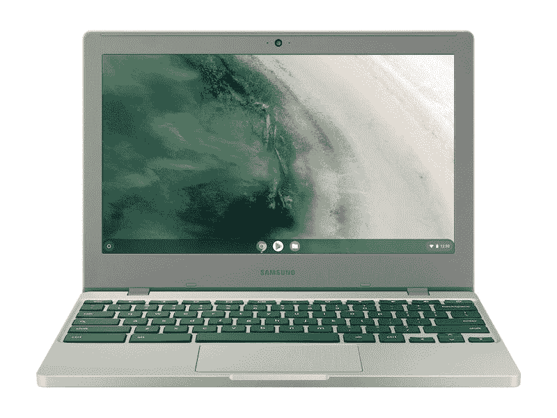

# 亚马逊上最好的 Chromebooks

> 原文：<https://www.xda-developers.com/best-chromebooks-amazon/>

亚马逊几乎拥有你想要或需要的一切。如果你正在寻找一款新的 Chromebook，很有可能你是通过打开亚马逊开始购物的。三星、宏碁、华硕等原始设备制造商有几十种很好的选择，因此很难选择你想要的设备。

这本购买指南列出了我们在亚马逊上各种价位的 Chromebooks 的首选。如果您已经知道您的具体使用情形，我们还列出了每种设备的所有主要功能。您可以通过单击产品名称和每个部分顶部的链接来购买这些设备。

## 整体最佳:华硕 Chromebook CX9

在亚马逊上我们的 Chromebook 列表中，排名第一的是[华硕 Chromebook CX9](https://www.xda-developers.com/asus-chromebook-cx9-review/) 。这是亚马逊直接从 Chromebook 制造商那里提供的最强大的产品之一，具有出色的显示屏和整体设计。

然而，我们如此喜欢华硕 Chromebook CX9 的头号原因是由于 CPU。这是亚马逊上最新的 Chromebooks 之一，内置强大的英特尔芯片。是的，这款 CPU 目前已经使用了大约两年，但它使用的是顶级的第 10 代英特尔处理器——英特尔酷睿 i7-1165G7。这是一个 4 核处理器，因此它将帮助您顺利完成 Chrome OS 中的大多数工作流程。即使使用 Android 应用程序和 Linux 也应该可以在这台设备上很好地工作。这款 Chromebook 还拥有 16GB 的内存和 512GB 的 PCIe NVMe 固态硬盘，进一步提高了速度。

除了 CPU，我们想提一下，这款 Chromebook 相当耐用。它是超高级的，由铝制成，并通过了军用级耐用性认证。华硕表示，该设备已经过压力、冲击和跌落测试，以确保弹性。甚至连键盘和端口都通过了这些测试。

我们喜欢的另外两个设计选择？首先是 Ergo 升降铰链。这提高了键盘甲板，所以你不必担心你的手在长时间的打字过程中抽筋。键盘也是背光的，所以你可以轻松地在晚上工作。第二个是摄像头防护罩，它可以帮助你保护自己不被看到。

这可能看起来很小，但我们也喜欢使用华硕的数字键盘。这个数字小键盘不是在键盘上，而是在触控板上，这样可以节省设备上的空间。您可以轻按键盘上的数字小键盘按钮来召唤触控板上的这个区域，然后您只需轻按触控板上相应的数字，就可以轻松地将数字输入电子表格。它还有两层背光。

最后，我们来到展示区。它的三面都有超薄边框，因此您可以充分利用 1920 x 1080 的分辨率，并排堆叠您的窗口。如果你愿意，你甚至可以购买一支 USI 手写笔来配合这款 Chromebook 使用。这将开启下载和使用 Android 绘图应用的可能性。

##### 华硕 Chromebook CX9

华硕 Chromebook CX9 是亚马逊上最好的 Chromebook 之一，这要归功于现代的英特尔 CPU、触控板上的 numpad 和令人惊叹的显示屏。

我们名单上的第二个是华硕 Chromebook Flip。这是目前亚马逊上销售的最好的 Chromebook 二合一设备之一。其中一个重要原因是显示器。许多 Chromebooks 可能有更小的 13 英寸屏幕，但这款是 15.6 英寸。这么大的尺寸，可以多任务处理，打开更多的 Chrome 浏览会话。结合 FHD 1920 x 1080 的分辨率，当您翻转设备以将其用作 2 合 1 设备，甚至作为平板电脑或在帐篷和支架模式下使用时，您可以充分利用您的内容。唯一稍微困扰我们的是显示屏丑陋的底部边框，但对于价格在 500-600 美元的 Chromebooks 来说，这是相当常见的。

接下来，这款 Chromebook 内置了去年的第 11 代英特尔处理器，特别是英特尔酷睿 i3-1115G4 CPU。这是一款低端 CPU，但它通常是我们向某人推荐 Chromebook 时的目标。它位于酷睿 i5 之下，但远高于大多数廉价 Chromebooks 上的英特尔奔腾处理器。如果你考虑到 8GB 的内存，你将获得流畅的性能，即使在打开 YouTube 等媒体密集型网页或在原生平板电脑模式下使用 Android 应用程序时也是如此。

最后，有一个很好的港口选择，这是很重要的，如果你是一名商人或学生。这款设备拥有我们认为适合移动使用的基本连接，具有 USB-C 3.2、USB-A 3.1、耳机/麦克风组合插孔、HDMI 和 microSD 存储卡读卡器。这意味着外部固态硬盘和 USB 驱动器应该可以正常连接到该设备。有了 microSD 卡，您甚至可以获得额外的存储空间，以便在旅途中携带文件。不过，HDMI 是我们最喜欢的附加功能，因为您可以连接到显示器，而无需使用加密狗。

##### 华硕 Chromebook Flip C536

华硕 Chromebook Flip C536EA 非常棒，这要归功于第 11 代英特尔 CPUs inside 以及超薄边框 FHD 显示屏。

## 最佳平板电脑:联想 IdeaPad Duet 5 Chromebook

亚马逊上的 Chromebooks 并非都是传统笔记本电脑。你还会发现一款类似于[联想 IdeaPad Duet 5 Chromebook](https://www.xda-developers.com/lenovo-ideapad-duet-5-chromebook-review/) 的设备，这对于使用过 iPad 或 [Surface 二合一平板电脑](https://www.xda-developers.com/best-microsoft-surface-pcs/)的人来说应该很熟悉。它有一个可拆卸的键盘，可选的笔支持，和一个超薄边框的宽屏。

屏幕绝对是你应该购买这款 Chromebook 的第一个理由。这款 Chromebook 没有配备 IPS 或 LCD 面板，而是配备了 OLED 面板，其黑色更深，亮度比其他显示器更高。除了 16:9 的宽高比，这款 Chromebook 还能创建更自然的图像，非常适合观看视频。当我们[回顾这个设备](https://www.xda-developers.com/lenovo-ideapad-duet-5-chromebook-review/)时，我们发现颜色的准确性几乎是准确无误的。我们喜欢看我们最喜欢的电影和电视节目。更棒的是，显示屏还支持墨迹书写。虽然联想没有 USI 手写笔，但你可以买一个，像真正的平板电脑一样使用这款 Chromebook。然后，您可以解锁使用绘图应用程序的功能，甚至可以使用谷歌草书应用程序将笔记与您的设备同步。

IdeaPad Duet 5 Chromebook 的另一个我们真正喜欢的部分是可拆卸键盘。与 iPad 或 Surface 不同，联想在购买时将键盘包含在包装盒中。连接上这款全尺寸键盘，你就可以支起支架，开始工作了。我们在这台设备上打出了很长的文章，没有任何问题。

在里面，你会发现一些令人惊讶的东西。你不会像我们列表中的其他一些选择一样，在里面得到英特尔或 AMD 芯片。这是一个基于 Arm 的芯片，高通骁龙 7c。对你来说，这款芯片意味着真正长的电池寿命，以及与 Android 应用程序的出色兼容性。Android 应用程序是为基于 Arm 的芯片编写的，就像这款一样，所以最新的 Android 游戏和社交媒体应用程序不会给这款 Chromebook 带来任何问题。

这款 Chromebook 可能会遇到一些小问题。首先，没有耳机插孔，所以你需要一个转换器或蓝牙耳机来听音乐。两个 USB-C 端口也可能是限制性的，因此您可能需要一个 USB 集线器来连接显示器以及打印机等老式外围设备。

##### 联想 IdeaPad Duet 5 Chromebook

联想 IdeaPad Duet 5 Chromebook 是你可以在亚马逊上买到的最好的 Chromebook 平板电脑之一。它有一个惊人的有机发光二极管屏幕，并附带一个键盘外壳。

## 最佳预算:三星 Chromebook 4

如果你在亚马逊上搜索 Chromebooks，有可能会发现很多便宜的设备。不过你必须小心，因为便宜的 Chromebook 并不总是好的 Chromebook。谢天谢地，这并不适用于三星 Chromebook 4。在这一点上它可能有点老，但是你将能够在不超出预算的情况下执行基本的任务。

从内部开始，这款设备的引擎盖下并不都是 150 美元以下的坏。Chromebook 配备了英特尔赛扬 N4000 CPU，我们通过测试发现它非常适合日常任务。如果你只是想浏览网页或使用谷歌文档等生产力应用程序，你会没事的。不过，我们不会超出这个范围，因为 4GB 的内存和较慢的 eMMC 存储可能太有限了。

对于这个低价格来说，显示器也不算太差。你不会像顶级 Chromebooks 那样获得 FHD 1920 x 1080 的分辨率，但你可以获得 1366 x 768 的分辨率，这对于在屏幕上打开一个网页来说已经足够了。但除此之外，你可能需要一个外部显示器。这样做的好处是电池寿命长。由于 Chromebook 不需要配备高分辨率面板，它可以持续一整天——据三星称，大约 12.5 小时。

便携性无疑是这款 Chromebook 的优势，尽管它是市场上最小的 chrome book 之一。它的尺寸为 11.33 x 7.96 x 0.66 英寸，屏幕为 11.6 英寸，重量不到 2.6 磅。如果你打算去旅行，这个设备将是一个很好的伴侣。

最后，我们将深入探讨键盘和端口选择。键盘是边到边的，一眼看上去很整齐。是的，它是一个全塑料键盘和设备，但这是为了这个低价格的另一个牺牲。背光也是另一个牺牲，所以如果你在晚上使用这个设备，你将不得不在房间里开着灯工作。端口并不完全是旗舰级的质量，但你确实有一个用于扩展的 microSD 卡插槽，以及 USB-A 和 USB-C。该设备可以通过 USB-C 充电，所以你可以在旅途中使用电源或充电器为它充电。

 <picture></picture> 

Chromebook 4 11.6

##### 三星 Chromebook 4

三星 Chromebook 4 是一款非常划算的 Chromebook，具有超级紧凑的设计，体面的显示屏以及 CPU 能力。

需要一台大显示屏的 Chromebook？看看宏碁 17 英寸的 Chromebook。它有一个巨大的显示屏，一个伟大的设计，以及体面的 CPU 的引擎盖下的权力。它非常适合在旅途中使用，或者如果您不喜欢使用带显示器的设备。

我们选择这款 Chromebook 的原因和 1920 x 1080 的分辨率有很大关系。一个高分辨率的屏幕在一个大的 Chromebook 上很重要，有了这个设备，你可以并排堆叠你最喜欢的应用程序，并获得真正的多任务处理——Chrome，一个 Android 应用程序，你能想到的。该面板甚至具有防眩光涂层，因此当您在强光下或阳光直射下工作时，不会出现反光。

不过，有一点需要注意。这可能是一个大屏幕的 Chromebook，但内部的 CPU 能力有点限制。再说一次，这不是一个坏的 CPU，因为 Chrome OS 与 Windows 相比是优化和轻量级的，但你必须坚持基本的网络浏览。由于较慢的 eMMC 存储和 4GB 的内存，运行 Android 应用程序可能不太好，但对于网页浏览来说，它是完美的。

总的来说，我们认为这个设备的设计非常棒。键盘上有扬声器，设备左侧还有一个完整的数字小键盘。这对于那些可能会花很多时间在 Google Sheets 上的人来说是非常理想的。我们确实希望键盘是背光的，但当你考虑到 300 美元的价格时，很难抱怨。

最后是港口。你将获得 USB-C、USB-A、microSD 卡扩展和 3.5 毫米耳机插孔。这是一台连接非常好的机器，但我们只是希望有一个 HDMI 端口，特别是考虑到该设备厚度为 0.89 英寸，重量为 5.18 磅，有点厚和重。

##### 宏碁 Chromebook 317

这款 Acer Chromebook 配备了大显示屏和像样的速度，这要归功于引擎盖下的英特尔赛扬 CPU。它非常适合在旅途中使用。

## 最适合教育:宏碁 Spin 311

Chromebooks 在教育领域很受欢迎，为此，我们推出了宏碁 Spin 311。这是一款严肃的 Chromebook，它将教育放在第一位，允许学生将其用于学校作业，而不是其他。

首先，里面有芯片。就像你在低端 Chromebooks 上看到的一样，这是一款联发科 MT8183。与英特尔的其他产品相比，这并不是最快的 CPU，但学生们将无法摆脱课业之外的事情。这款 Chromebook 无法运行最高端的 Android 游戏，因此学生访问谷歌 Play 商店将受到限制。凭借基于 Arm 的 CPU 和 4GB 的 RAM，它主要是一台用于 Chrome 和教育应用程序的网络浏览器。说到电池寿命，它也是一款持久的 Chromebook，因为低端规格降低了功耗。电池续航时间最长可达 15 小时，因此学生不必担心在一天中不断给设备充电。

然后，是显示器。这是一个 11 英寸的可转换显示屏，分辨率为 1366 x 768。对于习惯高端电脑的成年人来说，这是一个低分辨率，但学生可以从中获得很多。他们可以将其保持在笔记本电脑模式下浏览网页，或者将其转换为帐篷或支架模式，以展示演示文稿和其他媒体。厚厚的边框有助于处理这款 Chromebook，并有助于避免意外触摸屏幕。请注意，这个亚马逊捆绑包还包括一个电容性的细长手写笔，可用于与显示器进行交互。不过，这不是 USI 笔，所以你不会用它来完成更复杂的任务，比如画画。

还有便携性的问题。如果你的孩子打算带着这款 Chromebook 上下学，他们会发现它非常便携。它的尺寸仅为 11.42 x 8.11 x 0.74 英寸，重量仅为 2 磅。如果你熟悉学校用品，它比大多数教科书都要小，比笔记本的大小还要大一点。孩子们可以轻松地将这款 Chromebook 放入包中，而不会增加额外的重量。

在端口方面，这款 Chromebook 就像宏碁产品线中的其他一些廉价设备一样，在背面有一个“驼峰”区域，你可以在那里找到端口。mix 包括一个 USB Type-C 端口、一个 USB 3.1 Gen 1 端口、一个 USB 2.0 端口、一个耳机插孔和一个 Kensington lock 插槽。同样，这里有足够的端口用于连接 USB 驱动器以及手机充电器等现代 USB-C 配件。

宏碁的 Spin 311 Chromebook 非常适合教育，因为它内置了联发科 CPU，具有可转换的设计和紧凑的 11 英寸屏幕。

考虑第一次向某人介绍 Chromebook？亚马逊上最好的 Chromebook 之一是三星 Galaxy Chromebook Go。这是一款时尚的 Chromebook，售价不到 300 美元，整体规格也不算太差。

在这款 Chromebook 的内部，您可以获得英特尔赛扬 N4500 处理器、4GB 内存和 32GB eMMc 存储。对于第一台 Chromebook，这是我们通常会寻找的。它将毫无问题地支持网页浏览和其他快速任务，尽管在运行更高端的 Android 应用程序或谷歌 Chrome 中的几个标签以外的多任务处理时，你会看到速度变慢。如果对你来说很重要，三星还通过威瑞森或美国电话电报公司提供了这款支持 LTE 的 Chromebook，因此当 Wi-Fi 不可用时，你可以在旅途中保持连接。这是你可能要考虑的事情，特别是因为这款设备有一整天 12 小时的电池。

而且这款 Chromebook 的设计超级硬朗。这款 Chromebook 通过了 MIL-STD-810G 测试，对于可能是第一次使用 Chromebook 的年幼儿童来说，这是一个持久的选择。它甚至有一个双色外观，笔记本电脑的内部是黑色的，侧面和盖子是白色的。尽管它很耐用，但并不重；它的便携重量仅为 3.2 磅，尺寸为 8.88 x 12.88 x 0.63 英寸。

看着显示器，1366 x 768 不是最好的分辨率，但我们认为它只是工作。这是 Chromebook 可能的最低分辨率，因此在这款设备上打开大量窗口是不可能的。只是第一次习惯 Chrome OS 的入门。如果你有一部三星手机，那么这款 Chromebook 也可以很好地配合它。您将能够使用移交功能在您的设备之间发送文件，而无需电子邮件。再加上对 Wi-Fi 6e 的支持，我们认为这款 Chromebook 在工作效率方面非常出色。

最后看看港口，这不是最令人印象深刻的。你必须考虑为这个设备购买一个加密狗。只有两个 USB-C 端口和一个 USB-A 端口。要在家里使用显示器，您需要一个 Chromebook dock。

##### 三星 Galaxy Chromebook Go

Galaxy Chromebook Go 是一款经济实惠的 Chromebook，时尚耐用，非常适合第一次使用 Chromebook。

我们名单上的最后一个是 Chromebook，它完全是关于显示器的。是的，我们之前已经提到过联想 IdeaPad Duet 5 Chromebook，但如果你进行大量流媒体和视频观看，这款设备将非常棒。

即使在 2022 年，也就是发布一年后，[三星 Galaxy Chromebook 2](https://www.xda-developers.com/samsung-galaxy-chromebook-2-review/) 拥有 Chromebook 上最好的显示屏之一。截至本文撰写之时，它甚至被三星评为亚马逊最佳笔记本电脑。这款 Chromebook 的显示屏最棒的地方是什么？和 QLED 技术有很大关系。QLED 显示器就像有机发光二极管面板一样，可以输出令人惊叹的逼真图像和色彩。它通常出现在电视上，尤其是在使用多媒体的时候。无论你最终在这台 Chromebook 上做什么，无论是浏览网页还是观看 YouTube 电影，它都会看起来很棒。

除了显示屏，我们选择三星 Galaxy Chromebook 2 上榜还有几个原因。首先，即使按照 2022 年的标准，第十代英特尔酷睿 i3 处理器也非常快。对于像运行 Android 应用程序和处理谷歌 Chrome 中超过 10 个标签的任务，这款 Chromebook 将成为冠军。它可以配置 8GB 或 16GB 的内存。也有 4GB 内存的低端版本，但我们建议不要购买该型号。内存越多越好，尤其是如果你想多任务处理。

然后，有兑换方面。你可以在帐篷模式、支架模式或平板模式下使用这款 Chromebook。三星还在这款 Chromebook 上提供了对 S Pen 的支持，尽管这款设备没有提供这种支持。你得单独买一个。你还必须在外部保持笔的安全，因为没有办法像上一代 Galaxy Chromebook 那样将它放在设备内部。

还有这款 Chromebook 的整体外观。这绝对不是一个看起来很无聊的设备。“节日红”的颜色将确保你在咖啡店或办公室里引人注目。而且说到外观，这款 Chromebook 超级薄。它只有 0.6 英寸厚，所以你可以随身携带。

总的来说，这是最好的三星 Chromebook。它只是比最初的三星 Galaxy Chromebook 有一些变化，可能会让一些人感到困扰，比如分辨率更低的屏幕(最初是 4K 的)和取消了指纹识别器。不过，它还是便宜得多，我们认为极具吸引力的价格会让你购买它。

##### 三星 Galaxy Chromebook 2

三星 Galaxy Chromebook 2 拥有令人惊叹的显示屏，非常适合观看电影和电视节目。它也有体面的处理速度。

* * *

这就是我们在亚马逊上可以买到的最好的 Chromebooks 列表。有了这么多选项，您可以轻松找到适合自己的设备。无论你的偏好如何，亚马逊都有一系列优惠，你可以利用这些优惠为自己买到最好的 Chromebook。