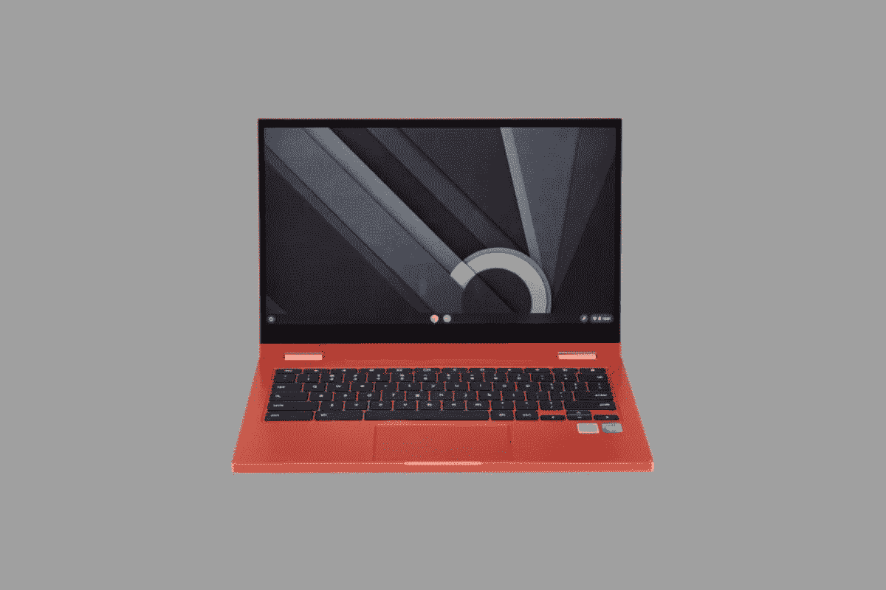
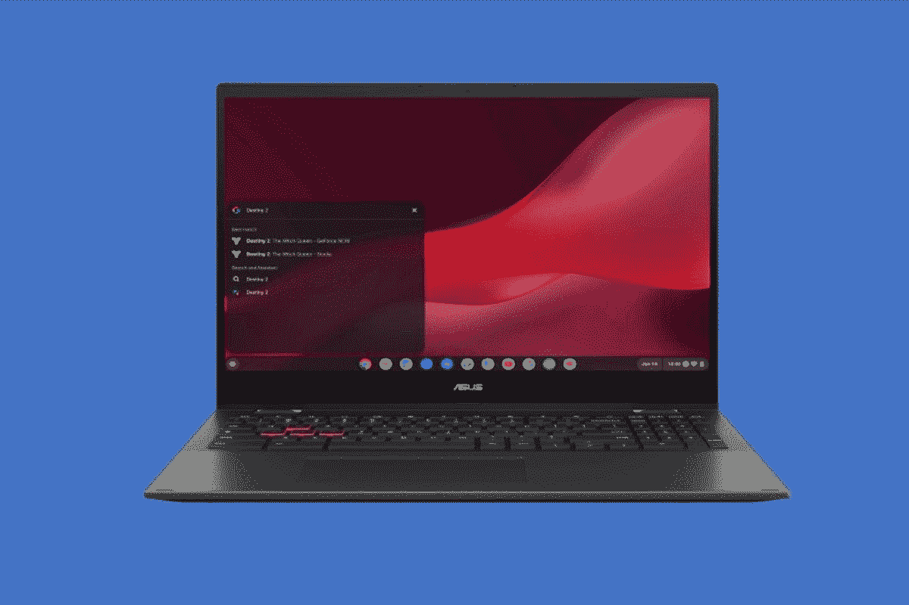

# 2023 年百思买最佳 Chromebooks

> 原文：<https://www.xda-developers.com/best-chromebooks-best-buy/>

百思买有很多很棒的科技产品出售，所以你会在那里找到一些最好的 Chromebooks 也就不足为奇了。无论是面对面还是在线，你都会在百思买找到符合你需求的 Chromebook，这些公司包括[惠普](https://www.xda-developers.com/best-hp-chromebooks/)甚至[宏碁](https://www.xda-developers.com/best-acer-chromebooks/)。甚至有很多不同的 Chromebooks，你可以以各种预算购买。

我们谈论的是高端 chrome book、平板电脑、中档 chrome book、教育版 chrome book 等等。Chromebooks 的数量如此之多，以至于我们在百思买列出了一个最佳可用和库存的选项列表。查看一下，并通过本文顶部的链接导航到您最喜欢的部分。

## 最佳整体:宏碁 Chromebook Spin 714

 <picture></picture> 

Acer Chromebook Spin 714

通常，如果你在百思买购物，你会通过按最高价格排序和选择库存来找到最好的产品。这就是我们所做的，我们在零售商那里看到了最新的 Chromebooks。是宏碁 Chromebook Spin 714。这款 Chromebook 实际上是宏碁最好的产品之一，其价格为 729 美元。它也有一些更新的规格，是一个完美的购买。

首先要注意的是第 12 代英特尔处理器和该设备的整体规格。这款 Chromebook 拥有第 12 代英特尔酷睿 i5-1235U CPU。这一代 CPU 在 Chromebooks 中很少见，因为它们在最新的 Windows 笔记本电脑中使用。Chromebooks 通常配备的是上一代英特尔 CPU。还有很多值得喜欢的地方，因为第 12 代英特尔 CPU 提供了高性能内核和高效内核，有助于让您每天使用这款 Chromebook 变得令人惊叹。然后，加上 RAM，这个特定型号上总共有 8GB。这大约是 Chromebook 的平均水平，有助于支持多任务处理，甚至运行 Android 应用程序。更好的是，这款宏碁还使用了传统的固态硬盘，而不是 eMMC 或闪存。这意味着文件传输和其他事情会进行得更快。

接下来，我们要进入键盘和显示器的细节。大多数 Chromebooks 可能都有低分辨率屏幕，但这款没有。显示器调整到较新的 16:10 宽高比。这是一个更高的显示器，因此您可以在屏幕上显示更多内容。说到内容，这里有很大的空间。分辨率设置为 1920 x 1200。您将能够在各种使用模式(帐篷、支架、平板电脑或笔记本电脑)下欣赏您在屏幕上观看的所有内容。)至于键盘，就是我们喜欢称之为海岛风格的。这是键盘在 Chromebook 中间的位置。键盘也有背光，因此您可以在黑暗中工作。不是每个 Chromebook 都有这个功能，如果所有按键都有均匀的灯光，它看起来会很棒。

Chromebook 上的端口也很棒。尽管重量为 3.04 磅，厚度为 0.70 英寸，但你会发现一个 USB-A，两个 Thunderbolt 端口，一个耳机插孔和 HDMI。我们要提到的另一件事包括 garaged 手写笔。你将能够使用它在屏幕上绘图，而不必担心将笔连接到 Chromebook 的侧面或屏幕的顶部。Garaged 意味着触控笔内置在机箱中。旅行时，你可以保持它的安全。

##### 宏碁 Chromebook Spin 714

得益于令人惊叹的显示屏和新的英特尔 CPU，Acer Chromebook Spin 714 是您在百思买可以买到的最好的 Acer Chromebook

 <picture></picture> 

Samsung Galaxy Chromebook 2

Chromebooks 不再只是用于工作或学校。当人们有停机时间时，他们可能会使用 Chromebook 来观看电影或观看来自网飞或亚马逊 Prime Video 等应用程序的内容。为此，你需要一个真正充满活力、色彩准确的显示器，类似于电视屏幕。百思买出售许多很棒的电视，但该零售商出售的 Chromebook 的屏幕技术类似于电视的屏幕技术是 [Galaxy Chromebook 2。](https://www.xda-developers.com/samsung-galaxy-chromebook-2-review/)

这实际上是第一款采用 QLED 显示屏的 Chromebook，就像最初的 Galaxy Chromebook 一样，这是第一款采用有机发光二极管显示屏的后续型号，尽管减少了一些高级功能，以获得更合理的价格。这里给人印象最深的肯定是显示屏。Chromebook 上配备了世界上首款令人惊叹的 QLED 显示屏，能够产生超过 100%的色彩量，您将能够对每张图像感到惊叹。

虽然处理器选项没有最初的 Galaxy Chromebook 那么高端，但英特尔酷睿 i3 应该可以满足大多数用户的需求。这款设备的存储容量最高为 128GB，但这仍然是我们所说的超高速固态硬盘存储。与最初的 Galaxy Chromebook 相比，您还可以保留 8GB 内存，并延长电池寿命。

这是一款触摸屏设备，虽然 S Pen 仍受支持，但它不与笔记本电脑捆绑在一起。这也意味着 Chromebook 的机身中没有存储 S Pen 的插槽，不像我们的其他首选。

总的来说，如果你能忍受移除 4K 显示屏和指纹传感器，这是最适合你的三星 Chromebook。极具吸引力的价格会动摇大多数用户选择这种第二代设备。请记住，由于这款 Chromebook 完全是关于多媒体的，所以您不会介意很多端口。设备两侧的板上只有 USB-C。如果你打算在工作或学校使用它，你需要购买一个适配器来连接显示器。

##### 三星 Galaxy Chromebook 2

通过 Galaxy Chromebook 2，三星取消了一些高端功能，但也大幅降低了价格。作为第一款采用 QLED 显示屏的 Chromebook，该机仍然为大多数用户提供了充足的动力和时尚。

## 最佳平板电脑:联想 Chromebook Duet 5

百思买有很多 iPads 和 Android 平板电脑，但也有越来越多的新款 ChromeOS 平板电脑。其中之一就是联想 Chromebook Duet 5。这款新的 Chromebook 平板电脑拥有许多我们在最好的 chrome book 中寻找的出色功能。从令人惊叹的显示屏到可拆卸的键盘，以及超长的电池寿命。

这是一款定价 500 美元的灵活高端平板电脑。但真正让联想 IdeaPad Duet 5 成为一款值得拥有的伟大设备的是它的动力。联想将第二代高通骁龙 7c 处理器放在这款平板电脑中。我们对这款平板电脑进行了测试，实际上在我们的评估期内，我们发现它非常好用。当游戏和许多 Android 应用程序运行良好时，没有延迟。我们的网页浏览也很顺利。然后，当谈到电池时，我们设法在使用该设备时获得一整天的工作价值。尽管耗电的有机发光二极管显示屏存在缺陷，像最初的 Galaxy Chromebook 这样的类似设备也有缺陷。

现在，让我们更深入地了解随附的配件。通常情况下，Chromebook 平板电脑的键盘薄而便宜，之前的 Duet Chromebook 平板电脑就是一个很好的例子。通常，键盘也是可选的，但在这里，开箱后，你可以将键盘连接到 IdeaPad Duet 5 显示器上，从后面拉出支架，然后开始工作。在我们的评测中，我们能够在膝盖上舒适地使用 IdeaPad Duet 5，没有任何挫败感。

ChromeOS 平板电脑的另一部分是它们如何用于多媒体和绘图。IdeaPad Duet 5 让这些任务变得相当有趣。你必须单独购买一只 USI 手写笔，但一旦购买，你就可以在网页上绘图，并使用谷歌 Play 商店的绘图应用程序。哦，我们还想指出的是，IdeaPad Duet 2 配有 16:9 OLED 面板。在我们的测试中，显示器具有出色的亮度和视角，以及准确的色彩再现。

不过，有一个小瑕疵。这款设备上没有耳机插孔，只有两个 USB-C 端口。你需要购买一个用于连接显示器和 USB 驱动器的加密狗，但这将成为 2022 年高端 Chromebooks 的一个常见问题。

 <picture></picture> 

Lenovo Chromebook Duet 5

##### 联想 Chromebook Duet 5

联想 Chromebook Duet 拥有充满活力的有机发光二极管显示屏和宽敞的键盘，是 ChromeOS 平板电脑的出差族

## 最适合教育:联想 Flex 3 Chromebook

 <picture></picture> 

Lenovo Flex 3 Chromebook

Chromebook 最好的一点是，它可以很容易地用于教育。不过，有时 Chromebook 制造商可能最终会为学生或教育市场销售专门的设备。百思买没有很多这样的产品，因为你通常需要通过原始设备制造商来购买，但我们设法挑选了一款适合学生在学校甚至家里使用的产品。是联想 Flex 3 Chromebook。

我们选择这款 Chromebook 是因为它的设计、整体尺寸和紧凑性。这是一个非常小的设备，可以很容易地放在包里，或者在教室之间随身携带，或者在通勤途中从家到学校。尺寸为 11.5 x 8.48 x 0.77 英寸，重量为 2.64 磅。如果你把它放在一张普通的法定尺寸的纸上，你会发现它比那张纸要小。我们也喜欢“深渊蓝”的颜色选项。与你通常看到的银色和黑色笔记本电脑相比，这是一种非常时尚的用于教育的颜色。

这款 Chromebook 进入我们名单的另一个原因与它的动力有关。学生们有时喜欢逃避功课，玩游戏或从谷歌 play 商店下载不必要的应用程序。这款 Chromebook 配备了联发科 MT8183 SoC，它在支持游戏和繁重的多任务处理方面并不是最强大的。不过，对于网页浏览等基本功能，以及使用核心谷歌应用程序(如表单或页面)来说，它还是足够好的。这是因为它配有 4GB 内存和 64GB eMMC 存储。

哦，别忘了外形。作为一款“Flex”设备，这意味着你可以将这款 Chromebook 转换成各种外形。这包括帐篷、支架、平板电脑和常规笔记本电脑模式。学生将能够更多地使用这种设备来观看课程计划，甚至演示内容。显示器也将有助于支持这一点。这是一款 11.6 英寸的高清显示屏，分辨率为 1366 x 768。这不是最高的分辨率，但对于 189 美元来说，很难抱怨，因为 Chromebooks 主要用于教育领域的网络浏览。如果你想要更高的分辨率，你就得买更高级的东西。

和往常一样，我们将讨论端口来结束这一部分。学生可能不希望使用加密狗将 USB 驱动器和其他附件连接到他们的计算机上，这正是他们能够避免的。该设备的左侧有 USB-C 和 USB-A 端口，以及耳机插孔和 microSD 卡插槽。同时，右侧有 USB-A 端口。音量摇杆也在那里，帮助控制音频，而不进入 ChromeOS。

##### 联想 Chromebook Flex 3

联想 Flex 3 Chromebook 非常适合学生，是百思买最便宜的 Chromebook 之一

## 最佳中端:三星 Chromebook 4+

 <picture></picture> 

Galaxy Chromebook 4+

中档 Chromebook 介于高端和低端之间，但价格仍然合理。你会在百思买找到很多这样的产品，但我们特别选择了三星 Chromebook 4+,因为它在规格和整体设计之间找到了一个很好的平衡，而且价格都是 300 美元。

支持该设备的是英特尔赛扬 N4000 处理器。这是一个更低端的处理器，所以我们有一个公平的警告。由于处理器速度较慢，像 Android 应用程序这样的东西可能不会发挥最佳性能。然而，配合 4GB 的内存，我们认为你可以很好地浏览网页。Chrome 针对像这样的低端硬件进行了大量优化。

随着显示屏的出现，300 美元的 Chromebook 出现了一些罕见的东西。它是一个全高清 1920 x 1080 分辨率的 15.6 英寸面板。这意味着有足够的空间进行多任务处理并同时使用不同的应用程序。更棒的是。三星甚至将显示屏的侧边框缩小了一点。这使它看起来像一个更高级的设备，但显示屏下仍然有一个丑陋的下巴，这是这个价格的常见现象。

现在来谈谈键盘和触控板，我们喜欢这款 Chromebook 上的两个功能，但也有一些抱怨。有一些不错的键旅行，因为这是一个岛式的 chiclet 键盘。但是，当打字太快时，键盘面板和触控板的塑料涂层可能会有一点太多的弯曲。然而，它的额外好处是防溅 Chromeb，这是耐用性方面的一大优势。然而不幸的是，没有背光。你必须坚持在白天使用这个，或者晚上在灯光下工作。

而便携性呢？嗯，你典型的 15 英寸 Chromebook 可能会很重，但他的这款却很不错，因为它是由所有塑料制成的，尺寸小于 15 英寸，重量为 3.75 磅，低于我们认为“太重”的典型 4 磅

与你在百思买找到的其他一些更贵的 Chromebook 类似，三星包括两个 USB-C 端口，用于为 Chromebook 4+充电。这是一个耳机插孔和一个 USB-A 端口的补充。由于有额外的 USB-A 端口，旧的 USB 驱动器或外设在该系统上应该可以正常工作。

 <picture></picture> 

Samsung Chromebook 4+

##### 三星 Galaxy Chromebook 4+

三星 Galaxy Chromebook 4+在小价格与大显示屏、高性能和像样的键盘之间取得了良好的平衡

## 最佳 17 英寸:宏碁 Chromebook 317

 <picture></picture> 

Acer Chromebook 317

你能在百思买找到的最大的 chrome book 是 17 英寸的。目前库存不多，但我们确实找到了一款 Acer Chromebook 317。这款 Chromebook 售价 500 美元，很难脱手。

我们这么说是因为这款 Chromebook 搭载了英特尔奔腾银色 N6000 处理器。诚然，这仍然是一个较低端的 CPU，但它的功率高于典型预算 Chromebook 的赛扬 CPU。这也是一个四核芯片，这意味着有更多的多任务处理能力。它不如第 12 代英特尔芯片上的性能核心或效率核心，但由于 ChromeOS 针对低端 CPU 进行了优化，我们不会太担心，特别是当你考虑 8GB RAM 和 eMMC 存储时。8GB 内存对于繁重的网页浏览来说绰绰有余。

我们选择这款宏碁的另一个原因是键盘。作为一台 17 英寸的笔记本电脑，它体积庞大，全尺寸，甚至还有一个数字键盘。它甚至有背光，所以你可以在晚上通过谷歌工作表查看电子表格。数字键盘甚至意味着你可以避免按 shift 键输入数字。很少看到 Chromebook 有像这样的全尺寸背光键盘。

你可能也认为 17 英寸的 Chromebooks 很重，但这款却完全不同。大多数 17 英寸的 Chromebooks 可能会超过 5 磅，但这款只有 4.85 磅。它也很薄，约为 0.89 英寸。对于合适的人来说，这款 Chromebook 可以非常轻松地放在包里进行旅行。

说到旅行，在旅途中或旅途中经常做的一件事可能是浏览网页，甚至是看电影。正如我们经常在 Chromebook 中寻找的那样，这款笔记本电脑拥有全高清 1920 x 1080 分辨率的显示屏来支持所有这些功能。在 17.3 英寸的厚度下，您可以随心所欲地拖动窗口，就像在家里使用外接显示器一样。甚至还有触摸支持，这有助于使管理这些窗口更容易。

最后，我们为什么选择这款 Chromebook 是因为端口。没有 HDMI 端口来连接显示器，所以需要加密狗。然而，仍然有许多其他的港口。这台笔记本电脑的左侧有 USB Type-C、USB-A、microSD 和一个耳机插孔。右侧有 USB-A 和 USB-C。所有这些 USB 端口应该足够快，可以进行数据传输。

 <picture></picture> 

Acer Chromebook 317 ($100 off)

##### 宏碁 Chromebook 317

凭借大屏幕和英特尔奔腾处理器，很难错过百思买的这款 17 英寸 Chromebook

## 最适合云游戏:华硕 Chromebook Vibe CX55 Flip

 <picture></picture> 

Asus Chromebook VIbe CX55 FLip

我们以华硕最新的 chrome book——chrome book Vibe CX55 Flip——结束了我们的指南。这是谷歌合作伙伴推出的三款新 Chromebooks 之一，都是关于云游戏的。我们还没有尝试过，但我们真的想向任何从百思买购买 Chromebook 的人推荐它。规格是完美的，因为它的设计，以及你最终可以使用它的方式。

首先来看看规格，这款 Chromebook 采用了第 11 代英特尔酷睿 i5 CPUs。您还可以将内存提升到 16GB。所有型号的存储容量都是 256GB。对于一款主要为云游戏设计的 Chromebook 来说，我们认为这款 CPU 非常棒。你可以一边用谷歌 Chrome 运行云游戏，甚至可以将这款 Chromebook 连接到显示器上，完成你通常的工作任务。即使在 2022 年，第 11 代英特尔芯片也非常强大。如果你打算将这款 Chromebook 仅用于学校作业，甚至日常工作，也不用担心。Linux 应用程序甚至 Android 应用程序也将运行良好。这不是我们所说的低端 CPU。

在设计上，这是一款真正为游戏玩家打造的 Chromebook 二合一设备。内部全黑，W、A、S、D 键用橙色加重。就连边上的按钮也有对比鲜明的橙色。这有助于使游戏一目了然。键盘甚至支持反重影技术，因此当您加速打字或玩游戏时，每一次击键都将超级准确。是的，它是背光的，但是，它缺乏 RGB 照明。

同样值得注意的是，我们为什么建议这款 Chromebook 是显示器。这是一款 2 合 1 敞篷车，因此可以在帐篷、支架、平板电脑或笔记本电脑模式下使用。不过，这是标准配置，而且这款 Chromebook 的显示屏刷新率是 Chromebook 中最高的。虽然其他云游戏 Chromebooks 的频率为 120 赫兹，但这款为 144 赫兹。这意味着无论是不是游戏，你在显示器上做的一切都将快速而准确。ChromeOS 在这款设备上应该感觉很有活力，我们唯一不喜欢的就是屏幕上难看的底部下巴。

最后，我们有一些关于华硕 Chromebook Vibe CX55 的连接和端口的说明。这款 Chromebook 有 Wi-Fi 6E，所以它支持最快的连接。除此之外，这是一个连接良好的系统。您将获得 microSD 卡扩展，HDMI，USB-C 和 USB-A。这里不需要加密狗！

##### 华硕 Chromebook Vibe CX55 Flip

华硕 Chromebook VIbe CX55 Flip 是三款云游戏 Chromebook 之一。它与其他产品不同，因为它是二合一设备，并且拥有超快的 144Hz 屏幕。

这些都是你今天能在百思买买到的最好的 Chromebooks。有很多很好的选择，我们希望这个列表能帮助你找到合适的设备。如果没有，你可以在很多其他大零售商那里找到 Chromebooks。我们在指南中提到了那些最佳 Chromebooks。