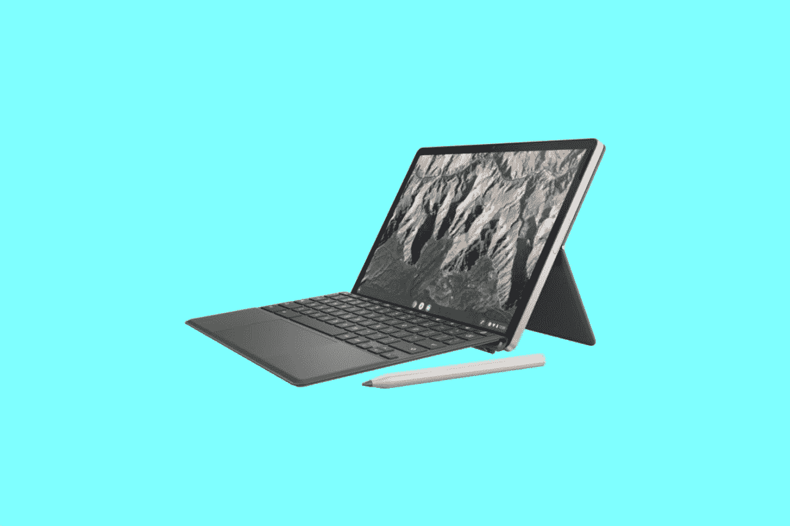
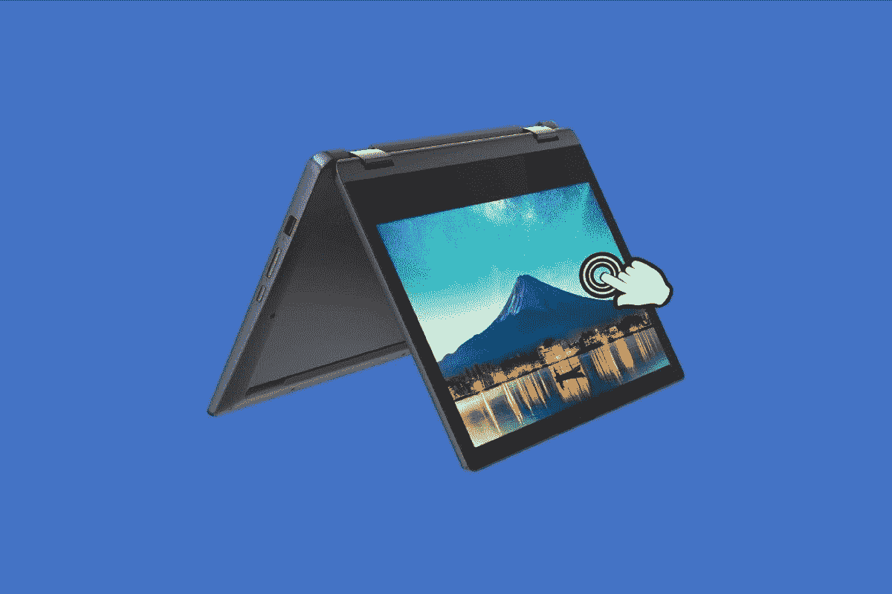

# 2023 年最佳儿童 Chromebooks

> 原文：<https://www.xda-developers.com/best-chromebooks-for-kids/>

为 Chromebooks 提供动力的 ChromeOS 的一个很酷的部分是，与 Windows 甚至 MacOS 相比，它简单易学。Chromebooks 也相当便宜，这使它们成为年幼儿童的完美选择。除此之外，Chromebooks 非常安全，你甚至可以轻松添加家长控制。你甚至可以通过 Steam、Nvidia GeForce Now 和 Xbox GamePass 等云游戏服务在 Chromebook 上玩游戏。

因此，如果你正在为你的孩子寻找一台新电脑，Chromebook 几乎是一切的完美选择。在这本指南中，我们将挑选一些我们最喜欢的儿童读物。我们将着眼于各种类别、价格范围和功能。几乎每个孩子都有一款 Chromebook。这是完整的列表，请务必使用下面的链接进行导航。

## 最佳整体:宏碁 Chromebook Spin 714

 <picture></picture> 

Acer Chromebook Spin 714

如果你正在为一个接近十几岁的大孩子寻找最好的 Chromebook，那么我们建议宏碁 Chromebook Spin 714。这款 Chromebook 是你现在花钱能买到的最好的 chrome book 之一，肯定会给他们留下深刻印象。规格是现代的，[宏碁以制作出色的 Chromebook 而闻名](http://www.xda-developers.com/best-acer-chromebooks/)，他们可以通过多种方式使用这款 chrome book(帐篷、支架、笔记本电脑或平板电脑)。

一个大一点的孩子通常不会想要一个慢的 Chromebook，这款也不会。它拥有英特尔的最新 CPU，第 12 代英特尔酷睿 i5-1345U，这是你通常在 Windows 笔记本电脑中找到的。无论你的孩子想用这款 Chromebook 做什么，无论是安装 Roblox、玩 Android 游戏，还是浏览网页，它都可以很好地工作。8GB 的 RAM 和传统的 SSD 也将帮助他们，因为与我们列表中配备 4GB RAM 或较慢的 eMMC 存储的其他系统相比，这两者都使系统速度更快。

这款 Chromebook 也有很棒的显示屏和键盘。它配备了 16:10 纵横比的 1920 x 1080 显示屏，非常适合多任务处理和同时打开许多应用程序。至于键盘，它是背光的，所以如果你的孩子喜欢在睡觉前偷偷进入社交媒体，他们可以在不开灯的情况下这样做。

让我们不要忘记车库手写笔。孩子们可以在屏幕上画画，给朋友发送笔记，在课堂上做笔记，甚至画画与朋友分享。手写笔位于设备的右侧，永远不会丢失。

当然，大一点的孩子可能会带着 Chromebook 去朋友家甚至学校。为此，这款 Chromebook 将超越标准。它非常便携，重量为 3.04 磅。它还非常薄，只有 0.70 英寸，因此可以轻松放入包中。我们也很喜欢端口的选择，因为它包括 USB-A、Thunderbolt 以及 HDMI。无需加密狗。

##### 宏碁 Chromebook Spin 714

Acer Chromebook Spin 714 非常适合年龄较大的孩子，因为它拥有我们在 Chromebook 中寻找的最新和最棒的功能

## 适合年幼儿童的最佳平板电脑:惠普 Chromebook x2 11

 <picture></picture> 

HP Chromebook X2 11

我们的首选是年龄较大的孩子，但对于年龄较小的孩子，我们建议使用[惠普 Chromebook x2 11](https://www.xda-developers.com/hp-chromebook-x2-11-review/) 。您将获得一台带有内置键盘的平板电脑，它小巧、便携、价格实惠。

这款 ChromeOS 平板电脑是目前最小的平板电脑之一。它有一个 11 英寸的显示屏，重量只有 1.05 磅。这使得它非常适合孩子放在婴儿车中或外出时使用。不太重。附带的键盘也意味着您可以在平板电脑收起时保护屏幕。

这款平板电脑上榜的另一个原因与显示屏有关。一个孩子在年幼时可能并不真正需要大屏幕，所以这款 11 英寸的显示器恰到好处。它还具有 2.1K 的高分辨率，亮度可达 400 尼特。这意味着电影或保存的内容在屏幕上会看起来很棒。你可以将电影保存到平板电脑上，然后交给他们观看。

说到旅行，让孩子忙起来的一个方法就是给他们一本涂色书。在这款平板电脑中，惠普包括一支惠普笔，因此您可以从谷歌 Play 商店下载绘图应用程序或涂色书，并让您的孩子使用屏幕上的笔涂色。这和你用 iPad Air 得到的东西差不多。当你完成后，它会粘在设备的侧面。

最重要的是它的电池寿命很长。当[我们审查它](https://www.xda-developers.com/hp-chromebook-x2-11-review/#perf)时，我们发现它可以持续一整天，这要归功于内部使用的高通骁龙 7c SoC。基于 ARM 的 SoC 也意味着 Android 应用程序也将运行良好。你的孩子将能够下载他们喜欢的任何应用程序，而不会抱怨应用程序性能不佳。当然，网页浏览也应该可以。ChromeOS 确实针对基于 ARM 的芯片进行了优化，因为它在低端硬件中很常见。

##### 惠普 Chromebook x2 11

HP Chromebook x2 11 非常适合儿童使用，这得益于其紧凑的设计以及键盘和随附的笔

## 最适合教育:联想 Flex 3 Chromebook

 <picture></picture> 

Lenovo Flex 3 Chromebook

[chrome book 在教育界很受欢迎](https://www.xda-developers.com/best-chromebooks-for-students/)，这就是为什么我们的第三款产品在许多学校使用，并受到家长的欢迎:联想 Flex 3 Chromebook。这款低于 200 美元的 Chromebook 包含一个可转换的紧凑外形，许多端口，总体来说是一个很好的选择。

对于教育而言，最重要的是便携性和风格，因为你不希望孩子在包里放一台笨重的笔记本电脑，甚至不希望孩子在家里占用太多的桌面空间。这款 Chromebook 的尺寸为 11.5 x 8.48 x 0.77 英寸，重量略低于 3 磅。如果你一直记着，那大概是一个大学规定的笔记本大小。在风格方面，这款 Chromebook 有深渊蓝，这是一种浅蓝色混合灰色。看起来真的很棒，你的孩子可能会喜欢它。

教育中另一件重要的事情是专注。对于这一点，联想 Flex 3 令人惊叹。它不是一款高性能设备，因为它配备了联发科 MT8183 SoC 以及 4GB 内存和 64GB eMMC 存储。这种 CPU 在低端 Chromebooks 中很受欢迎，但它非常适合为小学或中学的学生提供基于网络的工作。网页和 Google Workspace 应用程序可以很好地加载，64GB 的 eMMC 存储也是一个优势，因为它允许一些空间来存储与学校相关的文件或个人文件。

这是联想的 Flex 设备之一，所以孩子可以从铰链上拉下屏幕，折叠起来，放在桌子上观看课程重播或他们最喜欢的电影。他们还可以将它完全折叠成平板电脑，并与教师可能分享的图像和照片进行交互。11.6 英寸的高清显示屏非常适合这种情况，因为它的分辨率为 1366 x 768。它不是那么锋利，但它会确保你的孩子专注于手头的任务。

最后，孩子们将获得许多端口，包括一个用于连接新固态硬盘的现代 USB-C 端口。否则，你会得到 USB-C，USB-A，耳机插孔和 microSD 卡插槽。甚至还有一个音量摇杆，让孩子在听课时很容易控制音量。

##### 联想 Chromebook Flex 3

联想 Flex 3 Chromebook 是年轻学生的绝佳选择。这不是最强大的设备，但它的大小非常适合孩子，而且非常便携。

## 最佳翻盖三星 Galaxy Chromebook 4+

 <picture></picture> 

Galaxy Chromebook 4+

到目前为止，我们已经谈论了很多关于平板电脑和二合一设备的内容，但是孩子们可能会滥用这些设备。如果这是你所担心的，那么传统的翻盖式笔记本电脑可能是一个更好的选择。在这一类中，我们建议三星 Galaxy Chromebook 4+。它有一个大屏幕，体面的规格，看起来很花哨，但不会太贵。

Galaxy Chromebook 4+的外形非常棒。从表面上看，它看起来很像 MacBook Pro，有银色的表面和超薄边框的屏幕。然而，它更适合孩子，因为它主要是由塑料制成的，可能会磨损很多。请注意，这也是一台 15 英寸的笔记本电脑。就其本身而言，它相当紧凑，但它仍然很大。它的尺寸为 14.16 x 9.64 x 0.65 英寸，重量为 3.75 磅。

现在，关于大屏幕的更多细节。屏幕尺寸为全高清 1920 x 1080 分辨率。在这种尺寸的 Chromebook 中看到这种情况并不常见。如果你把这个交给一个孩子，他们将能够进行多任务处理，在屏幕上打开不止一个东西，一边说课程，另一边说视频。只有这款笔记本电脑丑陋的底部下巴可能会分散注意力，因为较新的笔记本电脑有 16:10 的宽高比显示屏，去掉了底部边框。

在处理能力方面，您将获得配有 4GB 内存的英特尔赛扬 N4000 处理器。你可能会认为这很慢，但谷歌已经在为 CPU 调整 ChromeOS，就像这个一样。ChromeOS 是一个轻量级操作系统，对于孩子做的任务(学校、YouTube 或社交媒体)，这将做得很好。我们只有一个警告:这个 CPU 不是运行 Android 应用程序的最佳选择。为此，基于 ARM 的 Chromebook 可能会更好，我们已经在列表中列出了几款。

我们还想再提一个缺点。这款 Chromebook 没有配备背光键盘。取决于你如何看待它，那可能是好的。你的孩子不会想在晚上使用它，因为键帽很难看到。或者，他们可以在你允许的情况下在房间里开着灯使用它。

##### 三星 Galaxy Chromebook 4+

三星 Galaxy 4+看起来像一台 MacBook，但由更耐用的塑料制成，屏幕很大，这使它成为孩子们的好选择。

## 最佳预算 Chromebook:联想 Chromebook 11.6

 <picture></picture> 

Lenovo Chromebook 11.6

Chromebooks 的一个好处是非常便宜。如果你不想花很多钱为孩子买第一台 Chromebook，然后再升级，联想 Chromebook 11.6 是一个很好的选择。它是一款敞篷车，拥有基于 ARM 的处理器，电池续航时间很长，而且有点时尚。

这款 Chromebook 由联发科 MT8183 SoC 驱动，这是一款基于 ARM 的低端芯片，但出于几个原因，它仍然很棒。首先，你的孩子可能想下载和玩安卓游戏，为此，你需要一台搭载 ARM 芯片的 Chromebook。其次，它配有 4GB 内存和 64GB eMMC 存储。这使得它足够体面的网页浏览。电池续航时间也很好，联想的评级约为 10 小时。

作为一款可转换设备，您的孩子可以以各种方式使用这款 Chromebook，包括平板电脑、笔记本电脑或帐篷模式。平板电脑模式非常适合玩游戏，笔记本电脑模式适合日常学校工作，帐篷模式适合展示演示文稿或与朋友分享。在所有这些模式下，1366 x 768 分辨率的屏幕都会发光。它不是最高分辨率的面板，但内容会很大很清楚，不会看起来太模糊或太小。这就是低分辨率屏幕的伟大之处，尤其是因为它是传统的 IPS 面板。

如果你或你的孩子计划去旅行，那么这款设备也非常适合在旅途中使用。这是一个很小的装置，尺寸为 11 x 8 x 1 英寸，重量不到 3 磅。它易于放入包中，也可与食物和零食等其他物品一起存放。再搭配酷炫的深渊蓝，这款 Chromebook 一定会脱颖而出。

如果你的孩子打算在这个设备上使用配件，那么它还是很棒的。有 USB-A，USB-C 端口，甚至还有一个 microSD 读卡器，你可以在上面存储电影和其他内容供他们观看。

##### 联想 Chromebook 11.6

联想 Chromebook 11.6 是一款廉价的二合一设备，可以教孩子 ChromeOS 的基础知识。您可以随时升级。

## 最适合流媒体:三星 Galaxy Chromebook 2

 <picture></picture> 

Samsung Galaxy Chromebook 2

对于一个孩子来说，我们的最后一个选择可能看起来不寻常，但我们认为对于一个热爱媒体的大孩子来说，这是一个很好的建议。是[三星 Galaxy Chromebook 2](https://www.xda-developers.com/samsung-galaxy-chromebook-2-review/) 。这款 Chromebook 相当昂贵，但它将是一项长期投资，具有出色的规格、出色的显示、巨大的价值，非常适合流媒体和多媒体。

我们这么说是因为这款 Chromebook 不同于市场上的任何其他产品，主要是因为它有一个 QLED 面板。该面板尺寸为 13.3 英寸，FHD 分辨率为 1920 x 1080。QLED 很重要，因为班上其他 Chromebooks 的 IPS 和 LCD 面板没有那么鲜艳。为了使流媒体内容看起来尽可能好，QLED 是最佳选择，具有更好的对比度和更准确的色谱。由于这是一款 2 合 1 设备，翻转屏幕也将真正展示显示屏，尽管底部边框可能会有点分散注意力。除此之外，它非常适合网飞，看电影，在 YouTube 上看视频。也有笔支持，但手写笔会额外收费。

这款 Chromebook 也有不错的处理能力。这款电脑有两种选择:英特尔赛扬 5205U 或酷睿 i3-1010U。Core i3 选项更经得起未来的考验，确保您在未来使用 Android 应用程序或打开多个网页时不会出现任何问题。英特尔的酷睿处理器性能更高，处理多任务的能力也更强。

另一个值得长期购买的原因是整体设计。这是一台非常耐用的机器，又轻又薄。是的，它是塑料的，但这意味着你可以用一只手轻松地拿着它，带着它到处旅行。键盘也是背光的，可以晚上用。如果有什么要抱怨的，那就是缺少港口。许多现代 Chromebooks 正在转向 USB-C，以保持设计轻薄。这里就是这样，有两个 USB-C 口。你必须[给你的孩子买一个加密狗](https://www.xda-developers.com/best-docking-stations-chromebooks/)随身携带，用于连接 USB 驱动器或显示器。

##### 三星 Galaxy Chromebook 2

由于 QLED 显示屏，Galaxy Chromebook 2 是一款非常棒的多媒体机器

## 最适合游戏:宏碁 Chromebook 516 GE

尽管 chrome book 在学校和家庭教育中都很棒，但谷歌最近也开始将 chrome book 作为游戏机进行推广。新的 [Acer Chromebook 516 GE](https://www.xda-developers.com/acer-chromebook-516-ge-hands-on/#acer-chromebook-516-ge-specs) 是少数几款为云游戏设计的 Chromebook 之一，很难不对任何可能喜欢视频游戏的孩子提出建议。显示屏令人惊叹，键盘、整体设计和引擎盖下的 CPU 能力也是如此。请记住，对于云游戏，Chromebook 需要连接到互联网，但大多数云游戏 chrome book(像这款)也可以在测试版中与 Steam 一起工作，所以你可以离线玩游戏。

我们建议宏碁 Chromebook 516 GE 用于游戏的主要原因之一与 CPU 有很大关系。这款 Chromebook 采用了第 12 代英特尔 CPU，特别是英特尔酷睿 i5-1240P 处理器。该 CPU 具有性能和效率内核，可将性能提升到通常只有 Windows 笔记本电脑才能达到的新水平。还有 8GB 内存和 256GB 固态硬盘存储。有了这样的规格，你可以通过 ChromeOS 安装 Steam 测试版，并享受离线玩更轻的游戏，不需要专用的 GPU。否则，当您的孩子通过 Nvidia GeForce Now 或 Xbox Game Pass 等服务连接到互联网时，仍然可以玩游戏。

宏碁 Chromebook 516 GE 的显示屏也很棒。该设备配有 16 英寸 2560 x 1600 分辨率的显示屏，刷新率为 120 Hz。这高于我们列表中大多数其他 Chromebooks 的标准 60Hz 刷新率。这意味着 ChromeOS 和您的游戏将呈现最佳状态，运行流畅。在游戏之外，高分辨率的 16 英寸面板使并排堆叠窗口和多任务处理变得非常容易。

至于设计，这不是塑料 Chromebook。它建造得很坚固；顶盖和底盖由铝制成，掌托采用塑料表面，经久耐用。对于那些可能对自己的设备不太习惯的孩子来说，这款 Chromebook 可以轻松应对跌落和孩子在玩游戏时可能对它产生的挫折感。只需注意，它的尺寸较大，为 14.04 x 9.83 x 0.84 英寸，重量为 3.75 磅。

最后是端口。无论是键盘、鼠标还是显示器等其他附件，您的游戏玩家孩子都不必担心加密狗。板载有一个 USB-A 端口、一个 HDMI 端口、一个以太网端口、一个 3.5 毫米耳机插孔以及两个 USB-C 端口。

##### 宏碁 Chromebook 516 GE

Acer Chromebook 516 GE 是一款出色的 Chromebook，适用于云游戏等领域。虽然它不能处理激烈的游戏，但这款 16 英寸的宏基 Chromebook 可以完成较轻游戏的工作。

我们现在已经到了儿童最佳 Chromebooks 名单的末尾。如果你没有在这个列表中找到一些东西，那么不要太担心。你可以买到一大堆不仅仅是为孩子设计的 chrome book，包括专业的 T2 商务 chrome book 和 T4 绘画 chrome book。有一款 ChromeOS 设备可供所有人享用，无论您的需求如何。