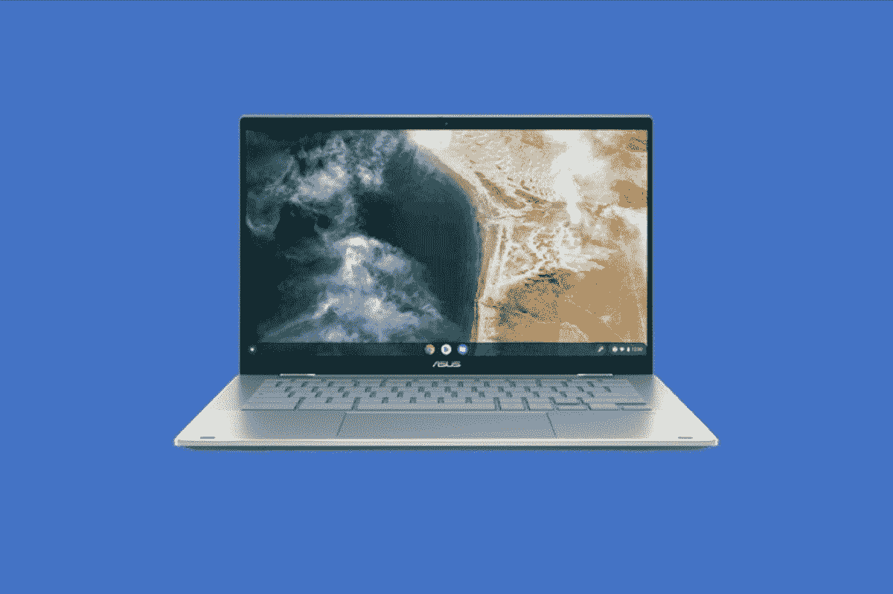
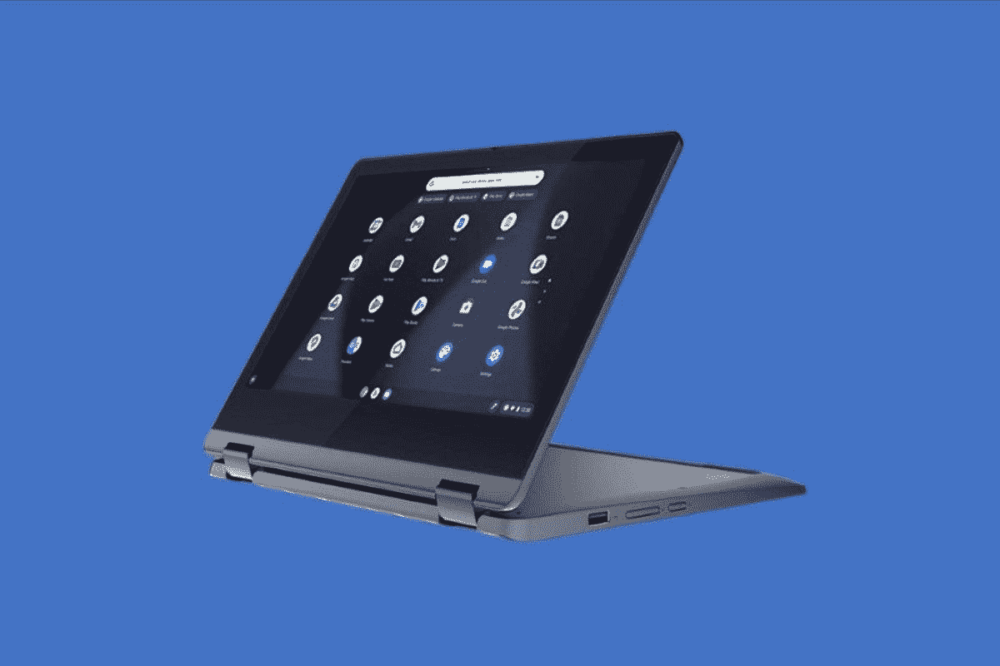
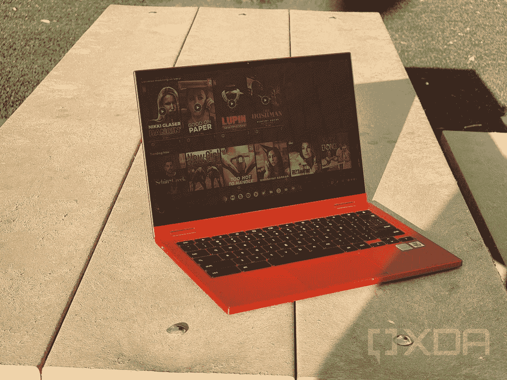
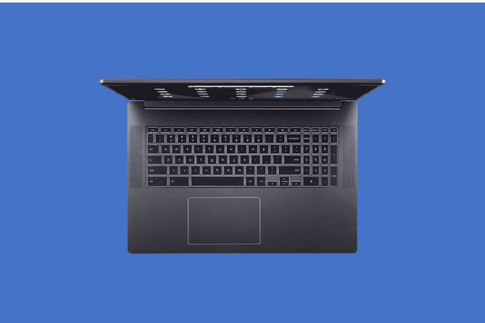
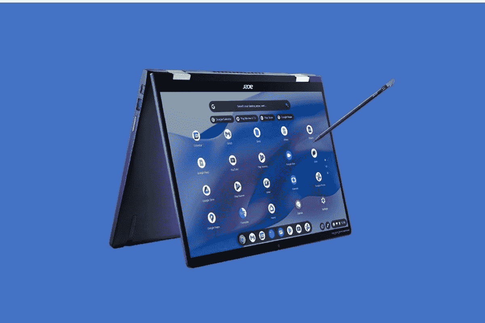

# 2023 年最佳学生 Chromebooks

> 原文：<https://www.xda-developers.com/best-chromebooks-for-students/>

如果你正在为自己或孩子寻找一台新的学校笔记本电脑，你应该考虑 Chromebook。ChromeOS 是一个非常快速的操作系统，具有出色的安全性和家长控制。它们的性价比也非常高。许多 Chromebook 型号的价格在 300 美元以下，比入门级 Mac 或 Windows PC 低得多。

在为学校寻找 Chromebook 时，您不需要很多。因为 ChromeOS 是基于云的，所以你可以买一个可用存储空间更低的 Chromebook，而且你可以使用更小的 RAM 配置，因为你不会做很多密集的任务。然而，你也会想要耐用性；许多领先的制造商提供军用级耐用性和防摔/防泼溅的型号。无论您是在为小学生还是大学生寻找 Chromebook，我们都能满足您的需求。

## 最佳整体:华硕 Chromebook Flip CX5

 <picture></picture> 

Asus Chromebook Flip CX5400

如果说我们知道学生在学校会做一件事，那就是浏览网页。这正是华硕 Chromebook Flip CX5 登上学生用顶级 Chromebook 排行榜榜首的原因。

这款 Chromebook 以独特的键盘开始强劲。键帽是背光的，非常适合深夜学习，它有一个“Ergo Lift”铰链，可以将键盘抬高一点，以获得更舒适的打字角度。官方称，华硕的键盘有 1.5 毫米的键程。这是 Chromebook 的标准配置，但最重要的是舒适度。它还在机箱中间有一个漂亮的大触控板，非常适合大量滚动。

至于引擎盖下的 CPU，这款设备有两种选择:英特尔酷睿 i3-1115G4 CPU 和英特尔酷睿 i7-1165G7 CPU，它们都来自英特尔的第 11 代阵容。这些都是上一代的部件，但它们仍然非常强大，尤其是考虑到这款 Chromebook 的内存高达 8GB。在研究项目期间，Chrome 中 10 多个标签的多任务处理应该没问题。它还有一个 14 英寸，1920 x 1080 FHD 分辨率的屏幕，两侧有细长的边框，非常适合展示演示文稿，甚至观看讲座的重播，而不会感到屏幕空间不足。

最后，这款 Chromebook 由优质材料制成。它全部由铝制成，并通过了军用级别的耐用性测试。“全蓝”的颜色也非常醒目，有助于学生在学校脱颖而出。它可能不如我们的下一款产品强大，但华硕 Chromebook Flip CX5 将满足您上学所需的一切需求。

##### 华硕 Chromebook Flip CX5400

华硕 Chromebook Flip CX5 是一款非常适合学生使用的 Chromebook，它拥有舒适的键盘、出色的设计和实惠的价格。

**Pros**

*   优质耐用的设计
*   细长边框
*   大型触控板

**Cons**

*   第 11 代英特尔 CPU

## 性能强劲的最佳 Chromebook:宏碁 Chromebook 516 GE

学生可能在学校做很多工作，但在休息时间玩视频游戏也是一种选择。这就是为什么我们很高兴地指出，我们的第二款产品 Acer Chromebook 516 GE 非常适合游戏和学校工作，或者是需要运行 Linux 应用程序的更认真的学生。

这里最需要提到的是引擎盖下的东西。我们最近评测的 Acer Chromebook 516 GE 拥有出色的性能，这要归功于英特尔最新最棒的产品。它有一个英特尔酷睿 i5-1240P CPU，带有四个性能内核和八个效率内核，以及 8GB 内存。我们针对基于网络的工作流程和社交媒体应用进行了测试，我们没有遇到性能问题。我们甚至玩了安卓游戏，比如*沥青 9、*，效果很好。

如果显示屏很糟糕，这也没关系，但谢天谢地，这款 Chromebook 有一个准确而快速的显示屏。它有一个巨大的 16 英寸显示屏，分辨率为 WQXGA 2560 x 1600，高于我们通常在学生设备中看到的 FHD 1920 x 1080 标准。这款显示器的四面都有超薄边框，刷新率达到 120 赫兹。2023 年能做到这一点的 Chromebooks 并不多。您可以并排堆叠窗口进行工作，但也可以充分利用 Xbox Cloud Gaming 或 Nvidia GeForce Now 等服务。

但这主要是为了学校作业，这款 Chromebook 有一个很棒的键盘用于打字。它有背光*和*提供预设的 RGB 照明，非常适合晚上打字。我们也喜欢键帽的触感；他们相当温和，没有给出严厉的反馈。总而言之，当你将键盘、显示器和 CPU 结合起来时，这是 2023 年最好的 Chromebooks 之一。

##### 宏碁 Chromebook 516 GE

学生游戏玩家会喜欢 Acer Chromebook 516 GE，因为它具有 RGB 照明、身临其境的 120Hz 屏幕和最新的英特尔 CPU。

**Pros**

*   非常适合游戏
*   第 12 代英特尔 CPU
*   高刷新率

## 最佳预算二合一设备:联想 Flex 3 Chromebook

 <picture></picture> 

Lenovo Flex 3 Chromebook

我们目前选择的两款 Chromebooks 都是相当昂贵的设备。如果你是一名学生(或者认识一名学生)，想要一台预算适中的 Chromebook 用于学校，但又不想花费超过 300 美元，那么这是一款不错的设备。请记住，会有一些牺牲，但不会太多，因为这将是一个教育专用设备。

例如，英特尔或 AMD 的 CPU 并不是最强大的。这款 Chromebook 采用了联发科(MediaTek)的低端 CPU，即联发科 MT81383，但我们认为它对于教育目的来说很好。该芯片配有 4GB 内存和 64GB eMMC 存储。像打开网页这样的简单任务将会工作得很好，但是由于 RAM 较低，在进行多任务处理时可能会有限制。不过，对于基本功能而言，它将毫无问题地驱动大多数学生完成他们的工作流程，尤其是使用核心的 Google Workspace 应用程序，如 Google Docs。

虽然这款 2 合 1 设备的规格并不令人印象深刻，但它的设计确实令人印象深刻。这是一款 11 英寸的 Chromebook，也是我们列表中最便携的一款。联想 Flex 3 Chromebook 甚至可能比学生随身携带的教科书还要小。它的尺寸只有 11.5 x 8.48 x 0.77 英寸，重量为 2.64 磅。小尺寸也意味着小显示器。这款 Chromebook 可能无法进行多任务处理，你正在浏览的网页也可能看起来不是最好的。屏幕分辨率为 1366 x 768 高清，不够清晰，但我们认为年轻学生不会介意。

结合所有这些以及如何在多种配置下使用这款 Chromebook，包括平板电脑模式，它将成为一款多功能设备，只用于教育目的，干扰最小。

##### 联想 Flex 3 Chromebook

联想 Flex 3 Chromebooks 是最便宜的学生用 chrome book 之一。它也是最小的一款，只有 11 英寸的显示屏。

**Pros**

*   负担得起的
*   便携紧凑
*   联发科 CPU 非常适合网络浏览

## 支持 LTE 的最佳预算翻盖手机:三星 Galaxy Chromebook Go

 <picture></picture> 

Samsung Galaxy Chromebook Go

有很多 2 合 1 Chromebooks，但由于你的设备可能会在你从一个班级到另一个班级的旅行中被滥用，我们建议购买传统的翻盖 Chromebook，因为它可能会损坏的部件较少。三星 Galaxy Chromebook Go 是这方面的最佳选择之一。对于不经常使用 Wi-Fi 的学生来说，这是少有的支持 LTE 的教育系统之一。

Galaxy Chromebook Go 是三星 Chromebook 系列中最耐用和最有吸引力的产品之一。它有一个吸引人的黑底白字设计，里面是不会显示污迹的黑色，外面是白色。该设备还通过了 Mil-STD-810G 认证，能够承受常见的跌落、撞击和泼溅。它也不会牺牲重量或厚度。它仍然是便携式的，尺寸为 12.88 x 8.88 x 0.63 英寸，重量为 3.2 磅。

与此同时，有一些相当不错的规范来帮助学生通过基于学校的工作流。同样，因为它是一个预算设备，你不会得到最好的芯片。相反，这款 Chromebook 采用了英特尔赛扬 N4500U CPU，配有 4GB 内存和 32GB 存储。话虽如此，但 CPU 有 2.8GHz 的睿频加速，所以使用这款 Chromebook 会感觉很棒。我们认为它可以在 1366 x 768 分辨率、200 尼特的明亮屏幕上轻松处理一些 Chrome 标签，甚至偶尔处理 Android 应用程序。低端规格也有助于延长电池寿命，因为它的额定时间为 12 小时。高端规格的 Chromebooks 通常不会有那么长的电池续航时间。

我们还知道，在教育中，学生希望避免使用加密狗。好消息是这款 Chromebook 有很好的端口选择，有两个 USB Type-C，一个传统的 USB Type-A 3.2 端口，一个 microSD 卡插槽和一个耳机插孔。Galaxy Chromebook Go 可能不是这个列表中最有趣的设备，但它对于忙碌的学生来说是完美的。

##### 三星 Galaxy Chromebook Go

三星 Galaxy Chromebook Go 是学生用最便宜的翻盖 Chromebook 之一。它还支持移动连接的 LTE。

**Pros**

*   特价时价格合理
*   LTE 连接
*   很多港口

## 最适合安卓应用的:宏碁 Spin 513

学校不仅仅依赖于网络浏览器。如果你的学校让你使用 Android 教育应用，那么你需要一台可以运行这些应用的 Chromebook。为此，我们建议使用宏碁 Spin 513。这款 Chromebook 有两种口味。一款采用联发科芯片，另一款采用高通芯片，但两款都能很好地运行安卓应用。

在这两种情况下，高通骁龙 7c 或联发科 Kompanio 1380 CPU 对于 Android 相关的任务来说都是强大的。这些都是基于 Arm 的芯片，Android 应用程序通常针对三星 Galaxy S22 Ultra 等 Android 手机上的基于 Arm 的架构和芯片组进行编码。我们回顾了配备联发科芯片的宏碁 Spin 513 版本，非常喜欢它的性能。我们尝试了许多要求苛刻的 Android 应用程序和游戏，运行起来没有任何问题。Photomath、Khan Academy、Google Classroom、Sololean 或 Kahoot 等热门教育应用程序！应该一切顺利。与英特尔或 AMD 型号相比，使用基于 Arm 的 CPU 的另一个好处是增加了电池。在我们的测试中，我们在不需要充电的情况下完成了一整天的工作，甚至电池中还有剩余的电量供我们第二天早上使用。

我们也喜欢这个展示。它是 13.5 英寸，长宽比为 3:2，分辨率为 2256 x 1504，亮度高达 360 尼特。更好的是，它支持 USI 笔协议，所以你可以适当地享受需要笔输入的 Android 应用程序，甚至让学生手动记笔记。请注意高纵横比。3:2 的宽高比有助于提高工作效率和并排堆叠窗口。

还不信服？宏碁 Chromebook Spin 513 有溢价，尽管它的售价只有 500 美元左右。这是一款全铝设备，配有背光键盘。盖子甚至有闪亮的装饰，在教室里非常显眼。该设计还为其所有端口加入了一个“驼峰”，包括两个 USB-C 端口，一个 USB-A 端口，一个 microSD 卡插槽和一个 3.5 毫米耳机插孔。

宏碁 Chromebook Spin 513 非常适合 Android 应用程序，因为它有一个基于 Arm 的 Soc。

**Pros**

*   电池续航时间长
*   3:2 宽高比显示屏
*   支持笔输入

**Cons**

*   联发科的变种比较难找

 <picture></picture> 

Samsung Galaxy Chromebook 2

[三星 Galaxy Chromebook 2](https://www.xda-developers.com/samsung-galaxy-chromebook-2-review/) 不同于我们迄今为止推荐的任何其他 Chromebook 或 2 合 1 设备，这要归功于它真正令人难以置信的显示屏。这使得它非常适合年长的学生或那些想用它来完成多媒体任务的人。

你看(双关语！)，这款 Chromebook 有 QLED 显示屏，类似于高端电视上的显示屏。色彩输出逼真且相当准确。更不用说，它还有外接 S 笔支持。它不在盒子里，但用户可以在屏幕上画画或用它做笔记。它还有多种配置，像帐篷或平板电脑模式，所以你可以舒适地使用屏幕。

Galaxy Chromebook 2 延续了最初 Galaxy Chromebook 的整体设计，拥有醒目的“嘉年华红”颜色。这也是一款非常纤薄的设备，重量不到 2.7 磅，尺寸为 12.0 x 8.0 x 0.55 英寸。绝对适合旅行。

我们通常在高端 Chromebooks 上寻找的一些其他功能也在这里出现。它有一个背光键盘，有大量的按键行程，一个像样的 720p 网络摄像头，以及与 Android 手机的集成，这要归功于三星包含的 Android 应用程序。

这听起来很棒，但值得注意的是，三星从以前的型号中删除了一些功能，以帮助降低价格。显示器是 FHD 1920 x 1080 分辨率，CPU 仅在 Core i3 选项上达到最高。虽然有 8GB 的内存，但对于日常任务来说仍然足够快。

##### 三星 Galaxy Chromebook 2

QLED 显示屏和别致的设计使这款 Chromebook 非常适合学习艺术或设计并需要最佳色彩准确度的年长学生。

**Pros**

*   颜色精确显示
*   支持笔输入
*   独特的颜色

## 最佳 17 英寸 Chromebook:宏碁 Chromebook 317

 <picture></picture> 

Acer Chromebook 317

学生并不总是连接到外部显示器来增加多任务处理，这就是为什么 Acer Chromebook 317 在我们的名单上。这是一款 Chromebook，可能没有最好的规格，但它有最大的屏幕，这可能就足够了。

这款 Chromebook 采用 17 英寸屏幕，分辨率为 1920 x 1080。目前，这是市场上唯一一款屏幕这么大的 Chromebook，这样的大屏幕对于生产力来说非常棒。全高清分辨率允许并排打开应用程序，并为第三个甚至第四个应用程序留出额外的空间。

伴随着一个大显示屏而来的是一个大键盘——实际上是一个全尺寸的键盘，带有一个数字小键盘。学习数学或科学的学生不需要不停地按多个按钮来得到他们需要的数字。哦，我们不能忘记这款 Chromebook 有一个背光键盘，如果学生计划在晚上工作到很晚，这对于提高工作效率来说是一个巨大的优势。

像 Chromebook 这样的大机箱也意味着有很多端口:USB Type-C、USB-A 和耳机插孔。HDMI 是缺失的一块，但对于一个将在旅途中使用的 Chromebook 来说，很难抱怨，而且没有什么是加密狗不能解决的。

不过，我们要注意的是 CPU。它有一个英特尔奔腾 CPU，这是一个非常慢的芯片，但是，由于该芯片是四核的，它有 8GB 的内存，而且由于 ChromeOS 是一个轻量级和高效的操作系统，学生通常经历的一切(如打开多个 Chrome 标签)都应该运行得很好。它还配备了 64GB 的存储空间，尽管它是较慢的 eMMC 类型。不过有了 microSD 卡扩展，我们也不能抱怨太多。

##### 宏碁 Chromebook 317

这款 Acer Chromebook 的 17 英寸大屏幕是不想连接显示器完成作业的学生的绝佳选择。

**Pros**

*   17 英寸大屏幕
*   背光键盘
*   8GB 内存

**Cons**

*   较慢的英特尔奔腾 CPU

## 最佳加固 Chromebook:华硕 Flip C214

需要一款经久耐用的耐用型 Chromebook 吗？然后，你会想看看华硕翻盖 C214。得益于整体构建、设计和摄像头，它旨在提供创新和鼓舞人心的学习体验。

这款 Chromebook 拥有多功能的 11.6 英寸触摸屏显示器，内置触控笔和 360 度转轴。它还具有教室就绪的耐用性，让教师和学生都放心，配有全方位的橡胶缓冲器、防泼溅键盘和超硬铰链。华硕甚至在背面加入了橡胶安全组，这有助于降低设备坠落的风险。盖子的表面也有凹痕，所以它也能抵抗刮擦。

凭借其长达一天的电池续航时间和省时、易于维护的模块化结构，华硕 Chromebook Flip C214 可满足任何需求。这款笔记本电脑的内部规格并不重要，但它配备了英特尔赛扬处理器、4GB 内存和 32GB eMMc 存储。这是最基本的，就像在谷歌浏览器中处理两个标签。相反，这款设备旨在提供创新的学习体验，这要归功于键盘一角面向世界的摄像头。例如，学生可以翻转屏幕，给白板拍照，以便记笔记。

##### 华硕 Chromebook Flip C214

华硕有不少学生用的固体 Chromebooks。这种特殊的型号非常适合年幼的孩子，因为它具有防泼溅和防跌落的加固设计。实惠的价格和可转换的外形也使它成为大学生的一个有吸引力的选择。

**Pros**

*   耐用的设计
*   内置手写笔
*   面向世界的照相机

## 最适合高中生:宏碁 Chromebook Spin 714

 <picture></picture> 

Acer Chromebook Spin 714

高中生需要更高级的 Chromebook。对他们来说，一些因素可能是高分辨率显示屏，以不同方式使用 Chromebook 的能力，可以通过使用一些更激烈的应用程序来供电的 CPU，甚至是轻度游戏。Acer Chromebook Spin 714 是一款多功能的 Chromebook，非常适合这种情况。这款 Chromebook 非常适合年龄较大的学生，因为它可以用于多种用途，而且当你看整体规格时，它非常接近 Windows 设备。

这款 Chromebook 对于高中生来说非常棒的第一点就是显示屏。Chromebook 的屏幕两侧有一些细长的边框，显示屏采用清晰的 1920 x 1200 分辨率和 16:10 纵横比。对于学生可能想要进行多任务处理的情况，这款高 16:10 宽高比显示屏将有助于完成任务。由于边框很薄，学生可以毫无问题地在屏幕上并排堆叠窗口，不会因为屏幕旁边的大黑条而分心。

请注意，屏幕底部确实有一个厚的底部挡板，但这有助于使用设备并将其转换为平板电脑模式，因为这是一个完全可转换的 Chromebook，这是一个学生可能想做的事情。作为奖励，Acer Chromebook Spin 714 配备了集成手写笔，用于在屏幕上绘图或在屏幕切换到不同的使用模式(帐篷、平板电脑、支架或笔记本电脑模式)时做笔记。

至于这款 Chromebook 的内部，宏碁使用的是第 12 代英特尔 CPU。具体部分是英特尔酷睿 i5-1235U，这是一个混合 CPU，同时具有性能和效率核心。再加上内置的 8GB 内存，我们认为这款 Chromebook 在打开 Chrome 中的多个标签时，甚至在使用 Android 和 Linux 应用程序时，都不会有任何问题。

我们喜欢这款 Chromebook 的最后一个原因与端口选择有关。有 1 个 USB-A 端口，2 个 Thunderbolt 端口，一个耳机插孔和 HDMI。这足以避免使用坞站或加密狗，因为坞站或加密狗会分散注意力，并且会在学生旅行时妨碍他们。

##### 宏碁 Chromebook Spin 714

宏碁 Chromebook Spin 714 拥有令人惊叹的显示屏，支持一支笔，是高中生可以买到的最好的 Chromebook

**Pros**

*   第 12 代英特尔 CPU
*   超薄边框显示屏
*   集成手写笔
*   背光键盘

## 最适合大学生:框架笔记本电脑 Chromebook 版

我们已经为所有年龄段的学生介绍了 Chromebooks，但那些正在上大学的老年人呢？对他们来说，像 MacBook 一样复杂和花哨的 Chromebook 是必不可少的，因为带着慢的低端 Chromebook 去上大学是一个灾难。这就是为什么我们会看到[框架笔记本电脑 Chromebook Edition](https://www.xda-developers.com/framework-laptop-chromebook-edition-review/) 。这是一款 1000 美元的 Chromebook，但它是我们评测过的最先进的 chrome book 之一。

Chromebook 的伟大之处在于它的整体可修复性和修补能力。框架 Chromebook 是完全模块化的，所以你看到的在技术上并不是你得到的。如果一名大学生觉得这款 Chromebook 太慢，他们可以换下内存，增加更多内存。如果需要更多存储，更换固态硬盘很容易。所有需要做的就是松开底部的螺丝，抬起键盘盖，然后取出 RAM 和 SSD。为此，包装盒中甚至包括一把螺丝刀。除了这些基本组件，扬声器、键盘、网络摄像头和触控板等其他组件都是完全可更换的，因此如果出现问题，可以通过 Framework marketplace 订购并更换它们。

回到规格上来，这是我们评测过的最快的 Chromebooks 之一。它配备了第 12 代英特尔酷睿 i5-1240P CPU，这是一个 30 瓦的 CPU。对于 RAM，8GB 是库存。当我们使用框架笔记本电脑 Chromebook Edition 执行任务时，例如在 Steam 中玩游戏，在 Linux 应用 GIMP 中编辑照片，以及在 Chrome 中用大约 10 个标签浏览网页，这种 CPU 对我们来说足够坚固。大学生可能有类似的工作流程。

总的来说，我们也很喜欢这款 Chromebook 的设计。键盘让我们想起了 MacBook 键盘，我们喜欢 16:10 宽高比 2256 x 1504 分辨率的显示屏多么明亮和充满活力。全铝设计有助于证明 1000 美元的价格是合理的，端口选择也是如此，因为在购买设备时，您可以通过在收银台选择扩展卡来配置自己的端口。

##### 框架 Chromebook

框架笔记本电脑 Chromebook Edition 不是你典型的 ChromeOS 设备。它提供了更换内存、固态硬盘和内部许多组件的能力。

**Pros**

*   完全可定制
*   伟大的展示
*   第 12 代英特尔 CPU
*   全天电池续航时间

* * *

总的来说，Chromebooks 是所有年龄段的优秀学校机器，非常安全，可以抵御恶意软件。它们比其他笔记本电脑更实惠，只要你不需要执行超级密集的任务，它们就非常适合去上课和在家工作。虽然这些 Chromebook 符合某些使用案例，但我们最喜欢的全能选项是华硕 Chromebook Flip CX5。它有很棒的规格、很棒的显示屏、很棒的键盘和很棒的设计。