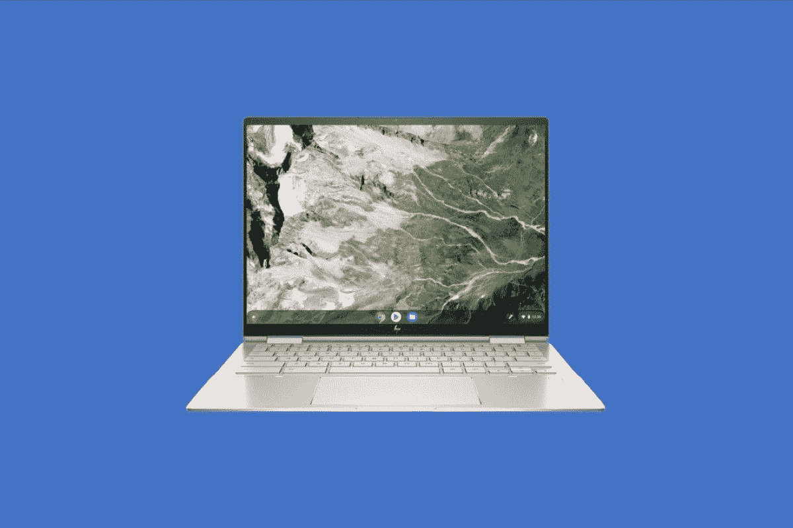
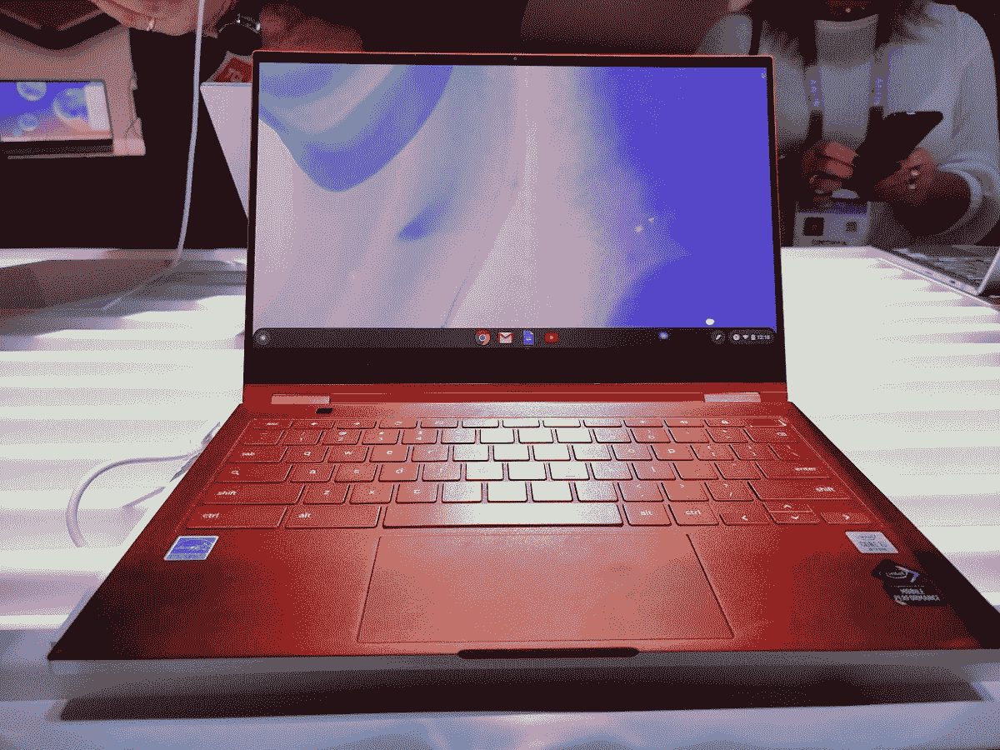

# 2023 年最佳作家 Chromebooks

> 原文：<https://www.xda-developers.com/best-chromebooks-for-writers/>

对于一些作家来说，[chrome book](https://www.xda-developers.com/best-chromebooks/)可能是他们的首选设备。与 Windows 或 Mac 系统相比，Chromebooks 的电池寿命非常长，启动速度很快，有时使用起来非常流畅。更好的是，一些 Chromebooks 也更便宜。因此，如果你是一名博客作者、小说家、编剧，或者任何以创造文字为生的人，正在寻找一款新的 Chromebook，那么你来对地方了。我们整理了这份指南，为 2022 年的作家们寻找最好的 Chromebooks。

我们的指南涵盖所有种类。我们将关注廉价的 chrome book、配备最好触摸屏的旗舰 chrome book[、廉价的 chrome book，甚至是配备 LTE 的 ChromeOS 平板电脑和设备。我们确信无论你需要什么，我们都会满足你。查看并使用下面的链接浏览指南。](https://www.xda-developers.com/best-chromebooks-touchscreens/)

## 最佳综合奖:惠普精英蜻蜓 Chromebook

 <picture></picture> 

HP Elite Dragonfly Chromebook

在我们的列表中，排名第一的是 2023 年你可以买到的最好的 Chromebook 之一，[惠普精英蜻蜓 Chromebook](https://www.xda-developers.com/hp-elite-dragonfly-chromebook-review/) 。它已经在我们的许多 Chromebook 购买指南中列出，对于作家来说，也很难不推荐它。原因何在？这款 Chromebook 拥有令人惊叹的触摸板、令人惊叹的键盘和非常现代的规格。当然，这是一款旗舰设备，所以可能会很贵，但不要让这阻止你挥霍。如果你不想挥霍，我们的下一个选择也会对你有好处。

我们向作家推荐这款 Chromebook 的首要原因与触摸板有很大关系。MacBook Pros 和许多新的 Windows 笔记本电脑，如 Surface Laptop Studio，都有所谓的触觉触摸板。对于一个经常浏览文档的作者来说，这是一个巨大的优势。我们这么说是因为触觉触摸板可以让你在表面的任何地方点击。它也会给你很好的反馈，让你拖动东西。触觉触摸板也是全玻璃的，所以当你使用它们时感觉最好。经过一整天的工作和写作，你的手指不会感到抽筋或疲劳。

除了触觉触摸板，还有键盘，这是作家工作流程中最重要的部分。[我们最近评测了这款 Chromebook，当我们评测时，我们爱上了它的键盘。我们发现它是 Chromebook 上最好的产品之一。这些键的间距是均匀的，并且有很大的移动空间，所以你可以避免打字错误和其他错误。当然，它是背光的，所以你可以在晚上工作，不用担心黑暗中的打字错误。](https://www.xda-developers.com/hp-elite-dragonfly-chromebook-review/#:~:text=The%20HP%20Elite%20Dragonfly%20is%20the%20best-looking%20Chromebook,squarer%20in%20form%20than%20a%20traditional%2016%3A9%20machine.)

我们选择的最后一部分与规格有很大关系。你看，这是一款 Chromebook，采用了英特尔最新最棒的技术。它内置第 12 代英特尔 CPU。这些 CPU 是具有性能和效率内核的 U 系列芯片。得益于此，作者将能够在这款惠普 Chromebook 上进行多任务处理，打开大量谷歌 Chrome 标签，甚至使用 Android 应用程序。除此之外，这款 Chromebook 的屏幕长宽比为 3:2，分辨率为 1920 x 1280。这种长宽比意味着作者可以并排堆叠窗口，完成更多工作，而不必担心连接到显示器。更好的是。这款 Chromebook 有很多很好的端口，可以避免使用加密狗，加密狗可能会让作者在旅途中随身携带。有 Thunderbolt 4、USB-A、HDMI 和耳机插孔。

 <picture></picture> 

HP Elite Dragonfly Chromebook

##### 惠普精英蜻蜓 Chromebook

惠普精英版蜻蜓 Chromebook 是你能买到的最好的 Chromebook，它配备了最新的 CPU、令人惊叹的触觉触控板和显示屏。

## 最佳预算:宏碁 Chromebook Spin 714

 <picture></picture> 

Acer Chromebook Spin 714

我们对作家的首选是价格在 1000 美元以上的。因此，如果你是一名预算有限的作家，并且仍然想要一台顶级的 Chromebook，那么 Acer Chromebook Spin 714 就是你的选择。与我们列表中的其他产品相比，它仍然拥有令人惊叹的显示屏、出色的背光键盘和一些更新的规格。最棒的是，它的售价在 700 美元左右。这里有一些关于我们为什么如此喜欢它的更多信息。

首先，您以这个价格获得了出色的性能。该设备采用第 12 代英特尔酷睿 i5-1235U CPU。这些 CPU 在 Chromebook 中很少见。如果你像我一样是一名作家，那么你可能会倾向于多任务处理，这就是这款英特尔 CPU 的优势所在。就像在最好的 Windows 系统上一样，它将经受住打开多个 Chrome 标签进行研究，以及摆弄多个谷歌文档进行笔记的巨大考验。甚至有足够的能力运行所有你可能梦想的 Android 应用程序。

当然，我们也不能忘记展示。普通的廉价 Chromebooks 配有低分辨率的高清屏幕，不太适合写字。有了这些，你将不能并排打开窗口，因为没有足够的像素。这些 Chromebooks 也调整到了 16:9 的宽高比，显示屏上有一个令人讨厌的底部下巴，挡住了去路。嗯，这款惠普 Chromebook 就不一样了。它被调整到更新的 16:10 宽高比，高得多，因此您可以在屏幕上一次显示更多内容。分辨率也被设置为 1920 x 1200。你可以在这个显示屏上享受任何你想要的东西，无论是谷歌文档，甚至只是多媒体。考虑到这是一个 2 合 1 设备，该解决方案对我们来说是一个巨大的胜利。您不仅可以在笔记本电脑模式下进行多任务处理，还可以在不写作的时候沉浸在电影和其他内容中。只需翻转屏幕，尽情享受！

但最重要的是键盘。这款 Chromebook 拥有典型的孤岛式键盘，但也有额外的好处。像我们的首选一样，键盘也是背光的，所以在黑暗中工作不会成为问题。

 <picture></picture> 

Acer Chromebook Spin 714

##### 宏碁 Chromebook Spin 714

宏碁 Chromebook Spin 拥有令人惊叹的显示屏和背光键盘

## 最佳平板电脑:联想 IdeaPad Duet 5 Chromebook

 <picture></picture> 

Lenovo Chromebook Duet 5

到目前为止，我们的列表集中在许多 2 合 1 或笔记本电脑的 Chromebooks 上。但传统平板电脑对作家来说也很棒。你会经常看到许多作家使用 iPads 或 Android 平板电脑，如果你真的喜欢 ChromeOS，请记住 Chromebook 平板电脑有一个新的新兴市场。我们在过去的中已经介绍了一些，但是如果你是一名作家，我们建议你推荐的首选是 IdeaPad Duet 5 Chromebook。它有一个令人惊叹的显示屏，一个非常好的键盘盖，和体面的 SoC。

不过，让我们先深入了解一下这个展示。毕竟，这是作家最终会整天盯着看的东西。请注意，这款 Chromebook 平板电脑配有有机发光二极管显示屏。有机发光二极管显示屏不同于其他 Chromebooks 中的传统 IPS 和 LCD 显示屏。它们可以产生更精确的颜色和更高的亮度。对于作者来说，这意味着网页看起来清晰准确。经常被插入到文档和帖子中的图片看起来也会很棒。[我们评测了](https://www.xda-developers.com/lenovo-ideapad-duet-5-chromebook-review/#perf)联想 IdeaPad Duet 5，非常喜欢它的显示屏。

作家可能会做的另一件事是什么？当然要记笔记。它可能是在会议期间，在一个事件中，或者仅仅是为了头脑风暴。嗯，这些都将在这款联想平板电脑上很好地工作。作为平板电脑，你可以购买一个可选的联想 USI 屏幕上的钢笔和墨水。你也可以附上键盘盒，打出一场风暴。我们真的很喜欢这个键盘套，并且发现它足够结实，可以放在我们的腿上使用。我们还发现它非常宽，键行程非常好。最重要的是，键盘保护套可以在旅行中保护屏幕——不需要屏幕保护器。

尽管如此，我们还是要提到这款设备下的片上系统。它不是英特尔或 AMD 处理器。确切地说，这是一个高通芯片。更具体地说，是高通骁龙 7c。这款芯片配有 8GB 内存，在我们的评测中表现良好，我们对它进行了网页浏览和玩安卓游戏的测试。也就是说，我们认为它对于任何使用谷歌 Chrome 以及混合社交媒体 Android 应用的作家来说都是完美的。

这款 Chromebook 最后值得一提的肯定是摄像头。这款联想有 2 组摄像头。有一个前置的 500 万像素网络摄像头和一个面向世界的 800 万像素网络摄像头。如果你是一名随叫随到的作家，你会看起来很棒。当不在通话时，您可以使用后置摄像头拍摄白板和其他文档的照片以供研究。

 <picture></picture> 

Lenovo Chromebook Duet 5

##### 联想 IdeaPad Duet 5

联想 IdeaPad Duet 5 采用有机发光二极管屏幕、后置摄像头和可拆卸键盘，是作家的绝佳平板电脑

## LTE 最佳选择:HP Elite C1030 Chromebook

 <picture></picture> 

HP Elite C1020 Chromebook

作为一名作家，我最担心的一个问题是无法连接 Wi-Fi。在这种情况下，我无法工作，因为我的很多工作都是基于网络的。这就是为什么我会选择一款支持 LTE 连接的 Chromebook。没有你想象的那么多，但你能买到的最好的一款是惠普 Elite C1030 Chromebook。这款 Chromebook 将帮助您在旅途中和紧急情况下保持联系。这也是一个奇特的设备，如果你是一个作家，经常去咖啡店和其他你在家以外工作的地方，这将有助于你脱颖而出。

我们先来了解一下这款设备的 LTE 方面。在 HP.com 结账时，如果您愿意，您可以选择添加 LTE 选项。该设备上的 LTE 由英特尔 XMM 7360 LTE-Advanced Cat 9 调制解调器提供支持。使用这种调制解调器，你不会获得更新的 5G 速度，但 LTE 速度对于作家最终可能会做的普通事情(网页浏览、查看社交媒体)来说仍然足够快。)

转到这个设备的其他方面，我们真的很喜欢它的整体设计。这款 Chromebook 不塑料也不无聊。这是惠普最棒的产品之一。全铝，非常薄。具体尺寸为 11.6 x 8.5 x 12 英寸，重量为 2.87 磅。同样，对于一个移动设备来说，这是非常便携的。这也是一款二合一的 Chromebook，因此作者可以转换它，并在各种模式下使用它。例如，用于滚动社交媒体的平板电脑模式，用于向同事展示演示文稿的帐篷模式，以及用于日常工作的笔记本电脑模式。

Chromebook 内部的处理器和显示屏让我们向作家推荐这款设备。诚然，处理器是老了，但这不是一个低端处理器，我们认为它将非常适合严重的多任务处理。惠普板载第十代英特尔酷睿 i3 处理器，搭配 8GB 内存和 128 GB NVMe 存储。至于显示器，它是一个 13.5 英寸对角线 WUXGA+ ( 1920 x1280)分辨率的触摸屏显示器。就像我们在这个列表中的其他两个选择一样，这个分辨率是因为使用了 3:2 的纵横比。它更高，非常适合多任务处理和并排抓取应用程序。

 <picture></picture> 

HP Elite C1020 Chromebook

##### 惠普精英 C1020 Chromebook

HP Elite C1030 Chromebook 具有可选的 LTE，非常适合移动写作者

## 最适合户外:三星 Galaxy Chromebook

 <picture></picture> 

Samsung Galaxy Chromebook

作为一名作家，你可以在户外使用的最好的 Chromebook 之一是原始的 Galaxy Chromebook。这款 Chromebook 配备了一个调到 4K 分辨率的奇妙的有机发光二极管显示器。它的性能也相当不错，并且有一个内置的 Spen。请继续阅读，了解我们为什么如此喜欢这款 Chromebook。

这款 Chromebook 的现代后续产品 Galaxy Chromebook 2 拥有 QLED 显示屏。这是一个受很多人欢迎的型号，但我们选择了这个旧版本来展示。这是有机发光二极管，也是 4K 分辨率。这款显示器与 Galaxy Chromebook 2 的显示器具有相同的沉浸感，但分辨率要高得多。它也变得异常明亮。我把这款 Chromebook 作为我的日常司机，当我在夏天户外工作时，我经常带着它在我的院子里。它没有那么刺眼。哦，对于一个作家来说，4K 分辨率意味着你将有更多的空间进行多任务处理。你可以进入 ChromeOS 的设置，改变缩放比例，使项目变得更小，这样你就可以在屏幕上安装比 Galaxy Chromebook 2 更多的应用程序。那台 Chromebook 只能达到 FHD 分辨率。

我们建议作家这么做的另一个原因是什么？这款老款 Galaxy Chromebook 配有一个车库 SPen。类似于 Galaxy S22 智能手机，你不必单独购买一部来做笔记。甚至这款 Chromebook 的 CPU 也不算太差。三星使用第十代英特尔酷睿 i5 处理器，也有英特尔酷睿 i7 处理器的选项。同样，我们认为这非常适合作家可能做的事情——混合社交媒体应用程序，在 Chrome 浏览器中浏览，以及观看视频。我设法在我的设备上顺利完成了所有这些任务。

就我个人而言，作为一名作家，我会提到，当我不使用 Windows 时，我会将这款三星 Chromebook 作为我的日常 ChromeOS 设备。设备上的键盘是我的最爱之一。键帽很软，可以轻松地放入机箱，背光也很好，很均匀。即使是触控板对我来说也很棒，尽管我希望它更宽一点。

除此之外，我认为 Chromebook 仍然存在一些问题，虽然只有两个 USB-C 端口。三星想让这款笔记本成为有史以来最薄的 Chromebook，所以如果你使用的是老式的 USB 驱动器，你就必须购买一个加密狗。由于 4K 面板的原因，这款 Chromebook 的电池寿命也不会是最好的。当我用我的时间工作时，我只有 3 个小时。

 <picture></picture> 

Samsung Galaxy Chromebook

##### 三星 Galaxy Chromebook

三星最初的 Galaxy Chromebook 仍然是他们最高端的产品。如果你正在寻找 4K 显示屏、开箱即用的 S-Pen 和最强大的处理器选项，这绝对是三星 Chromebook 的不二之选。

## 最适合便携式办公:宏碁 Chromebook 317

 <picture></picture> 

Acer Chromebook 317

没有一个作家总是呆在家里，有时一个作家可能会去外地。为此，作家将需要一个超越基本功能的大屏幕 Chromebook。是的，13 英寸、14 英寸和 15 英寸的笔记本电脑更常见，但 17 英寸的 Chromebooks 也很常见。我们认为 17 英寸的 Chromebook 非常适合作家。这里有一个更大的探究是什么让宏碁 Chromebook 317 如此伟大。

对于作家来说，宏碁的伟大最重要的是键盘。在这台宏碁设备上，对于一台 Chromebook 来说，有两个罕见的东西。第一个是数字键盘，位于键盘面板的左侧。这有助于作者在处理数字时避免一直使用 Shift 键。第二个是背光。是的，售价 500 美元的 Chromebook 有背光功能！这意味着作家可以在黑暗中或光线不好的情况下工作。

接下来是展示。没错，是 17 寸面板，但不是普通面板。宏碁没有采用低分辨率，而是将分辨率提升到了 FHD 1920 x 1080。这意味着作家将获得惊人的多任务处理体验。屏幕甚至还兼容触摸。作家可以并排堆叠窗口，打开 Android 应用程序，并使用他们的手指而不是键盘和鼠标进行交互。

另一件很酷的事？这是便携性方面。你可能认为 17 英寸的 Chromebook 必须很重，但这款设备不是那样的。作家可以把它和额外的装备一起带在身边而不用担心。Chromebook 厚度仅为 0.89 英寸，重量不到 5 磅。这绝对不像一台旧的 17 英寸 Windows 笔记本电脑。它非常便携。

我们喜欢这款 Chromebook 的第三点也是最后一点是它的整体性能和端口。虽然它不是最高端的 CPU，但这款 Chromebook 采用了英特尔奔腾银色 N6000 处理器。这是一个不错的 CPU，因为 ChromeOS 已经过优化。宏碁还为其配备了 8GB 内存，非常适合多任务处理。虽然 eMMC 存储速度较慢，但这对于一些作家来说并不太重要，因为写作通常不涉及繁重的数据处理。A 对于端口，没有板载 HDMI 用于连接显示器，但宽大的机箱意味着有 USB-A、USB-C、microSD 卡插槽和耳机插孔的空间。

 <picture></picture> 

Acer Chromebook 317

##### 宏碁 Chromebook 317

宏碁 Chromebook 317 是一款出色的 17 英寸 Chromebook

## 最佳长电池续航时间:惠普 Chromebook X2 11

 <picture></picture> 

HP Chromebook X2 11

我们在最佳作家 Chromebook 名单中的倒数第二名是惠普 Chromebook X2 11 号。这是一款相当小的 Chromebook，但它的电池寿命很长。我们知道小尺寸可能不适合所有的作家，但是请听我们解释一下为什么我们首先建议这样做。

首先，这款平板电脑的售价为 570 美元。考虑到这款设备的整体规格，这并不算贵。这款 Chromebook 的引擎盖下有高通骁龙 7c。正如我们在这篇评论的顶部提到的联想，这意味着作家将从设备中获得一些非常好的性能。对于网页浏览和使用 Android 应用程序，这款小平板电脑将超过。

除此之外，高通芯片意味着电池寿命长。高通芯片比英特尔和 AMD 的同类产品更节能。当我们对它进行测试时，我们得到了 8 小时的电池。它持续了我们一整天的工作，以及运行 Android 应用程序的空闲时间。这是我们名单上的 Chromebooks 之一，我们实际上也花了很多时间，所以当我们说它经久耐用时，请相信我们的话。

我们向作家推荐这款 Chromebook 的另一个原因是它的尺寸。它的尺寸为 9.94 x 6.96 x 0.3 英寸，重量仅为 1.04 磅。这种小尺寸听起来可能不好，但事实并非如此。显示器是弥补它的东西。这款平板电脑的 11 英寸屏幕还是比较有沉浸感的。2.1K 分辨率(2160 x 1440)的多点触控面板具有超薄边框，亮度可达 400 尼特。此外，键盘外壳增加了支架，使这款平板电脑更容易用作笔记本电脑，因为您可以拉出支架，将其放在膝盖上，并在需要时开始打字。

当然，还有一些我们认为作家可能会喜欢的额外内容。有一个指纹识别器用于登录，以帮助保持平板电脑的安全。还有一个 500 万像素的宽视野前置摄像头和一个 800 万像素的后置摄像头，用于拍摄你周围世界的物体。惠普甚至在价格上捆绑了惠普笔。这意味着你可以做笔记，写剧本，等等。

 <picture></picture> 

HP Chromebook X2 11

##### 惠普 Chromebook X2 11

惠普 Chromebook x2 11 结合了 Chrome OS 的强大功能和传统平板电脑的便携性。借助可选的 4G LTE 功能，您可以在任何地方工作。这是新的顶级 Chrome OS 平板电脑体验。

## 最便宜的:三星 Galaxy Chromebook Go

Galaxy Chromebook Go 是三星 Chromebook 系列中的一款新预算产品，我们认为这款 14 英寸的 Chromebook 具有坚固的显示屏和迷人的黑底白字设计，是一款非常划算的 Chromebook。它还通过了 Mil-STD-810G 测试，对于经常外出的作家来说，这是一个非常耐用的选择。除此之外，如果你是一个喜欢咖啡或液体的作家，请确保这款 Chromebook 不会发生事故。它有一个防溅键盘。

在内部，您可以获得英特尔赛扬 N4500 处理器、4GB 内存和 32GB eMMc 存储。值得注意的是，Galaxy Chromebook Go 唯一带触摸屏的型号是 LTE 版本，但并非在所有国家都有销售。英特尔赛扬 N4500 也是一款不错的 CPU。它非常适合支持基本的多任务处理，以及在谷歌浏览器中浏览。编剧不会有 CPU 能力的问题。

三星还包括大量的连接，有 1 个 USB3.2 端口，2 个 USB-C 端口，一个 microSD 读卡器和一个 3.5 毫米耳机/麦克风插孔。如果你是一个关心便携性的作家，这款 Chromebook 仅重 3.2 磅，对于 14 英寸的设备来说相当轻。由于这是一款较新的设备，你也将在很长一段时间内获得 Chrome OS 更新，使这款设备能够经受住时间的考验。

虽然这不是写作的理想设置，但它是一个很好的预算设备。您将获得一个足够大的屏幕来完成书写任务，并获得稳定的电池续航时间。如果你不想倾家荡产，加上在某些国家增加 LTE 的选项，这是一个完美的旅行伴侣。此外，如果你还有有线耳机，你可以在撰写下一篇文章或学校作业时戴上耳机。

对于作者来说，唯一真正令人失望的是 32GB 的 eMMC 存储。即使以 Chromebook 的标准来看，这个空间也不算大。如果你想将它作为日常写作的驱动力，请确保在购买 Galaxy Chromebook Go 之前，你已经有了一个好的云解决方案。

 <picture></picture> 

Samsung Galaxy Chromebook Go

##### 三星 Galaxy Chromebook Go

三星的 Galaxy Book Go 是一款很棒的 Chromebook，有着别致的设计和优质的显示屏，300 美元是一个很好的选择。

我们现在已经结束了对作家来说最好的 Chromebooks。我们认为这个列表对每个人来说都应该是广泛的，但是如果你没有找到你喜欢的，不要担心。百思买有一些很棒的 Chromebooks，还有 T2 的沃尔玛。