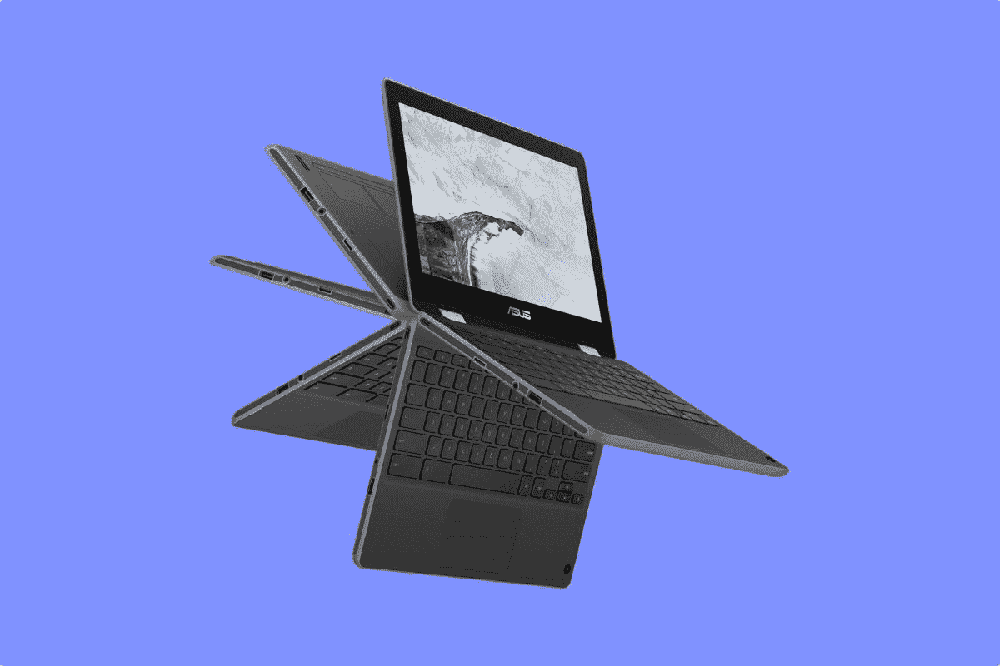

# 2023 年 300 美元以下的最佳 Chromebooks

> 原文：<https://www.xda-developers.com/best-chromebooks-under-300/>

人们普遍认为 Chromebooks 比 Windows 笔记本电脑便宜。然而，如果你想要最新最棒的 Chromebook，你仍然需要花 900 多美元购买高端规格，如第 12 代英特尔 CPU，或高分辨率 16:10 宽高比屏幕。但这并不意味着你找不到便宜的 Chromebooks！

ChromeOS 生态系统中最棒的部分是你可以用不到 300 美元或大约 300 美元购买的不同设备的数量。在本指南中，我们将只关注这一点。从[惠普](https://www.xda-developers.com/best-hp-chromebooks/)，宏碁，三星等等，我们收集了一些我们在各种零售商那里找到的最好的 Chromebooks。我们还将重点介绍这些设备的性能、设计和端口。如今每个人都有一款 Chromebooks，你可以找到适合你的那一款。只需通过上面的链接导航到您感兴趣的特定部分

## 整体最佳:三星 Galaxy Chromebook 4+

 <picture></picture> 

Galaxy Chromebook 4+

开始我们的名单是三星 Galaxy Chromebook 4+。出于几个不同的原因，我们认为这是最好的 Chromebook。首先，它看起来很像一台旧的 MacBook Pro。第二，它有一个巨大的显示屏。第三，这款 Chromebook 在价格上有一些完美的规格。综上所述，以下是我们如此喜欢它的具体原因。

根据设计，这是你能得到的最接近 MacBook 外观的 Chromebook。这款三星 Chromebook 的颜色看起来与一款较旧的铝制 MacBook Pro 非常相似。这是一个很好的方式来愚弄人们或者让他们问你更多关于你的笔记本电脑的事情。同样出色的还有整体尺寸。你可能认为 15 英寸的 Chromebooks 很重，但这款刚刚好。是的，它可能看起来像 MacBook，但这款 Chromebook 不是铝制的。你不会在 300 美元的 Chromebook 上找到它，相反，它是塑料的。它有助于保持设备轻薄。尺寸为 14.16 x 9.64 x 0.65 英寸，重量仅为 3.75 磅。你可以把它放在书包里，毫无问题地旅行。

该设计的其他额外部分包括防溅键盘，可以承受事故。只是要记住键盘不是背光的，这是对这个低价的一种期待。虽然我们讨厌没有键盘背光的设备，但我们认为三星通过提供大量端口供您使用来弥补这一点。mix 包括两个用于充电的 USB-C 端口。你还会发现一个耳机插孔和另一个 USB-A 端口。

现在回到显示器上，这个价格的 Chromebook 非常罕见。这款 Chromebook 没有配备亚高清面板，而是配备了 1920 x 1080 FHD 显示屏。当您将它与 15 英寸的大屏幕空间结合起来时，您将拥有大量空间来并排堆叠窗口和进行多任务处理。这是在旅途中拥有一个便携式办公室的好方法！

深入了解规格，三星 Galaxy Chromebook 4+由英特尔赛扬 N4000 处理器提供支持。正如你将在本指南中看到的，很难找到 300 美元的最新和最好的规格。这就是为什么这个价格最常见的 CPU 将是英特尔赛扬系列。CPU 也不差。虽然 Android 应用程序可能不会运行得最好，但网页浏览和多任务处理等基本功能也能很好地运行。这是因为 ChromeOS 是一个轻量级操作系统，没有 Windows 那么重。对于网络浏览，你会没事的。

##### 三星 Galaxy Chromebook 4+

三星 Galaxy Chromebook 4+在小价格与大显示屏、高性能和像样的键盘之间取得了良好的平衡

## 最佳 14 英寸:三星 Galaxy Chromebook Go

第二款是更小的 Chromebook，Galaxy Chromebook Go。这款 14 英寸的 Chromebook 就其尺寸而言非常紧凑。它还配备了更新的英特尔赛扬 CPU，以及大量端口和存储可扩展性选项。让我们更深入地了解这款 Chromebook，好吗？

首先从性能开始，该设备板载的英特尔赛扬 N4500 CPU 非常适合日常任务。更具体地说，是赛扬 N4500。这是英特尔最新的低端处理器之一，这意味着它拥有更高的 2.80 GHz 的睿频加速。对于在 Chrome 中打开许多标签页，并尝试 Android 应用程序，这应该没问题。该 CPU 还配有 4GB 内存和 32GB 存储空间。存储在低端，所以你可能需要把更多的文件保存在云中。然而，可选的 micoSD 卡插槽可以用作额外的存储空间。在其他规格中，三星热衷于强调这款 Chromebook 已经为 Wi-Fi 6 做好了准备。如果你有一个兼容的路由器，你将能够获得更快的下载和上传速度。此外，电池续航时间长达 12 小时。

尽管屏幕尺寸很大，但这实际上是一款非常紧凑的 Chromebook。尺寸为 12 x 8.28 x 0.63 英寸，重量为 3.20 磅。端口也是其中一个因素，机箱上有足够的空间容纳端口。它包括 2 个 USB Type-C，一个传统的 USB Type-A 3.2 端口，以及一个 MicroSD 卡插槽和耳机插孔。三星强调了 USB-C 端口如何用于充电。哦，Chromebook，我们一直很欣赏 USB-A，因为这意味着你可以毫无问题地使用你的 USB 驱动器。

不过，对价格有一个警告。虽然屏幕是 14 英寸，但你只能获得 1336 x 768 分辨率的高清面板。当你和我们上面的选择比较时，它不是最好的。然而，对于基本来说，它足够好，因为屏幕更大。事情不会一目了然，但会有空间多开一扇窗。网络摄像头也不是最好的。是 720 的网络摄像头，2022 年已经不够好了。当然，对于一个预算设备，你不能指望 1080p 的网络摄像头。为此，你可能需要花费 800 多美元，或者只需购买一个外部网络摄像头，然后将其插入 USB-A 端口。

##### 三星 Galaxy Chromebook Go

Galaxy Chromebook Go 是另一款售价不到 300 美元的出色设备

## 最佳平板电脑:惠普 x2 11

你可能会认为，300 美元买不到好的 ChromeOS 平板电脑。那你就错了。这是一个新的不断增长的空间，特别是因为谷歌不再制造自己的第一方 ChromeOS 平板电脑。最棒的是，这些设备的价格大多接近 300 美元。我们的最佳选择？惠普 Chromebook x2 11 是惠普最新的 Chromebook 之一，通常在百思买和其他零售商那里售价接近 300 美元(有时略高于 400 美元)。)

我们之所以这么喜欢惠普 x2 11，跟设计有很大关系。它甚至比 Surface Go 这样的 Windows 2 合 1 还要小。尺寸为 9.94 x 6.96 x 0.3 英寸。然后，即使算上键盘，重量也只有 1.05 磅。它是如此的轻，以至于你可以把它放进你的包里，甚至忘记它曾经在那里。让这一切成为可能的是 11 英寸的外形。这是市场上最小的 Chromebook 之一，尽管 IdeaPad Duet Chromebook 的屏幕为 10 英寸。不过，我们不能再推荐这款设备了，因为联想已经停产了。

我们[最近评测了](https://www.xda-developers.com/hp-chromebook-x2-11-review/#perf)惠普 x2 11，非常喜欢它。当我们安装了附带的可拆卸键盘后，我们就可以写长文章了。事实上，它还可以保护屏幕，这对我们来说是另一个巨大的优势。说到屏幕呢？这款平板电脑的显示屏一点都不便宜。它是 2.1K 分辨率的面板，类似于 iPad Air 的分辨率。屏幕上有很多像素，可以用来绘图、打开网页等等。

当然，作为一台平板电脑，你可能最终只是打开支架，在屏幕上观看电影。为此，我们喜欢这个设备。它达到了 400 尼特的亮度，甚至高于我们列表中大多数 Chromebooks 的 250 尼特屏幕。如果你打算看电影或沉浸在多媒体中，这是这个价格的一个很好的设备。

惠普还在这款 Chromebook 的包装盒中附带了一支触控笔。它就像苹果的新款 Apple Pencil 一样，通过连接到屏幕的一侧来充电。你可以用那支笔在屏幕上画画，甚至做笔记。因为它贴在屏幕的侧面，你不必担心它会丢失。

在我们深入了解这款平板电脑的最后，我们将介绍一下它的规格。我们将在这个列表中提到的许多 Chromebooks 都有英特尔或 AMD 的 CPU。这款由高通骁龙 7c SoC 供电。这是一种基于 ARM 的芯片，类似于流行的 Android 手机上使用的芯片。这意味着，如果你购买它，平板电脑将拥有全天的电池寿命和非常好的网络浏览性能——就像我们在审查期间得到的一样。

 <picture></picture> 

HP Chromebook X2 11

##### 惠普 Chromebook x2 11

惠普 Chromebook x2 11 结合了 Chrome OS 的强大功能和传统平板电脑的便携性。借助可选的 4G LTE 功能，您可以在任何地方工作。这是全新的顶级 Chrome OS 平板电脑体验。

## 最佳紧凑型二合一设备:联想 Chromebook 11.6

 <picture></picture> 

Lenovo Chromebook 11.6

如果你真的想在没有键盘或鼠标的情况下享受 ChromeOS，那么你应该试试 2 合 1。这种外形让你可以以多种方式使用 Chromebook，比如在帐篷、支架、平板电脑或传统的笔记本电脑模式下。通常情况下，2 合 1 设备的价格可能会超过 300 美元，但这款联想 Chromebook 11.6 的价格刚刚好，为 200 美元。这里有更多关于为什么它是一个好的选择。

首先，我们进入引擎盖下是什么规格。这款联想 Chromebook 配备了基于 ARM 的 Soc，电池续航时间长达 10 小时。更具体的说，就是联发科 Mt8183 SoC。同样，这不是一个高性能的 CPU，但对于运行 Android 应用程序这样的任务来说，这是非常好的。该 CPU 还配有 4GB 内存和 64GB eMMC 存储，这意味着您可以毫无问题地快速浏览网页。

我们喜欢的另一件事是展示。同样，它在 1366 x 768 分辨率下不是最好的，对于这款设备的 11 英寸屏幕来说，无论如何你都不需要很多像素。这是浏览单个网页或翻转屏幕并向同事展示网页或重要文件的绝佳解决方案。据联想称，该屏幕有多种视角，并采用 IPS 技术，视觉效果更清晰。

设计也非常简洁。这款二合一设备采用“深渊蓝”颜色，这将帮助您在咖啡店或课堂上脱颖而出。联想在键盘上方有一个扬声器，所以视频声音更大，特别是当你旋转屏幕面对你的时候。除此之外，它还是我们列表中最紧凑的二合一设备之一。尺寸为 11 x 8 x 1 英寸，你可以把它塞进一个标准的袖子里，随身携带，而且还有空间放笔记本和其他物品。就连重量也达到了令人印象深刻的 3 磅。同样，这有助于提高可移植性。

即使对于一个小设备来说，联想对端口也很友好。有 1 个 USB A 2.0、1 个 USB-C 2.0、x 个 microSD 读卡器和一个耳机/麦克风组合插孔(3.5 毫米)。你可以将你拥有的任何东西连接到这个设备上，尽管显示器需要一个加密狗。

##### 联想 Chromebook 11.6

联想 Chromebook 11.6 是最紧凑的二合一设备之一，它的电池续航时间也非常长。

## 最适合教育:Acer Chromebook 512 笔记本电脑

 <picture></picture> 

Acer Chromebook 512 Laptop

我们名单上最便宜的 Chromebook 是宏碁 Chromebook 512 笔记本电脑。这对教育来说很重要。此外，它有时在亚马逊等大多数地方售价 150 美元，非常适合批量购买。它的性能也很不错，一旦你习惯了 ChromeOS，这是一个很好的方式来过渡到一个新的 Chromebook 型号。

这款 Chromebook 的内部是英特尔赛扬 N4020 CPU。您还可以添加总共 4GB 的内存和 32GB 的 eMMC 存储。在教育领域，这些规格对于网页浏览和使用授权的 Android 应用程序已经足够好了。记住，在教育领域，Chromebooks 是基于云的和基于网络的机器。不是在设备上保存和计算，而是使用像谷歌文档、工作表和幻灯片这样的应用程序。这些都是网页，我们认为它们都能在他的设备上正常运行。我们确实认为电池寿命也会很长。额定 12 小时，对于一个低功耗的 CPU 来说非常棒。

对于教育版 Chromebook 来说，另一件重要的事情是它必须耐用。学生们将对他们的设备进行最严格的测试。你应该很高兴知道这是军用标准 810G 的投诉。如果你不知道，那么这意味着笔记本电脑可以承受从桌子等表面高达 122 厘米的跌落。此外，防泼溅键盘也非常耐用，即使有水落在上面也不会损坏。

我们也不能忘记 3:2 的长宽比。与其他 Chromebooks 相比，将会有更多的垂直空间来阅读文档和滚动网页。据宏碁称，它的垂直高度增加了 18%。12 英寸的屏幕是一个奇怪的 1255 x 912 分辨率的屏幕，你可能不会多任务处理，但看起来好像这是一个教育设备，用于阅读单个网页，你会很好。

在端口和网络摄像头上，左侧有一个 USB-C 端口、一个 USB-A 端口和一个 microSD 卡扩展。右侧有 USB-A 和 USB-C。与我们列表中的其他产品相比，网络摄像头也很棒，因为它是 1080p，这有助于避免你看起来像是在你的相机镜头上涂了凡士林。

##### 宏基 Chromebook 512 笔记本电脑

Acer Chromebook 512 非常适合教育

## 价格略高于 350 美元的最佳选择:宏碁 Chromebook 317 笔记本电脑

 <picture></picture> 

Acer Chromebook 317

你可能会认为 17 英寸的屏幕会花掉你一大笔钱，但是你又错了！市场上有很多很棒的 17 英寸 Chromebook，其中之一是 Acer Chromebook 317 笔记本电脑，通常售价略高于 300 美元。

这款 Chromebook 采用了英特尔奔腾银色 N6000 处理器，这也是一款低端 CPU，但它比我们上面列表中的 chrome book 中的赛扬 CPU 要好。这是因为 CPU 是四核的，所以你仍然可以进行多任务处理，完成很多工作，类似于更高端的 Chromebook。这也得益于 8GB 的内存和 64GB 的 eMMC 存储。同样，8GB 是获得良好性能和多任务处理的基础，eMMC 存储不是太大的担忧。正如我们一再所说的，Chromebooks 主要是基于云的设备，并且操作系统已经针对速度进行了优化，因此启动时间和数据传输时间并不太重要。

回到键盘，是全尺寸背光。右边的数字键盘也是另一个巨大的好处，因为你可以更容易地处理电子表格中的数字，而不用使用 shift 键。这两个在这个价位的 Chromebook 上都很难找到。

总的来说，对于 17 英寸的 Chromebook 来说，这也不是一个太重的设备。由于拥有 GPU，典型的 17 英寸 Windows 笔记本电脑可能接近 6 磅，但这款笔记本电脑仅重 4.85 磅，不到 5 磅。它也没有那么厚，大约 0.89 英寸，适合合适的人携带。

除了键盘和 CPU，我们还想突出显示。它的尺寸为 17.3 英寸，分辨率为 1920 x 1080。如此大的屏幕为您提供了大量空间来并排堆叠窗口，并进行多任务处理。请注意，屏幕也是触摸的，这有助于在您不想触摸鼠标时移动东西。

我们也很喜欢这里的端口选择，尽管缺少 HDMI 意味着你需要一个加密狗。17.3 英寸的设计给了宏碁很大的端口空间，他们确实做到了。左侧是 USB Type-C、USB-A、microSD 和耳机插孔。右侧还有另外一个 USB-A 口和 USB-C，两个 USB-A 口都是 USB 3.0，所以你获得了一点额外的速度。

##### 宏碁 Chromebook 317

凭借背光键盘和全尺寸数字键盘，Acer Chromebook 317 的价格非常划算

## 最适合儿童:华硕翻盖 C214

 <picture></picture> 

Asus Clip C214

华硕 Chromebook Flip C214 旨在提供创新和鼓舞人心的学习体验，非常适合儿童。除了多功能触摸屏和内置手写笔，还有一个 360 度转轴和一个面向世界的摄像头。华硕 Chromebook Flip C214 具有适合儿童使用的耐用性，让父母放心，它配有全方位的橡胶缓冲器、防泼溅键盘和超坚韧的转轴。凭借其长达一天的电池续航时间和省时、易于维护的模块化结构，华硕 Chromebook Flip C214 可以应对孩子可能扔过来的任何东西。

虽然这款笔记本电脑的内部规格并不重要，但它内置了英特尔赛扬处理器、4GB 内存和 32GB eMMc 存储。然而，华硕 Chromebook Flip C214 包括一个特殊的面向世界的摄像头，因此孩子们可以用全新的方式探索和学习。这使他们能够在平板电脑模式下拍摄照片和视频。还计划让面向世界的摄像头支持多功能应用程序，为学生和教师提供令人兴奋的新学习辅助工具。

当你有孩子时，意外就会发生，华硕 Chromebook Flip C214 已经为他们做好了准备。它可以承受日常的教室撞击、碰撞、跌落和泼溅而不会造成任何损坏。它超越了苛刻的军用级 MIL-STD-810G 耐用性标准，还通过了严格的 ASUS 质量测试。它可以承受高达 120 厘米(超过标准桌面高度)的偶尔跌落，转轴和 I/O 端口经过全面测试，可以承受日常使用的压力和张力。

##### 华硕 Chromebook Flip C214

华硕为学生提供了相当多的可靠选择。这种特殊的型号非常适合年幼的孩子，因为它具有防泼溅和防跌落的加固设计。实惠的价格和可转换的外形也使它成为大学生的一个有吸引力的选择。

所以你有它！这些是我们挑选的 300 美元以下的 Chromebooks。我们尽了最大努力来收录最好的设备，但有时，这些设备可能会以更低的价格出售，或者最终定价更高。这就是目前 chrome book 的市场状况，但你总能在当地零售商百思买(Best Buy)等零售商那里找到最好的 chrome book。