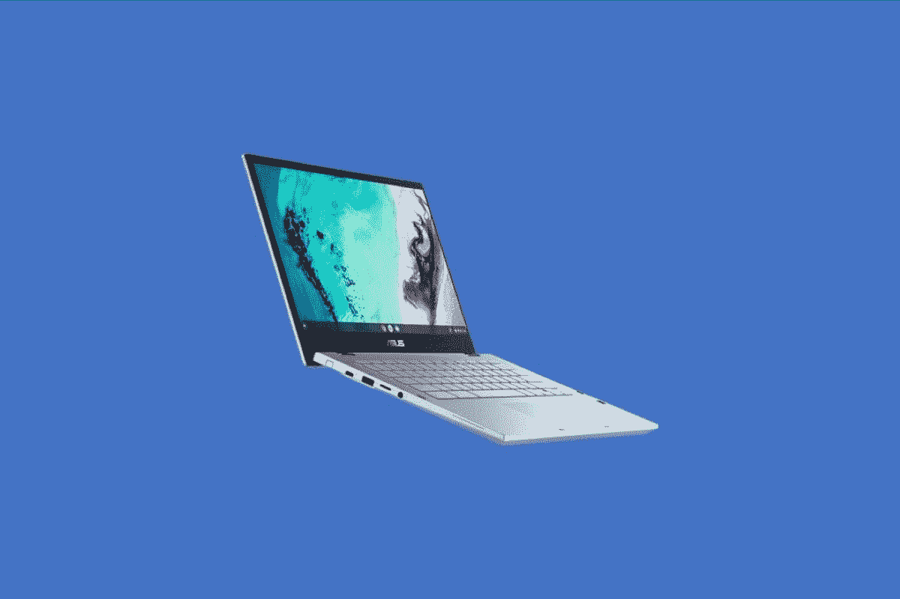
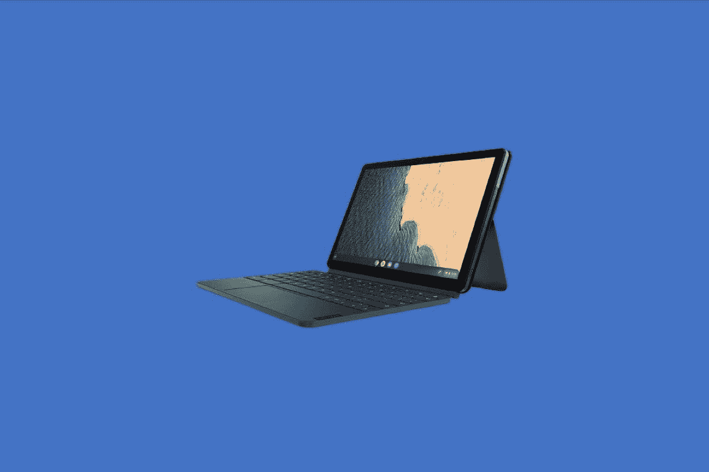
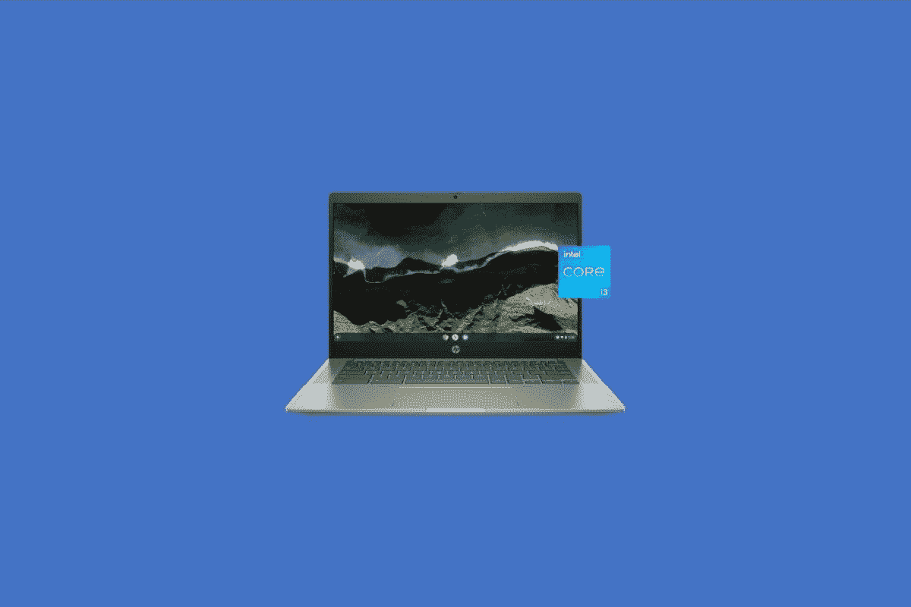
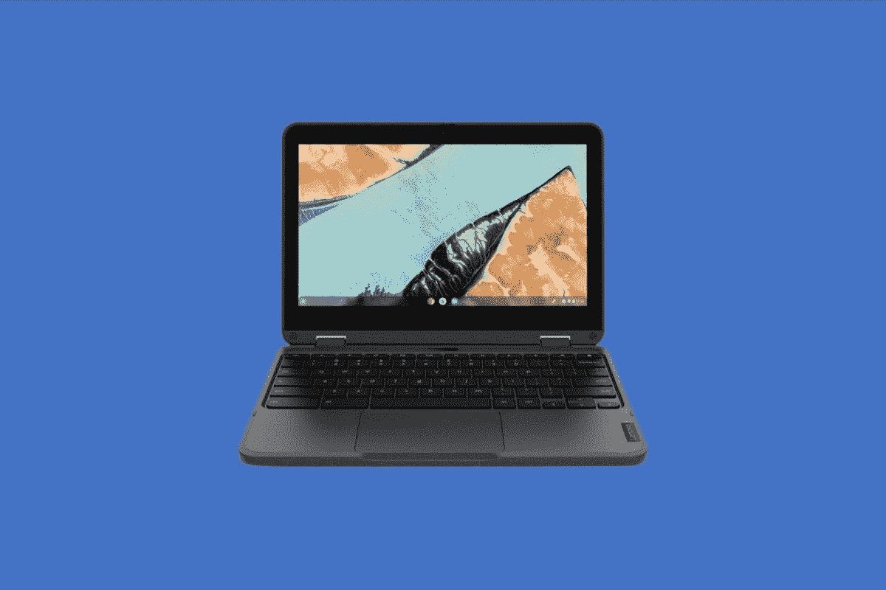
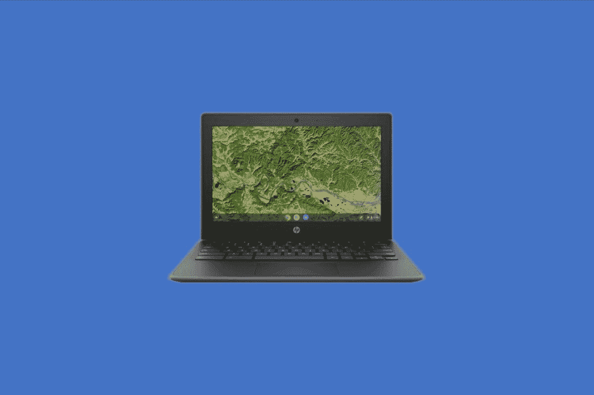
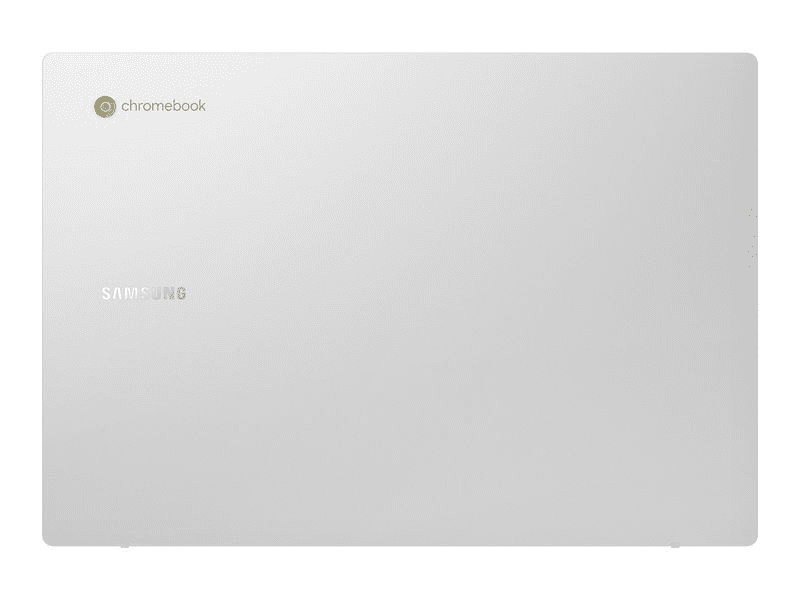

# 2023 年沃尔玛销售的最佳 Chromebooks

> 原文：<https://www.xda-developers.com/best-chromebooks-walmart/>

沃尔玛为你的家庭和其他地方提供了大量的好产品，包括 Chromebooks。如果你喜欢从沃尔玛实体店甚至网上商店购买产品来寻找交易，那么你可能也会在那里找到一些不错的 Chromebooks。有各种各样的 Chromebooks 可供选择，尽管大多数都是预算选项。

所以，不用担心！我们已经为你做了调查，并整理了沃尔玛的 Chromebook 清单，以了解目前有哪些库存和可供购买。我们的列表涵盖了来自[惠普](https://www.xda-developers.com/best-hp-chromebooks/)、三星、[宏基](https://www.xda-developers.com/best-acer-chromebooks/)、联想等公司的一些最佳设备。如果你需要一些便宜的，昂贵的，或其他任何东西，那么我们有你涵盖。以下是 2022 年你能在沃尔玛买到的所有最好的 Chromebooks。

请记住，我们直接从沃尔玛销售全新和非翻新的 Chromebooks，而不是从沃尔玛网站上的第三方零售商那里购买。你会发现许多第三方出售二手或旧的 Chromebooks，但这些设备不是来自沃尔玛，这就是为什么我们建议避免使用它们。

## 最佳整体:华硕 Chromebook Flip CX3 14

 <picture></picture> 

ASUS Chromebook Flip CX3

为了在沃尔玛找到最好的 Chromebook，我们按照最高价格进行了排序，并根据库存进行了筛选。这让我们看到了华硕 Chromebook Flip CX3 14。这款 Chromebook 售价 600 美元，有很多我们喜欢的地方。它很花哨，性能很好，并且可以用手写笔完全转换。我们再深入一点，好吗？

我们先从这个系统的性能说起。它采用英特尔酷睿 i3 处理器。这是我们在价格不超过 1000 美元的 Chromebook 中寻找的典型 CPU。这是一个非常适合网络浏览和运行 Android 应用程序的 CPU，因为它有一个以上的内核和 2.50 GHz 的工作范围。更好的是，这个系统搭配了 8GB 的内存，并配有 128GB 的固态硬盘。这意味着你可以将文件存储在云上，而不用担心当你在谷歌浏览器中打开多个标签进行多任务处理时系统会变慢。

进入设计，这是一个完全可转换的 Chromebook。这意味着您将能够以多种方式使用它，无论是展示演示文稿的帐篷模式，玩游戏的平板电脑模式，还是打印文档和浏览网页的笔记本电脑模式。除此之外，这款 Chromebook 有一个触摸屏，并支持 garaged 手写笔。这意味着，当你不需要它的时候，你可以把手写笔放在安全的地方，当你需要它的时候，把它拔出来，这样你就可以在屏幕上画画或者做笔记了。在其他设计领域，这款 Chromebook 符合军用级耐用性，因此可以在旅途中得到保护。它还有一个 Ergo 提升铰链，可以将键盘提升到一个舒适的打字位置，

现在，为了更好地展示。这款 Chromebook 拥有 14 英寸 1920 x 1080 分辨率的显示屏。如果你不是像我们这样的技术型，那是一个非常高分辨率的显示器。您将能够欣赏电影并看到每个细节，并排堆叠您最喜爱的应用程序以进行多任务处理，并在屏幕上拖动所有内容，而不会耗尽空间。把它想象成一个移动办公室。

我们喜欢这款 Chromebook 的最后一点是电池寿命，以及端口。电池续航时间为 11 小时，因此您不必担心必须一直插上电源。至于端口，有很多要避免加密狗。有 2 个 USB-C 端口，2 个 USB-A 端口，一个 microSD 卡插槽，一个耳机插孔，以及侧面的音量摇杆。

 <picture></picture> 

ASUS Chromebook Flip CX3

##### 华硕 Chromebook Flip CX3

华硕 Chromebook Flip CX3 是一款全面出色的 Chromebook，这要归功于现代 CPU、garaged 触控笔以及设计

## 最佳平板电脑:联想 IdeaPad Duet 5

 <picture></picture> 

Lenovo Chromebook Duet

我们名单上的第二个设备是非常受欢迎的 Chromebook。在很多零售商那里很难找到，但是沃尔玛有库存。是联想 IdeaPad Duet 5。这是一款 Chromebook 平板电脑，配有可拆卸键盘和可选手写笔。这是我们为什么把它选为第二名的独家新闻。

首先，我们真的很喜欢这款 Chromebook 的显示屏。这是一个 OLED 面板。如果你不熟悉，这种类型的面板选择意味着当你观看电影和流媒体内容时，你最终会获得无与伦比的亮度、真正准确的颜色和逼真的体验。你典型的 Chromebook 有有机发光二极管或 IPS 面板，但这是有机发光二极管，它非常适合达到高色域和产生逼真的颜色。除了显示器，另一个有利于多媒体的部分是扬声器，这是一个四阵列设置。这意味着您的音频最终面向您。当我们[有了用于审查的设备](https://www.xda-developers.com/lenovo-ideapad-duet-5-chromebook-review/#perf)时，我们做了很多这样的事情，并且在我们的试用期间真的很喜欢它。

作为 ChromeOS 平板电脑，这款设备还配有键盘。通常情况下，键盘是可选购买的，但在这种情况下，它是为您提供的。这意味着你将能够在旅行中连接键盘保护套并保护屏幕。你也可以用键盘输入文件，或者用触控板浏览网页。你不必整天只在手中使用这个设备。

接下来，作为 Chromebook 平板电脑，你最终可能会像使用 iPad 一样使用这款设备。这个设备的好处是它的引擎盖下有一个芯片，这是非常好的。这是高通骁龙 7c 第二代。这意味着更长的电池寿命，以及可从谷歌 Play 商店下载的 Android 应用程序的出色性能。这是因为这款设备有一个基于 ARM 的芯片，通常用在你的手机上。内含的 4GB 内存和 64GB eMMC 存储非常适合支持这一点。

请注意，这是一款平板电脑，但没有手写笔。你必须单独买一个，就像你买 iPad 一样。一旦你买了一个，你就可以在网页上画画，使用谷歌草书应用程序做笔记，等等。

当然，便携性对平板电脑来说很重要，而这一款非常适合。它不到一磅。不过，从可移植性方面来说，我们只需要一件东西，那就是端口。这只有一个 USB Type-C 端口，所以你需要使用蓝牙耳机来播放音频，或者购买一个加密狗来扩展你的 USB 驱动器和显示器。不过总的来说，这款售价 500 美元的平板电脑很难有什么可抱怨的，尤其是它的显示屏。

 <picture></picture> 

Lenovo Chromebook Duet

##### 联想 Chromebook Duet

由于惊人的有机发光二极管显示屏，联想 IdeaPad Duet 5 是你今天可以买到的最好的可拆卸 Chromebooks 之一

## 最佳 14 英寸翻盖手机:惠普 14 英寸 Chromebook

 <picture></picture> 

HP 14-inch Chromebook

到目前为止，我们已经提到了平板电脑和二合一设备，但是如果你想要一台传统的翻盖笔记本电脑，并且不介意失去可转换性，那该怎么办呢？你现在可以在沃尔玛找到的最好的一款是惠普 14 英寸 Chromebook。它的价格接近 400 美元，性能非常好。

深入研究一下，我们先回到 CPU。与我们的首选相似，这款 Chromebook 内置英特尔酷睿 i3-1135 CPU。这是英特尔核心阵容中较低端的芯片，但它仍然非常出色，高于其他 Chromebooks 中的赛扬和奔腾处理器。我们认为你在浏览网页，甚至使用 Android 应用程序方面应该没有问题。这是一款非常适合多任务处理的设备，即使只有 4GB 的内存。

现在，为了展示。这是一个低分辨率的 14 英寸 1366 x 768 面板，但我们仍然认为它很棒。14 英寸的屏幕给你很大的空间来打开应用程序。和其他内容。该显示器还有一个触摸屏，防眩光，这意味着如果你在室外或明亮的办公室工作，你仍然可以看到屏幕上的内容。屏幕上方是什么？这是一台惠普宽视野 720p 高清摄像机。宽视野技术意味着您将在通话中融入更多的自我，而不仅仅是脸部。甚至还有一个隐私滑块，所以你可以静音。

至于设计，有很多我们仍然喜欢的。在更高端的 Chromebooks 上你会发现一些东西。首先是背光键盘。正如你所料，这意味着你可以在晚上使用这款 Chromebook。此外，屏幕支持触摸，所以如果你下载了一个 Android 应用程序，你可以用手指而不是键盘与它互动。第三，是 B&O 扬声器，它可以帮助提高你的音频，使它看起来更像生活。最后是便携性，它的重量是 3.31 磅。这意味着你可以放心地带着它旅行。

像往常一样，我们确实想以一个关于端口的注释来结束。这款 Chromebook 就装了它们。在一侧，有一个 microSD 读卡器，因此您可以扩展您的端口、耳机插孔、USB Type-C 和 USB Type-A。在另一侧，甚至还有 HDMI、USB-A 端口和另一个 USB-C 端口。对于显示器和其他配件的连接，您可以使用这款 Chromebook。

 <picture></picture> 

HP 14-inch Chromebook

##### 惠普 14 英寸 Chromebook

惠普 14 英寸 Chromebook 是一款出色的翻盖式笔记本电脑，配有背光键盘和英特尔酷睿 i3 CPU

## 最佳 15 英寸:三星 Chromebook 4+

 <picture></picture> 

Galaxy Chromebook 4+

在这次挑选中，我们必须确定这款笔记本电脑是一款经济实惠的笔记本电脑。拿它和更高端的笔记本电脑在特性和能力上比较是不公平的。然而，这是一台 15 英寸显示屏的非常好的笔记本电脑。

在一个快速的规格纲要中，美学非常好，有点让人想起 MacBook。它干净整洁，没有可见的螺钉和光滑的轮廓。屏幕是漂亮的 16.5，4+提供 64 GB 存储和 4 或 6 GB RAM。有 2 个 USB-C 端口，1 个 USB-A 端口，一个 micro-SD 插槽(非常适合初露头角的摄影爱好)，当然还有一个耳机插孔。处理器是英特尔赛扬 4000。它的重量非常轻，只有 3.7 磅，每颗三星的电池寿命为 10.5 小时。

对于那些只需要基本功能的人来说，以下是我们认为这款笔记本电脑非常出色的原因。这款笔记本电脑比其他同等价位的笔记本电脑更轻，屏幕更大，内存更大。这是一款不错的简单笔记本电脑，可以轻松地同时处理流媒体电影、浏览网页、检查电子邮件和做作业。

换句话说，这款 Chromebook 非常适合学生和不需要超级昂贵的电脑来执行大部分在线业务的人。这台笔记本电脑能和我们的首选相比吗？不，但这可以理解。这是一匹结实的老黄牛。它非常耐用，可以承受快速下跌。这些钥匙也是防撬的，所以它们也能承受相当大的打击。

沃尔玛没有太多 15.6 英寸预算的 Chromebooks，所以这是值得考虑的。你不会得到世界上最好的性能，但它确实是这个价位上你需要的。此外，由于内置 6GB 内存，你可以进行一点点多任务处理。你肯定需要投资云存储服务，因为这款 Chromebook 缺乏更高的板载存储选项，但这是 Galaxy Chromebook 4+唯一的大问题。那些喜欢用有线耳机听音乐的人也会喜欢 3.5 毫米耳机插孔。

 <picture></picture> 

Samsung Chromebook 4+

##### 三星 Chromebook 4+

那些喜欢大屏幕的人会喜欢 15.6 英寸的显示器，它隐藏在轻薄的机箱中。凭借超长的电池续航时间和高达 128GB 的存储空间，如果您需要额外的屏幕空间，这款 Chromebook 是一个非常值得的选择。

## 最适合教育:联想 300e Chromebook Gen 3

 <picture></picture> 

Lenovo 300e Chromebook

沃尔玛是许多优秀教育类 Chromebooks 的大本营。现在似乎很受欢迎的是联想 300 e Chromebook Gen 3。这款 Chromebook 包含了你可能需要的所有东西，从坚固的设计到像样的 CPU，甚至是可转换的设计和车库手写笔。

我们将首先通过触摸显示屏来开始这一部分。在教育场景中，你不希望孩子们走得太远，或者一心多用，玩游戏和其他东西。就这一点而言，这款 Chromebook 非常不错。它拥有 11.6 英寸的屏幕，分辨率为 1366 x 768。这是一个使网页和其他内容看起来又大又亮的 crip 解决方案。此外，还有触摸屏和手写笔支持。有了带车库的手写笔，学生们可以在屏幕上画画和做笔记。这支笔可以安全地放在一边，在往返学校的途中不会丢失。

这款 Chromebook 也是全塑料材质。这意味着，如果你是父母或老师，你不必担心跌落损坏设备。除此之外，它还非常便携。尺寸为 11.4 x 8 x 0.78 英寸。体重 2.93 斤。这大约是一张纸的大小，几乎和你的普通教科书一样重。学生可以带着这款 Chromebook 旅行，并将其放入书包中。

当我们有你的时候，我们会提到引擎盖下的东西的规格，以及为什么它会成为我们决策的因素。首先，这是一款 AMD 驱动的 Chromebook。更具体地说，它内部有 AMD 3015Ce 芯片。这是一个双核芯片，这意味着学生可以非常高效。在 Chrome 中打开多个标签，或者从页面或表格中处理多个 Google Workspace 文档都不是问题。此外，使用教育授权的应用程序也很好。

在端口上，我们希望在教育版 Chromebook 上看到很多避免使用加密狗的内容。左侧有 USB-C 充电，USB-A 端口，耳机插孔，以及 microSD 卡插槽。右侧有一个音量摇杆来控制音量，一个 USB-A 端口，以及一个 HDMI 插槽。HDMI 对我们来说是一个巨大的优势，因为当学生在家时，他们可以连接到显示器或电视，而不需要适配器。

 <picture></picture> 

Lenovo 300e Chromebook

##### 联想 300e Chromebook

联想 300e Chromebook 为教育行业配备了非常好的 CPU，以及出色的触摸屏和坚固的设计

## 最便宜的:惠普 11.6 英寸 Chromebook

 <picture></picture> 

HP 11.6-inch Chromebook

随着我们继续我们的列表，我们现在来到了惠普 11.6 英寸 Chromebook。这值得一提，因为它是我们名单上最便宜的 Chromebooks 之一。这是另一个 AMD 驱动的系统，在销售时，可以低至 100 美元。现在让我们更深入地研究一下规格，好吗？

从驱动这个系统的东西开始，它是 AMD A4 CPU。有了 2.4Ghz 的睿频加速，当你考虑它时，这不是一个太强大的芯片，但我们真的仍然喜欢它。我们这么说是因为它是双核芯片。像这样的双核芯片仍然非常适合日常任务，如网页浏览和打开 Android 应用程序。毕竟 ChromeOS 确实针对这些低端芯片进行了优化。请注意，这里也有 4GB 的内存，这是我们在 Chromebook 上进行多任务处理时通常需要的基本内存。

现在，对于整体设计。尽管这是一款廉价的 Chromebook，但它仍然非常坚固。它有一些高端机器的高级功能。虽然它仍然是塑料的，但你会发现这款笔记本电脑配有金属加固的边角。这使得它可以承受高达 122 厘米的跌落。技术尺寸为 11.60 x 8.10 x 0.74 英寸，重量不到 2 磅。键盘也是防溅的，所以液体可以通过而不会损坏内部。如果你想带着这台机器旅行，这一切都很棒。

像往常一样，我们也要注意电池寿命和端口。惠普认为该系统的电池续航时间可达 10 小时。当你考虑到分辨率较低的 11.6 英寸 1366 x 768 分辨率屏幕时，这应该不会太令人惊讶。分辨率较低的屏幕对电池的消耗较少。除此之外，看端口，联想还挺大方的。该组合包括左侧的 USB-C、USB-A、右侧的 microSD 卡插槽以及右侧的 USB-C 和 USB-A。低价的话，就别指望看到 HDMI 了。

 <picture></picture> 

HP 11.6-inch Chromebook

##### 惠普 11.6 英寸 Chromebook

这是沃尔玛最便宜的 Chromebook，规格和显示屏都还不错，电池续航时间也很长

## 最适合儿童:三星 Chromebook Go

Galaxy Chromebook Go 旨在承受日常生活中不可避免的打嗝。Galaxy Chromebook Go 采用军用级设计，精心打造，经久耐用，甚至足以承受偶尔的跌落、撞击或泼溅。放心地打开和合上盖子——铰链也能承受这种压力。此外，转轴采用 180 度设计，让您可以从多个视角充分享受 Galaxy Chromebook Go。

如果你在市场上购买低价 Chromebook，并且你愿意接受不是最好的屏幕，特别是以今天的标准来看，这可能是一个不错的选择。如果你一定要有超高分辨率的显示器，那就去别处看看吧。这款的屏幕不是 IPS，而且可视角度有限，分辨率只有 1366×768。

也就是说，其他的都很好。它速度快，运行流畅，并能完成你交给它的所有基本任务。它从 YouTube 上流式传输 4K/60 内容，不会丢帧。(不过，你会想要一个外部显示器来欣赏它)。根据提供的规格，基准测试比预期的要好。结果比运行相同基准测试的所有用户中的 70%要好，比使用 ChromeOS 的用户好 80%。你可以轻松地使用这款 Chromebook 一整天，然后进入下一天，并且仍然有超过 50%的电池剩余，估计可以再运行近 8 个小时。我认为声称的 12 小时电池寿命实际上是非常现实的，这是一个惊喜，因为这些估计通常会相差很多。三星在这一点上做得很好，有效地发挥了它的所有潜力。即使这样强调它也不会变热，只是勉强暖和。没有风扇或任何冷却设备，所以它保持完全安静。

按键手感不错，虽然间距有点奇怪。随着时间的推移，你肯定会习惯的。这同样适用于任何新键盘。触摸板运行良好，反应灵敏。我们喜欢它有一个点击的硬件按钮，或者一个水龙头也可以工作。它支持常见的手势，一切都很自然。音质出奇的好。它清晰响亮，低音、中音和高音都很好。两个扬声器安装在底部，在柔软的表面使用时会有点低沉。相机还可以，无论如何都不算好。它可以很好地用于 Skype 和其他视频通话，但这也是你所需要的。

总体而言，三星知道他们在 Galaxy Chromebook Go 上做了什么。该机器专为儿童设计，用于学校作业，或为需要第二台机器用于内容消费和轻度生产力的成人而设计。对于这两个任务，这是一个巨大的价值。如果你经常旅行，你也可以选择支持 LTE 的型号，这种型号稍微贵一点，如果你想走这条路线，可以在威瑞森通过设备支付计划购买。耐用性和整体设计令人印象深刻，任何寻求时尚基本款 Chromebook 的人都会喜欢 Galaxy Chromebook Go。

 <picture></picture> 

Samsung Galaxy Chromebook Go

##### 三星 Galaxy Chromebook Go

三星 Galaxy Book Go 是一款漂亮的设备，具有高质量的显示屏和出色的 CPU

这是我们目前在沃尔玛能找到的最好的 Chromebooks。请记住，沃尔玛的股票总是在变化。我们将尽可能更新该指南。如果我们挑选的东西不符合你的口味，那么不要担心。其他零售商如[百思买也出售 Chromebook](https://www.xda-developers.com/best-chromebooks-best-buy/)，你总能从我们的最佳 chrome book 列表中找到一些[。](https://www.xda-developers.com/best-chromebooks/)