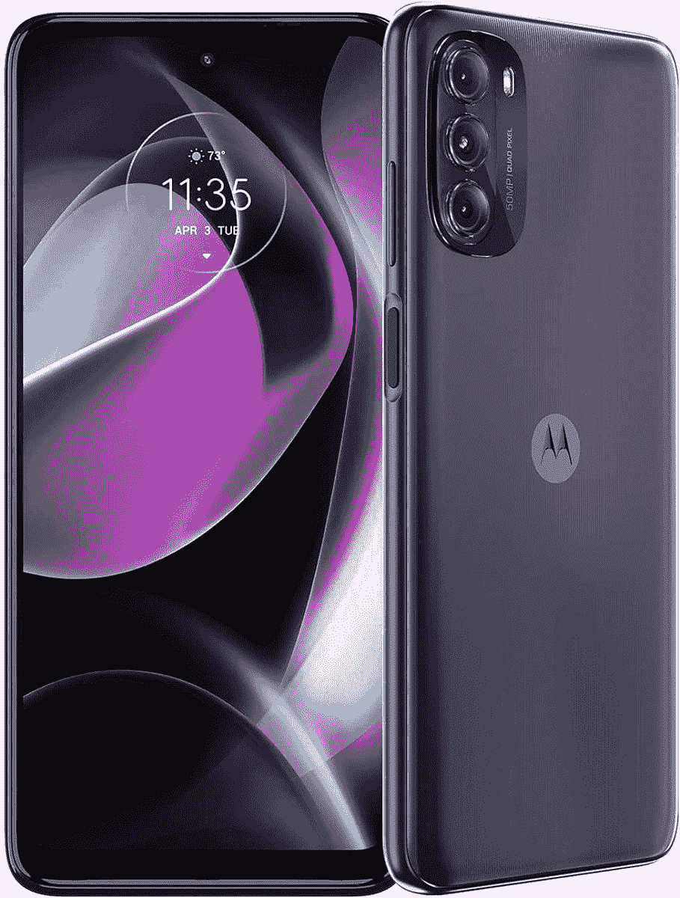

# 2023 年最佳板球无线手机

> 原文：<https://www.xda-developers.com/best-cricket-wireless-phones/>

尽管我们喜欢在 XDA 测试和推荐旗舰手机，但我们明白，让许多读者每年花费数千美元购买市面上最好的设备是没有意义的。这就是为什么我们重视管理和维护一份最新的廉价手机和平价手机套餐列表。与你所想的相反，你仍然可以享受许多最新最棒的功能，而不用花一大笔钱。此外，还有像 Cricket Wireless 这样的运营商以更实惠的价格提供电话和蜂窝计划。如果你已经在 Cricket Wireless 上，或者想转过去，有很多选择。我们最喜欢的许多手机都被认为是入门级或中端手机，但我们也强调了一些高端选项，包括 iPhone 14 Pro。

## 整体最佳 iPhone:苹果 iPhone 14 Pro

苹果新的 [iPhone 14 Pro](http://www.xda-developers.com/apple-iphone-14-pro-review/) 首次为 iPhone 阵容带来了许多新功能，包括前置摄像头和 FaceID 的新切口，新的 48MP 传感器主摄像头传感器，永远在线的显示屏，新的芯片组等等。所有这些升级使新的 iPhone 14 Pro 成为真正的“专业”iPhone，证明了比普通 iPhone 14 型号溢价的合理性。它也很容易从美国的 Cricket Wireless 购买，使它成为这个列表中的一个坚实的补充。

iPhone 14 Pro 的一大亮点是显示屏顶部的新切口。苹果称之为动态岛，这实际上是一个时髦的名字，用于根据你使用的应用程序而变得活跃的剪切块。该公司正在使用软件将两个独立的剪切块变成一个单一的单元，以流畅的动画来响应触摸交互。

iPhone 14 Pro 机型的另一个新功能是 A16 仿生芯片。它不仅是目前市场上最强大的移动芯片，而且还实现了一些很酷的新功能，包括新的永远显示。苹果的版本与安卓手机略有不同，许多人都表示显示屏有点太“亮”值得注意的是，A16 Bionic 的显示引擎还使 iPhone 14 Pro 能够在户外实现高达 2000 尼特的新峰值亮度。

新的 48MP 主摄像头传感器也是一个很好的补充，允许您捕捉更详细的镜头。我们强烈建议您查看我们的 [iPhone 14 Pro Max 评测](https://www.xda-developers.com/apple-iphone-14-pro-max-review/)，在这里我们将详细介绍新的相机传感器，并展示一些样品。普通 iPhone 14 Pro 和 Pro Max 型号基本相同，只是 Max 型号的显示屏和电池更大。

Cricket Wireless 提供 iPhone 14 Pro 的所有四种颜色:太空黑、银色、深紫色和金色。你还可以选择 128GB、256GB、512GB 和 1TB 的存储选项，尽管有些型号已经缺货。你可以选择预先支付手机的全价，或者每月支付 63 美元。板球无线也将免除激活费，当你购买并获得在线激活。

 <picture></picture> 

Apple iPhone 14 Pro

##### 苹果 iPhone 14 Pro

iPhone 14 Pro 比前代产品有很多值得注意的升级，包括新的正面设计、升级的摄像头和强大的 A16 仿生芯片。它有多种饰面，现在都可以从 Cricket Wireless 购买。

## 最佳预算 iPhone:苹果 iPhone SE 3 (2022)

苹果的新 iPhone SE 3 是大多数用户在 Cricket 无线网络上的最佳选择之一，主要是从性价比的角度来看。这款新机型搭载了相同的 iPhone 8 机身，但它配备了更新的内部部件，以匹配市场上一些较新的 iPhone。iPhone SE 3 有很多令人喜欢的地方，对于那些不想花 1000 美元以上购买新智能手机的人来说，这是一款出色的手机。

iPhone SE 3 最好的一点就是它配备了苹果的 A15 仿生芯片。这意味着 iPhone SE 3 的性能和 iPhone 13 系列一样好，甚至和新款 iPhone 14 Plus 一样好。众所周知，苹果的 A 系列芯片功能强大，甚至比安卓领域的一些顶级芯片更可靠。所以可以肯定的说，iPhone SE 3 将会为你服务很多年。

iPhone SE 3 采用了与 iPhone 8 相同的设计，这一事实也意味着它在这些天涌现的大量手机中相对紧凑。它也是唯一一款使用 TouchID 的 iPhone，这使得它本身具有独特性。这种权衡显然是正面的大块挡板，与带有凹槽和动态岛的新款 iphone 相比，这款手机看起来非常旧。

iPhone SE 3 还运行最新的 iOS 16 软件，这意味着它获得了一些你在一些最新 iPhone 上享受的简洁的 iOS 功能。众所周知，苹果还会在很长一段时间内保持其设备的最新软件，因此我们预计 iPhone SE 3 甚至会在未来 3-4 年内保持相关性。我们强烈推荐查看我们的 [iPhone SE 3 评论](https://www.xda-developers.com/apple-iphone-se-3-review/)来详细了解这款手机，包括它的相机性能。

如果你不介意使用设计相对陈旧的手机，那么 iPhone SE 3 是一个很好的选择。Cricket Wireless 提供所有三种颜色的手机，你还可以在 64GB、128GB 和 256GB 之间选择存储空间。您可以选择支付全价，也可以选择每月支付 20 美元来购买新的或现有的线路。

 <picture></picture> 

Apple iPhone SE 3

##### 苹果 iPhone SE 3 (2022)

iPhone SE (2022)是你现在能买到的最实惠的 iPhone。虽然它不是市场上最强大的 iPhone，但它仍然包含了伟大的 A15 仿生芯片，提供了很多价值。

## 最佳安卓手机:三星 Galaxy S21 FE

Galaxy S21 FE 可能不是目前最高端的三星智能手机，但它是板球无线网络上最好的 Android 选项之一。如果你不想支付 Galaxy S22 和 Galaxy S22 Plus 的全价，Galaxy S21 FE 是一个更便宜的选择，因此它以相对更便宜的价格换取了一些高级功能。

三星 Galaxy S21 FE 有很多令人喜欢的地方，包括支持 120Hz 刷新率的 FHD+显示屏。AMOLED 显示屏变得足够明亮，色彩鲜明，视觉效果清晰。正如你所见，手机的后壳是由塑料制成的，但我们喜欢背面的摄像头岛融入外壳的其余部分，而不是单独伸出。

Galaxy S21 FE 在美国由高通骁龙 888 SoC 驱动，在几乎所有其他地方由三星 Exynos 2100 SoC 驱动。Cricket Wireless 上出售的变体将带有骁龙 888 芯片。它不是最快的芯片，但应该足以帮助您顺利完成日常工作。这款手机还配备了三星承诺的三次 Android 操作系统更新和四年的安全补丁。

至于光学系统，我们正在考虑一个三摄像头设置，包括一个 12MP 超宽，一个 12MP 主摄像头和一个 8MP 长焦摄像头。使用 Galaxy S21 FE 拍摄的照片与其他现代三星手机拍摄的照片基本相当，因此没有抱怨。你可以查看我们的 [Galaxy S21 FE 评论](https://www.xda-developers.com/samsung-galaxy-s21-fe-review/)来查看一些相机样本，以更好地了解会发生什么。不过总的来说，如果你想从 Cricket Wireless 购买一部手机，Galaxy S21 FE 是一款不错的手机。

该运营商还提供三星 Galaxy S21 FE，目前仅售 500 美元，低于其 700 美元的原价。它只能在 Graphite colorway 中购买，你可以将其与每月计划配对，以获得无限的 5G 数据和 15GB 热点数据。

 <picture></picture> 

Samsung Galaxy S21 FE

##### 三星 Galaxy S21 FE

如果你不想花 1000 美元以上购买现代安卓手机，Galaxy S21 FE 值得一看。这是一款非常便宜的手机，物超所值，尤其是在 Cricket Wireless 的 500 美元。

## 最佳中档:三星 Galaxy A53 5G

三星 Galaxy A53 5G 无疑是目前最好的中端手机之一，我们很高兴它可以在 Cricket Wireless 购买。Galaxy A53 5G 凭借其规格和一系列良好的功能在中档手机的海洋中脱颖而出。它凭借 120Hz 的显示屏、巨大的电池、像样的摄像头等优势与 iPhone SE 3 (2022)展开了正面交锋。

三星 Galaxy A53 5G 采用了非常简单的设计，塑料背面。然而，我们最喜欢这个设计的是摄像头岛如何轻松融入手机背面。我们已经在 OPPO Find X5 Pro 等其他一些高端手机上看到了这一点，它在 Galaxy A53 5G 上看起来也一样好。这款手机的贴合性和光洁度也很好，尽管尺寸相对较大，但握在手中的感觉很好。

性能由三星的 Exynos 1280 芯片处理，6GB 内存和 128GB 存储。它运行的是开箱即用的 Android 12 和 OneUI 4.1，而且保证会得到基于 Android 13 的 OneUI 5.0。事实上，Galaxy A53 5G 最好的一点就是保证未来四年的 Android 更新。这使得它明显优于市场上的许多其他中档手机。值得注意的是，Galaxy A53 5G 内部还装有一块 5000 毫安时的电池，一次充电应该足以舒适地持续一天。

我们的 [Galaxy A53 5G 评测](https://www.xda-developers.com/samsung-galaxy-a53-5g-hands-on/)中有图像样本，但如果你不想点击进入，手机的三摄像头设置可以捕捉一些看起来不错的照片。它的相机设置包括一个 6400 万像素的主相机，1200 万像素的超宽相机，以及一对 500 万像素的微距和深度传感器。32MP 前置摄像头处理自拍。使用主相机传感器拍摄的照片看起来很棒，尤其是在光线充足的白天。总的来说，Galaxy A53 5G 有很多值得喜欢的地方。它还支持 5G，在 Cricket 无线网络上运行良好。

Cricket Wireless 正在推出令人敬畏的黑色配色的 Galaxy A53 5G，现在你可以以低至 249 美元的价格买到它。你也可以用一个新的或现有的板球号码来支付这部手机，所以一定要检查一下。

 <picture></picture> 

Samsung Galaxy A53

##### 三星 Galaxy A53 5G

Galaxy A53 5G 是一款功能强大的中档手机，它以实惠的价格提供了现代设计、大屏幕和长效电池。它只有一种颜色，但你现在只需花 250 美元就能从 Cricket Wireless 买到。

## 最佳预算手机:Moto G 5G (2022)

Moto G (2022)是 Cricket Wireless 上为数不多的低价手机之一。很多老款 Moto G 手机都是预算充足的手机，新款 Moto G 5G (2022)也不例外。它可能不会以一种有意义的方式移动指针，但它提供了足够的价值，在我们的名单上赢得了类似价格手机的一席之地。

正如你所看到的，新款 Moto G 5G 的设计非常简单，看起来很像市场上可以买到的许多其他 Moto 手机。它有一个简单的塑料背板，只有摄像头岛和 Moto 标志。手机的框架也是由塑料制成的，所以这里没有高级材料。它配备 6.5 英寸高清显示屏，支持高达 90Hz 的刷新率。HD+显示屏有点糟糕，但它通过 90Hz 的刷新率支持弥补了这一点。

该设备由联发科 Dimensity 700 芯片驱动，该芯片配有高达 6GB 的内存和 256GB 的存储空间。这款手机还支持通过 microSD 卡进行可扩展存储，这很棒。这款手机的一个亮点是它内置了一块 5000 毫安时的大电池。你可以预计这款手机在充电之间可以持续很长时间，但它只支持 10W 充电，这意味着可能需要一段时间才能达到 100%。

Moto G (2022)背面配备了三摄像头设置，包括一个 50MP 主传感器和两个 2MP 宏观和深度传感器。另一方面，自拍由 1300 万像素的前置摄像头处理。

最重要的是，如果你是一名新客户，带着你的号码通过 Cricket Wireless 激活一条新线路，你可以免费获得 Moto G 5G (2022)。运营商还会让你按月支付手机费用，而不是要求你预先支付全价。只有月光灰色的手机配色可通过运营商，所以要记住这一点。

 <picture></picture> 

Moto G 5G 2022

##### 摩托罗拉摩托 G 5G (2022)

Moto G 5G (2022)提供了一套价格合理的内部设备，整体上提供了一种体面的预算手机体验。这款手机有很多令人喜欢的地方，而且很便宜，尤其是当你可以通过一条新线路免费获得它的时候。

## 最佳手写笔:Moto G Stylus 5G

如果你不介意在普通 Moto G 5G (2022)的要价上多花一点钱，那么我们建议看看 [Moto G Stylus 5G](http://www.xda-developers.com/motorola-moto-g-stylus-5g-2022-review/) 。你也可以在 Cricket Wireless 上买到这款手机，这也是一个不错的补充。

Moto G 手写笔不是市场上最好看的手机，但它坚持基本原则，并提供了一个经过反复测试的塑料背面设计。它有几种外观，但 Cricket Wireless 只提供“钢蓝”颜色的手机，这是我们在评论中的特色。手机背面看起来很简单，只有摄像头岛，中央有一个 Moto 的 logo。

手机的亮点显然是附带的手写笔。这是一个无源手写笔，这意味着它不需要充电，但它也没有蓝牙，所以它的功能有限。你还可以用它在截图上画画，涂鸦，写笔记等等。

这款手机由骁龙 695 芯片驱动，在我们的测试中表现非常好。这种特殊的芯片并不逊色，它应该足以运行像*暗黑不朽*这样的游戏。它配备了高达 8GB 的内存和高达 256GB 的存储空间。你还可以选择通过 microSD 卡将存储空间扩展到 2TB，因此对于那些安装大量应用程序和游戏的人来说非常棒。该设备还装有一个 5000 毫安时的电池，一次充电应该可以持续很长时间。但就像普通的 Moto G 5G (2022)一样，这款也配有 10W 的充电器，充电需要一段时间。

总的来说，Moto G 手写笔是一款不错的手机。Cricket Wireless 还会让你以低至 29.99 美元的价格拥有它，只要你带上你的号码并按月付费激活它。

 <picture></picture> 

Motorola Moto G Stylus 5G

##### 摩托罗拉 Moto G 手写笔 5G

Moto G Stylus 5G 是一款带有 garaged stylus 的中端手机，它提供的功率和性能足以以让他们的钱包满意的价格吸引手写笔粉丝。

* * *

Cricket Wireless 的目录相当有限，除了[iphone](https://www.xda-developers.com/best-iphone/)之外没有太多高端设备(苹果目前的整个阵容在 Cricket Wireless 上都有)。尽管如此，我们还是强调了 iPhone SE 3 和 iPhone 14 Pro，因为它们分别是其产品线中最便宜和最高端的选择。对于那些希望从 Cricket Wireless 购买一款可靠且价格实惠的手机的人来说，iPhone SE 3 是我们在这两款手机中最值得推荐的。

转移到 Android 方面，我们建议购买三星 Galaxy S21 FE。它可能不是市场上最新的 Android 手机，但它现在确实物有所值。我们将继续关注 Cricket Wireless 目录，并在该系列上市后添加更多选项。