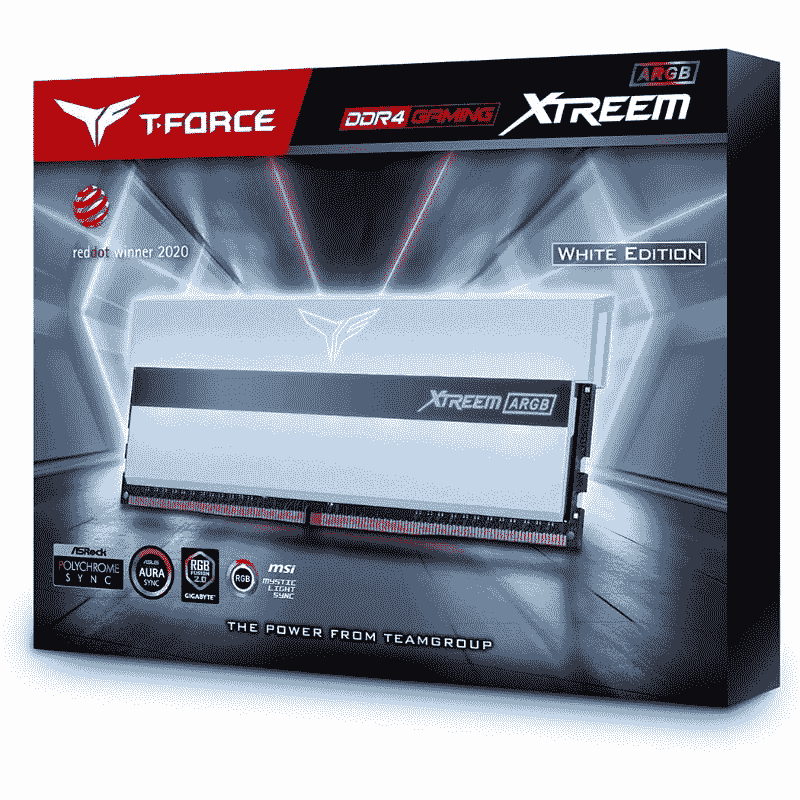
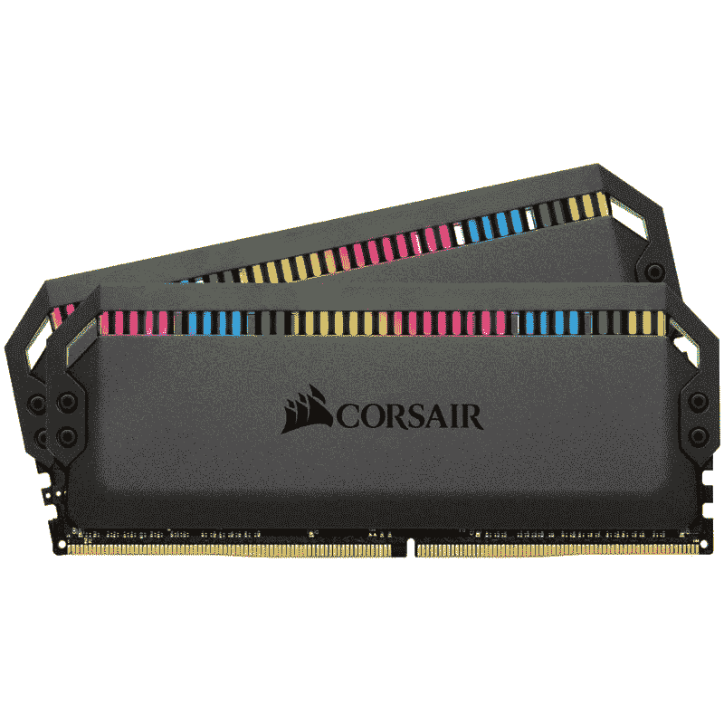
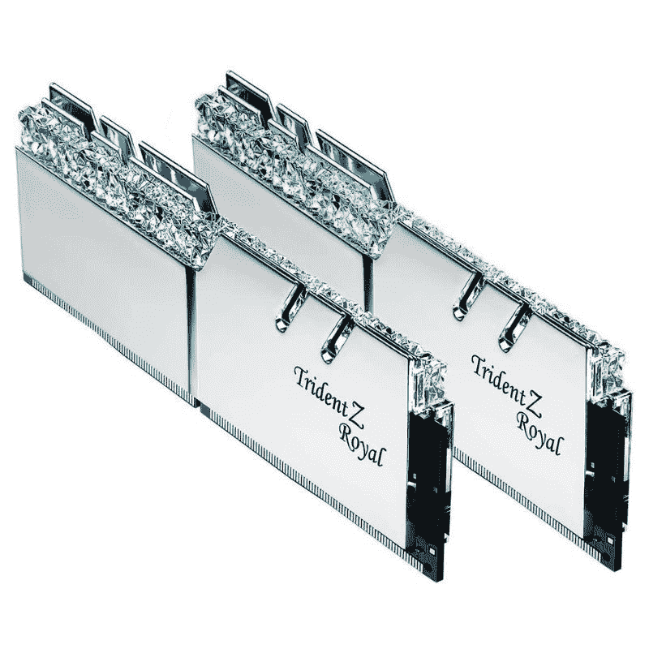
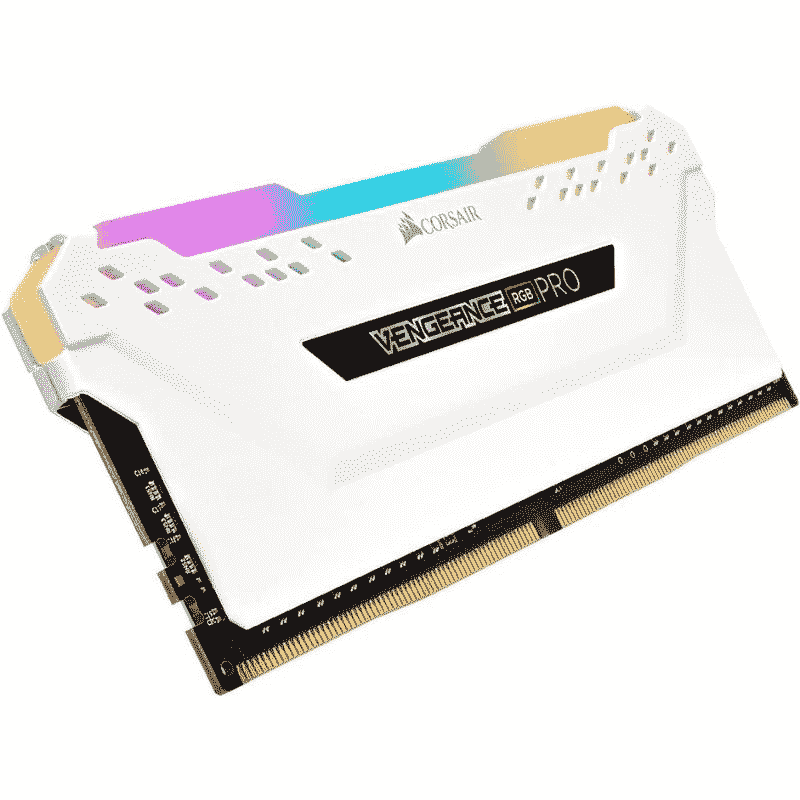
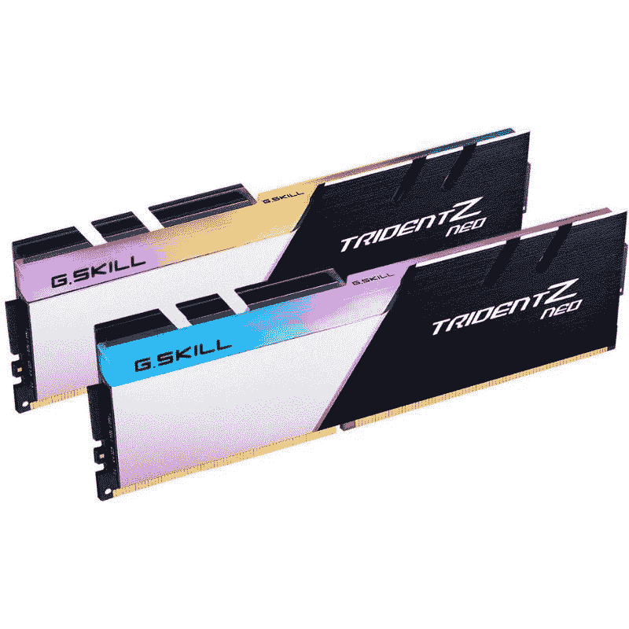
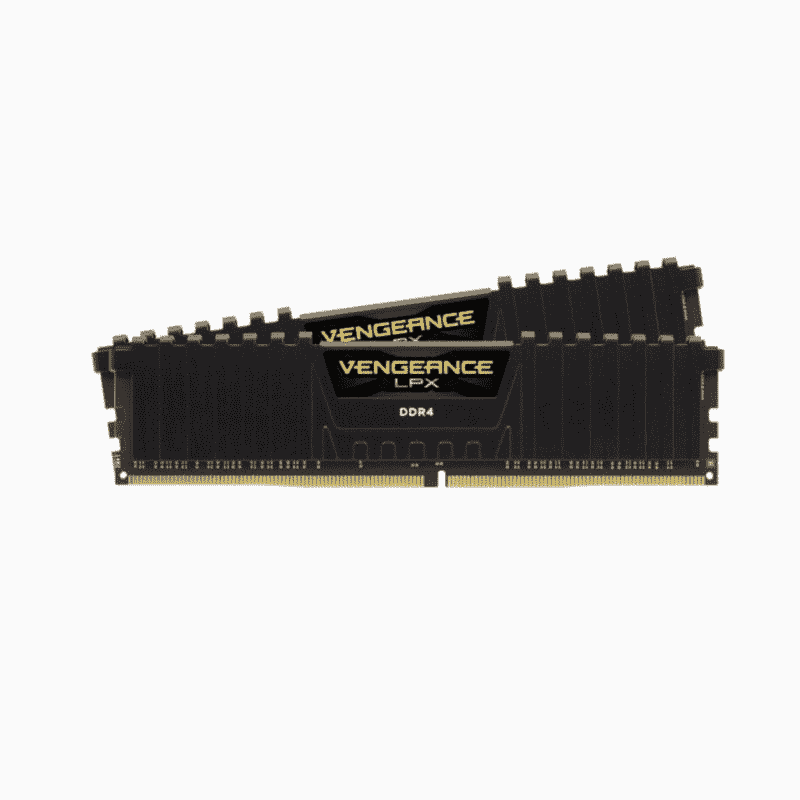

# 2023 年最佳 DDR4 RAM

> 原文：<https://www.xda-developers.com/best-ddr4-ram/>

随机存取存储器(RAM)不仅仅是规格表上的一个数字。内存是构建中最重要的硬件之一，内存套件的类型对系统在游戏、生产力任务等方面的整体性能有着巨大的影响。许多不同的制造商定期发布不同速度、时间和容量的新内存套件，使得浏览似乎无穷无尽的内存棒型号的整个过程成为一项耗时的任务。但由于它不容忽视，我们将帮助您找到最适合您系统的 DDR4 RAM 套件。

尽管英特尔和 AMD 推出了支持新 [DDR5 RAM](https://www.xda-developers.com/best-ddr5-ram/) 的最新 CPU，但 DDR4 内存模块仍然是一个受欢迎的选择。正如在我们的 [DDR4 与 DDR5 RAM 对比](https://www.xda-developers.com/ddr4-vs-ddr5/)中看到的，没有必要立即升级到新标准。但是如果你在一个旧的平台上，你将被限制在 DDR4 上。

让我们看看在购买新的 DDR4 RAM 之前需要考虑的几个重要事项:

*   **16GB 内存对大多数用户来说已经足够了:**是的，16GB 仍然是目前几乎所有游戏和工作任务的最佳选择。不过，重度多任务处理者和倾向于创造性工作流程的人可能需要更多内存。
*   **您不需要最快的 RAM 套件:**我们建议英特尔和 AMD 都购买 3200MHz 至 3600MHz 频率的 DDR4 内存。比这些速度更快的套件往往价格会上涨，但对性能的影响较小。
*   **紧密的内存计时>速度:**列访问选通(CAS)延迟，或 CL，计时看起来像这样:15-17-17-35。它表示 RAM 响应命令所需的时钟周期数。在不涉及太多细节的情况下，我们想指出，对于游戏，甚至是流、渲染等多任务场景，更紧的计时比更快的速度更好。
*   **更快的 RAM，更多的 RAM，**可以极大地有益于运行 APU 的系统，因为它们利用了计算机的系统 RAM。
*   **散热器和 RGB 灯:**只要你没有通过手动超频将内存推到极限，这些棒就不需要金属散热器。而且 RGB 灯也不会改变你的记忆表现。因此，如果你的箱子没有窗口，或者你不在乎你的系统看起来如何，你可以简单地选择暴露 PCB 的棍子。
*   **内存通道:**几乎每一个现代 CPU 都有多个内存通道，用于在安装多个 RAM 时增加内存带宽。大多数主流 CPU(如 AMD 的锐龙 7000 系列或英特尔的第 13 代)只有两个双通道内存通道，而大多数工作站 CPU 提供四通道甚至八通道内存。对于主流 CPU 来说，你总是想要两个或四个内存来获得最高性能，因为只使用一个内存对性能来说是很糟糕的。

说完这些重要的东西，让我们来详细看看我们系列中的每一件商品:

## 最佳整体 DDR 4 RAM:Team Xtreem ARGB DDR 4-3600 MHz

| 

规格

 | 

团队 Xtreem ARGB DDR4-3600MHz RAM

 |
| --- | --- |
| **速度:** | 3600 兆赫 |
| **计时:** | 14-15-15-35 |
| **CAS 延迟:** | 14 |
| **电压:** | 1.45 伏 |
| **内存:** | 2 个 8GB、2 个 16GB、2 个 32GB |

团队 Xtreem ARGB RAM 套件是我们为您的电脑选择的最佳整体 DDR4 RAM。它是为数不多的 CAS 延迟仅为 14 的 3600MHz RAM 套件之一。这个集合中的许多其他工具包的 CAS 延迟为 15 或更高，这意味着它们的内存计时更长。Xtreem ARGB RAM 套件的默认电压为 1.45v，主计时为 14-15-15-35。

每个 DIMM 的外壳将光线分散到大部分模块上，从而产生微弱的光线。我们说“微妙”是因为 RGB 光线在该套件上得到了适当的扩散。您也不必处理单独的定制软件，因为模块灯可以使用各种主板制造商的软件套件进行定制。

DDR4-3600MHz 的速度使其非常适合基于英特尔和 AMD 的构建。您可能已经知道，超过这个速度会导致延迟损失，需要非常高的速度来克服。我们谈论的是超过 4000MHz，在这一点上，你会看到一些高级套件。3600MHz 正好位于内存速度的最佳点，Xtreem ARGB 套件是你能买到的最好的套件之一。只要您的主板支持高内存速度，您也可以安全地对 Xtreem ARGB 套件进行超频。你可以将它与目前市场上的许多主板配对，并轻松将其推至 4400MHz。当然，您的超频里程可能会有所不同。不过，如果您不想处理任何修补工作，这也是一个很棒的即插即用套件。直接从盒子里拿出来是很好的。

总的来说，我们认为团队 Xtreem ARGB 套件及其 DDR4-3600 速度和 14-15-15 计时是最好的。它提供了速度和低延迟的良好组合，而不会占用您太多的预算。它与市场上其他许多价格昂贵的顶级内存套件进行了交易。它可能不是最好的超频，但如果你不想以额定速度运行它，它绝对是一个选择。

 <picture></picture> 

Team Xtreem ARGB DDR4-3600MHz c14

##### 团队 XTREEM ARGB DDR4-3600MHZ C14

Xtreem ARGB 团队勾选了所有正确的框，成为我们现在可以购买的最佳 DDR4 RAM。它提供可靠的速度和低延迟，以提供稳定的性能。

## 最佳高端 DDR4 RAM: Corsair Dominator 白金 RGB DDR4-3200MHz

| 

规格

 | 

海盗船支配者白金 RGB DDR4-3200MHz 内存

 |
| --- | --- |
| **速度:** | 3200 兆赫 |
| **计时:** | 16-18-18-36 |
| **CAS 延迟:** | 16 |
| **电压:** | 1.35 |
| **内存:** | 2x8GB、4x8GB、4x16GB、2x16GB、8x16GB、2x32GB、4x32GB、8x32GB |

海盗船的支配者白金 RGB DDR4 一直是市场上最好的内存套件之一，相当一段时间了。这是大多数希望构建新的高端 PC 的用户的首选 RAM 模块。它是首批上市的高性能 DDR4 套件之一，Corsair 在优化它方面做得非常好。它是常规支配者白金套件的继任者，该套件以其时尚的设计，专利的 DHX 冷却技术和无与伦比的性能而闻名。

支配者铂金 RGB 放弃了以前套件中的银色顶条，转而使用光条来分散 12 个可单独寻址的 RGB LEDs 的光。内存本身有一个隐形的外观，可以很好地融入大多数电脑。ARGB 灯不会消耗太多的能量，这很好，因为更少的能量也意味着更少的热量输出。就像所有其他海盗船组件一样，您可以通过该公司的 iCUE 软件控制 Dominator Platinum RGB DDR4 套件上的灯光。

Dominator Platinum RGB DDR4 套件有多种配置可供选择。每个 SKU 都有不同的速度和 CAS。例如，3600MHz 单元具有 18 的 CAS 延迟，而 3200MHz 单元是 C16 套件。性能与其他高级内存套件相当，有时甚至更好。这些都是很棒的套件，使用 3600MHz 的 XMP 设置，简单即插即用。你也可以通过手动超频轻松实现高达 4,000MHz 的速度。

这款 DIMM 令人印象深刻的是，它非常好地处理了热量输出。即使在极端温度下，支配者铂 RGB 保持在可接受的限度内。将它放入一个通风良好的 PC 机箱中，即使在负载下，该套件也不会出现任何问题。Corsair 还出售这种 RAM 的变体，速度高达 4000MHz，延迟为 19 CAS。正如我们前面提到的，你不一定需要所有的速度，但这绝对是一种选择。你也可以购买这个套件的白色版本，它对于白色版本非常有用。

 <picture></picture> 

Corsair Dominator Platinum RGB DDR4-3200MHz

##### 海盗船支配者白金 DDR4 内存

Corsair 的 Dominator Platinum RGB 是市场上可以买到的最好的高性能 DDR4 内存套件之一。由于 ARGB 灯，它提供了很高的速度和低延迟，看起来很棒。

## 最佳高频 DDR 4 RAM:G . Skill Trident Z Royal DDR 4-4000 MHz

| 

规格

 | 

G.技能三叉戟 Z 皇家 16GB DDR4-4000MHz 内存

 |
| --- | --- |
| **速度:** | 4000 兆赫 |
| **计时:** | 15-16-16-36 |
| **CAS 延迟:** | 15 |
| **电压:** | 1.50 伏 |
| **内存:** | 2x8GB、4x8GB、8x8GB |

在这个类别中，G.Skill Trident Z Royal 是我们的最佳选择，因为它是市场上最好的 DDR4 内存之一，看起来非常漂亮。在具有 15-16-16 时序的 DDR4 4000MHz 下，它提供了高频率、低时序和广泛平台兼容性的完美组合。我们看到的 CAS 延迟为 15，大约相当于 DDR4-4000 套件的延迟。不过，它需要 1.5V 的电压才能工作，这对于默认电压来说是相当高的。更高的工作电压使得进一步调整存储器变得更加困难，因为它很快变得不稳定。

它有金色或银色两种颜色，都有令人惊叹的镜面光洁度，顶部有闪闪发光的水晶灯条。顶栏也有 RGB 灯，它们可以变得非常亮。尤其是银色的，将会很好地与很多建筑融合，但是金色的也不会太落后。镜面抛光绝对是指纹磁铁，但这真的是 RAM 模块的问题吗？你可以使用 G.Skill 自己的名为灯光控制软件的 RGB 应用程序来控制灯光。每个模块上有八个 LED 灯，它们可以通过软件控制，在您的箱子内创建相当的灯光表演。你还可以控制亮度，这是很好的，因为默认设置可以压倒一切，特别是与闪闪发光的晶体和镜面光洁度。

性能与市场上大多数其他高频 RAM 模块相当。它配备了三星 B-Die IC，该 IC 以其能够很好地随电压扩展而闻名。使用一个好的 CPU 内存控制器和一个功能强大的主板，您可以真正将内存发挥到极限。我们建议将其与高端主板(如华硕 Maximus XII Apex)搭配使用。超频也是一个选项，通过将 CAS 延迟从 15 更改为 16，该模块被证明可以在库存 1.5v 下达到 DDR4-4400。

 <picture></picture> 

G.Skill Trident Z Royal DDR4 RAM kit

##### G.技能三叉戟 Z 皇家 DDR4

毫无疑问，G.Skill Trident Z Royal 是市场上最好看的 RAM 模块之一。它还具有支持高频率和低延迟的性能。

## 最佳 32GB RGB DDR4 内存套件:海盗船复仇 RGB Pro DDR4-3200

| 

规格

 | 

海盗船复仇 RGB Pro DDR4-3200MHz RAM

 |
| --- | --- |
| 速度: | 3200 兆赫 |
| 时机: | 16-20-20-38 |
| CAS 延迟: | 16 |
| **电压:** | 1.35 伏 |
| 内存: | 2x16GB |

我们已经将 Corsair 的 Dominator Platinum 添加到我们的收藏中，作为我们对最佳高端 RAM 模块的选择。现在，我们还将复仇 Pro RGB 模块添加到该系列中，作为您现在可以购买的最佳 32GB DDR4 内存套件。海盗船复仇专业 RGB 套件带来了我们认为最好看的模块之一，以合理的价格提供了四个 8GB DIMMs(总共 32GB)的 CAS 16 计时。

与其他一些套件不同，复仇专业 RGB 套件具有恰到好处的灯光量，可以使用海盗船的 iCUE 应用程序进行控制。这些指示灯也可以通过主板的 RGB 软件进行寻址。提醒你一下，不仅仅是外表。海盗船复仇专业 RGB 凭借其低延迟和高频率击败了许多其他 DDR4 套件。事实上，复仇 Pro RGB 也因其超频能力而受欢迎，就像其非 RGB DDR4 对应产品一样。

在规格方面，海盗船复仇专业 RGB 有各种容量。如果您有空间进行四通道设置，这款 32GB 套件尤其配有 4 个 8GB 模块。如果没有，双通道设置的 2 x 16GB 套件也是一个选项。我们正在查看 CAS 16 在 16-18-18-36 计时下的测试延迟。复仇 Pro RGB 模块的额定工作电压为 1.35v，低于我们之前看到的三叉戟 Royal Z。较低的额定电压意味着它为调谐留下了一些空间，有可能提高套件的整体速度。

海盗船复仇专业 RGB 在大多数速度下击败了许多其他高性能 DDR4 模块，并提供了比该价格范围内的其他套件更好的 XMP 值。超频也是一种选择，在爱好者中非常受欢迎，比支配者白金套件更受欢迎。它缺乏先进的冷却解决方案，但你确实有一个铝散热器来提高导热性，以便在超频时获得更好的性能。

 <picture></picture> 

Corsair Vengeance Pro RGB RAM Kit

##### 海盗船复仇专业 RGB DDR5 内存

海盗船复仇专业 RGB 是市场上最好的 DDR4 内存之一，以合理的价格提供了一套奇妙的功能。32GB 套件提供 2x16GB 或 4x8GB 模块选项。

## 最佳手动调优 DDR 4 RAM:G . Skill Trident Z Neo DDR 4-3600

| 

规格

 | 

G.skill Trident Z Neo DDR 4-3600 MHz RAM

 |
| --- | --- |
| **速度:** | 3600 |
| **计时:** | 16-16-16-36 |
| **CAS 延迟:** | 16 |
| **电压:** | 1.35 伏 |
| **内存:** | 2x8GB、2x16GB、4x16GB |

Trident Z Neo DDR4-3600 内存套件看起来可能不像我们之前看到的 Trident Z Royal 那么复杂，但它几乎提供了高端 DDR4 RAM 套件所需的一切。它采用双色设计的三鳍式机身。铝制散热器的一半具有拉丝金属表面，而另一半具有微妙的白色外观。这些模块高 44 毫米，顶部有一个 LED 扩散器来展示 RGB。您可以使用 G.Skill 的灯光控制软件或您的主板软件来控制模块上的灯光。

默认情况下，Trident Z Neo 的开机自检频率为 DDR4-2133 和 15-15-15-36，但您可以使用 XMP 配置文件将它们提升到宣传的 DDR4-3600 频率。该配置文件还将时序和 DRAM 电压分别设置为 16-16-16-36 和 1.35V。这意味着它的 CAS 延迟为 16，这在 DDR4 内存空间中仍然非常值得称赞。Trident Z Neo 内存套件最大的优点是它提供了大量的手动调整空间。三叉戟 Z Neo 被证明可以毫无问题地攻击 DDR4-4200。你可以很容易地实现这一点，从基础值增加 DRAM 电压，并放宽一点时间。通过适当的调整，16-16-16-36 的 XMP 时间可以缩短到 13-14-14-35，尽管你需要一个好的主板来允许定制。

Trident Z Neo 是规格表上看起来相当不起眼的内存套件之一。但如果使用得当，它比市场上大多数其他高端 RAM 套件的性能都要好。当然，基于不同的硬件，超频性能可能会有所不同，但你不能据此就一笔勾销。凭借正确的专业知识和一点耐心，Trident Z Neo 可以证明是最好的 DDR4 套件之一，与市场上更昂贵的选项进行交易，如 Corsair Dominator Platinum 或 G.Skill 自己的 Trident Z Royal。Trident Z Neo 有各种速度和配置，3600MHz 是最实惠的选择。它们都具有相同的设计、相同的散热器和相同的五个可寻址 RGB 灯组。

 <picture></picture> 

G.Skill Trident Z Neo RAM kit

##### G.技能三叉戟 Z Neo DDR4

G.Skill Trident Z Neo 是一个完美的 RAM 套件，适合那些不介意动手做一些修补而不是简单的即插即用体验的人。

## 最适合中端电脑的 DDR 4 RAM:G . Skill rip jaws V

| 

规格

 | 

G.技能 Ripjaws V 3200Mhz 兆赫 16GB 内存

 |
| --- | --- |
| **速度:** | 高达 3200Mhz |
| **计时:** | 16-16-16-36 |
| **CAS 延迟:** | 16 |
| **电压:** | 1.35 伏 |
| **内存:** | 2 个 8GB |

事实证明，省去 RGB 真的可以节省大量成本。这就是为什么 G.Skill Ripjaws V 非常实惠的原因，使其成为经济型购物者关注预算到中端构建的完美套件。G.Skill Ripjaws V 是广受欢迎的 Ripjaws 的继任者。Ripjaws V 有许多不同的速度和配置，但它们都有 CAS 16，这很好。你确实需要确保你的 CPU 和主板可以支持 DDR4-3200 XMP，然后再选择其中一个，因为除了股票之外，它们没有任何速度的配置设置。

与本指南中列出的其他内存模块不同，G.Skill Ripjaws V 看起来并不花哨。你仍然可以得到一个铝制散热器，它有两种颜色可供选择:红色和黑色。你还可以得到终身保修。在原始性能方面，Ripjaws V 也很可靠。这是不可调整的，但它仍然优于 XMP 设置的竞争对手的内存套件。它可以轻松处理几乎所有的基本工作负载。然而，APU 用户可能想看看其他选项。

G.Skill 听取了大量的反馈和批评，使 Ripjaws V 比它的前身更好。它更快，更实惠，我们认为与市场上的其他非 RGB 内存套件相比，它看起来也很不错。你可以调整设置来超频套件，但在遇到稳定性问题之前不会有太大作用。

 <picture></picture> 

G.Skill Ripjaws V RAM kit

##### G.技能 Ripjaws V DDR4

G.Skill Ripjaws V 是一个非常棒的内存套件，适合那些不追求最高频率或花哨的 RGB 灯散热器设计的预算购物者。这些模块非常适合中低端版本。

## 最佳入门级 DDR4 内存:海盗船复仇 LPX

| 

规格

 | 

海盗船复仇 LPX 拉姆

 |
| --- | --- |
| **速度:** | 2133 兆赫 |
| **计时:** | 16-19-19-36 |
| **CAS 延迟:** | 16 |
| **电压:** | 1.35 伏 |
| **内存:** | 2 个 8GB |

复仇 LPX DDR4 内存仍然是入门级构建的最佳 RAM 套件之一。海盗船复仇 16GB DDR4-2666 套件仍然优于其许多竞争对手，每个 DIMM 的内存列数增加了一倍。例如，仍在使用 H370 等相对较旧芯片组的入门级用户，可以通过升级到复仇 LPX 内存来获得性能提升。除非您希望构建延迟较小的内存来提高性能，否则这可能会很昂贵，您可以在每个通道中构建两个内存等级。

可以理解的是，复仇 LPX 记忆套装在 16-18-18-35 的计时相当慢。这意味着它的 CAS 延迟为 16，是 DDR4 RAM 类别中最低的延迟之一。值得注意的是，您还需要一个支持 XMP 的主板来启用套件的 DDR4-2666 配置文件。

复仇 LPX 内存真正闪耀的电压高达 1.35 伏。复仇 LPX 被证明可以剃掉三个周期的 CAS 和四个周期的 tRP 和 tRCD。然后，它开始超越其价格范围内的竞争模块。事实上，它甚至成功地锁定了相对更新、更强大的 DIMMs，如 G.Skill Ripjaws V 和 HyperX Predator RGB 等。

这也意味着复仇 LPX 是一个值得选择的一些其他非 RGB 套件。它属于我们所说的“低姿态”套件，因为缺乏任何引人注目的设计元素或高大的散热器阻碍了市场上巨大的 CPU 冷却器。这些 LPX DDR4 模块可以愉快地放入没有窗口的 PC 机箱中。事实上，它没有散热器也可以工作得很好，因为它不一定是高性能的内存套件。

 <picture></picture> 

CORSAIR VENGEANCE LPX DDR4

##### 海盗船复仇 LPX DDR4 内存

海盗船复仇 LPX DDR4 内存是一个伟大的选择，入门级建设涉及相对较旧的 CPU。它也可以用于不允许 DDR4-2666 以上内存设置的旧平台。

* * *

## 最后的想法

Xtreem ARGB DDR4-3600MHz 团队是我们为您挑选的最佳 DDR4 套件。它以高速度和紧凑的内存时间击败了竞争对手。这也是最好看的模块之一，RGB 灯在外壳内营造出一种展示效果。如果你想建造一个高端游戏装备，海盗船白金也是一个值得选择的。我们还增加了一些高频套件，如 G.Skill Trident Z Royal，我们认为这是目前市场上最好看的高端内存模块。我们还包括一些预算选项，如海盗船复仇 LPX DDR4 模块，为那些希望开始与入门级建设。

RAM 套件就像 PC 的许多其他核心组件一样，正在快速发展，我们已经在市场上推出了 DDR5 模块。但正如我们之前提到的，DDR5 内存模块仍然相对较新，而且目前也相当昂贵。总有一天你需要做出改变，对于 AMD 的最新产品来说，就是现在。但对于其他人来说，老 DDR4 狗还有生命。