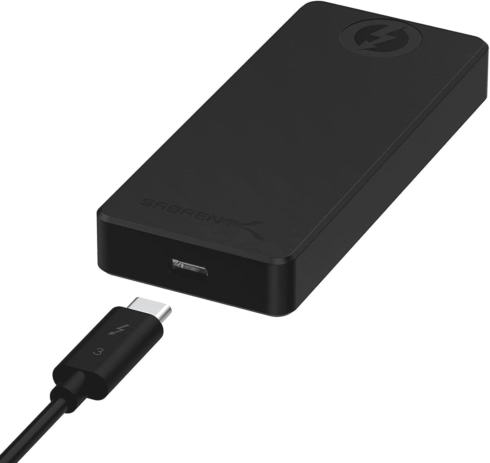
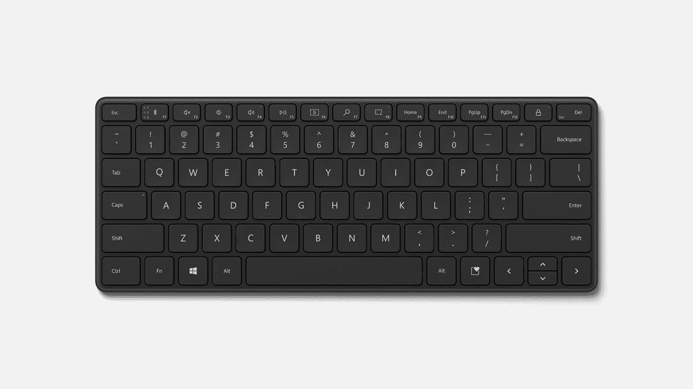
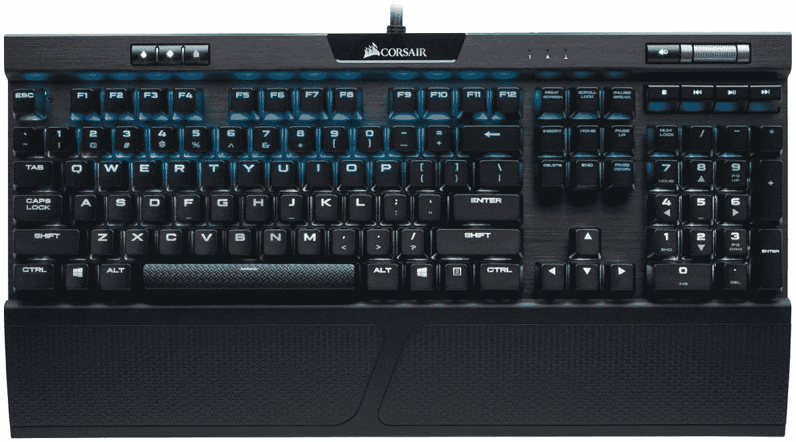

# 2023 年最佳戴尔 XPS 13 附件

> 原文：<https://www.xda-developers.com/best-dell-xps-13-accessories/>

在过去的几年里，[戴尔 XPS 13](https://www.xda-developers.com/dell-xps-13-9310-review/) 一直是你在任何时候都能买到的[最好的笔记本电脑](https://www.xda-developers.com/best-laptops/)之一。这并不奇怪，考虑到戴尔为[制造了大量优秀的笔记本电脑](https://www.xda-developers.com/best-dell-laptops/)，无论您想要的是商用、家用，甚至是游戏。戴尔 XPS 13 可能是该公司最受欢迎的笔记本电脑，但这并不意味着它适合所有人。无论您想要更多的端口、一些外部显示器，甚至是将其变成一个游戏装备，附件都可以大大增强您的德普 XPS 13 体验。

为了让事情变得更简单，我们收集了一些您可以在 Dell XPS 13 上使用的优秀附件，以便您可以开始构建适合自己的完美设置。我们将这些分为三类，一类侧重于家庭或办公室使用等更静态的场景，一类侧重于便携性，一类侧重于游戏。请记住，我们在这里关注的是戴尔 XPS 13 的 2020/2021 型号，我们有一个专门的页面用于 2022 版本的[附件，这是非常不同的。事不宜迟，我们开始吧。](https://www.xda-developers.com/best-accessories-dell-xps-13-2022/)

## 适合家庭和办公室使用的最佳戴尔 XPS 13 附件

*   ##### 罗技 MX Master 3S

    罗技 MX Master 系列通常是注重生产力的鼠标的黄金标准，MX Master 3S 比以往任何时候都更好。这款鼠标采用了符合人体工程学的高端设计，配有金属滚轮(外加一个水平滚轮)、8K DPI 传感器和其他出色的功能，无疑是市场上最好的鼠标之一。

*   <picture></picture>

    戴尔顶级无线键盘和鼠标 KM7321W

    ##### 戴尔 KM7321W Combo

    如果您想要一个完整的桌面设置而没有任何麻烦，或者不必寻找单独的鼠标和键盘，戴尔 km 7321 w 是一个很好的组合包。它包括一个时尚而现代的全尺寸键盘，以及一个优质而同样现代的鼠标，两者都支持通过单个加密狗或蓝牙进行无线连接。

*   ##### 微软 Sculpt 人体工程学键盘

    如果舒适和健康是你优先考虑的问题，微软的这款鼠标和键盘组合是一个很好的选择。它们的形状可以让你的手更舒适地休息，并把所有的按键放在一个更舒适的位置。

*   ##### Moft Z 不可视笔记本电脑支架

    Moft Z 是一款超级多功能的笔记本电脑支架，可以折叠成各种姿势。它可以将你的笔记本电脑放在一个角度，以便更舒适地打字，或者如果它太低或者你想站起来，可以将它从你的桌子上抬起来。它可以完全折叠，便于存放。

    T17
*   ##### 三星 T7 Touch 便携式固态硬盘

    如果你的笔记本电脑没有足够的存储空间，额外的存储空间可能很重要，三星的 T7 Touch 固态硬盘提供高达 2TB 的存储空间和高达 1，050MB/s 的速度。此外，它有一个指纹传感器，所以只有你可以访问你的数据。

*   <picture></picture>

    萨布伦特火箭 XTRM-Q

    ##### 萨布伦特火箭 XTRM-Q

    这款来自萨布伦特的紧凑型固态硬盘容量从 500GB 到 8TB 不等，由于 Thunderbolt 的支持，它的读取速度可达 2700 MB/s。它也非常紧凑

*   ##### 戴尔 Thunderbolt 坞站 WD22TB4

    像戴尔官方提供的这种坞站是为戴尔 XPS 13 这样的时尚笔记本电脑添加更多端口的好方法。这一款包括四个显示输出、USB Type-A 端口和以太网，当您在办公室时，您可以有很多选择来连接外围设备。有点贵，但是很好用。

*   <picture></picture>

    可插拔的 Thunderbolt 坞站

    ##### 可插拔的雷电 3 坞站

    如果你想要一个稍微更实惠的选择，那也是一样有能力(甚至更有能力)，这款来自 Pugable 的坞站包括多达 14 个端口，包括两个显示输出(总共 4 个端口)，外加 6 个 USB-A 端口，USB-C

*   ##### 可插拔双 HDMI 坞站

    Thunderbolt 坞站给你很大的带宽，但它们也很贵。有了这个码头，你仍然可以花更少的钱得到很多港口。六个 USB 端口，以太网，双 HDMI 端口和独立的音频插孔都包括在内，价格低得多。不过，它不会给你的笔记本电脑充电。

*   <picture></picture>

    雷蛇 Anzu 智能眼镜

    ##### 雷蛇 Anzu 智能眼镜

    这个概念听起来可能有些怪异，但雷蛇 Anzu 眼镜可以帮助保护你的眼睛免受电脑屏幕光线的伤害，同时还可以让你的耳朵旁边有一套私人扬声器你可以听音乐或接电话，而不会被周围的人听到。

*   <picture></picture>

    Surface 耳机 2

    ##### 微软 Surface 耳机 2

    Surface 耳机是一款高端时尚的耳机它们提供出色的音频和主动噪音消除功能，您可以使用耳罩上的旋转转盘通过精细控制进行调节。还有音乐播放或通话的触摸控制。

*   <picture></picture>

    Razer Barracuda X

    ##### Razer Barracuda X

    如果你发现蓝牙很难用你的 PC 设置，Razer Barracuda X 就是完美的解决方案。它们使用 USB-C 加密狗进行无线连接，您可以将它们与笔记本电脑、电话或控制台配合使用。它们还可以连接 3.5 毫米音频插孔，最新型号包括蓝牙支持，因此您有更多的选择。

*   ##### 索尼 WF-1000XM4

    如果你喜欢小耳塞的自由胜过大耳机，索尼制造了一些你今天可以买到的 ebst 耳塞。WF-1000XM4 提供高品质的音频，主动噪音消除，以及外观精美的设计。

*   ##### 戴尔 UltraSharp 4K 网络摄像头

    即使是顶级笔记本电脑也经常有令人失望的网络摄像头，因此这款戴尔 UltraSharp 机型可能值得您使用。它支持高达 4K 的分辨率、HDR、自动取景，并具有索尼 STARVIS 传感器，以改善弱光性能。

    T17
*   <picture></picture>

    微软现代网络摄像头

    ##### 微软现代网络摄像头

    我们无法负担得起 200 美元的网络摄像头费用，因此，如果戴尔 XPS 上的网络摄像头不能为您做到这一点，微软的这款替代产品是一个不错的选择。它支持每秒 30 帧的 1080p 视频和 HDR，另外它还有一个隐私快门。

*   <picture></picture>

    三星 J791 系列

    ##### 三星 J791 34 英寸超宽显示器

    如果你想要生产力的终极设置，这就是给你的。这款三星 J791 曲面显示器以惊人的 QLED 面板 100Hz 刷新率为您提供超宽四核高清分辨率。此外，这是一款支持菊花链的 Thunderbolt 显示器。

*   <picture></picture>

    LG 24 qp 500-B

    ##### LG 24 qp 500-B

    想要一台仍然锐利且出色的廉价显示器来进行多任务处理吗？如果你想要实惠的东西，这款 LG 显示器是任何笔记本电脑的绝佳补充，而且价格合理。它只有 HDMI 或 DisplayPort 输入，因此您可能需要一个适配器。

*   <picture></picture>

    明基 TK850 4K 投影仪

    ##### 明基 TK850i 4K HDR 投影仪

    如果你有很多钱可以花，并且想要一种家庭影院般的体验，明基 TK850i 是一款非常棒的家庭投影仪。它支持 4K 分辨率，亮度高达 3000 流明。此外，它具有梯形校正功能，支持垂直镜头移动，并且，当您没有 PC 时，您可以使用附带的 Android TV 加密狗来观看您喜欢的内容。

## 最佳旅行用戴尔 XPS 13 附件

便携性是您可能购买 Dell XPS 13 等笔记本电脑的一个重要原因，因此我们也为那些经常在旅途中工作的人准备了一些附件。无论您是需要笔记本电脑保护，还是需要更小巧的配件，这些都适合您。

*   <picture></picture>

    mCover 戴尔 XPS 13

    ##### mCover 硬壳 XPS 13 机箱

    保护您的笔记本电脑免受损坏很重要。这种硬壳附件可以连接到您的 Dell XPS 13 上，以便在您使用笔记本电脑时保持开机状态。它有一系列明亮的颜色可供选择，因此可以让您的 XPS 13 脱颖而出。

*   <picture></picture>

    wal new 笔记本电脑保护套

    ##### wal new 保护软套保护套

    这款纤薄的保护套不仅可以在您随身携带时保护您的笔记本电脑。开口处的翻盖非常大，所以你也可以把它当作鼠标垫使用。对于那些从不在旅行时不带外接鼠标的人来说，这太棒了。

*   ##### 戴尔 Ecoloop Pro 公文包

    如果您喜欢为您的笔记本电脑准备一个正式公文包的感觉，戴尔 EcoLoop Pro 公文包是一个不错的选择。这款包可以提在手中或扛在肩上，它为您的笔记本电脑和配件提供了充足的空间，而且它有很多填充物。更好的是，它由环保材料制成，包括海洋回收塑料。

*   ##### Dell Pro 超薄双肩包 15

    如果您喜欢将笔记本电脑背在背上，Dell Pro 超薄双肩包是 Dell XPS 13 的绝佳选择，尽管它也可以容纳更大的笔记本电脑。它有一个干净的外观和足够的额外空间，加上填料，让你在走动时保持舒适。

    T17
*   ##### 微软 Arc 鼠标

    如果你需要一个可以轻松带到任何地方的鼠标，微软 Arc 鼠标就是这样，不会让人不舒服。当你需要存放它的时候它是一个近乎扁平的鼠标，但是当你需要使用它的时候，它的身体可以弯曲形成一个更加舒适的弧形。

*   <picture></picture>

    微软设计者紧凑型键盘

    ##### 微软设计者紧凑型键盘

    如果您在旅途中需要外置键盘，这是一个非常棒的紧凑型选项，您可以轻松带到任何地方。它还可以与多达三个设备配对，因此您可以轻松地在它们之间切换，并与您的 PC、手机或平板电脑配合使用。

*   ##### SanDisk Ultra Dual Drive Luxe

    有时候并不是容量或速度的问题，而是能够轻松地随身携带文件或项目。这款闪存盘具有 USB Type-C 和 Type-A 连接器，因此您不仅可以在没有任何加密狗的 XPS 13 上使用它，还可以在只有 USB Type-A 的旧电脑上使用它。

*   <picture></picture>

    Anker PowerExpand+

    ##### Anker Power expand+7 合 1 USB-C Hub

    如果您外出时需要一些额外的端口，Anker Power expand+可添加两个 USB Type-A 端口、一个 USB Type-C 端口、一个 SD 读卡器、HDMI 输出

*   <picture></picture>

    sate chi 超薄多端口适配器

    ##### sate chi 多端口适配器 V2

    如果您出门在外但需要有线互联网，这款 Satechi hub 以紧凑的设计为您提供一个互联网端口。它还具有 microSD 和 SD 卡插槽、三个 USB Type-A 端口(能够进行 5Gbps 传输)、一个 HDMI 端口(支持 60Hz 的 4K)和一个用于供电的 Type-C 端口。

*   <picture></picture>

    Einova 笔记本电脑电源组

    ##### Einova 笔记本电脑电源组

    当您的笔记本电脑电池无法持续使用一天时，这款 Einova 电源组可以提供足够的电量，让您多使用几个小时。它通过 USB Type-C 提供 45W 的功率，Type-A 端口也可以为你的手机充电。

*   <picture></picture>

    Anker 发电站 II 400

    ##### Anker 发电站 II 400

    如果你要离开商店几天，Anker 发电站 II 400 是必不可少的。它可以通过几个 USB 端口供电，但你也可以插入交流适配器充电。如果你只是给你的笔记本充电的话，它应该够你用几天。

*   ##### 联想 ThinkVision M14

    使用这款联想外置便携式显示器，随时随地享受双显示器生活。14 英寸显示屏具有全高清分辨率和 300 尼特的亮度。它通过 USB Type-C 连接，支持直通充电。

## 最佳游戏配件

最后，我们为那些想要使用 Dell XPS 13 玩游戏的人提供一些附件，或者作为他们游戏体验的补充。诚然，XPS 13 不是开箱即用的游戏 PC，但这并不意味着你不能在外部 GPU 和一些额外附件的帮助下实现它。

*   ##### Razer Core X Chroma

    XPS 13 不是游戏 PC，但像这样的外部 GPU 外壳可以让你使用强大的 GPU，就像它在你的 PC 内部一样。这款 Razer 机箱支持多达三插槽宽的 GPU，功率为 650W，因此大多数卡都应该可以使用它。还有一个带 RGB 灯光的版本。

    T17
*   ##### 三星奥德赛 G5 (G50A)

    如果你在 XPS 13 上玩游戏，你可以使用这款三星显示器获得更流畅的体验。它具有 165Hz 的刷新率和 AMD FreeSync Premium，1 毫秒的响应时间，加上四核高清分辨率，确保您仍然拥有清晰的图像。

*   <picture></picture>

    海盗船 K70 MK.2 游戏键盘

    ##### 海盗船 K70 MK.2 游戏键盘

    这款游戏键盘几乎提供了你想要的一切。你可以选择你喜欢的 Cherry MX 开关，它有一个耐用的铝框架，每个键的 RGB 背光让你创造你想要的外观。它甚至可以通过 USB 给你的手机充电。

*   <picture></picture>

    雷蛇蛇怪 V2 游戏鼠标

    ##### 雷蛇蛇怪 V2

    雷蛇蛇怪 v2 是一款高级游戏鼠标，拥有 11 个可编程按键，采用雷蛇的光学式开关。鼠标传感器拥有 20，000 的 DPI，可以根据您的喜好进行调整，并且它有一根轻质电缆，使用起来更加舒适。

*   <picture></picture>

    Xbox 无线游戏耳机

    ##### 微软 Xbox 无线耳机

    Xbox 无线耳机就其所提供的东西而言是相当实惠的。它具有麦克风自动静音、空间声音和旋转拨号控制等功能，可以调节游戏和聊天音频之间的平衡。它也适用于个人电脑、Xbox 游戏机和手机。

*   <picture></picture>

    Xbox 无线控制器

    ##### 微软 Xbox 无线控制器

    Xbox 可以说是配备 Xbox 无线控制器的最佳视频游戏控制器，并且由于蓝牙支持，它可以与您的戴尔 XPS 13 开箱即用。这是最新版本，具有更舒适的设计和改进的 D-pad，加上新的共享按钮。

*   ##### 8BitDo 无线适配器

    如果你已经有一个想要使用的无线控制器，这个 USB 适配器可以让它变得更简单。它支持 Xbox、PlayStation 和任天堂游戏机上几乎所有的现代控制器。如果你愿意，你甚至可以把它和任天堂 Switch 一起使用。

*   <picture></picture>

    Elgato HD60 S+

    ##### Elgato hd60s+

    Elgato 制作了非常受欢迎的流媒体设备，hd60s+捕捉卡非常适合从您的主机捕捉游戏并向全世界展示。它有 4K 60FPS 的通过，所以你的游戏看起来一样好，但它在 1080p 流。

    T34
*   ##### 蓝色雪人 X

    如果你在 XPS 13 上播放流媒体或播客，外置麦克风会很有帮助。蓝色 Yeti X 是其中最好的一款，具有一个 LED 音量表，四个冷凝器和 24 位采样率。你也可以使用 Blue 的软件来更改设置。

Dell XPS 13 有大量附件可供选择，您几乎可以满足所有需求。显然，Dell XPS 13 不是一台游戏 PC，但这就是为什么有这么多方法让它对游戏玩家更好。例如，如果你想在上面玩现代游戏，像 Razer Core X 这样的外部 GPU 是非常必要的。或者，如果你是一个游戏机玩家，你可以使用 [Elgato HD60 S+](https://www.amazon.com/Elgato-Game-Capture-HD60-PlayStation/dp/B01DRWCOGA?tag=xda-1hhqs7n-20&ascsubtag=UUxdaUeUpU3304&asc_refurl=https%3A%2F%2Fwww.xda-developers.com%2Fbest-dell-xps-13-accessories%2F&asc_campaign=Commerce) 来捕捉和分享游戏。

即使您更注重工作效率，也有许多附件可以让 Dell XPS 13 变得更好。像三星 J791 这样的第二个屏幕可以给你更多的工作空间，而 [Thunderbolt dock](https://www.xda-developers.com/best-thunderbolt-docks/) 给了你许多连接选项。当然，还有保护您的 XPS 13 的问题，在这种情况下，像 mCover 硬壳案件就起作用了。

如果您现在想买一台新的笔记本电脑，我们今天不会推荐这款戴尔 XPS 13。如果您想要更现代、更便携的产品，我们建议您看一看 [2022 戴尔 XPS 13](https://www.xda-developers.com/dell-xps-13-2022-review/) 。