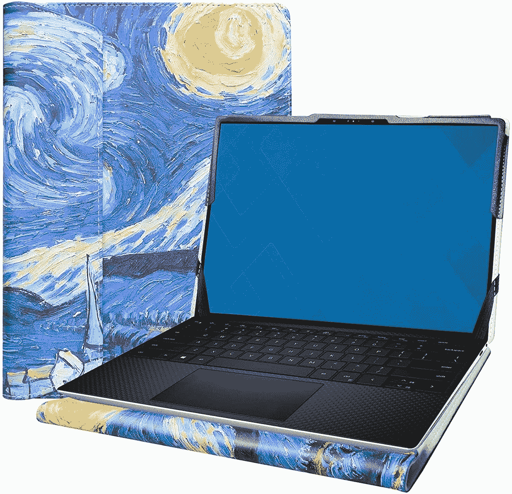
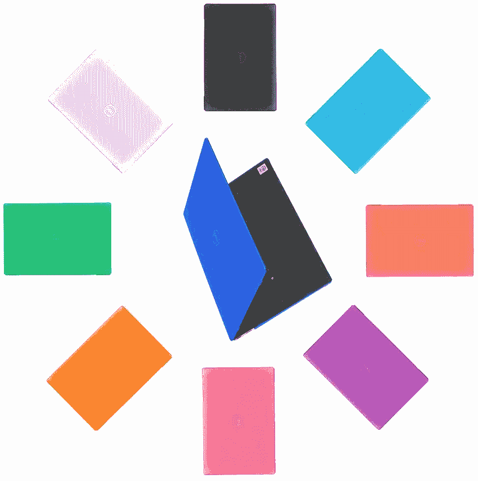
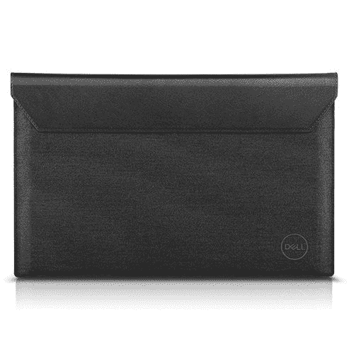
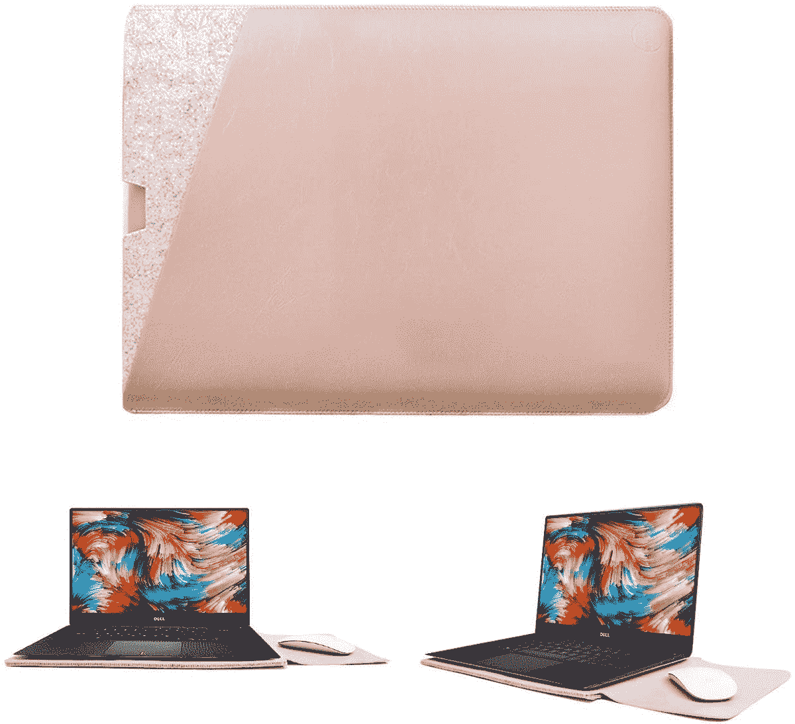
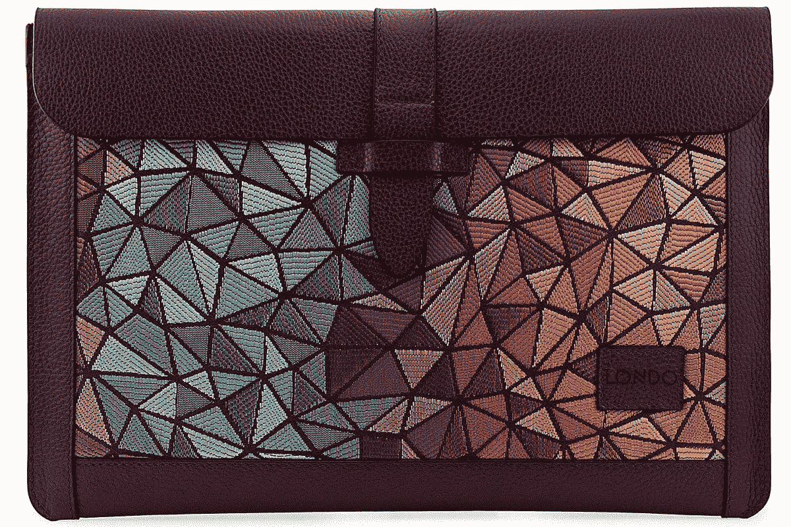
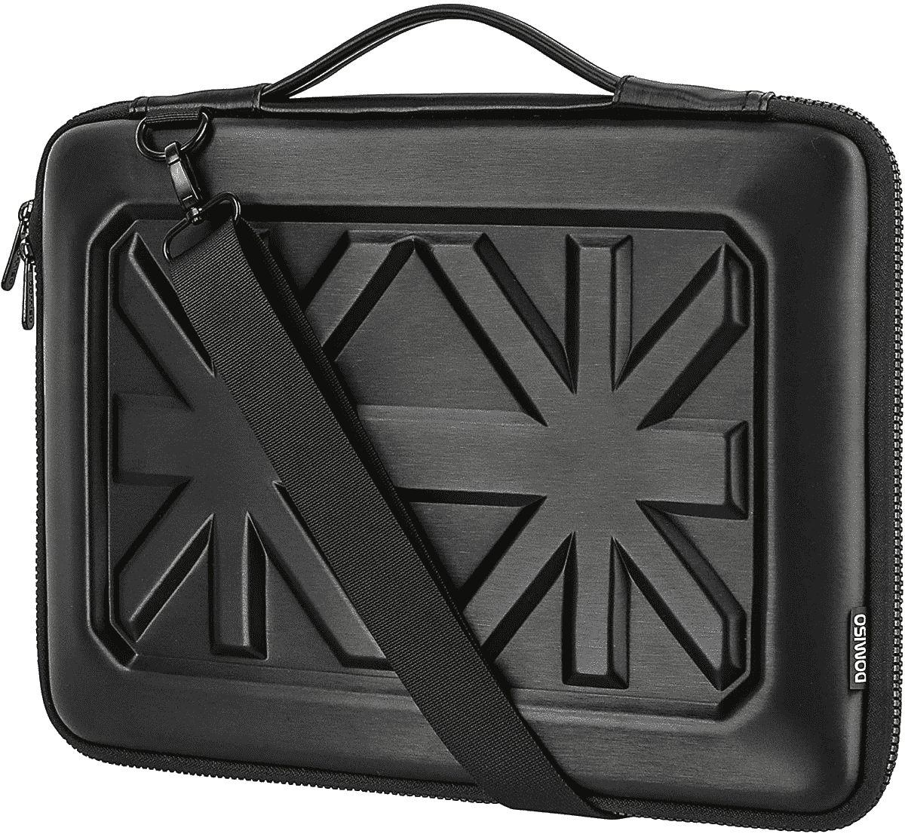
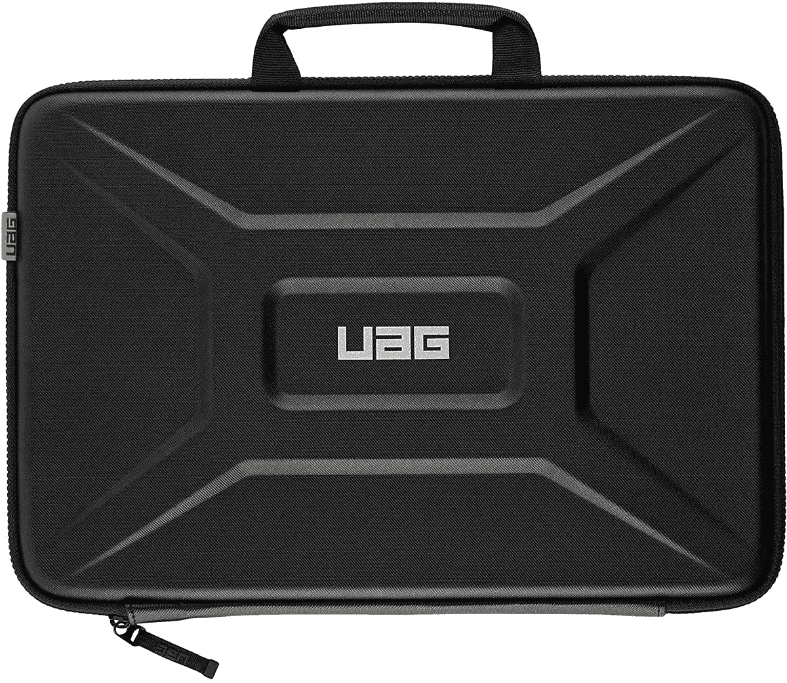

# 2023 年戴尔 XPS 13 的最佳案例

> 原文：<https://www.xda-developers.com/best-dell-xps-13-cases/>

# 2023 年戴尔 XPS 13 的最佳案例

寻找保护您笔记本电脑的方法？这些是您外出时保护您的 Dell XPS 13 安全的最佳案例。

戴尔制造了一些很棒的笔记本电脑，T2 XPS 13 在 T4 最好的笔记本电脑中脱颖而出。它拥有最新的英特尔处理器，这意味着它的速度很快，并且具有非常强大的集成显卡。它还具有 [Thunderbolt 4](https://www.xda-developers.com/best-thunderbolt-4-laptops/) 的优势，这意味着你可以获得 40Gbps 的外设带宽，包括同时插入两个 4K 屏幕。像这样的设备应该可以使用很长时间，为了实现这一点，保护非常重要。我们收集了一些您可以为您的 Dell XPS 13 找到的最佳案例，以确保它在未来几年内保持安全和美观。

就尺寸而言，Dell XPS 13 是一款非常紧凑的超极本，因此很容易找到适合它的外壳。戴尔提供了一些自己的产品，但也有许多第三方产品可供选择。需要注意的一点是，标准 XPS 13 与 XPS 13 二合一设备的尺寸不同。有些情况下可能不适合这两种型号，此列表中的前两种仅适用于翻盖式。

 <picture></picture> 

Alapmk Protect Cover Case for Dell XPS 13

##### Alapmk 防护型戴尔 XPS 13 外壳

Alapmk 保护套包裹着 Dell XPS 13，无论是打开还是合上，都能保护它。它带有一些艺术设计，可以让它看起来更有个性。

 <picture></picture> 

mCover Hard Shell Case for Dell XPS 13

##### mCover 硬壳 XPS 13 外壳

尽管戴尔 XPS 13 看起来很高端，但它的外观也有点乏味。麦考夫硬壳案件给它一个明亮的颜色，使它真正脱颖而出，并呼吁你的口味。它还设计为始终适用，因此您始终受到保护。

 <picture></picture> 

Dell Premier Sleever 13

##### 戴尔高级袖套 13

戴尔为 XPS 13 提供了自己的高端保护套。它是全黑色的，使用了皮革和织物的组合。如果你碰巧有带触控功能的 XPS 13，它还包括一个笔环。

 <picture></picture> 

Walnew Laptop Sleeve

##### 沃尔新保护软套盒

这个人有一个锦囊妙计(双关语)。当你打开翻盖时，柔软的内部空间足够大，可以放在你的笔记本电脑旁边，还可以用作鼠标垫。如果你不得不随身携带鼠标，这是一个漂亮的奖励。

 <picture></picture> 

Londo Genuine Leather Sleeve

##### Londo 真皮袖套

这款真皮保护套有多种外观可供选择，让您的笔记本电脑更具档次和个性。正如您所料，它提供了基本的保护，防止所有碰撞和刮擦。

 <picture></picture> 

tomtoc 360 Carrying Case

##### Tomtoc 360 保护型笔记本电脑单肩包

Tomtoc 360 笔记本电脑保护套在您的笔记本电脑周围提供了大量衬垫，包括角落的额外保护。它也有一个额外配件的小袋子。

 <picture></picture> 

Kinmac 360 degree protective laptop sleeve

##### Kinmac 360 保护防水笔记本电脑外壳

这款 Kinmac 包还提供了很多保护，四周有很多衬垫和坚硬的框架。然而，由于有许多不同的设计可供选择，它也给了你许多个性化的选择。

 <picture></picture> 

DOMISO 13.3 Inch Shockproof

##### 多米索 13.3 英寸防震

如果您想要一点额外的保护，DOMISO 笔记本电脑外壳的坚硬外壳几乎肯定会保护您的 Dell XPS 13 免受碰撞甚至跌落。

 <picture></picture> 

Urban Armor Gear Sleeve

##### UAG 中号笔记本电脑套

城市装甲装备是制造超级棘手案件的大牌，所以这可能是最艰难的选择之一。它有两种颜色可供选择，可以连接到您的笔记本电脑上，即使您正在使用它，也可以保护它。

这涵盖了您可以购买的保护您的 Dell XPS 13 安全的所有最佳案例。有各种不同口味的选择，所以你一定会找到你喜欢的。就我个人而言， [mCover 硬壳箱](https://www.amazon.com/mCover-Without-360-degree-Fitting-DL-XPS13-9300/dp/B08FTJS9K9?tag=xda-621ajih-20&ascsubtag=UUxdaUeUpU3398&asc_refurl=https%3A%2F%2Fwww.xda-developers.com%2Fbest-dell-xps-13-cases%2F&asc_campaign=Short-Term)似乎对我特别感兴趣，因为我们生活在一个许多高端笔记本电脑都有相同颜色的时代。总是银色或者某种深灰色或者黑色。我非常喜欢让你的笔记本电脑拥有更独特的颜色。如果你想要额外的保护，[城市装甲装备箱](https://www.amazon.com/URBAN-ARMOR-GEAR-Weatherproof-Protective/dp/B08NVP34LC?tag=xda-621ajih-20&ascsubtag=UUxdaUeUpU3398&asc_refurl=https%3A%2F%2Fwww.xda-developers.com%2Fbest-dell-xps-13-cases%2F&asc_campaign=Short-Term)可能是一个不错的选择，如果你倾向于掉你的箱子或者撞到东西的话。

如果您还没有购买，可以通过下面的链接购买最新的戴尔 XPS 13。正如我们提到的，它是最好的笔记本电脑之一。它采用英特尔酷睿 i7-1185G7 处理器、高达 32GB 的内存和高质量显示屏，具有顶级的性能。

 <picture></picture> 

Dell XPS 13 (9310)

##### 戴尔 XPS 13

Dell XPS 13 是一款非常高端的笔记本电脑，采用金属结构和碳纤维键盘底座，具有相当独特的外观。它拥有顶级的性能和时尚的设计，让人难以错过。