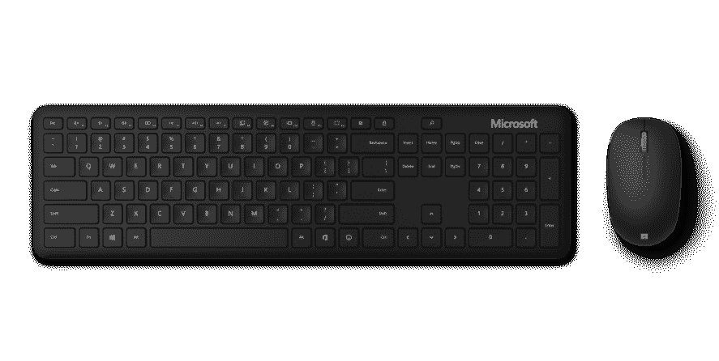
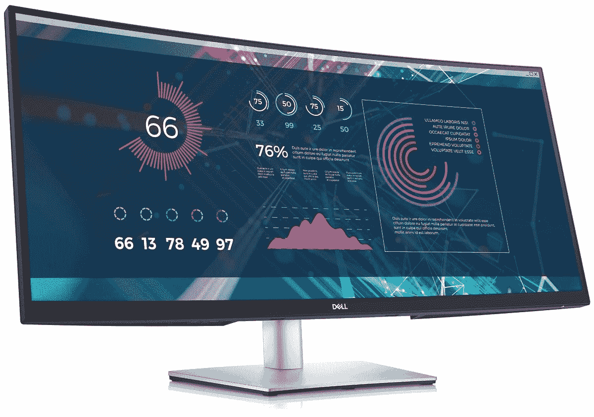
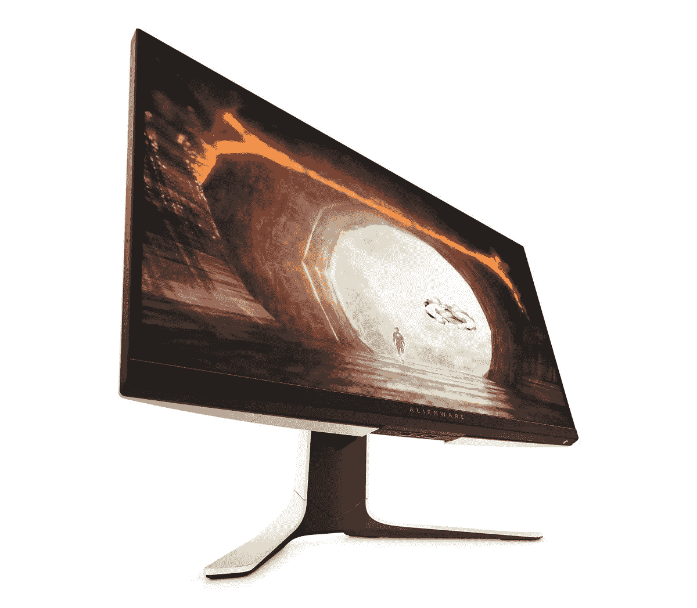
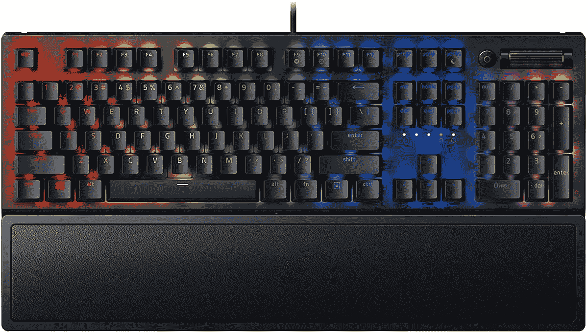
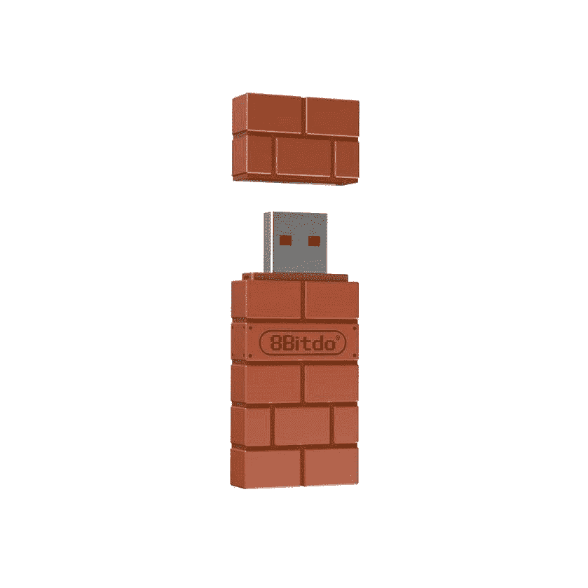
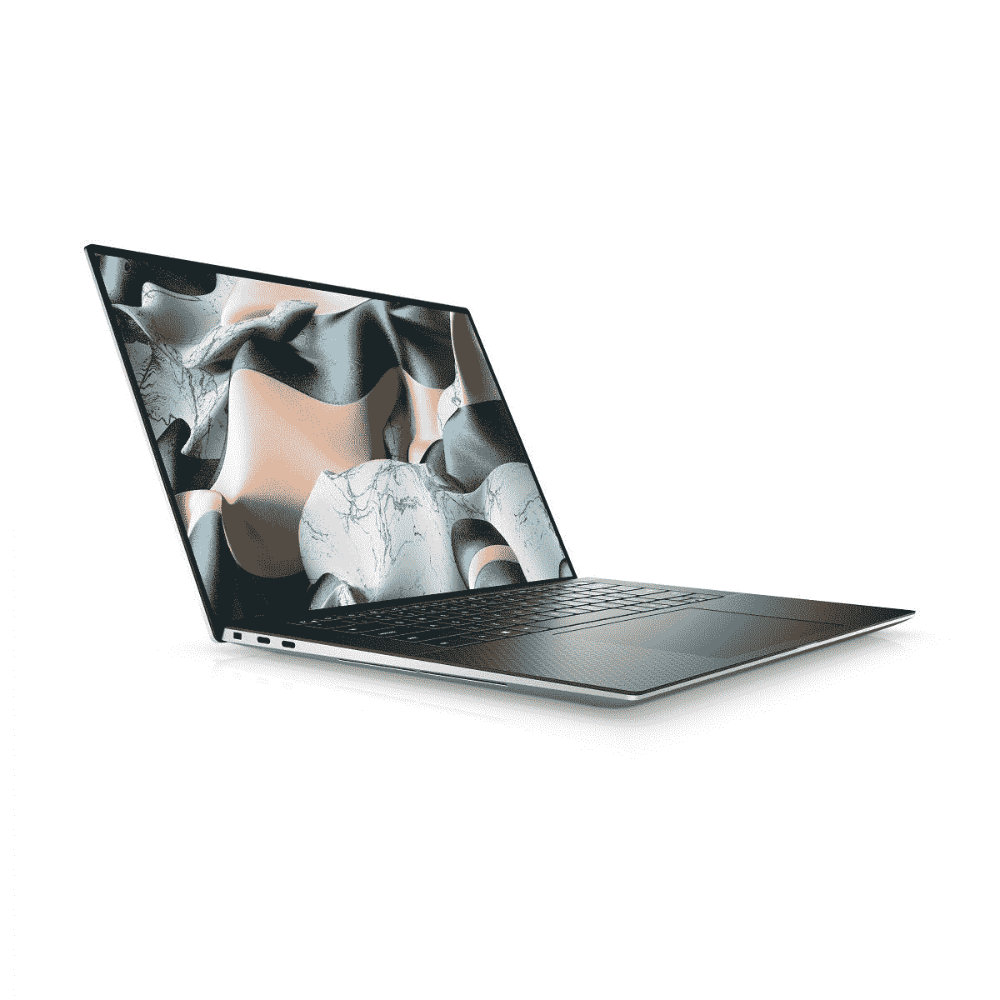

# 2023 年最佳戴尔 XPS 15 附件

> 原文：<https://www.xda-developers.com/best-dell-xps-15-accessories/>

# 2023 年最佳戴尔 XPS 15 附件

附件可以大大提高笔记本电脑的个性化和实用性，因此这里有您可以获得的最佳 Dell XPS 15 附件。

戴尔最近用一些结实的硬件更新了其广受欢迎的 XPS 系列。它们已经是你能得到的[最好的笔记本电脑](https://www.xda-developers.com/best-laptops/)，最近的更新更进一步。新的 [XPS 15](https://www.xda-developers.com/dell-xps-15-2022-review/) 采用英特尔第 11 代 H 系列处理器和 [Nvidia 显卡](https://www.nvidia.com/en-us/geforce/news/rtx-3050-ti-laptops-out-now/)，是一款便携的发电站。但是不管笔记本电脑有多好，你总可以做些事情来改进或扩展它的功能。或者你只是想保护它？这就是为什么我们收集了一些您可以购买的最佳 XPS 15 附件来搭配您的设备。

在这个综述中，我们涵盖了几个不同的类别。我们有一些配件来完成您的家庭或办公室设置，其他配件使 XPS 15 成为更好的旅行伴侣，最后，还有一些游戏配件。由于 XPS 15 具有 [Thunderbolt](https://www.xda-developers.com/best-thunderbolt-docks/) ，您可以连接外部 GPU 和游戏显示器等设备，因此您可以将它变成一个合适的游戏装备。

*   <picture></picture>

    微软蓝牙桌面套装

    ##### 微软蓝牙键盘

    要设置您的家庭办公室，一个键盘鼠标组合可以大有作为。这种无线设置使用蓝牙，它提供了一些独特的功能，如表情符号和键盘上的 Office 键。

*   <picture></picture>

    三星 T7 Touch

    ##### 三星 T7 Touch 便携式固态硬盘

    三星 T7 Touch 是一款快速便携式固态硬盘，读取速度可达 1，050MB/s，写入速度可达 1，000MB/s。此外，指纹传感器可用于保护您的数据免遭陌生人窃取。

*   <picture></picture>

    可插拔 14 合 1 雷电 3 坞

    ##### 可插拔 14 合 1 雷电 3 坞

    这种可插拔雷电坞的多功能性很难与之匹敌。它可以通过两个 HDMI 和 DisplayPort 输出、七个 USB 端口、以太网等大大扩展 XPS 15 的连接能力。

*   <picture></picture>

    雷蛇 Anzu 智能眼镜

    ##### 雷蛇 Anzu 智能眼镜

    雷蛇 Anzu 通过过滤蓝光来帮助缓解在电脑前工作的压力，但它们也有内置扬声器，就在你的耳朵旁边，所以你可以独自欣赏音乐和参加会议。另外，太阳镜镜片可以戴在外面。

*   <picture></picture>

    Surface 耳机 2

    ##### 微软 Surface 耳机 2

    Surface 耳机 2 采用了高级设计和直观的触摸和拨号控制。它们还提供主动噪音消除功能，帮助您消除背景噪音。

*   <picture></picture>

    戴尔 34 英寸曲面 USB-C 显示器

    ##### 戴尔 34 英寸 WQHD 曲面显示器

    双显示器设置非常有利于提高工作效率，戴尔的这款 34 英寸超宽显示器是一个绝佳的选择。它的大尺寸和 WQHD 分辨率为多任务处理提供了大量空间，此外它还提供了 65W 的功率输出。

*   <picture></picture>

    明基 TK850 4K 投影机

    ##### 明基 TK850 4K HDR 投影机

    这款 4K 投影机提供高达 3000 流明的亮度，即使在白天也能欣赏到高质量的电影和表演。它支持 HDR 4K，可以投射 300 英寸大小的图像。

*   <picture></picture>

    Kinmac 360 度笔记本电脑保护套

    ##### Kinmac 360 保护套

    Kinmac 笔记本电脑保护套为您的笔记本电脑提供防水保护，加上各方面的充足缓冲，以防您跌落。它也有很多不同的外观。

*   <picture></picture>

    戴尔专业背包 17

    ##### 戴尔专业背包 17

    戴尔专业背包 17 可能是为更大的笔记本电脑设计的，但它仍然可以保护您的 XPS 15 免受雨水和冲击。它可以容纳配件和你需要携带的任何东西，此外，你还可以通过专用充电器口袋中的电源为你的笔记本电脑充电。

*   <picture></picture>

    微软 Arc 鼠标

    ##### 微软 Arc 鼠标

    如果你想要一个可以带去任何地方的鼠标，就是这款了。微软 Arc 鼠标非常薄，但它被设计成可以弯曲的，所以当你使用它时，它可以正好放在你的手中。虚拟滚轮需要一些时间来适应，但这是一个公平的权衡。

*   <picture></picture>

    Anker power expand+

    ##### Anker 341 7 合 1 USB-C Hub

    如果您在旅途中需要一些额外的连接，这款 Anker USB-C hub 可以轻松放入包中，并提供七个端口，包括 HDMI 和三个 USB 端口。它还可以为您的笔记本电脑提供 85 瓦的功率。

*   <picture></picture>

    Vissles 便携式 15.8 英寸显示器

    ##### Vissles 便携式 15.8 英寸显示器

    有些人的笔记本电脑离不开第二块屏幕，Vissles 便携式显示器就是为了解决这一问题而推出的。它有一个全高清 15.6 英寸显示屏，如果你通过 USB Type-C 连接，它甚至支持触摸输入。

*   <picture></picture>

    Anker power house II 400

    ##### Anker power house II 400

    Anker power house 是一款大容量便携式电池，可以让您为所有设备充电，包括使用 388Wh 电池的笔记本电脑。过度杀戮？也许吧，但如果你要去野营或长途旅行，它可以给你几天的电力。

*   <picture></picture>

    Razer Core X

    ##### Razer Core X

    一些 XPS 15 机型已经包含相当坚固的移动 GPU，但如果你想要更强的性能，Razer Core X 可以提供帮助。这款 eGPU 盘柜支持最多三插槽大小的大多数 GPU，并包括一个 650 瓦的 PSU。你只需要找到一个 GPU 放在里面。

*   <picture></picture>

    戴尔外星人 27 款游戏显示器

    ##### 外星人 AW7220HF 27 英寸游戏显示器

    如果你想在游戏中充分利用你的 GPU，一台高刷新率的显示器很重要。戴尔外星人 27 具有全高清分辨率，支持高达 240Hz 的刷新率，以及 AMD FreeSync 和 Nvidia G-Sync。

*   <picture></picture>

    雷蛇黑寡妇 V3

    ##### 雷蛇黑寡妇 V3

    机械键盘是很多游戏玩家的生活方式，雷蛇黑寡妇 V3 是一个很棒的选择。你可以用绿色开关或无声的黄色开关来得到它，它有每个键的 RGB 照明和用于各种系统控制的多功能转盘。

*   <picture></picture>

    Razer DeathAdder V2

    ##### Razer death adder V2

    没有游戏鼠标就没有完整的游戏设置，Razer death adder V2 拥有 20，000DPI 传感器，并使用 Razer 的光学鼠标开关来实现更快的按钮操作。此外，你可以使用 Razer Synapse 定制 RGB 照明。

*   <picture></picture>

    Xbox 核心控制器

    ##### 微软 Xbox 无线控制器

    对于某些游戏来说，控制器只是比鼠标和键盘设置更容易使用，Xbox 无线控制器是 Windows 上控制器的黄金标准。它可以和蓝牙一起工作，你可以用 Xbox 附件应用程序来定制它。

*   <picture></picture>

    8BitDo USB 无线适配器

    ##### 8 bitdo 无线适配器

    如果你已经有了一个喜欢的控制器，而且它不是 Xbox one，那么 8 bitdo 无线适配器非常棒。使用 8BitDo 的终极软件，您可以创建宏，自定义触发灵敏度，并调整振动强度。它支持大多数现代控制器。

*   <picture></picture>

    Xbox 无线耳机

    ##### 微软 Xbox 无线耳机

    Xbox 无线耳机是一款非常棒的游戏耳机，它具有不说话时麦克风自动静音和声音隔离等功能，让你听得很清楚。它支持环绕声，让你可以通过旋转转盘来调节音量，以及其他功能。

这应该向您表明，有许多附件可以帮助您扩展 Dell XPS 15 的使用体验。多亏了 Thunderbolt，你可以插入游戏用的高刷新率显示器，甚至是一整个外部 GPU。如果你喜欢玩游戏，Xbox 无线耳机之类的东西非常适合与队友通话。

另一方面，如果您更多地将 XPS 15 用于工作，戴尔 34 曲面显示器可以提供巨大的工作空间，非常适合办公室使用。添加鼠标和键盘组合以及用于其他外围设备的 Thunderbolt 坞站，您可以轻松地将 XPS 15 变成一台生产力机器。无论您在寻找什么，XPS 15 都可以通过这些附件成为一台非常多功能的机器。如果你还没有买，可以在下面买。

 <picture></picture> 

Dell XPS 15

##### 戴尔 XPS 15

考虑到其尺寸，戴尔 XPS 15 是一款强劲的笔记本电脑。它采用第 11 代英特尔酷睿 H 系列 CPU 和高达 Nvidia GeForce RTX 3050 Ti，几乎可以处理您扔给它的任何东西。