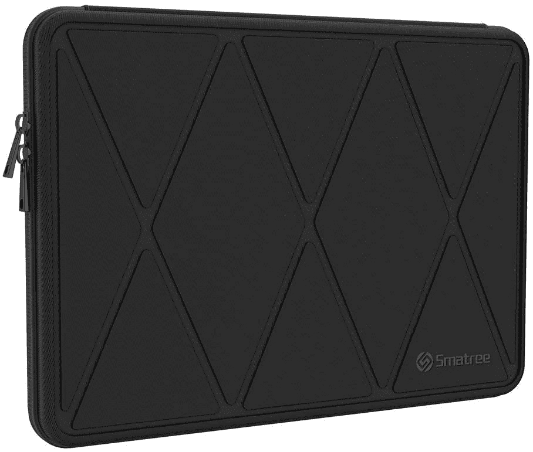

# 2023 年戴尔 XPS 15 的最佳案例

> 原文：<https://www.xda-developers.com/best-dell-xps-15-cases/>

# 2023 年戴尔 XPS 15 的最佳案例

需要为您的笔记本电脑提供额外保护吗？以下是您能找到的一些关于戴尔 XPS 15 的最佳案例，从袖子到背包，应有尽有。

戴尔 XPS 15 是一款令人难以置信的强大的 [15 英寸笔记本电脑](https://www.xda-developers.com/best-15-inch-laptops/)，它的外观具有欺骗性。它很紧凑，相对来说很薄，但它可以容纳英特尔酷睿 i9-11980HK CPU 和 NVIDIA GeForce RTX 3050 Ti 显卡。你可以在这台机器上完成一些重要的工作，而且你可以毫不费力地把它带走。但是，由于许多原因，随身携带笔记本电脑是危险的，包括跌落或撞到什么东西的风险。如果您想要保护您的戴尔 XPS 15，以下是您可以获得的一些最佳案例。

有很多不同的方法来保护你的笔记本电脑免受日常事故的影响，从薄袖子到大袋子。我们这里什么都有，所以你可以选择更适合你口味的。

 <picture></picture> 

mCover Hard Shell Case

##### mCover 硬壳 XPS 15 外壳

戴尔 XPS 15 有几种不同的颜色，但它们并不真正令人兴奋。除了保护您的笔记本电脑，这款 mCover 硬壳还可以为您的 Dell XPS 15 增添一抹亮色，让它更加出众。还有一个完全清晰的版本。

 <picture></picture> 

Alapmk Protective Cover Case

##### Alapmk 防护型戴尔 XPS 15 外壳

这款适用于 Dell XPS 15 的保护套包裹着整个笔记本电脑，使其免受日常碰撞和刮擦。有纯黑色或红色可选，如果你想要更有个性的款式，也可以选择几种不同的图案。

 <picture></picture> 

Dell Premier Sleeve 15

##### 戴尔高级袖套 15

谁能比戴尔袖套更好地保护戴尔笔记本电脑？这款优质袖套采用防水织物外壳，内部带有微纤维衬里，可防止刮擦。皮革覆盖的翻盖用磁铁合上，这样您的 Dell XPS 15 就不会被带走。

 <picture></picture> 

Londo Genuine Leather Sleeve

##### Londo 真皮袖套

如果你想要一个有个性的修身袖子，Londo 真皮袖子是一个很好的选择。结合真皮和各种图案，它有一个独特的，但仍然是经典的外观，有几个款式可供选择，所以你可以找到适合你的风格，而不是太浮华。

 <picture></picture> 

Kinmac 360 degree protective laptop sleeve

##### Kinmac 360 保护套

如果你似乎找不到符合你个人风格的东西，这可能是你最好的选择。有 20 多种款式可供选择，这款 Kinmac 袖套一定有你喜欢的。此外，它提供了大量的缓冲和防震外壳保护。

 <picture></picture> 

Smatree Hard Shell Case

##### Smatree 硬质笔记本电脑套

如果您需要为您的戴尔 XPS 15 提供额外保护，这是最好的选择之一。它使用坚硬但灵活的硬壳来保护您的笔记本电脑免受剧烈的跌落和碰撞，并使用柔软的外壳来防止刮擦。另外，它是防水的。

 <picture></picture> 

Dealcase Laptop Sleeve

##### Dealcase 笔记本电脑套

旅行时随身携带配饰并非易事，但 Dealcase 手机套配有一个单独的储物袋。你可以在需要的时候拿走你的配饰，也可以在不需要的时候把它们留下。它也有几种不同的颜色。

 <picture></picture> 

Targus Strata Laptop Sleeve

##### Targus Strata 笔记本电脑套

这款高品质的保护套有些简单，但它有足够的空间来放置充电器和其他配件。此外，它还配有肩带，便于携带，无需拿在手中。极简美学对商业用户来说也很棒。

 <picture></picture> 

Dell Urban Backpack 15.6

##### 戴尔都市背包 15

对于长途旅行，或者对于那些不喜欢肩带的人来说，戴尔官方 Urban 背包是携带笔记本电脑的最佳方式。你可以不用双手，用多个隔层打包许多配件和额外物品，让它们井井有条。非常适合经常长途旅行的人。

正如我们所说，每个人都有适合自己的东西，有不同类型的案例可供选择。你有搭扣套、袖子、单肩包和背包可供选择，许多款式都有。个人最喜欢的是 Kinmac 360 笔记本电脑保护套，因为它提供了我认为的保护和时尚的完美结合。

如果您还没有，可以使用以下链接购买戴尔 XPS 15。正如我们之前所说的，这是一款非凡的笔记本电脑，它的尺寸可能会欺骗你。除了高端 CPU 和显卡，您还可以获得高达 64GB 的 RAM 和 4TB 的存储。它甚至配有 OLED 面板选项，在笔记本电脑上看起来绝对惊艳。这是最好的笔记本电脑之一，但你也可以随时查看戴尔的其他[优秀笔记本电脑。](https://www.xda-developers.com/best-dell-laptops/)

 <picture></picture> 

Dell XPS 15

##### 戴尔 XPS 15

Dell XPS 15 是一款功能强大的 15 英寸笔记本电脑，紧凑的设计透露出其强大的内部规格。它配备了最新的英特尔酷睿处理器和 NVIDIA RTX 显卡，以及大量 RAM 和存储选项。