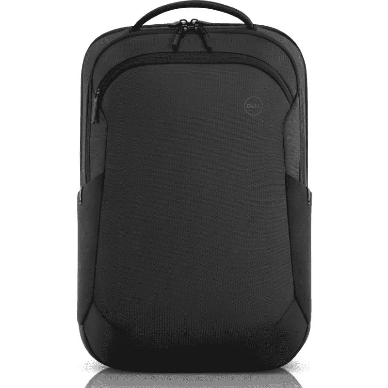
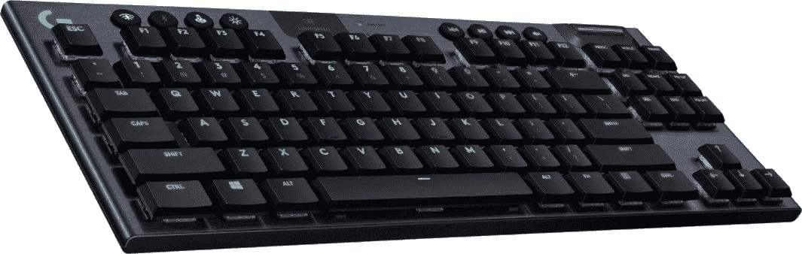
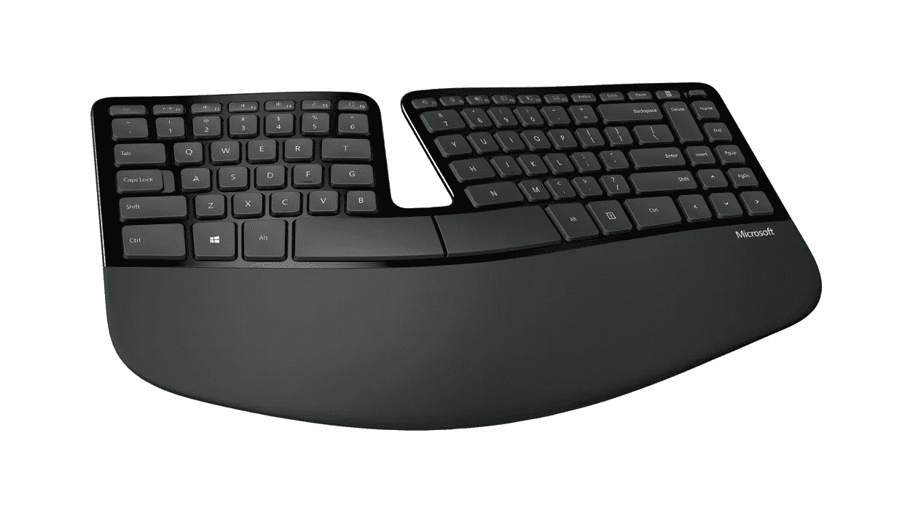
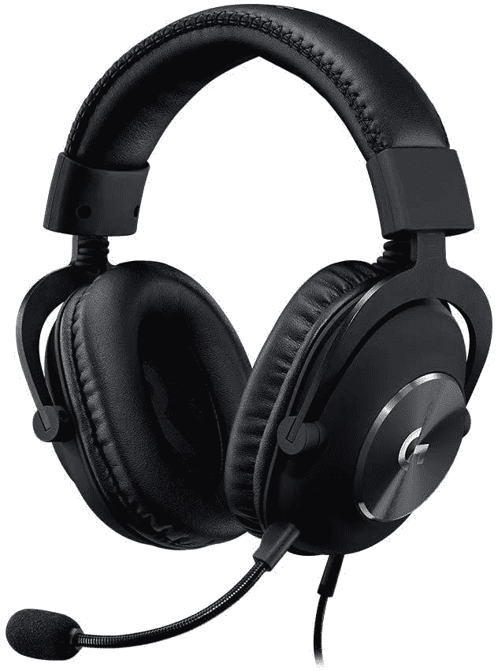
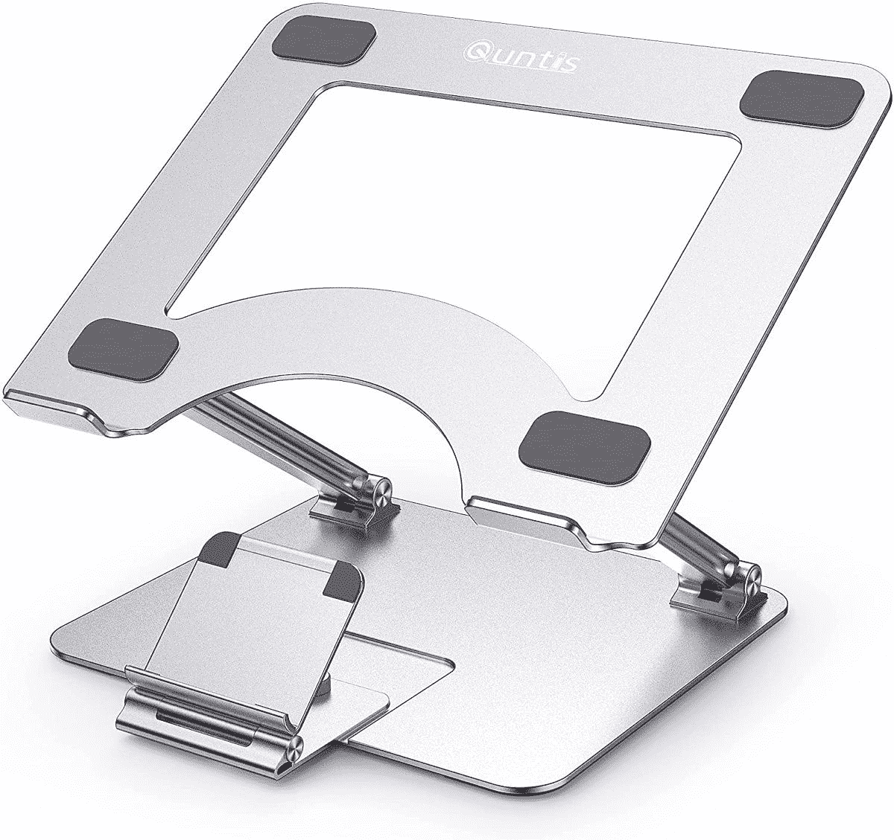

# 戴尔 XPS 17 的最佳附件

> 原文：<https://www.xda-developers.com/best-dell-xps-17-accessories/>

# 戴尔 XPS 17 的最佳附件

使用这些最新的 Dell XPS 17 必备附件，提高您的工作效率。看看他们！

[戴尔 XPS 17](https://www.xda-developers.com/dell-xps-17-2022-review/) 是你现在可以买到的[最好的笔记本电脑](https://www.xda-developers.com/best-laptops/)之一，它对生产力和内容创作特别有帮助。它在性能方面表现强劲，配备强大的第 12 代 45W 英特尔处理器、NVIDIA RTX 显卡，以及高达 4TB 的 SSD 存储和 64GB RAM 的配置。最重要的是，它有一个 17 英寸的大显示屏，宽高比为 16:10，你甚至可以通过超清晰的超高清+面板获得它。XPS 17 理应在[戴尔最好的笔记本电脑](https://www.xda-developers.com/best-dell-laptops/)中占有一席之地，但没有一款笔记本电脑好到某些配件不能让它变得更好。

对于任何给定的笔记本电脑，你可以购买大量的配件，让体验更加有用。在戴尔 XPS 17 的情况下，您可能会发现自己想要一个 Thunderbolt 坞站或 USB-C 集线器，因为这些几乎是您开箱即用的唯一端口。但是你可能还需要很多其他东西——显示器、鼠标、键盘，应有尽有。我们收集了您可以购买的最佳附件，以补充您的戴尔 XPS 17，并使其更适合您的需求。

*   <picture></picture>

    多米索笔记本电脑套

    ##### 多米索防震笔记本电脑套

    如果你平时比较粗糙，多米索笔记本电脑套是另一个很好的选择。它有一个坚硬的 EVA 外壳，可以吸收更大的冲击力，而且更防水。

*   <picture></picture>

    戴尔 EcoLoop Pro 双肩包

    ##### 戴尔 EcoLoop Pro 双肩包

    如果你要去旅行，双肩包可以帮你携带笔记本电脑和其他东西，比手提箱方便多了。这一个有一个现代的设计，而且它使用回收材料。

*   <picture></picture>

    罗技 MX Master 3S

    ##### 罗技 MX Master 3S

    如果你想提高你的工作效率，MX Master 3 是一款出色的鼠标。它提供了多个可编程按钮、罗技的 MagSpeed 滚轮、多设备支持、符合人体工程学的设计等等。

*   <picture></picture>

    雷蛇蝰蛇旗舰版

    ##### 雷蛇蝰蛇旗舰版

    雷蛇蝰蛇旗舰版提供了一个 20K DPI 光学传感器、8 个可编程按钮和 70 小时续航时间的轻巧灵巧设计。它还具有 Razer 的光学开关，可以实现更精确的点击。

*   <picture></picture>

    戴尔 Premier 可充电无线鼠标

    ##### 戴尔 Premier 可充电无线鼠标

    一款高级无线鼠标，通过 USB-C 充电仅需两分钟即可完成一整天的工作，戴尔 Premier MS7421W 采用优雅的设计，最多可连接三台设备。

*   <picture></picture>

    Dell Premier 无线键盘和鼠标 km 7321 w

    ##### Dell km 7120 w Combo

    Dell Premier 无线键盘和鼠标 Combo 提供 2.4GHz 或蓝牙 5.0 连接，允许您无缝连接和配对多达三台设备。该套装外观精美，非常适合办公室使用。

*   <picture></picture>

    罗技 G915 TKL

    ##### 罗技 G915 TKL

    一款出色的轻薄无键机械键盘，采用顶级紧凑设计和 RGB 照明。它支持罗技定制的无线连接、蓝牙或有线连接。

*   <picture></picture>

    微软 Sculpt 人体工学键盘

    ##### 微软 Sculpt 人体工学键盘

    如果你想要一种让你的手和手腕保持舒适健康的打字体验，这样一款人体工学键盘就太棒了。按键放置在理想的位置，大手腕休息是最大的舒适角度。

*   <picture></picture>

    Belkin USB-C Hub

    ##### Belkin 6 合 1 USB Hub

    如果 XPS 17 上的 USB-C 端口还不足以满足您的需求，这款 USB-C Hub 可提供 HDMI、USB Type-A、以太网和高达 85 瓦的直通充电，大大扩展了您的选择如果您在旅行时需要额外的端口，它也足够紧凑，可以带到任何地方。

*   <picture></picture>

    Anker Apex 12 合 1 Thunderbolt 4 坞站

    ##### Anker 777 Thunderbolt 坞站

    Anker 最近推出了 Apex Thunderbolt 4 坞站，如果您的 XPS 17 需要一个可靠的坞站，它就是您的一站式解决方案。您可以通过 HDMI 连接多达两个 4K 显示器，您可以获得多个 USB-A 端口、千兆以太网等等。

*   <picture></picture>

    Razer Core X

    ##### Razer Core X

    戴尔 XPS 17 可能有一个坚固的 GPU 来提高工作效率，但如果你想用它来玩游戏，你会想要一个像 Razer Core X 那样的外部 GPU 外壳。采用时尚的设计，有充足的气流，650 瓦 PSU

*   <picture></picture>

    华硕 ProArt pa 279 cv

    ##### 华硕 ProArt PA279CV 27 英寸 4K UHD 显示器

    华硕为创意专业人士打造了一些惊艳的显示器，这款也不例外。这是一个超清晰的 4K 显示器，100% sRGB 和 Rec。709 覆盖率。它的颜色准确度等级为 Delta E < 2，并通过了 Calman 的验证。它提供的东西也很实惠。

*   <picture></picture>

    三星 Odyssey G7

    ##### 三星 Odyssey G7

    三星 Odyssey G7 是目前你能买到的最好的曲面游戏显示器之一，具有四核高清分辨率和 240Hz 的快速刷新率，响应时间为 1 毫秒。它有一个令人惊叹的 QLED 面板，支持 HDR600，你可以在背面的 RGB 照明下炫耀。

*   <picture></picture>

    华硕 Zen screen MB 16 ace

    ##### 华硕 ZenScreen MB16ACE

    如果您的工作需要经常出差，便携式显示器可以让您在旅途中设置双显示器，提高您的工作效率。华硕 ZenScreen MB16ACE 是一款非常棒的便携式显示器，配有 15.6 英寸全高清面板，可以使用一根 USB 电缆连接，易于设置。

*   <picture></picture>

    罗技 G Pro X Surround

    ##### 罗技 G Pro X Surround

    这款罗技 G Pro X Surround 游戏耳机无论你是想玩游戏，还是只是想要一款舒适的日常耳机，都是业内数一数二的。它支持 7.1 环绕声，并采用 Blue Voice 技术，在通话过程中提供清晰的音频。

*   <picture></picture>

    Surface 耳机 2

    ##### 微软 Surface 耳机 2

    如果你想要出色的音频体验，Surface 耳机 2 是戴尔 XPS 17 的绝佳选择。除了出色的音频，您还可以使用直观的音量和噪音消除拨盘控制和音乐播放触摸控制。

*   <picture></picture>

    戴尔 UltraSharp 4K 网络摄像头

    ##### 戴尔 UltraSharp 4K 网络摄像头

    XPS 17 的网络摄像头相当糟糕，所以如果你打算进行视频通话或在线播放，你需要一个更好的摄像头 Dell UltraSharp 可能是市场上最好的网络摄像头，配有 4K 索尼 STARVIS 传感器，可实现弱光、自动对焦和其他出色功能。

*   <picture></picture>

    三星 T7 Touch

    ##### 三星 T7 Touch 便携式 SSD

    说到存储，三星提供了一些最佳的解决方案。T7 Touch 便携式固态硬盘不仅提供快速的数据传输速度，还配有内置指纹扫描仪，以增加安全性。

*   <picture></picture>

    希捷便携式 1TB 外置硬盘

    ##### 希捷便携式外置硬盘

    如果你需要存储大量文件，购买大容量外置硬盘通常比固态硬盘便宜。希捷便携硬盘提供 1TB、2TB、4TB 甚至 5TB 容量，支持 USB 3.0。

*   <picture></picture>

    Xbox 无线手柄

    ##### 微软 Xbox 无线手柄

    虽然很多游戏用鼠标和键盘玩起来更好，但也有一些游戏用手柄感觉更直观 Xbox 无线控制器可以说是 PC 游戏的最佳控制器，具有出色的人体工程学设计和各种颜色。

*   <picture></picture>

    qun tis 笔记本电脑支架

    ##### qun tis 笔记本电脑支架

    拥有一个笔记本电脑支架有很多好处，尤其是提供高度调节的支架。你可以获得合适的角度来打字，或者如果你的桌子太低，可以抬高你的笔记本电脑。此外，它可以改善气流，使笔记本电脑不会发热。

*   <picture></picture>

    嗖！屏幕清洁剂套装

    ##### 嗖！屏幕清洁工具包

    如果你想避免以后被划伤，保持笔记本电脑屏幕清洁是个好习惯。这个工具包带有一种液体试剂，对所有类型的屏幕都是安全的，你可以得到一套超细纤维布来保持你的笔记本电脑一尘不染。

*   <picture></picture>

    海盗船 MM700 RGB 游戏鼠标垫

    ##### 海盗船 MM700 RGB 游戏鼠标垫

    海盗船 MM700 是一款大尺寸鼠标垫(36.6" x 15.8 ")，可以轻松容纳 XPS 17，并且仍有足够的空间用于它采用柔软的织物表面，边缘带有 RGB 照明..

* * *

无论您在寻找什么，您一定会在此列表中找到一些适用于 Dell XPS 17 的出色附件。从存储到外部显示器或坞站解决方案，这里有适合每个人的东西-甚至像屏幕清洁工具包这样的基本东西，它比你想象的更有用。甚至还有一个外部 GPU，如果你想在家里使用笔记本电脑玩游戏，而又不完全破坏它的便携性。

如果你还没有，你可以在下面购买最新的戴尔 XPS 17。请务必阅读我们的[戴尔 XPS 17 评测](https://www.xda-developers.com/dell-xps-17-2022-review/)，了解为什么它是您目前可以获得的最佳选择之一，尤其是在这种尺寸的情况下。