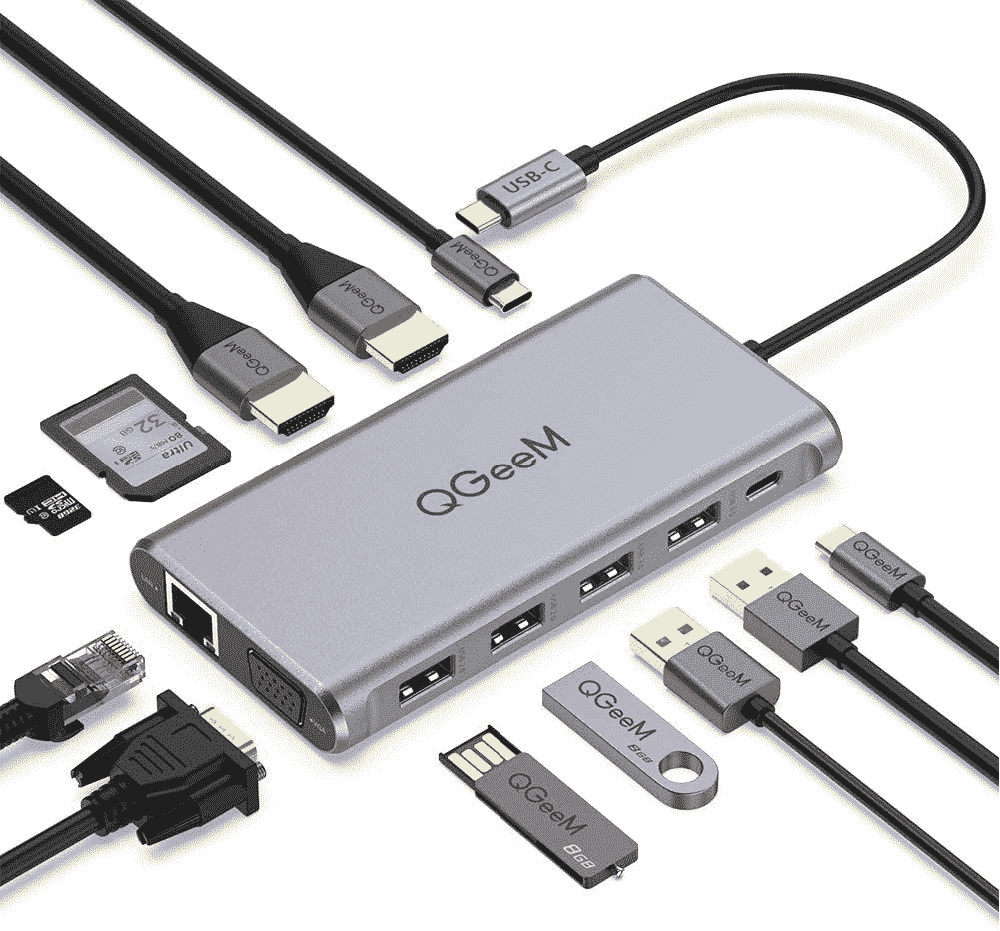

# Acer Swift 3 的最佳坞站(2022 年)

> 原文：<https://www.xda-developers.com/best-docking-stations-acer-swift-3-2022/>

# Acer Swift 3 的最佳坞站(2022 年)

宏碁 Swift 3 (2022)没有太多端口。因此，下面是宏碁 Swift 3 (2022)的一些最佳坞站。

Acer Swift 3 (2022) 是我们今年在 MWC 看到的最令人兴奋的主流笔记本电脑之一。新的 Acer Swift 3 refresh 型号看起来很棒，具有强大的内部功能，还有高质量的 QHD 面板选项。它没有的一点是很多端口。只有两个 USB Type-C 端口，以及两个 USB Type-A 端口和一个 HDMI 端口。因此，如果你打算插入多个外围设备、显示器或类似以太网电缆的东西，你将需要一个坞站。在本文中，我们将了解 Acer Swift 3 (2022)的最佳坞站综述。

市场上有很多扩展坞，但我们将尝试只筛选值得考虑的最佳扩展坞。让我们从列表开始:

* * *

## Acer Swift 3 的最佳坞站(2022 年)

*   <picture></picture>

    宏碁 USB-C 坞站

    ##### 宏碁 USB-C 坞站

    宏碁 USB-C 坞站的价格略低于上一款，但它为您的笔记本电脑提供了一个不错的端口选择。您可以获得多达两个 HDMI 端口、两个 display 端口、一组 USB 端口等等。它还附带一年保修，尽管这款没有配备支架或液晶显示器支架，所以请记住这一点。

*   <picture></picture>

    QGeeM USB-C Hub

    ##### QGeeM 12 合 1 USB Hub

    如果您需要一款价格相对实惠、便于携带的 Hub，并能为您提供多种端口选择，那么一定要看看 QGeeM USB-C Hub。这是一个非常强大的选项，共有 12 个端口，包括多个 USB 端口、双 HDMI、以太网、SD 读卡器等。不像宏碁的官方集线器，这款也很实惠。

*   <picture></picture>

    Anker power expand 5-in-1 Thunderbolt 4 Mini Dock

    ##### Anker power expand 5-in-1 Thunderbolt 4 Mini Dock

    Anker 的 power expand 5-in-1 Thunderbolt 4 Mini Dock 在相当一段时间内都是一个可靠的选择。这个特殊的坞站具有一个 85W Thunderbolt 4 上游端口、三个 Thunderbolt 4 下游端口和一个 USB-A 端口。它还支持 15W 功率输出和高达 60Hz 4K 的双显示器。

*   <picture></picture>

    Razer Thunderbolt 4 Dock

    ##### Razer Thunderbolt 4 Dock Chroma

    如果你想为你的设置添加一点 RGB 的话，Razer Thunderbolt 4 Dock Chroma 是一个不错的选择。这个特殊的坞站配有一个 SD 读卡器、一个 3.5 毫米音频插孔、三个 Thunderbolt 4 下游端口、一个 Thunderbolt 4 上游端口、千兆以太网和三个 USB-A 3.2 Gen 2 端口。

*   <picture></picture>

    Anker USB C Hub

    ##### Anker power expand 5-in-1 Thunderbolt 4 Mini Dock

    如果你正在寻找一个简单的 USB-C dock，它也是便携式的，那么看看 Anker PowerExpand+ dock 就够了。这款 7 合 1 坞站配有一系列 USB 端口、一个 MicroSD 和一个 SD 读卡器，支持 100W 功率传输等等。这也是这个系列中最实惠的选择之一，所以一定要看看。

* * *

好了，这就把我们带到了这篇特别的收藏文章的结尾。上面提到的所有坞站都可以很好地与 Acer Swift 3 (2022)笔记本电脑配合使用，并且它们为笔记本电脑添加了一套全新的端口。虽然宏碁的官方 USB-C 坞站是一个很好的选择，但它是该系列中最昂贵的选择之一。我们建议您选择 Anker PowerExpand 坞站或 QGEEM USB-C 集线器。

如果你不想处理添加独立坞站的麻烦，那么一定要看看我们收集的[最佳宏碁笔记本电脑](https://www.xda-developers.com/best-acer-laptops/)来找到一些宏碁的其他笔记本电脑。或者，您也可以看看我们对[最佳笔记本电脑](https://www.xda-developers.com/best-laptops/)的总结，看看您是否能找到具有更好端口选择的其他替代方案。否则，您可以使用下面的链接购买 Acer Swift 3。

 <picture></picture> 

Acer Swift 3

##### 宏碁 Swift 3

Acer Swift 3 采用第 12 代英特尔处理器，最高配有四核高清显示屏和新的全高清网络摄像头。