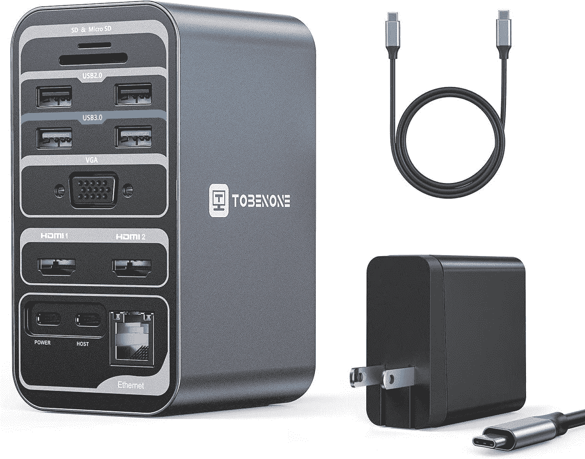

# 2023 年 Chromebooks 的最佳扩展坞

> 原文：<https://www.xda-developers.com/best-docking-stations-chromebooks/>

# 2023 年 Chromebooks 的最佳扩展坞

这是我们列出的你现在能得到的最好的 Chromebook 扩展坞。包括来自 Anker、Aukey 等的扩展坞。

chrome book 以其轻巧便携的结构而闻名。虽然这使它们成为伟大的旅行伴侣，但当你在家里使用时，它会带来一些障碍。例如，大多数 Chromebooks 没有大量的端口，这对那些希望使用多个配件的人来说是一个主要障碍。这就是 Chromebook 坞站可以帮助你的地方。

有了一个好的对接解决方案，你可以大大扩展你的 Chromebook 的多功能性，以及通常选择的[伟大的 Chromebook 配件](https://www.xda-developers.com/chromebook-accessories/)。您可以使用它来连接鼠标、机械键盘、外部存储设备、多台显示器或同时连接所有设备。最重要的是，通过一些坞站，只要有兼容的 USB Type-C 端口，你甚至可以为 Chromebook 充电。为了帮助您购买，我们整理了一份您现在可以购买的最佳 Chromebook 坞站列表。

*   <picture></picture>

    io gear Dock Pro 6 合 1 4K 坞站

    ##### io gear Dock Pro 6 合 1 4K 坞站

    如果你正在显示器上使用 Chromebook，那么这款笔记本电脑坞站就是为你准备的。它不仅在侧面有一系列端口，而且它还可以兼作支架，可以将您的笔记本电脑提升到舒适的打字位置。

*   <picture></picture>

    tobe none USB-C 笔记本电脑坞站

    ##### tobe none USB-C 笔记本电脑坞站

    这款 USB-C 笔记本电脑坞站提供对 17 个不同端口的访问。它配有一个 USB-C 充电器为集线器提供电源，并在背面提供了一个 VGA 端口，这对于较新的 Chromebook 坞站来说是罕见的。

*   <picture></picture>

    tier grade USB C 扩展坞

    ##### tier grade USB-C 扩展坞

    tier grade USB C chrome book 扩展坞非常适合高级用户。它提供了最广泛的端口选择，包括两个 USB 3.0 Type-A 端口、两个 USB 2.0 Type-A 端口、两个 USB 3.0 Type-C 端口、两个 HDMI 端口、一个 DisplayPort 端口、一个 RJ45 千兆以太网端口、3.5 毫米耳机和麦克风插孔、一个 S/PDIF 音频端口和一个 60W 功率输出的 USB 3.0 Type-C 端口。除此之外，该坞站还包括一个全尺寸 SD 读卡器和一个 microSD 读卡器。

*   <picture></picture>

    Anker Powerexpand+USB-C Hub

    ##### Anker power expand+USB-C Hub

    如果你不愿意花 40 美元买一个小小的 USB C hub，那么 Anker power expand+应该是一个更好的选择。它比 NOVOO USB C dock 稍大，但端口数量相同。这包括两个 USB 3.0 Type-A 端口、一个用于数据的 USB Type-C 端口、一个支持高达 100W 的直通充电的 USB Type-C 端口、一个 HDMI 端口和一个 SD 读卡器。如果你有基本的需求，它应该能完成工作，而且对周围的人来说也不是太坏

*   <picture></picture>

    SABRENT 通用笔记本电脑坞站，带平板电脑和笔记本支架

    ##### SABRENT 通用笔记本电脑坞站，带平板电脑和笔记本支架

    SABRENT Chromebook 坞站是带可拆卸键盘的 Chromebook 的不错选择，因为它有一个支架，不用时可以用来支撑 chrome book 在端口方面，它提供了两个 USB 3.0 Type-A 端口，两个 USB 2.0 Type-A 端口，两个 USB Type-A 2.4A 快速充电端口，一个 HDMI 端口，一个 DVI 端口，一个 USB 3.0 输入，3.5mm 耳机和麦克风插孔，以及一个 RJ45 千兆以太网端口。

*   <picture></picture>

    Targus USB-C 双视频坞站

    ##### Targus USB-C 双视频坞站

    Targus chrome book 坞站是一款不错的二合一选择，不仅提供了不错的端口选择，还可以兼作一个完整的支架。它包括 4 个 USB 3.0 Type-A 端口、2 个 DisplayPort 端口、2 个 HDMI 2.0 端口、1 个支持 60W 直通充电的 USB Type-C 端口、1 个耳机/麦克风组合插孔和 1 个 RJ45 千兆以太网端口。

*   <picture></picture>

    Anker 777 Thunderbolt 4 Dock

    ##### Anker 777

    如果你想要一个 Dock 那就是溢价，那么这款就是了。它由全金属制成，很可能与任何高端 Chromebook 型号

    相匹配
*   <picture></picture>

    Kensing 双显示器扩展坞

    ##### Kensing 双显示器扩展坞

    如果你有几个 USB Type-A 配件，Kensignton Chrombook 扩展坞是个不错的选择。它总共包括六个 USB Type-A 端口，两个 USB 3.0 端口和四个 USB 2.0 端口。此外，它还提供了一个 RJ45 千兆以太网端口、一个 HDMI 端口、一个 DVI 端口以及 3.5 毫米耳机和麦克风插孔。

如果你仍然不确定，这里有几个额外的因素可以帮助你最终选择。如果你的预算有限和/或无法在你的桌子上容纳一个大型坞站，或者一个 [Chromebox](https://www.xda-developers.com/best-chromeboxes/) ，我们建议选择 Anker PowerExpand+。它很小，提供了一个体面的端口选择，支持直通充电，甚至包括一个 SD 读卡器。但最棒的是它很便宜。