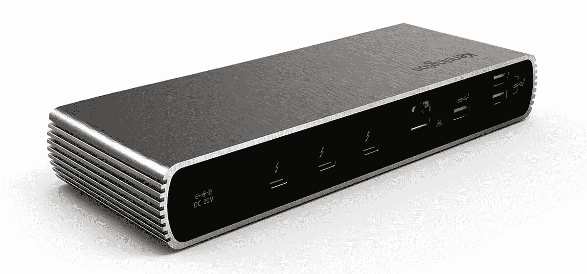
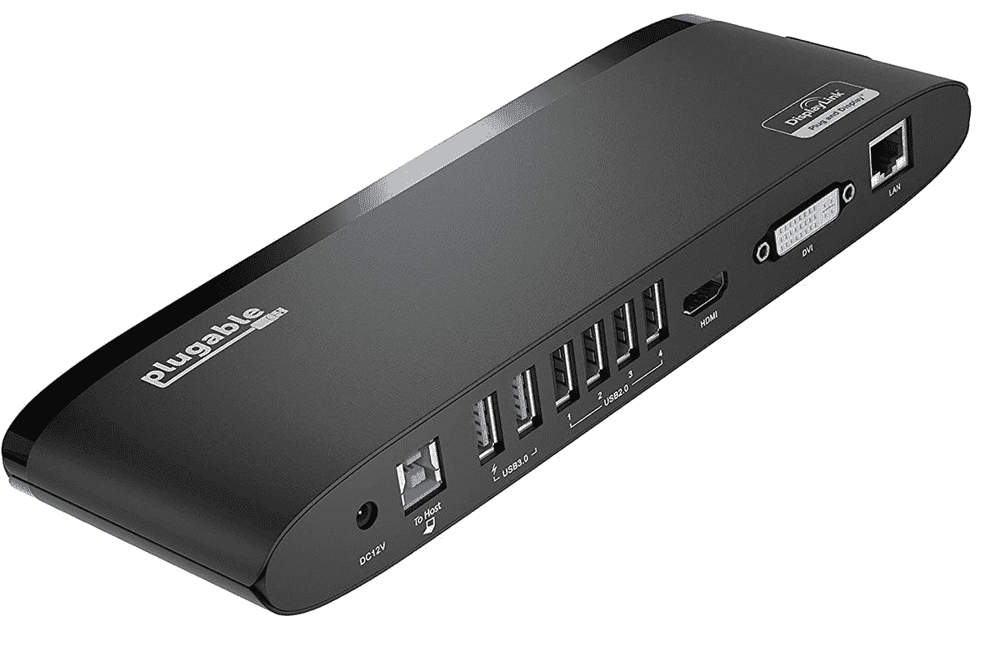
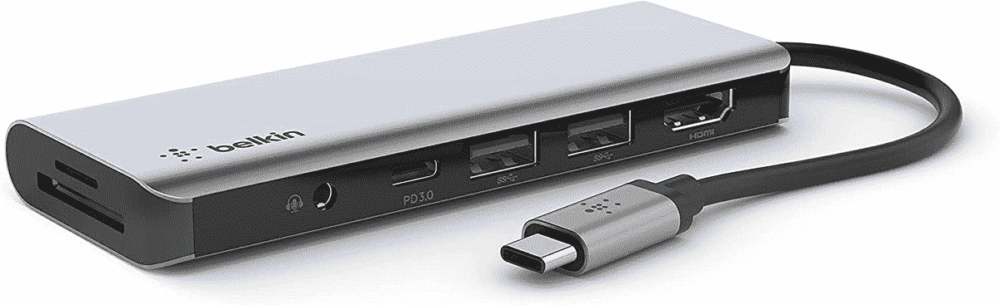

# Dell Latitude 5430 的最佳坞站

> 原文：<https://www.xda-developers.com/best-docking-stations-dell-latitude-5430/>

像许多其他公司一样，戴尔最近推出了采用英特尔第 12 代 Alder Lake 处理器的新笔记本电脑。在这些笔记本电脑中，我们有 [Dell Latitude 5430](https://www.xda-developers.com/dell-latitude-5430/) ，这是戴尔在[商用笔记本电脑](https://www.xda-developers.com/best-business-laptops/)领域中更主流的产品之一，但仍具有高端处理器和商用笔记本电脑应有的可配置性。与大多数商用笔记本电脑一样，Latitude 5430 也有稳定的端口供应，因此您可以插入您可能需要的所有外围设备。但有时，这还不够，这时您可能需要为 Dell Latitude 5430 购买一个坞站。

事情是这样的——仅仅因为笔记本电脑有大量的端口，并不意味着当你到达你的办公桌时，将你的每一个外围设备都插入其中，然后当你不得不离开时，再将它们全部拔掉是很方便的。一段时间后会变得乏味。此外，如果您的设置涉及使用多个显示器或大量外围设备，端口可能不够用。坞站可以为您的 Dell Latitude 5430 提供更多端口，除此之外，它们还可以让您的所有外围设备只占用笔记本电脑上的一个端口。因此，我们现在为您收集了一些适用于 Dell Latitude 5430 的绝佳选项。

*   <picture></picture>

    可插拔的雷电 3 坞站

    ##### 可插拔的 TBT3-UDC3

    如果你想要更多的多功能性，这种可插拔的坞站以比大多数更合理的价格提供各种各样的端口设置。你有三个 USB Type-A 端口，两个 USB Type-C 端口，HDMI，DisplayPort 和千兆以太网，所以你可以连接不同类型的外设。另外，它支持为您的笔记本电脑进行 96W 充电。

*   <picture></picture>

    肯辛顿 Thunderbolt 4 坞站

    ##### 肯辛顿 SD5700T Thunderbolt 4 坞站

    如果你非常依赖显示器之类的 Thunderbolt 外设，肯辛顿坞站可能是你不错的选择。它有四个 USB Type-A 端口，三个 Thunderbolt 4 下游端口，千兆以太网，一个 SD 读卡器和一个耳机插孔。然而，它没有像 HDMI 那样的传统显示输出。

*   <picture></picture>

    CalDigital 元素 Hub

    ##### CalDigital 元素迅雷 4 Dock

    不需要一吨的端口？CalDigit Element Hub 是 Dell Latitude 5430 的一个非常紧凑的坞站，它为您提供了四个 USB Type-A 端口和三个 Thunderbolt 下游端口，以便您可以连接外围设备和外部显示器。它也比大多数迅雷坞便宜。

*   <picture></picture>

    雷蛇迅雷 4 Dock

    ##### 雷蛇迅雷 4 Dock

    有些人可能更喜欢整洁的外观，但有些人可能想打扮一下自己的办公桌。这款 Razer dock 为您提供了两个 USB Type-A 端口、三个 Thunderbolt 下游端口、以太网和一个 SD 读卡器，但其最显著的特点是支持 Razer Chroma RGB。虽然白色的模型没有它。

*   <picture></picture>

    亚马逊基本型 10 合 1 雷电 3 坞

    ##### 亚马逊基本型 10 合 1 雷电 3 坞

    这款亚马逊基本型坞可能是你能找到的最便宜的 Thunderbolt 坞了。它很便宜，但仍然有能力，有两个 USB-A 端口，一个 USB-C，一个 THunderbolt 下游端口，千兆以太网和 SD 卡读卡器。甚至支持 60W 充电。

*   <picture></picture>

    可插拔的 UD-3900h

    ##### 可插拔的 USB 3.0 通用笔记本电脑坞站

    如果你不需要 THunderbolt 的所有功能，这种可插拔坞站是获得更多端口的更实惠的选择。它为您提供了六个 USB 型端口、HDMI、DVI 和千兆以太网，因此您可以以相对较低的价格获得大量连接。

*   <picture></picture>

    Belkin USB-C Hub

    ##### Belkin 6 合 1 USB Hub

    想要更小巧的解决方案？这款 Belkin 坞站配有两个 USB Type-A 端口、一个 USB-C、HDMI 和两个 SD 读卡器，外形非常紧凑。它还支持高达 100 瓦的直通电源，因此您可以为笔记本电脑充电。

*   <picture></picture>

    Totu 9 合 1 集线器

    ##### Totu 9 合 1 USB-C 集线器

    即使采用更小的设计，也有可能拥有稳定的端口供应，这款 USB-C 集线器就是您所需要的全部证明，它拥有三个 USB A 类端口，两个 HDMI 端口所有这些都包含在一个紧凑且经济实惠的封装中。

这就是我们为 Dell Latitude 5430 推荐的坞站。有各种用户和预算的选择，但我们认为 Anker 777 可能是这个列表中最好和最通用的选择。它有一个超级高级的设计，许多端口，而且价格合理。

如果您还没有，可以使用以下链接购买 Dell Latitude 5430。虽然它不是戴尔最高端的产品，但它非常强大，开箱后您可以获得两个 Thunderbolt 4 端口、两个 USB Type-A 端口、HDMI、RJ45 以太网、一个耳机插孔，如果您想在没有 Wi-Fi 的情况下连接到互联网，甚至可以选择 LTE 支持。如果你正在寻找一些与众不同的东西，也许可以看看我们今天列出的你能买到的最好的笔记本电脑。

 <picture></picture> 

Dell Latitude 5430

##### 戴尔 Latitude 5430

Dell Latitude 5430 是一款高度可配置的商用笔记本电脑，配备第 12 代英特尔处理器和各种端口，包括 Thunderbolt 4 支持。