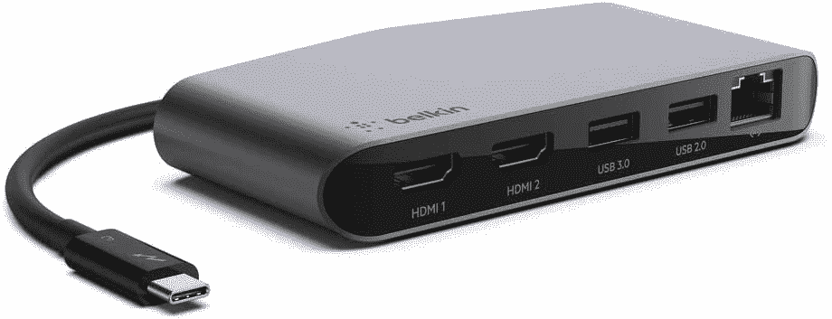

# HP EliteBook 840 G9 的最佳坞站

> 原文：<https://www.xda-developers.com/best-docking-stations-for-hp-elitebook-840-g9/>

您可能对老式笔记本电脑的扩展坞很熟悉。传统上，你需要将笔记本电脑滑入工作站来扩展端口阵列。然而，谈到 2022 年你能在[买到的](https://www.xda-developers.com/best-laptops/)[商务笔记本电脑](https://www.xda-developers.com/best-business-laptops/)和一些最好的笔记本电脑，时代已经变了。坞站现在更加便携和紧凑，可以为您的笔记本电脑添加更多种类的端口。在 HP EliteBook 840 G9 的情况下，坞站将从 2 个 Thunderbolt 4 端口、2 个 USB-A 端口、HDMI 端口、智能卡读卡器扩展到更多。

这就是为什么我们为 HP EliteBook 840 G9 准备了一些最佳坞站指南。我们的指南涵盖了许多不同的坞站，而不仅仅是惠普的官方坞站。我们甚至会进入 Thunderbolt 坞站，以及类似于软件狗大小的更紧凑的坞站。无论您在寻找什么，我们都有最适合您的产品。

 <picture></picture> 

HP Thunderbolt Dock G2 with Combo Cable

##### 惠普雷电坞站 G2

凭借即插即用 USB-C 连接、集成音频、显示端口、RJ45 以太网插孔，甚至 VGA 输出，这款 HP Thunderbolt 坞站专为企业和扩展您的工作空间灵活性而设计。

 <picture></picture> 

Anker 777 Thunderbolt Docking Station

##### Anker 777 雷电坞站

如果你想要一个拥有各种港口和优质设计的全能码头，Anker 777 可能是你最好的选择之一。它采用坚固的全金属外壳，有许多端口，包括两个 HDMI 端口、USB Type-A、以太网和下游 Thunderbolt。

 <picture></picture> 

Dell Dual Charge Dock

##### 戴尔双充电坞站

它并不适合所有人，但戴尔双充电坞站是一款有趣的产品，它为您的笔记本电脑提供了更多端口，可以充电，并且还为您的手机提供了无线充电板。这是相当昂贵的，但你得到了一些额外的端口和一个非常独特的功能集启动。

 <picture></picture> 

Anker 341 USB-C Hub

##### Anker 341 USB-C 集线器

如果您只需要几个额外的端口，而没有太多的花哨功能，Anker 的这款 7 合 1 集线器是一个很好的选择。它有 USB Type-A 端口，HDMI，甚至支持高达 85W 的功率输出。它也很小，所以很容易随身携带，这样您就可以随时准备更多的端口。

 <picture></picture> 

Belkin Thunderbolt 3 Dock Mini

##### 贝尔金雷电 3 迷你码头

如果你需要一个迷你 Thunderbolt 坞站来为双显示器供电，这款 Belkin 产品是你应该购买的。它可以帮助您以 60Hz 的频率为双 4K 显示器供电，并通过内置的 USB-A 端口以高达 40Gbps 的速度传输数据。

 <picture></picture> 

Amazon Basics 10-in-1 Thunderbolt 3 Dock

##### 亚马逊基础 10 合 1 雷电 3 坞站

大多数 Thunderbolt 坞站的价格往往超过 300 美元，但亚马逊 Basics 的这款坞站价格不到 250 美元。它仍然有稳定的端口供应，包括 DisplayPort 和以太网。USB Type-A，以及下游迅雷。

 <picture></picture> 

HP Elitebook ZBook TB3 Thunderbolt Dock 90W

##### 惠普 elite book z book TB3 Thunderbolt Dock 90W

该坞站旨在与 ZBook 工作站一起使用，但它可以与任何设备一起工作。它可以为笔记本电脑提供高达 90 瓦的功率，并将添加 USB-A、显示端口、VGA、甚至耳机插孔和 RJ45 以太网插孔等各种端口

 <picture></picture> 

CalDigit Element Hub

##### CalDigit Thunderbolt 4 元素集线器-通用多端口集线器，

如果你想要一个非常紧凑的坞站，并且你已经主要依赖于基于 Thunderbolt 的外围设备，那么 CalDigit Element Hub 可能适合你。它只有几个端口，但有三个 Thunderbolt 下游连接和四个 USB Type-A 端口，它仍然非常强大。

现在你知道了。我们为 HP EliteBook 840 G9 收集了 8 个我们最喜欢的坞站。请记住，这些坞站不仅仅适用于惠普设备。它还可以与任何装有 USB-C 或 Thunderbolt 的笔记本电脑、Chromebook、Macbook 或台式电脑兼容。在大多数情况下，你甚至也不需要驱动程序。只需将其插入，并开始扩展您的端口，插入您最喜欢的附件，如 USB 驱动器、打印机、显示器等。这就是为什么购买一个这样的坞站会比扩展你的端口有用，它适用于所有设备。

同样，如果你还没有购买 HP EliteBook 840 G9，你可以在下面查看一下。我们非常喜欢它采用博锐处理器，这是一种以业务为先的简单设计。但如果那不适合你，也不用担心。2022 年，你可以从惠普购买成吨的其他笔记本电脑。

 <picture></picture> 

HP EliteBook 840 G9

##### 惠普 EliteBook 840 G9

HP EliteBook 840 G9 是一款 14 英寸笔记本电脑，采用英特尔 P 系列处理器，设计时尚低调。