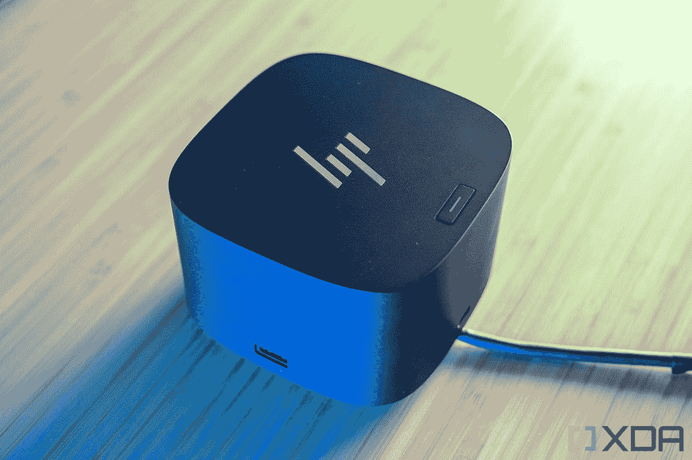
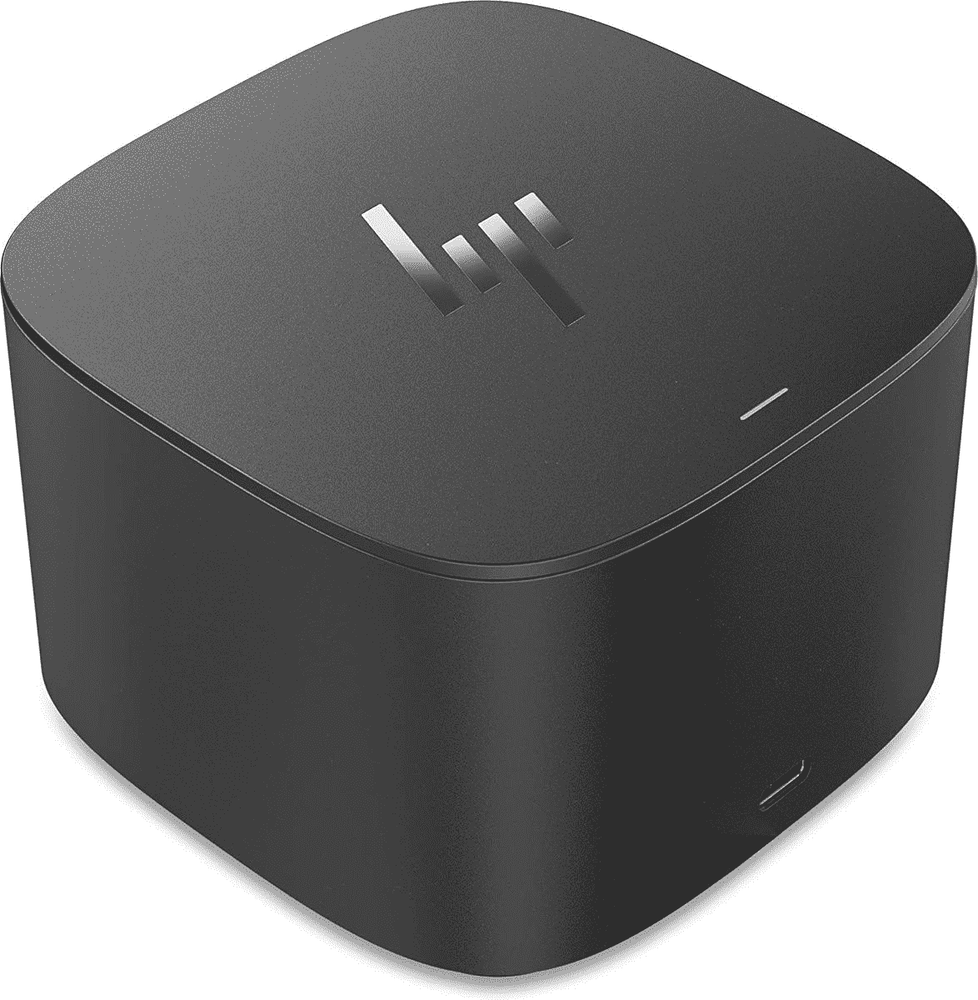

# HP Envy x360 的最佳坞站(2022)

> 原文：<https://www.xda-developers.com/best-docking-stations-for-the-hp-envy-x360-2022/>

# HP Envy x360 的最佳坞站(2022)

借助这些具有 USB-A、以太网、HDMI 等功能的扩展坞，增加 HP Envy x360 上的端口数量。

 <picture></picture> 

HP Thunderbolt Dock G4

关于 [HP Envy x360 (2022)](https://www.xda-developers.com/hp-envy-x360-13-2022-review/) 型号的一大优点是它的端口选择。尽管它是一款纤薄、便携的 2 合 1 设备，具有漂亮的圆角，但惠普设法将 Thunderbolt 4、USB-A 以及 microSD 卡插槽放入了设备的机箱中。同时，15.6 英寸版本增加了一个 HDMI 端口。对于一台不到 1000 美元的二合一来说，这相当令人惊讶，因为大多数[惠普笔记本电脑](https://www.xda-developers.com/best-hp-laptops/)都没有这么好的连接。

不过，我们知道您可能需要更多端口。可能是全尺寸 SD 读卡器？也许你需要一个像 VGA 这样的传统端口？或者，如果您打算将 2 合 1 设备用于流媒体，甚至可以使用以太网端口？为了获得这些额外的端口，你需要一个扩展坞。无论是全尺寸的码头，还是更轻便的码头，我们都在这里为你收集了九个最好的。

*   ##### HP Thunderbolt Dock G4

    你能买到的最好的 Dock

    为什么不为你的 HP Envy x360 买一个由 HP 制造的 Dock 呢？这个 Thunderbolt dock 很贵，但它可以为你的笔记本电脑充电，还可以为你的系统添加额外的 USB-A 端口、DisplayPort、HDMI 端口和以太网端口。它也非常适合设置多台显示器。

    T17
*   <picture></picture>

    惠普迅雷坞 G2 带组合线缆

    ##### 惠普迅雷坞 G2

    这是惠普推出的一款更老更便宜的迅雷坞虽然它提供了与 G4 相同的设计，但该坞站是为雷电 3 笔记本电脑设计的。它还有一个 VGA 端口，而不是 HDMI，但 USB-A 端口较少。

*   <picture></picture>

    惠普 Spectre USB-C 旅行坞

    ##### 惠普 Spectre USB-C 旅行坞

    这与其说是一个坞站，不如说是一个加密狗。它非常经济实惠，适合在旅途中与 Envy x360 一起使用。它有一根可以折叠的电缆，为您提供额外的端口，如 VGA、HDMI、以太网和 USB-a。

*   <picture></picture>

    HP Elitebook ZBook TB3 Thunderbolt Dock 90W

    ##### HP elite book ZBook TB3 Thunderbolt Dock 90W

    虽然这款 200 美元的 Dock 是打算与 HP elite book 配合使用的，但它仍然可以与 Envy x360 配合使用。它也可以为你的笔记本电脑充电，并提供 3 个 USB 3.1 端口，2 个 USB Type-C，2 个 DisplayPort 和一个 VGA 端口。

*   ##### Anker 777 霹雳 4 坞

    Anker 777 霹雳坞你不会错的。这个坞站售价 350 美元，但它与我们清单上的其他坞站不同，因为它是全金属制成的。它将与您羡慕的 x360 的外观相匹配，同时为您提供 HDMI、SD 读卡器、USB-A 和一系列其他端口。

*   <picture></picture>

    Razer Thunderbolt 4 Dock

    ##### Razer Thunderbolt 4 Dock Chroma

    惠普 Envy x360 不是一款游戏笔记本电脑，但如果你真的想为你的办公桌增添情趣，这款 Thunderbolt 4 Dock 可以为你做到。它给你额外的端口，以及昂贵的 RGB 照明。

*   <picture></picture>

    可插拔的雷电 3 坞站

    ##### 可插拔的 14 合 1 雷电 3 坞站

    一个拥有 14 个不同端口的坞站

    顾名思义，这种坞站是为了帮助您将喜爱的配件插入您的电脑而设计的。它有 14 个不同的港口，是我们名单上联系最紧密的码头之一。

*   ##### CalDigit TS4 Thunderbolt 4 Dock

    带有大量端口的桌面 Dock

    如果你想要一个 Thunderbolt 4 Dock 为你的 HP Envy x360 提供尽可能多的端口，那么这就是一个。它提供了 18 个不同的端口，并采用带有许多通风孔的金属外壳，以保持冷却和高效运行。

*   ##### Anker 扩展坞

    Anker 最棒的扩展坞

    Anker 制造了一些最好的 PC 加密狗，而且你也不会对这个扩展坞有任何误解。它的价格为 279 美元，并提供了许多额外的端口，如 USB-A、耳机插孔、SD 读卡器。它甚至可以为您的 HP Envy x360 充电高达 85W 的功率。

我们希望您能找到适合您需求的 HP Envy x360 (2022)坞站。如果你在寻找惠普最好的坞站，你真的不能击败惠普 Thunderbolt Dock G4。不过，还有其他替代产品，尤其是 Anker 777、Anker 扩展坞和 CalDigit TS4。您甚至还可以找到像 HP Spectre USB-C 旅行坞站这样经济实惠的便携式坞站。如果你还没有 HP Envy x360 (2022)的话，你也可以通过下面的链接来看看为什么我们认为它是 2022 年最好的笔记本电脑之一。

*   ##### HP Envy x360 13(2022)

    2022 HP Envy x360 是一款注重便携性的敞篷车，配有英特尔 9W 处理器和大电池，以及 16:10 显示屏，非常适合完成工作。几乎对任何人来说，这都是一款出色的笔记本电脑。

*   ##### 惠普 Envy x360 (2022) 15 英寸(英特尔)

    惠普 Envy x360 的 2022 版本之一尺寸为 15.6 英寸，可选择英特尔 P 系列和 U 系列处理器。还有一个选项是添加英伟达 RTX 20 系列移动 GPU。

    T17
*   ##### 惠普 Envy x360 (2022) 15 英寸(AMD)

    这个版本的 2022 惠普 Envy x360 带有 AMD 锐龙 5000 系列 CPU 的选项。这款 15.6 英寸的机型还有一种黄昏黑色。