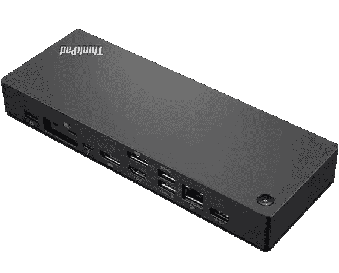

# 联想 ThinkPad X1 Extreme Gen 5 的最佳坞站

> 原文：<https://www.xda-developers.com/best-docking-stations-lenovo-thinkpad-x1-extreme-gen-5/>

如果有一件事[联想 ThinkPad](https://www.xda-developers.com/best-thinkpads/)通常擅长，那就是连接性， [ThinkPad X1 Extreme Gen 5](https://www.xda-developers.com/lenovo-thinkpad-x1-extreme-gen-5-review/) 也不例外。开箱即用，您可以获得相当广泛的各种端口，因此您可以连接所有外围设备，而不需要 USB 集线器或适配器。但即使你有所有这些端口，坞站也有一些优点，因为你可以使用笔记本电脑上的一个端口连接一组外围设备，一气呵成。因此，我们收集了您可以为联想 ThinkPad X1 Extreme Gen 5 购买的最佳坞站。

如果您想知道为什么需要其中一个，那么考虑一下单端口连接的好处是很重要的。假设您在办公室工作，有多台显示器、全尺寸键盘和鼠标，甚至可能有有线互联网连接。如果你把你的笔记本电脑作为设置的核心，这意味着你必须一个接一个地插入这些外围设备，然后当你想离开的时候再把它们拔掉。可能会很乏味。此外，扩展坞可能有额外的端口，如以太网或显示端口。说完了，让我们开始吧。

 <picture></picture> 

Lenovo ThinkPad Workstation Thunderbolt 4 Dock

##### 联想 ThinkPad 工作站雷电 4 坞站

这款 Thunderbolt 4 坞站直接来自联想，提供三种显示输出，USB Type-A、以太网和 Thunderbolt 菊花链。最值得注意的是，它也是为数不多的可以为您的笔记本电脑提供 230 瓦电源的坞站之一。

 <picture></picture> 

CalDigit TS4

##### CalDigit TS4

CalDigit TS4 是最通用的坞站之一。它只有一个常规的 DisplayPort 输出，但它有三个 Thunderbolt 下游端口，多个 USB Type-A 和 Type-C 端口，2.5Gb 以太网，SD 读卡器等等。此外，它采用光滑的金属底盘，手感坚固。

 <picture></picture> 

Plugable Thunderbolt Dock

##### 可插拔雷电坞站

Plugable 的 is 型号是另一个功能丰富的坞站，具有两个 HDMI 和两个 DisplayPort 输出，因此您可以选择适合您显示器的输出。此外，它有六个 USB A 型端口，USB-C 为您的手机充电，以及以太网，所有这些都比大多数价格更合理。

 <picture></picture> 

Anker 777 Thunderbolt 4 Dock

##### Anker 777 雷电坞

这款 Anker 扩展坞非常适合联想 Thinkpad X1 Extreme，具有两个 HDMI 输出、四个 USB Type-A 端口、以太网、一个下游 Thunderbolt 连接等等，所有这些都包裹在一个坚固的金属机箱中。

 <picture></picture> 

SIIG Thunderbolt 3 docking station

##### SIIG 雷电 3 坞站

如果你想要更便宜的东西，这个来自 SIIG 的坞站价格明显更低，而且它仍然有稳定的端口供应，包括两个 DisplayPort 输出，三个 USB Type-A 端口和以太网。不过，它只能为你的笔记本电脑提供 60W 的电力，所以你仍然需要一个单独的充电器。

 <picture></picture> 

CalDigit Element Hub

##### CalDigit 元素集线器

乍一看，CalDigit Element Hub 并不是最通用的坞站，但是如果您有一些 Thunderbolt 外设，这里提供的三个下游端口可能就是您所需要的。此外，它还有四个 USB 型端口，可连接更多标准外设。这种设置使它比大多数 Thunderbolt 坞站更小、更便宜。

 <picture></picture> 

Lenovo ThinkPad Universal Docking Station

##### 联想 ThinkPad 通用扩展坞

如果你不需要 Thunderbolt dock 可以提供的全部带宽，这款联想官方 dock 是一款多功能但更实惠的选择。它有三个显示输出选项，五个 USB Type-A 端口，USB-C，以太网，它可以通过 USB-C 为您的笔记本电脑提供 90W 的功率，或通过专有适配器提供 135W 的功率。

 <picture></picture> 

DockCase Visual Smart Hub 9-in-1

##### DockCase 视觉智能中枢 9 合 1

USB 集线器需要屏幕吗？也许不能，但这一款确实能让你看到你连接的设备正在使用什么样的带宽，包括显示器分辨率和刷新率，以及有多少功率通过笔记本电脑。它也足够小，可以带到任何地方，而且价格也很合理。

 <picture></picture> 

Lenovo USB-C Mini Dock

##### 联想 USB-C 迷你坞站

想要几个可以随身携带的额外端口吗？这个来自联想的官方 USB-C 集线器有几个额外的端口，包括以太网和 VGA，这些都是 ThinkPad X1 Extreme 中没有的。它比大多数第三方产品都贵一点，但你可以放心，因为它是由联想自己制造的。此外，它还有一个小设计，你可以把它放进任何包里。

这些是联想 ThinkPad X1 Extreme Gen 5 的最佳坞站。如果你负担得起，官方的 ThinkPad 工作站坞站是一个不错的选择，因为如果你有顶级配置，它可能是唯一一个可以提供 ThinkPad X1 Extreme 所需的 230W 总功率的坞站。如果你不需要充电功能，Anker 777 是另一个很好的选择，它的价格提供了很多价值。

如果你还没有，你可以使用下面的链接购买联想 ThinkPad X1 Extreme Gen 5。如果商务笔记本电脑不是你的风格，你可能想看看[最好的联想笔记本电脑](https://www.xda-developers.com/best-lenovo-laptops/)，看看该公司还能提供什么。如果联想没有您想要的产品，我们也有一个[最佳笔记本电脑](https://www.xda-developers.com/best-laptops/)的列表。

 <picture></picture> 

Lenovo ThinkPad X1 Extreme Gen 5

##### 联想 ThinkPad X1 Extreme Gen 5

联想 ThinkPad X1 Extreme Gen 5 是一款功能强大的商用笔记本电脑，采用英特尔 H 系列处理器和英伟达 RTX 显卡。它还有大量外设端口，包括 Thunderbolt 4。