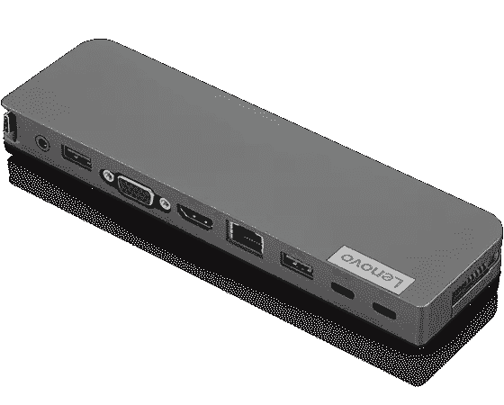
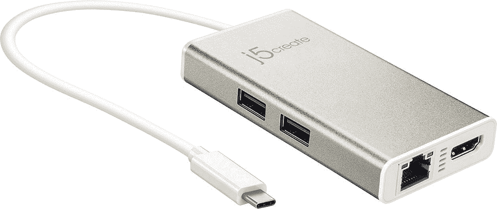

# 联想 Yoga 6 的最佳坞站(2023)

> 原文：<https://www.xda-developers.com/best-docking-stations-lenovo-yoga-6-2023/>

对于精打细算的买家来说，[联想 Yoga 6](https://www.xda-developers.com/lenovo-yoga-6-2023/) 是我们[最喜欢的笔记本电脑](https://www.xda-developers.com/best-laptops/)之一，2023 年，联想用新的 AMD 锐龙 7030 系列处理器更新了它。除了性能提高之外，这款新机型与前代几乎相同，但考虑到它已经是一款很棒的机器，这并不是一件坏事。虽然它很棒，但是如果你想为你的办公室创建一个多功能的工作站，你会想要一些外围设备，而坞站是连接它们的最简单的方法。

需要明确的是，联想 Yoga 6 已经配备了非常可靠的端口设置，提供了两个 USB-C 端口，两个 USB Type-A 端口，HDMI 和一个 microSD 读卡器。但是坞站仍然可以给你更多，最重要的是，它们允许你使用一根电缆将所有外围设备连接到你的计算机，因此当你需要时，可以更容易地一次连接或移除所有东西。如果你正在寻找一个新的坞站来搭配 2023 年的联想 Yoga 6，这里有一些很好的选择:

*   ##### plug able UD-ULTC4K

    plug able 制造了一些业内最好的扩展坞，这款机型的独特之处在于它最多支持三个 4K 显示器(您可以选择 HDMI 或 DisplayPort)，甚至没有 Thunderbolt。它使用专门的驱动程序来实现这一点，此外它还有许多 USB 端口、以太网和 SD 读卡器。

*   ##### Kensington 三显示器 USB-C 扩展坞 SD4839P

    这是另一个三显示器扩展坞，但它不使用特殊的驱动程序，在分辨率方面有点受限，支持三个 1080p 显示器。对于 Yoga 6 这样的笔记本电脑来说，这已经足够好了，再加上以太网和一些额外的 USB 端口。

*   <picture></picture>

    Baseus 17-in-1 坞站

    ##### Baseus 17-in-1 坞站

    如果你想要很多端口，你不可能比这款 Baseus 坞站做得更好了，它具有 5 个 USB-A 端口、2 个 USB-C 端口、以太网端口、3 个 HDMI 端口，并且两者都有它非常适合桌面设置，甚至支持高达 100W 的直通充电。

*   ##### 联想 ThinkPad 通用 Thunderbolt 4 坞站

    这款来自联想的 Thunderbolt 坞站由于其 40Gbps 的带宽而非常通用，它支持多个 4K 显示器、千兆以太网和多个 USB 外设。Yoga 6 使用 AMD 处理器，因此它无法支持所有这些功能，但如果你想让自己适应未来，这是一个不错的选择。

*   ##### Anker 556 USB-C Hub

    Anker 556 是另一个非常强大的扩展坞，但它没有使用 Thunderbolt 4，而是使用了 USB4，这一点非常相似。它带有两个显示输出，以太网，多个 USB 端口，并支持 100W 充电。Yoga 6 不能完全支持 USB4，但同样，这将让你更适应未来。

    T17
*   <picture></picture>

    联想 USB-C Mini Dock

    ##### 联想 USB-C Mini Dock

    如果你想从联想得到更便宜的东西，这款 USB-C Mini Dock 是另一个很好的选择。它有几个 USB 端口，以太网，HDMI，甚至 VGA，如果你在紧要关头插入旧显示器或投影仪，这可能是有用的。它还支持高达 45W 的直通充电。

*   ##### Anker 655 8 合 1 USB-C Hub

    Anker 还凭借 655 在该榜单上获得了第二名，这是一款外观独特的坞站，它提供了显示输出、以太网、USB 端口以及 SD 和 microSD 读卡器，可用于从相机导入照片。它还支持高达 85W 的直通充电。

*   <picture></picture>

    j5 create USB Type-C Hub

    ##### j5create USB-C Hub

    并不是每个人都需要大量的端口，j5 create USB-C Hub 反而专注于通过额外的 HDMI 端口为第二(或第三)显示器添加一些真正的价值它还有两个 USB 型端口。

    T34
*   ##### Hiearcool 7 合 1 USB-C hub

    但是如果你真正追求的是价值，这款 USB-C hub 可能是最适合你的。它的价格不到 30 美元，但它有七个端口，包括 HDMI、读卡器和 USB 端口。它甚至支持直通充电，并有几种颜色可供选择，以适应不同的口味。

这就是我们为联想 Yoga 6 (2023)推荐的所有坞站，尽管所有相同的描述也适用于 2022 型号。Thunderbolt 4 和 USB4 扩展坞是一项更大的投资(尤其是前者)，但它们可能是值得的，因为有一个强大的外围设备生态系统支持它，如果你将来有一个支持 Thunderbolt 的设备，你将能够充分利用这些坞站。除此之外，我个人推荐的是可插拔的 UD-ULTC4K，这要归功于它拥有的所有端口和对多达三个 4K 显示器的支持。

至于 Yoga 6 本身，2023 款尚未上市，计划于 4 月推出。如果你等不起，Yoga 6 的 [2022 型号仍然是你能买到的](https://www.xda-developers.com/lenovo-yoga-6-gen-7-review/)[最好的廉价笔记本电脑](https://www.xda-developers.com/best-cheap-laptops/)之一，也是[联想最好的笔记本电脑](https://www.xda-developers.com/best-lenovo-laptops/)之一。