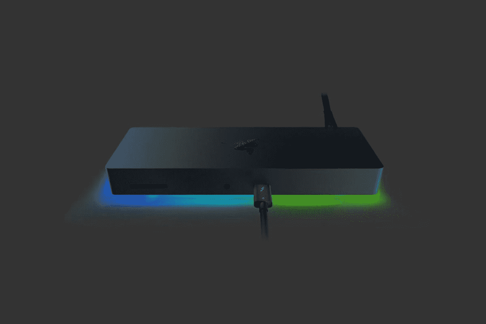
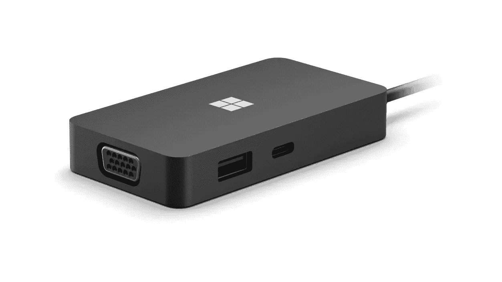

# 2023 年 Surface Studio 2 Plus 最佳扩展坞

> 原文：<https://www.xda-developers.com/best-docking-stations-surface-studio-2-plus/>

# 2023 年 Surface Studio 2 Plus 最佳扩展坞

您的一体机有很多端口可供选择，但如果您需要更多端口，您可以查看坞站和集线器。

 <picture></picture> 

Razer Thunderbolt 4 Dock Chroma

与去年的 Surface Studio 2 相比， [Surface Studio 2 Plus](https://www.xda-developers.com/surface-studio-2-plus/) 的一个巨大改进是连接性。它进行了更现代的升级，现在具有 Thunderbolt 4 端口、两个 USB-A 3.1 端口、一个 3.5 毫米耳机插孔和一个千兆以太网端口。

与一些[最好的 Surface PC](https://www.xda-developers.com/best-microsoft-surface-pcs/)相比，这是一个很好的端口选择，这是有意义的，因为这是一台 4000 美元的一体机。但是，如果您想要更多端口，您可以通过扩展坞增加额外的连接，以获得 SD 卡插槽或 HDMI 端口，从而以菊花链形式连接更多显示器。我们在这里为你收集了一些我们最喜欢的。

*   <picture></picture>

    雷蛇迅雷 4 Dock

    ##### 雷蛇迅雷 4 Dock Chroma

    如果你想要一个适合你的 Surface Studio 2 Plus 的花式 Dock，那么这款就是你要的。它具有 RGB 照明，并且能够将端口扩展到 USB-A 和 USB-C。请记住，它没有 HDMI 或显示端口。

*   <picture></picture>

    Baseus 17 合 1 USB-C 扩展坞

    ##### Baseus 17 合 1 USB-C 扩展坞

    需要最可能的端口与你的 Surface Studio 2 Plus？这款 Baseus 坞站将增加 17 个额外端口，包括用于连接更多显示器的 HDMI 端口，以提高工作效率。

*   ##### Anker 777 Thunderbolt 4 Dock

    这款 Anker Thunderbolt 4 dock 是我们名单上比较超值的选项之一。它为你提供了额外的端口，包括两个 HDMI、USB Type-A、以太网和下游 Thunderbolt，但它也可以与你的 Surface Studio 2 Plus 的铝制表面相匹配。

*   <picture></picture>

    Anker power expand 13 合 1 USB 扩展坞

    ##### Anker power expand 13 合 1 USB 扩展坞

    这款扩展坞可为您的 Surface Studio 2 Plus 提供多达 13 个不同的端口。除了额外的 USB-A 端口和 3.5 毫米耳机插孔外，您还将获得 micro SD 读卡器和 SD 读卡器。

*   <picture></picture>

    Surface USB-C 旅行集线器

    ##### 微软 Surface USB-C 旅行集线器

    如果你正在为你的微软 PC 寻找一个 USB-C 集线器，为什么不买一个微软制造的呢？这个 Surface 品牌的集线器为您的 Surface Studio 2 Plus 添加了 USB Type-C、USB Type-A 端口、HDMI 和 VGA。

*   ##### Anker PowerExpand+ 7 合 1 USB-C Hub

    这个 USB-C 坞站是比较基本的选项之一，但是如果你不需要一吨额外的端口，它就很棒了。除了额外的 USB-A 端口外，它还将为 Surface Studio Plus 2 添加 SD 读卡器和 microSD 读卡器。它还有一根长电缆，可以帮助你确保它可以很好地放在你的桌子上。

*   ##### Belkin 6 合 1 USB Hub

    这个 USB dock 是另一个简单的选项，有六个端口。它将通过 USB-A 端口、耳机插孔、HDMI、microSD 和 SD 读卡器来增强你的 Surface Studio 2 Plus。

    T17
*   ##### CalDigit TS4 Thunderbolt 4 Dock

    这是 Surface Studio 2 Plus 的又一个 Thunderbolt hub。它共有 18 个端口，包括 Thunderbolt 下游端口、DisplayPort、USB-C、USB-A 和超快速 2.5Gb 以太网。它还具有坚固的金属结构，这有助于它感觉优质和耐用。

*   ##### CalDigit Element Hub

    既然 Surface Studio、2 Plus 都有迅雷端口，可以用一个迅雷 dock 这样的。它为您提供了多达四个额外的 USB-A 端口，可用于连接额外的显示器。

    T37

暂时就这样了。Surface Studio 2 Plus 的这九个伟大的扩展坞将为您提供所需的端口数量。我们强烈建议从 Baseus 以及 Anker，因为这些给你最可能的港口。但如果你预算有限，像 Anker PowerExpand+7，Belkin 6 合 1 USB Hub，甚至微软 Surface USB-C Travel Hub 这样简单的 USB-C hub 都没什么问题。我们所有的建议都为您的新 Surface 增加了大量的额外端口。

Surface Studio 2 Plus 是一款一体化电脑，配备第 11 代英特尔酷睿 i7 处理器和 Nvidia GeForce RTX 显卡。它有一个分辨率非常高的 28 英寸 PixelSense 显示屏，支持触摸和笔输入。