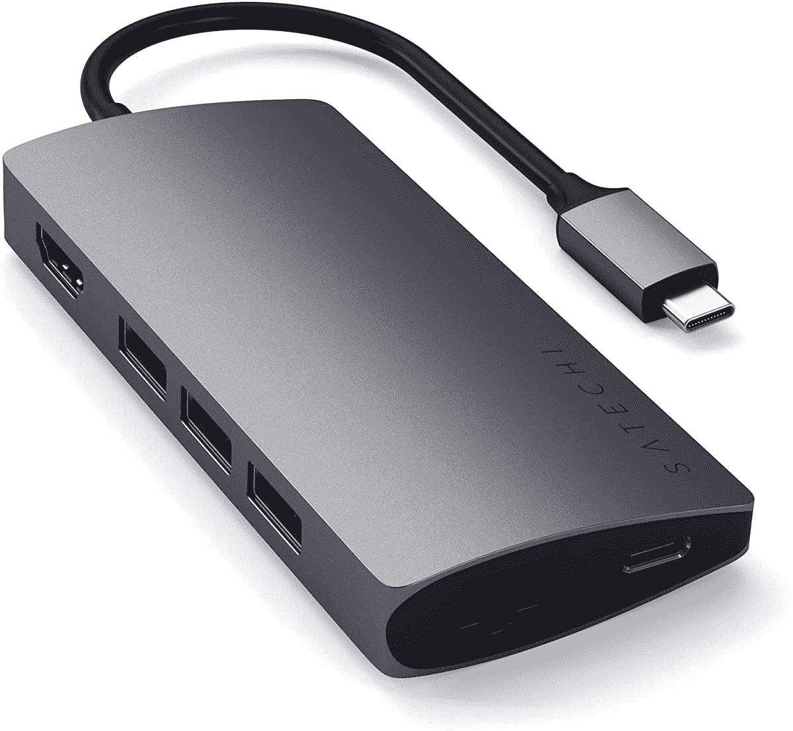

# 2023 年惠普精英蜻蜓 G3 的最佳坞站

> 原文：<https://www.xda-developers.com/best-docks-hp-elite-dragonfly-g3/>

好的商用笔记本电脑有几个特点。他们通常运行 Windows 11 的专业版，他们通常有相当程度的可修复性，并提供大量的连接选项。但是当这些连接选项不够用时，您总是可以使用坞站和适配器来添加更多端口。在这篇文章中，我们来看看你能为[惠普精英蜻蜓 G3](https://www.xda-developers.com/hp-elite-dragonfly-g3-review/) 找到的最好的坞站。

需要说明的是，这款笔记本电脑开箱后就有稳定的端口供应。两个 Thunderbolt 4 端口、一个 USB Type-A 端口、HDMI 和一个耳机插孔是 13 英寸笔记本电脑的绝佳选择。但是，您可以随时获得更多，尤其是如果您想要连接一个大型办公系统。 [Thunderbolt 坞站](https://www.xda-developers.com/best-thunderbolt-docks/)是为你的笔记本电脑增加一些高速连接的最佳方式，但如果你不需要 Thunderbolt，也有一些更实惠的选择。如果您想要扩展 HP Elite 蜻蜓 G3 的端口，我们已经收集了两种类型的坞站。

*   <picture></picture>

    Belkin Thunderbolt 4 Dock Pro

    ##### Belkin Connect Pro Thunderbolt 4 Dock

    Belkin Connect Pro Thunderbolt 4 Dock 是周围比较贵的坞之一，但是很有能力。它有两个 HDMI 端口、四个 USB Type-A 端口、一个 USB Type-C 端口、千兆以太网、一个 SD 读卡器和 Thunderbolt 菊花链支持。它还为您的笔记本电脑提供高达 90W 的功率，看起来时尚而现代。

*   <picture></picture>

    CalDigit TS3 Plus

    ##### CalDigit TS3 Plus 雷电 3 Dock

    CalDigit TS3 Plus 是这个名单上看起来最坚固的坞站之一，但它也非常独特。它有五个 USB 型端口、DisplayPort、Thunderbolt 菊花链等等。然而，它的独特之处在于，它甚至包括 S/PDIF 光学音频，以及独立的耳机和麦克风插孔。它可以为您的笔记本电脑提供高达 87W 的功率。

*   <picture></picture>

    Anker power expand 5-in-1 Thunderbolt 4 Mini Dock

    ##### Anker power expand 5-in-1 Thunderbolt 4 Mini Dock

    如果您想要连接更多 Thunderbolt 设备，那么您很幸运。这个 Anker dock 给你三个 Thunderbolt 4 下行端口和一个 USB Type-A 端口。它很小，可以给你的笔记本电脑充电，最高 85W。

*   <picture></picture>

    可插拔 14 合 1 雷电 3 坞站

    ##### 可插拔 14 合 1 雷电 3 坞站

    这款可插拔坞站是你在任何地方都能找到的最佳之一。它有六个 USB Type-A 端口、两个 HDMI 和两个 DisplayPort 连接、千兆以太网和 SD 读卡器。此外，它能以高达 96W 的功率为您的笔记本电脑充电。

*   <picture></picture>

    雷蛇迅雷 4 坞站

    ##### 雷蛇迅雷 4 坞站

    水银白色的雷蛇迅雷 4 坞站是任何笔记本电脑的绝佳搭配。它有三个 Thunderbolt 4 下游端口、三个 USB Type-A 端口、千兆以太网接口和一个 SD 读卡器。水银白款没有 RGB，看起来更干净。

*   <picture></picture>

    可插拔扩展坞

    ##### 可插拔 USB 3.0 通用笔记本扩展坞

    几乎任何一款 Thunderbolt 扩展坞都要花费 200 多美元，所以如果你想要一款更实惠的办公桌，这款就是了。它有六个 USB Type-A 端口、HDMI、DVI、以太网，以及独立的耳机和麦克风插孔。不过，它不会给你的笔记本电脑充电。

*   <picture></picture>

    Satechi 多端口适配器 V2

    ##### sate chi 多端口适配器 V2

    如果你想要一个仍然便携的高端 USB-C 集线器，这款 sate chi 型号就是为你准备的。它有三个 USB Type-A 端口、HDMI、以太网、microSD 和全尺寸 SD 读卡器，以及高达 60W 的直通充电，因此您可以为您的笔记本电脑充电。

*   <picture></picture>

    Anker power expand 11-in-1

    ##### Anker power expand 11-in-1 USB-C Hub

    如果你想要一个便携但功能非常强大的 Hub，Anker 的这款就是给你的。它有三个 USB Type-A 端口、HDMI、DisplayPort、以太网、SD 读卡器等，所有这些都在一个非常紧凑的设计中。它甚至支持为您的笔记本电脑充电高达 85W。

这些都是很好的选择，应该可以满足大多数用户的需求。每个人都想要不同的东西，所以我们不能告诉你哪个适合你。如果我是为自己购买，Anker PowerExpand 11 合 1 USB-C 坞站可能会是我的选择，因为它是功能和价格的完美平衡。当然，那是因为我其实并不需要迅雷的超高速。

无论如何，HP Elite 蜻蜓 G3 已经提供了大量现成的端口。除了物理端口之外，您还可以将其配置为支持 4G LTE 或 5G 连接，因此对于像这款笔记本电脑这样小巧轻便的笔记本电脑，您可以获得大量选项。如果你想购买惠普精英蜻蜓 G3，你可以使用下面的链接。否则，你可以看看你现在能买到的最好的惠普笔记本电脑。

 <picture></picture> 

HP Elite Dragonfly G3

##### 惠普精英蜻蜓 G3

惠普 Elite 蜻蜓 G3 是惠普最高端的商用笔记本电脑，采用第 12 代英特尔处理器、3:2 显示屏和轻量级设计，仍然适合稳定的端口供应。