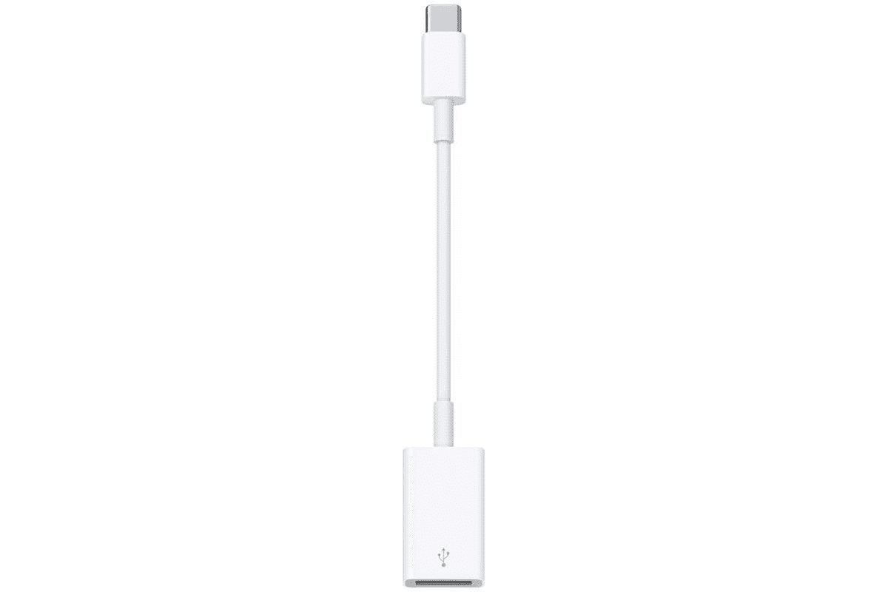
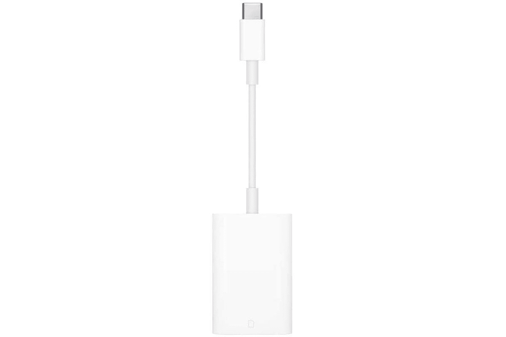
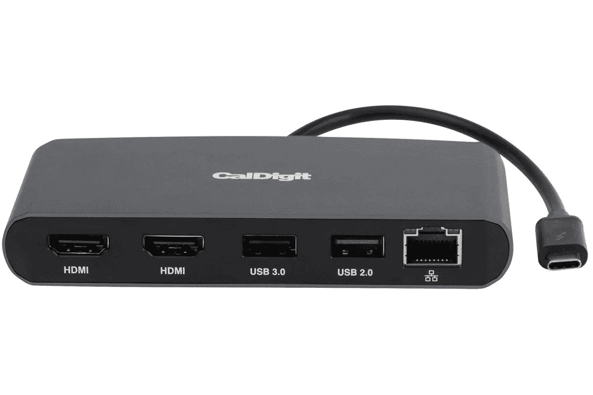
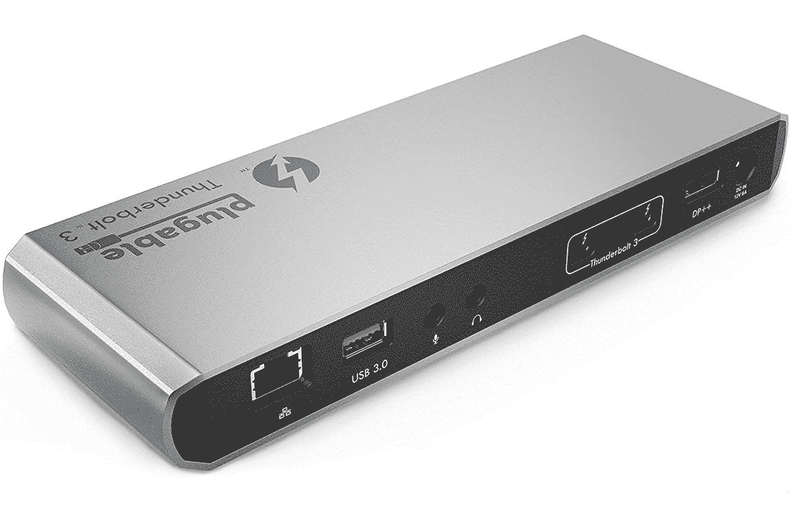
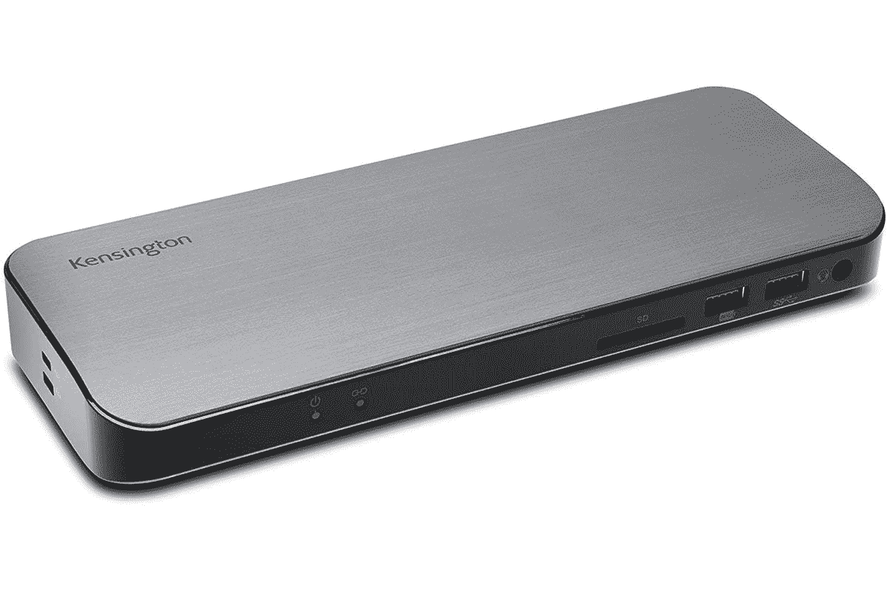
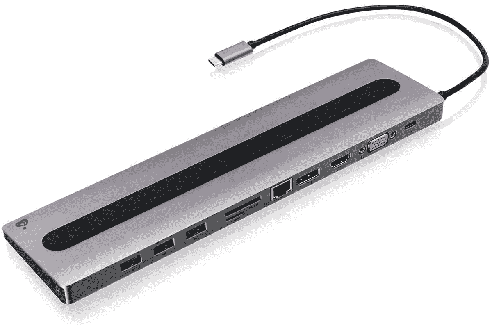
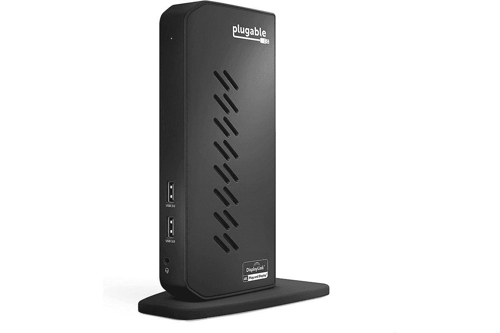

# M1 苹果 iMac 的最佳坞站和加密狗(2021 年)

> 原文：<https://www.xda-developers.com/best-docks-m1-imac/>

苹果早在 2021 年就推出了 M1 驱动的 iMac。在此之前，苹果芯片仅限于 MacBook Pro、MacBook Air 和 Mac Mini。像许多最近的[苹果电脑](http://xda-developers.com/best-macs)一样，这台 iMac 只有 USB Type-C 端口。这意味着你可能需要一些加密狗和接口来充分利用你的 iMac。

苹果的 M1 缺少一些你会在英特尔产品上发现的关键功能，比如多显示器支持和外部 GPU 支持。一开始，这就剥夺了 Thunderbolt 的许多优势。由于这是一台台式机，您甚至不必担心电力输送。24 英寸 iMac 配有两个雷电 3 / USB 4 端口，支持高达 40Gbps 的速度、HDMI、DVI、VGA、DisplayPort 等。如果你得到更高端的型号，有两个额外的 USB 3.2 Gen 2 Type-C 端口，这对 5Gbps 的速度很好。

我们可以将它分为加密狗、 [Thunderbolt 坞站](https://www.xda-developers.com/best-thunderbolt-docks/)和非 Thunderbolt USB Type-C 坞站。对于大多数用户来说，这款设备的 Thunderbolt 和普通 USB Type-C 坞站没有太大区别，因为你[不能使用双外部显示器](https://www.xda-developers.com/use-external-monitor-with-m1-imac/)或外部 GPU。不过，你可能需要 Thunderbolt 来获得额外的带宽，或者如果你身边有另一个 Thunderbolt 设备。

## 苹果 M1 24 英寸 iMac 的加密狗

*   <picture></picture>

    苹果 MJ1M2AM/A USB-C 转 USB 适配器

    ##### 苹果 USB-C 转 USB-A 适配器

    这是一种将 USB Type-C 端口变成 USB Type-A 端口的快速而廉价的方法。如果你在寻找简单的东西，这就是。

*   <picture></picture>

    苹果 USB-C 转 SD 读卡器

    ##### 苹果 USB-C 转 SD 读卡器

    USB-C 转 SD 读卡器以 UHS-II 的速度将高分辨率照片和视频传输到你的 Mac 或 iPad Pro 上。

## Thunderbolt 与苹果 M1 的 24 英寸 iMac 对接

*   <picture></picture>

    CalDigit 雷电 3 迷你坞站

    ##### CalDigit 雷电 3 迷你坞站

    这是一个迷你坞站，所以它很小，并且它带有两个 HDMI 2.0 端口、两个 USB Type-A 端口和千兆以太网。这个没有动力输出。

*   <picture></picture>

    海盗船 TBT100 雷电 3 坞

    ##### 海盗船 TBT100 雷电 3 坞

    如果你喜欢海盗船，这款适合你。它有两个 USB 3.2 Gen 2 Type-C 端口，两个 USB 3.2 Gen 1 Type-A 端口，千兆以太网，双 HDMI 2.0 端口，雷电 3，一个 Kensington 锁，一个 SD 读卡器和一个 3.5 毫米音频插孔。它提供 85 瓦的功率输出。

*   <picture></picture>

    可插拔的 14 合 1 雷电 3 坞

    ##### 可插拔的 14 合 1 雷电 3 坞

    可插拔的一些坞站的评级最高。这款配备了 14 个端口，包括两个 HDMI、两个 DisplayPort、五个 USB 3.2 Gen 1 Type-A、一个 USB 3.2 Gen 2 Type-C、一个 USB 3.2 Gen 2 Type-A、千兆以太网、3.5 毫米音频输入/输出和 SD 读卡器。

*   <picture></picture>

    可插拔的雷电 3 坞

    ##### 可插拔的 14 合 1 雷电 3 坞

    小一点，便宜一点。这款配备了两个雷电 3 端口、一个 USB 3.2 Gen 1 Type-C 端口、两个 USB 3.2 Gen 1 Type-A 端口、DisplayPort、千兆以太网和 3.5 毫米音频输入和输出端口。它没有动力输出。

*   <picture></picture>

    肯辛顿雷电 3 扩展坞

    ##### 肯辛顿 SD5300T Thunderbolt 4 扩展坞

    这款肯辛顿解决方案显然有一个肯辛顿锁端口，但它也有五个 USB 3.2 Gen 1 Type-A 端口、两个雷电 3 端口、HDMI 2.0、3

## 非 Thunderbolt USB Type-C 坞站，适用于带苹果 M1 的 24 英寸 iMac

*   <picture></picture>

    io gear Dock Pro 100 USB-C 4K 超薄工作站

    ##### io gear Dock Pro 100 USB-C 4K 超薄工作站

    IOGear 的解决方案有三个 USB 3.2 Gen 1 Type-A 端口、一个 SD 卡插槽、HDMI、DisplayPort、VGA 和

*   <picture></picture>

    可插拔的 UD-3900h

    ##### 可插拔的 USB 3.0 通用笔记本电脑扩展坞

    这款机型带有六个 USB Type-A 端口，其中两个是 USB 3.2 Gen 1，四个是 USB 2.0。你可以用后者来做简单的事情，比如键盘和鼠标。还有 HDMI、DVI 和以太网。它配有 USB Type-C 和 USB Type-A 适配器，因此您可以将其用于各种设备。

*   <picture></picture>

    可插拔 USB-C 扩展坞

    ##### 可插拔 14 合 1 雷电 3 扩展坞

    这款比上面可插拔的那款贵一点，但它有六个 USB 3.2 Gen 1 Type-A 端口。它还具有双显示端口和 HDMI 端口，尽管每种端口只能使用一个。它也有千兆以太网。

* * *

在决定购买哪一款时，需要记住的关键一点是，苹果 M1 不支持多个外部显示器，不支持外部 GPU，也不会利用功率传输。这意味着在为您的 iMac 选择 dock 时，您真正需要的只是端口。

然而，坞站是即插即用的解决方案。您可以轻松地断开与 24 英寸 iMac 的连接，并连接您可能正在使用的笔记本电脑。如果这是一台基于英特尔的笔记本电脑，你肯定可以用 Thunderbolt 做更多的事情，如果有一个合适的 [Thunderbolt dock](https://www.xda-developers.com/best-thunderbolt-docks/) 你会更好。如果你在寻找除基座之外的 iMac 配件，一定要看看我们关于[最佳键盘](https://www.xda-developers.com/best-keyboards-m1-apple-imac/)和[最佳鼠标和触控板](https://www.xda-developers.com/best-keyboards-m1-apple-imac/)的指南。

 <picture></picture> 

24-inch iMac with 4.5K display

##### 苹果 iMac (2021 年)

苹果的 2021 一体机拥有 4.5K 显示屏，M1 芯片组，并有漂亮的颜色。

*您会为您的 iMac 购买以下哪些坞站？请在下面的评论区告诉我们。*