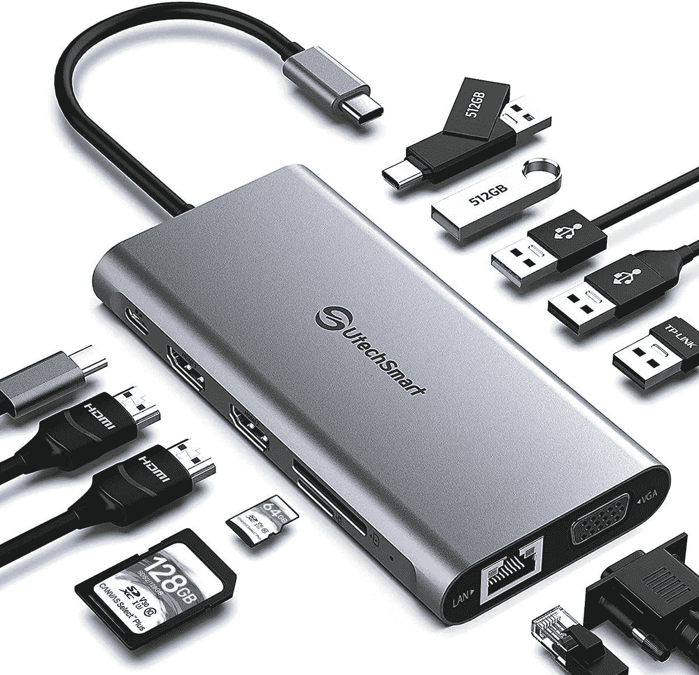
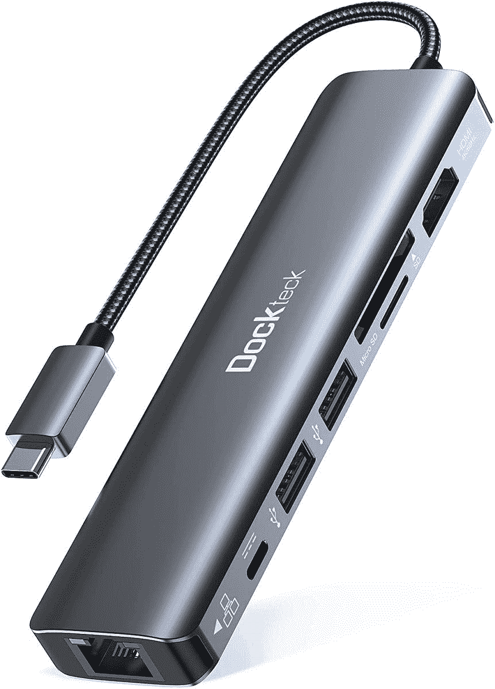
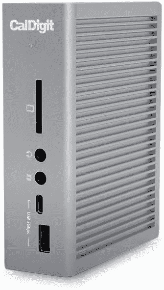

# Mac 工作室的最佳坞站

> 原文：<https://www.xda-developers.com/best-docks-mac-studio/>

# Mac 工作室的最佳坞站

苹果终于发布了全新的 Mac Studio。这里列出了你能为这台台式电脑买到的最好的坞站。

苹果公司在 Peek 表演活动中展示了 Mac 工作室。它宣布了这款电脑以及 iPhone SE 3 (2022)和 iPad Air 5 (2022)。除了这些设备，该公司还为 M1 家族引入了一种新的芯片——M1 超。目前，它只适用于 Mac Studio 的某些变体，但我们也可以看到它将出现在一些未来的 Mac 上。这家库比蒂诺的科技巨头一直在慢慢地从英特尔芯片过渡到自己的 SoC。因此，如果你[购买一台 Mac](https://www.xda-developers.com/best-macs/) ，它很可能会包含一个 M1 处理器——因为大多数产品系列都已经过渡了。开发者也在为苹果芯片优化他们的[应用，以在 macOS Big Sur 和](https://www.xda-developers.com/best-apps-apple-silicon/) [macOS Monterey](https://www.xda-developers.com/macos-monterey) 上提供更好的性能。Mac Studio 有很多端口。然而，一些超级用户需要更多。以下是 Mac 工作室可用的最佳坞站。

*   <picture></picture>

    UtechSmart 坞站

    ##### UtechSmart 12 合 1 USB-C 坞站

    这款来自 UtechSmart 的 12 合 1 坞站包括 1 个 4K HDMI 1、1 个 HDMI 2、1 个 VGA、2 个 USB 3.0、2 个 USB 2.0、1 个 RJ45 千兆位

*   <picture></picture>

    Anker USB C Hub

    ##### Anker 341 7 合 1 USB C Hub

    这款来自 Anker 的 7 合 1 hub 包括 4K@30Hz HDMI、SD 卡连接、USB-A / USB-C 数据端口，以及高速直通充电它具有紧凑的外形和简约的设计，是任何办公桌的绝佳选择。

*   <picture></picture>

    可插拔坞站

    ##### 可插拔 11 合 1 雷电 3 坞站

    这款 11 合 1 坞站包括 1 个 HDMI 端口、1 个 HDMI/VGA/DVI 端口、1 条混合 2 合 1 USB-A 或 USB-C 电缆、2 个 USB 3.0、4 个

*   <picture></picture>

    Dockteck USB C Hub

    ##### Dockteck 7 合 1 USB C Hub

    这款来自 Dockteck 的 7 合 1 USB C Hub 包括 1 个 4K@60Hz HDMI 输出端口、1 个 100W PD 充电端口、1 个 1Gbps RJ45 以太网端口、1 个 SD 卡

*   <picture></picture>

    CalDigit TS3 Plus Dock

    ##### CalDigit TS3 Plus 雷电 3 Dock

    这款 15 合 1 dock 拥有 2 个雷电 3 40Gb/s、DisplayPort 1.2、5x USB-A & 1 个 USB-C 3.1 Gen 1、1 个 USB-C 3.1 Gen2

* * *

Mac Studio 已经有了各种各样的端口。然而，有时人们需要更多，尤其是那些工作流程不依赖无线解决方案的人。坞站提供了一种方便的方式来充分利用您强大的计算机。把 Mac 想象成一个失去四肢的强大实体。当你连接一个码头，你只能更好地利用其无与伦比的力量。

就个人而言，如果我必须为我的 Mac 工作室购买一个这样的坞站，我会选择 [Anker 坞站](https://www.amazon.com/Anker-Docking-PowerExpand-Charging-Ethernet/dp/B088F7SY6S/?tag=xda-7aop198-20&ascsubtag=UUxdaUeUpU40544&asc_refurl=https%3A%2F%2Fwww.xda-developers.com%2Fbest-docks-mac-studio%2F&asc_campaign=Short-Term)。这是因为它提供了更多种类的端口，使您不太可能需要其他加密狗或码头。在我看来，这是终极的 Mac Studio dock。更不用说它是由 Anker 公司生产的，这是一家非常有声誉的公司。

 <picture></picture> 

Apple Mac Studio

##### 苹果 Mac 工作室

Mac Studio 由苹果 M1 Max 或全新的 M1 Ultra 芯片驱动。它只有银色可选，起价 1999 美元。

*你会为你的新 Mac 工作室购买哪种坞站？请在下面的评论区告诉我们。*