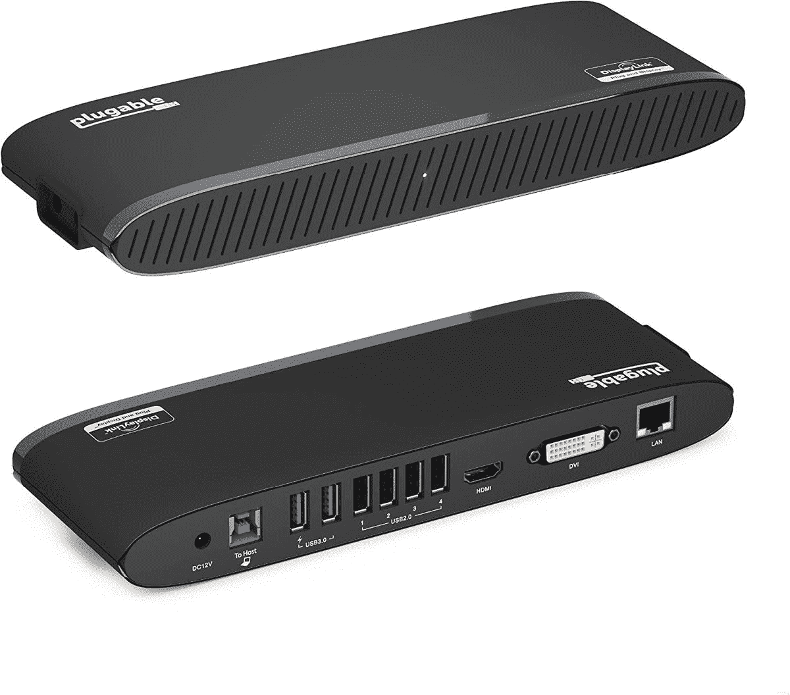
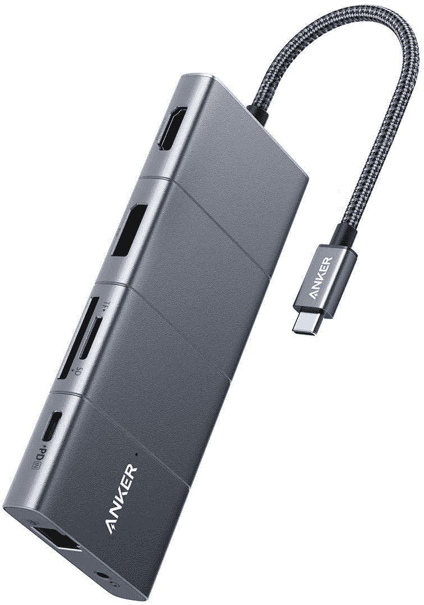
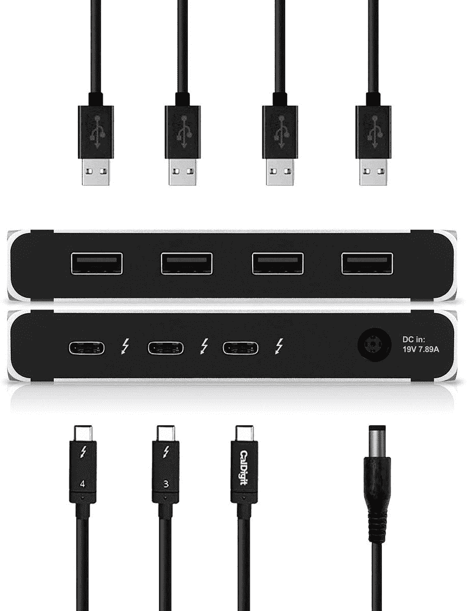
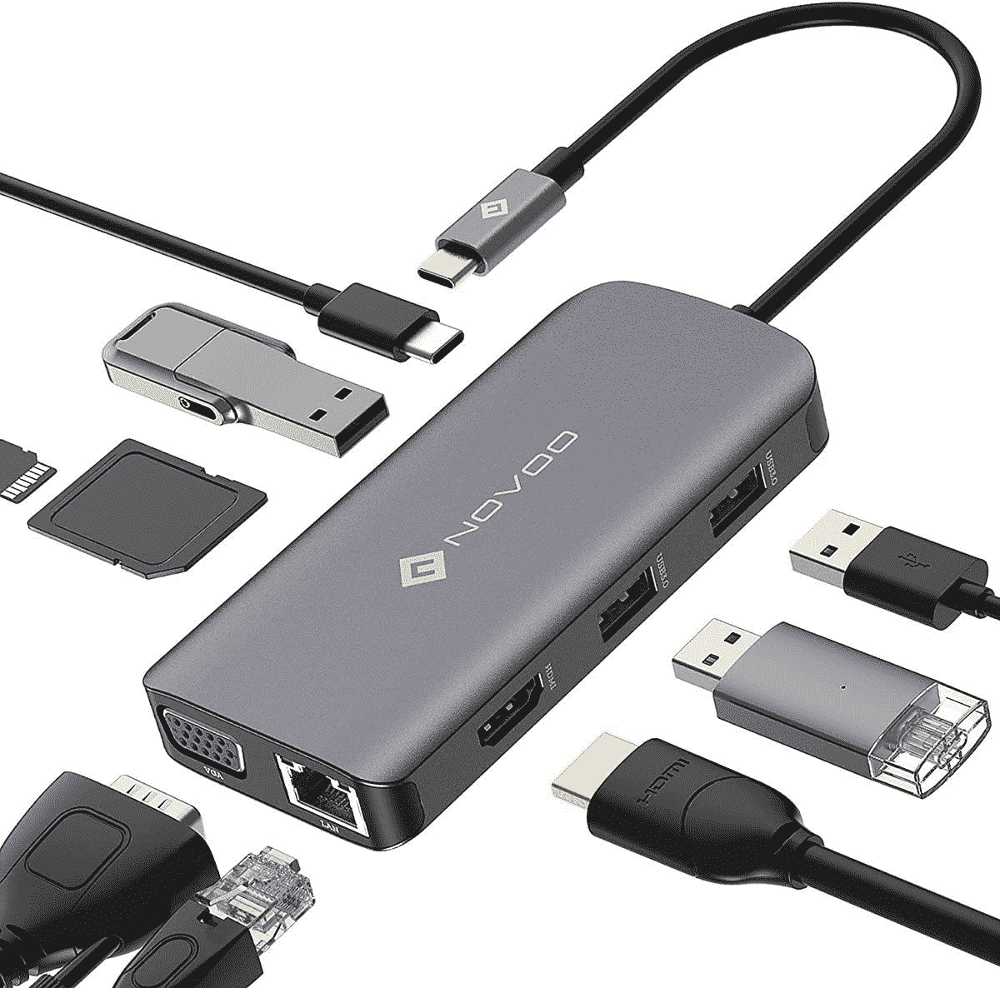

# 苹果 MacBook Pro 13 的最佳坞站(2022)

> 原文：<https://www.xda-developers.com/best-docks-macbook-pro-13-2022/>

# 苹果 MacBook Pro 13 的最佳坞站(2022)

在这里，你可以找到一个最好的坞站列表，现在可以为你的全新 13 英寸苹果 MacBook Pro M2 (2022)购买。

苹果在 WWDC22 的主要主题演讲中介绍了 [13 英寸 MacBook Pro M2 (2022)](https://www.xda-developers.com/apple-macbook-pro-13-inch-m2-2022-review/) 。这款受欢迎的 [Mac 系列](https://www.xda-developers.com/best-macs/)产品保留了经典的专业笔记本设计。与[MacBook Pro(2021)](https://www.xda-developers.com/macbook-pro-2021/)——你可以[买到翻新的](https://www.xda-developers.com/best-places-buy-refurb-macbook-pro/)——不同的是，2022 款没有凹口或宽端口种类。它坚持公司已经使用多年的熟悉的身体。这意味着，如果你打算将大量有线配件连接到 MacBook Pro (2022)，你可能需要依赖基座。坞站允许您增加 MacBook Pro (2022)的额外肢体。这样你就可以充分利用它无与伦比的力量。无论您是想要连接相机、外接显示器、硬盘还是任何其他兼容配件，坞站都是实现这些多功能连接的关键。以下是你可以为你的 Mac 电脑购买的最佳产品列表。

## MacBook Pro 的最佳坞站(2022)

*   <picture></picture>

    可插拔坞站

    ##### 可插拔 11 合 1 雷电 3 坞站

    这款多功能坞站提供 DVI、千兆以太网、USB A、HDMI 和音频输出/输入端口。

*   <picture></picture>

    Anker USB C Hub 适配器

    ##### Anker power expand 11-in-1 USB-C Hub

    这款 Hub 自带多种端口，包括 USB (A 和 C)、HDMI、音频、SD 卡、以太网等端口。

*   <picture></picture>

    CalDigital Element Hub

    ##### CalDigital Element Thunderbolt 4 Dock

    这款 solid one 自带四个 Thunderbolt 4 USB C 端口和四个 USB A 端口。

*   <picture></picture>

    Novoo 坞站

    ##### Novoo 9 合 1 USB-C 坞站

    这款坞站配有 USB C、USB A、VGA、以太网、HDMI 和其他类型的端口。

*   <picture></picture>

    Iviin 扩展坞

    ##### Iviin 扩展坞

    这款扩展坞支持通过 USB A、HDMI、VGA、SD 卡等等进行连接。

* * *

苹果 MacBook Pro M2 只有两个 Thunderbolt 4 端口和一个耳机插孔。这意味着您在有线附件连接方面非常有限。码头改变了这一切！以相对较低的价格，您可以扩展功能强大的 Mac 的边界。你不应该仅仅因为缺少很多端口而限制 M2 芯片的能力。解决方案就在眼前，值得！

除了引入 M2 芯片，2022 年的 MacBook Pro 与 M1 非常相似。它有相同的建设，提供了触摸酒吧，并在太空灰和银色完成。那些对 MagSafe 充电端口和现代设计感兴趣的人将不得不考虑 MacBook Air M2 (2022)或 MacBook Pro 14/16 (2021)。

 <picture></picture> 

Apple MacBook Pro M2

##### 苹果 MacBook Pro 13 英寸(2022)

2022 年的 MacBook Pro 13 英寸提供了经典的设计，重新引入了 Touch Bar，并封装了 M2 芯片。

你会为你的 13 英寸 MacBook Pro M2 (2022)购买这些坞站中的哪一个，为什么？请在下面的评论区告诉我们。