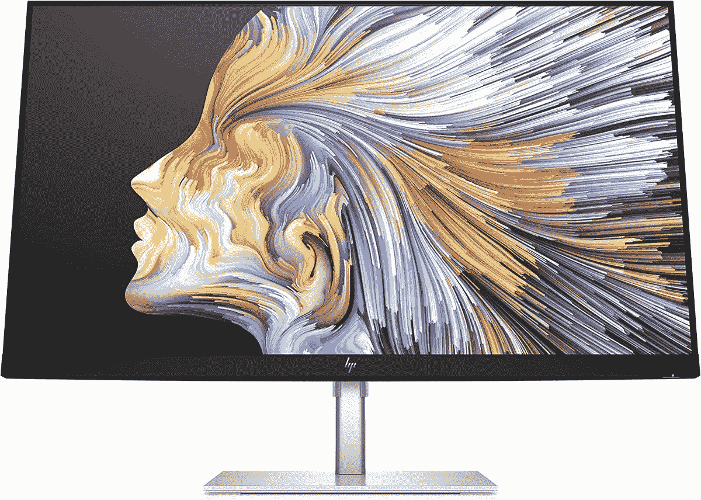

# HP EliteBook 840 G9 的最佳外接显示器

> 原文：<https://www.xda-developers.com/best-external-monitors-for-hp-elitebook-840-g9/>

HP EliteBook 840 G9 是我们最喜爱的商用笔记本电脑之一。凭借英特尔第 12 代博锐处理器和防泼溅键盘，它拥有我们喜欢的最佳笔记本电脑的许多功能，而预算不超过 1000 美元。但是如果你最终在[的商业场景](https://www.xda-developers.com/best-business-laptops/)或者在家里使用，你可能也需要一个外接显示器。内置的 1920 x 1200 分辨率显示器只能为多任务处理和完成工作做这么多。有一个额外的屏幕真的可以帮助你感觉更有效率，因为你可以一次打开更多的窗口和应用程序。

这就是我们制作这份指南的原因。查看我们为 HP EliteBook 840 G9 挑选的最佳外接显示器。我们的指南将涵盖许多不同的展示。从 USB-C 显示器到宽屏曲面显示器，甚至可以放在包里随身携带的便携式显示器。我们给导游的另一个提示是什么？你不需要购买任何加密狗，除非你最终有一个显示器显示端口或 VGA。HP EliteBook 840 G9 内置了一个 HDMI 端口。

 <picture></picture> 

HP 24MH FHD Monitor

##### 惠普 24MH FHD 显示器

这款惠普显示器具备您所需的基本功能，并且不会超出预算。您将获得 FHD 分辨率、HDMI 和 DisplayPort 连接，价格不到 180 美元。

 <picture></picture> 

HP M27 Webcam Monitor

##### 惠普 M27 网络摄像头显示器

HP M27 网络摄像头显示器顶部有一个网络摄像头，还有麦克风和一个扬声器条，帮助您在重要会议期间保持最佳的外观和声音。

 <picture></picture> 

HP U28 4K HDR Monitor

##### 惠普 U28 4K HDR 显示器

惠普 U28 4K HDR 显示器包 4K 分辨率，真正伟大的色彩，HDR 支持，和准确的色域，以产生令人难以置信的图像。USB-C 连接也是一个额外的便利。

 <picture></picture> 

Arzopa Portable Monitor

##### Arzopa 便携式监视器

生产力可以在任何地方发生，如果您在旅途中工作时需要额外的屏幕，Arzopa 的这款显示器是一个很好的选择。它通过 USB-C 工作，大小与普通笔记本电脑差不多，加上它的分辨率为 Quad HD+分辨率，因此非常清晰。

 <picture></picture> 

HP S14 FHD Portable Monitor

##### 惠普 S14 FHD (1920x1080)便携式显示器

如果你想要一个惠普官方便携式显示器，这是一个值得购买的。它与 USB-C 连接，并包括一个迷你扬声器，因此您可以无线输出笔记本电脑上的音频。

 <picture></picture> 

Dell UltraSharp U3223QE

##### 戴尔 UltraSharp U3223QE 31.5 4K UHD WLED 液晶显示器

Dell UltraSharp U3223QUE 是一款出色的 4K 显示器，配有 32 英寸面板。它采用 IPS 黑科技，对比度是典型 IPS 面板的两倍，并且具有出色的色彩覆盖范围，包括 100%的 sRGB 和 98%的 DCI-P3。

 <picture></picture> 

HP E34m G4 34 WQHD Curved Screen LED LCD Monitor

##### 惠普 E34m G4 显示器

HP E34m G4 34 英寸显示器将让您以时尚的方式享受视频会议。它拥有 HDMI 连接，75Hz 的刷新率，以及弹出式网络摄像头和内置扬声器。超宽的 3440x1440 分辨率也将帮助您在屏幕上一次显示更多内容。

 <picture></picture> 

ASUS ProArt PA278CV

##### 华硕 ProArt PA278CV 27 英寸 WQHD 显示器

华硕 ProArt PA278CV 是任何人的理想显示器，提供了规格和价格的完美结合。您可以获得四倍高清分辨率，100%覆盖 sRGB 和 Rec。709，色彩准确度评级为δE**附属链接**

Amazon

[View at Amazon](https://www.amazon.com/ASUS-ProArt-Display-Monitor-PA278CV/dp/B08LCPY1TR/ref=sr_1_1?crid=30MBJ361DTR3Q&keywords=Asus+Proart+PA278cv&qid=1663090767&sprefix=asus+proart+pa278cv%2Caps%2C103&sr=8-1&ufe=app_do%3Aamzn1.fos.c3015c4a-46bb-44b9-81a4-dc28e6d374b3&tag=xda-sish4g1-20&ascsubtag=UUxdaUeUpU43587&asc_refurl=https%3A%2F%2Fwww.xda-developers.com%2Fbest-external-monitors-for-hp-elitebook-840-g9%2F&asc_campaign=Evergreen)

就我个人而言，在使用带外接显示器的笔记本电脑时，我总是喜欢不太大也不太小的东西。像 Dell Ultrasharp 这样的 32 英寸显示器正合适。因为不是我所有的笔记本电脑都有颜色准确的显示器，所以颜色的准确性也是我所追求的。当然，每个人都是不同的，这就是为什么我们包括了各种各样的显示器。

如果你还没有 HP EliteBook 840 G9，你可以看看下面。正如我们所说，这是一款非常适合企业的笔记本电脑。但是如果你对商务笔记本电脑不感兴趣，你可以看看我们为你在 2022 年能买到的[最好的笔记本电脑](https://www.xda-developers.com/best-laptops/)。

 <picture></picture> 

HP EliteBook 840 G9

##### 惠普 EliteBook 840 G9

HP EliteBook 840 G9 是一款 14 英寸笔记本电脑，采用英特尔 P 系列处理器，设计时尚低调。