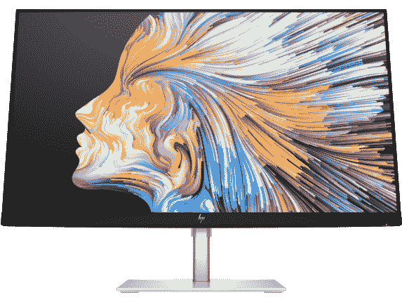
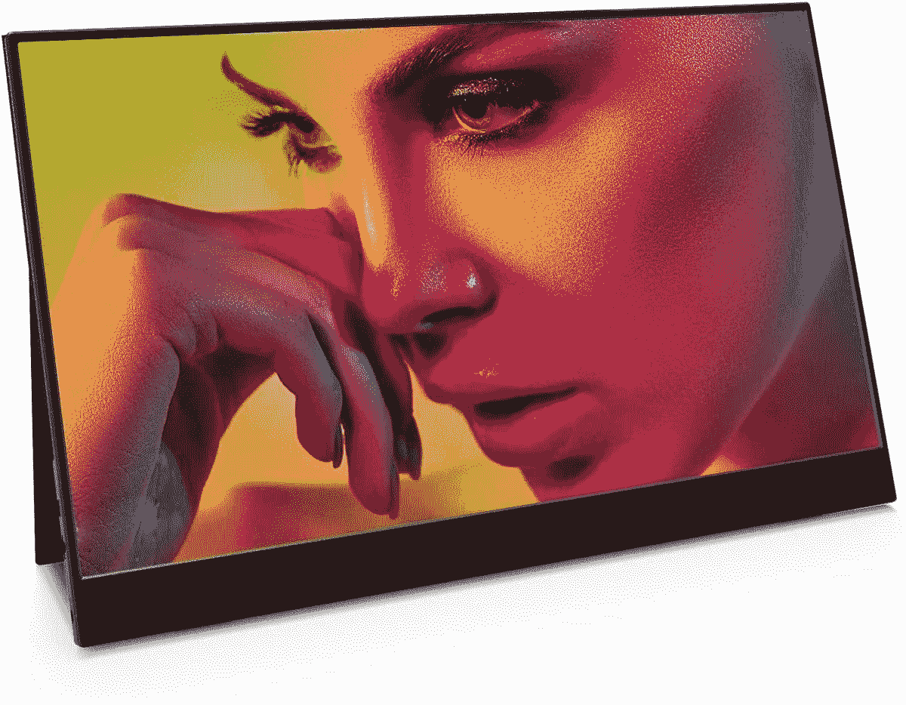

# 2023 年惠普 Elite Folio 最佳外部显示器

> 原文：<https://www.xda-developers.com/best-external-monitors-hp-elite-folio/>

# 2023 年惠普 Elite Folio 最佳外部显示器

想知道惠普 Elite Folio 的最佳外接显示器是什么吗？我们已经收集了在家和在旅途中使用的最佳选择。

我们已经在 XDA 审查了 HP Elite Folio ,发现它是目前你能买到的最好的 ARM 驱动的 Windows 笔记本电脑。与英特尔笔记本电脑相比，使用 ARM 芯片组具有一些优势，如始终在线连接、即时唤醒和长电池寿命。如果你正在寻找一款可以在旅途中携带的时尚设备，它是一些[最好的笔记本电脑的有力竞争者。但是如果你发现自己需要更多的屏幕空间呢？这就是为什么我们收集了一些你能为 Elite Folio 买到的最好的显示器。](https://www.xda-developers.com/best-laptops/)

尽管使用 ARM 芯片组有很多优点，但也有一些缺点。首先，Thunderbolt 是一项英特尔技术，所以你不能只使用一个 [Thunderbolt dock](https://www.xda-developers.com/best-thunderbolt-docks/) 来连接外部显示器。另外，惠普没有包括 HDMI 或 DisplayPort 端口，所以你唯一的选择是通过 USB Type-C 连接。这与 Surface Laptop 4 非常相似，后者也没有 Thunderbolt。幸运的是，Elite Folio 上的 USB 端口支持 DisplayPort 1.4，并且有一些显示器支持它。不仅如此，还有一些便携式显示器。这意味着您可以在旅途中随身携带它们，在任何地方都可以获得双屏设置。以下是我们为 HP Elite Folio 找到的一些最佳显示器。

 <picture></picture> 

HP E24u G4

##### 惠普 E24 G4 显示器

如果您只需要一台坚固的基本显示器，HP E24u G4 就能满足您的需求。它有一个全高清 24 英寸屏幕和一个高达 250 尼特的 IPS 面板，因此它足够亮，适合办公室使用。它没有太多突出之处，但如果需要，它有可靠的规格和多个输入。

 <picture></picture> 

ASUS ProArt PA278CV

##### 华硕 ProArt PA278CV 27 英寸 WQHD 显示器

这款 27 英寸的华硕 ProArt 显示器具有经过 Calman 验证的显示器，色彩准确度高，覆盖 100%的 sRGB 和录制。709 个色域。你可能不会用 Elite Folio 做大量的图像编辑工作，但如果你用它在其他电脑上操作，这已经足够了。

 <picture></picture> 

HP U28 4K

##### 惠普 U28 4K HDR 显示器

如果您正在寻求出色的媒体观看体验，HP U28 有很多优势，包括 4K 支持和 VESA DisplayHDR 400 认证。此外，惠普使用回收材料制造它。

 <picture></picture> 

LG UltraWide 35WN75CN-B

##### LG 35WN75C-B

虽然您可以将两台显示器连接到 Elite Folio，但有时超宽显示器更简单。这个有 WQHD 分辨率和 100Hz 刷新率，所以你也可以在玩游戏的时候插上你的游戏装备。

 <picture></picture> 

ASUS ProArt PA329C

##### 华硕 ProArt PA329C 32 英寸 4K 显示器

如果色彩准确度和图像质量是您的一切，那么 Adobe RGB、sRGB 和 Rec 的 100%覆盖率。709 可能已经很诱人了。再加上 4K 分辨率和 VESA DisplayHDR 600，就不能要求更多了。

 <picture></picture> 

HP Z43

##### 惠普 Z43 4K UHD 显示器

有时候需要大屏幕，有时候需要更大的。这里的 42.5 英寸 4K 显示屏上真的没有什么放不下的，而且还为其他输入提供了几个端口。350 尼特的亮度应该足够大多数室内使用。

 <picture></picture> 

Vissles Portable 15.8-inch Monitor

##### Vissles 便携式 15.8 英寸显示器

如果您必须随身携带双显示器，Vissles-M 是最好的选择之一。它提供了 15.6 英寸的大屏幕，厚度为 5.3 毫米，重量为 0.58 千克，因此您可以将它带到任何地方。它还有两个 USB Type-C 端口，因此您可以在笔记本电脑的任何一侧使用它。

 <picture></picture> 

ASUS ZenScreen MB16AHP

##### 华硕 ZenSCreen MB16AHP

大多数便携式显示器必须由您的笔记本电脑供电，这可能会影响其电池寿命。华硕 ZenScreen Go 内置电池，因此您可以使用自己的电源最多使用三个小时，充电一小时可以使用两个小时。

 <picture></picture> 

Lenovo ThinkVision M14

##### 联想 ThinkVision M14

Vissles-M 可能会提供更多端口，但 ThinkVision M14 可能是 Elite Folio 的完美匹配。它有着相似的物理尺寸，而且薄得令人难以置信，只有 4.4 毫米(不包括支架)。你可以很容易地把它和你的笔记本电脑放在同一个包里，甚至不会注意到它。

无论您是在旅途中还是在家中需要第二台显示器，这些都是非常好的选择，它们涵盖了各种使用案例。所有这些显示器都应该与 Elite Folio 有限的显示输出一起工作，但许多显示器还提供了其他设备的连接选项。

对于家庭使用，我会说 [LG 35 英寸超宽显示器](https://shop-links.co/1743154721992704721?u1=f27a3771-670f-435a-a2b1-ed2d78c0b01d)在生产力和提供更高刷新率之间取得了很好的平衡，如果你想插入游戏装备的话。如果便携式显示器是你想要的，那么 [Vissles-M](https://www.amazon.com/Vissles-Portable-Computer-Speakers-Brightness/dp/B08QFLJJ3D?tag=xda-43648q9-20&ascsubtag=UUxdaUeUpU2649&asc_refurl=https%3A%2F%2Fwww.xda-developers.com%2Fbest-external-monitors-hp-elite-folio%2F&asc_campaign=Short-Term) 就其价格而言具有最引人注目的功能，所以这将是我个人的选择。如果你还没有购买 Elite Folio，但是这些选项把你推向了它，你可以在下面找到它。

 <picture></picture> 

HP Elite Folio

##### 惠普精英版

HP Elite Folio 是一款优雅、高端的 ARM 笔记本电脑。它覆盖着纯素食皮革，手感很好，其始终在线的连接非常适合在旅途中工作。骁龙 8cx Gen 2 芯片组也可以处理大多数日常任务。