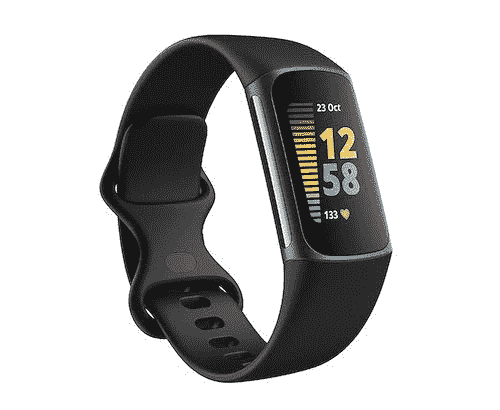
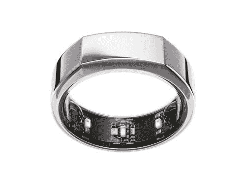
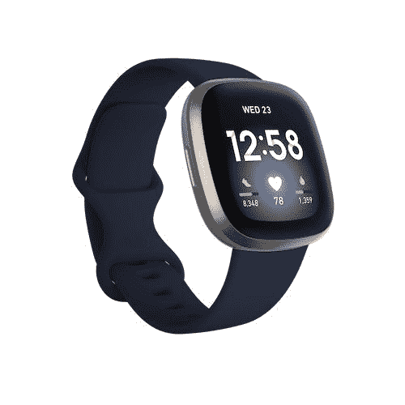
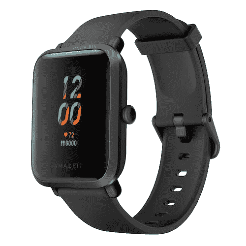
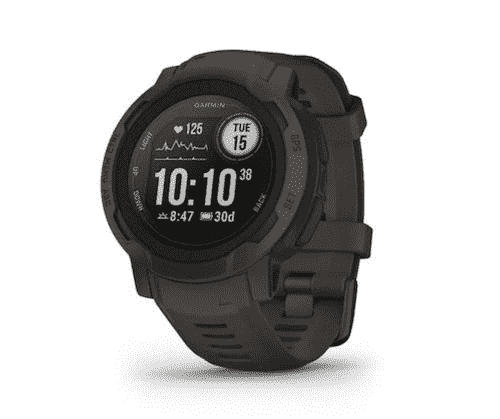

# 2023 年最佳健身追踪器

> 原文：<https://www.xda-developers.com/best-fitness-trackers/>

多年来，健身追踪器在外形和功能方面都有了很大的发展。现代健身追踪器不再仅限于追踪你每天的步数和睡眠时间。它们现在已经成为可靠的工具，可以帮助你每天更加活跃，帮助你获得高质量的睡眠，甚至可以跟踪心率、含氧量等重要指标。只要你准备好找到合适的产品，这些健身追踪器可以帮助你轻松实现所有的健身目标。

市场上不乏健身追踪器，这意味着你必须浏览几十种产品，才能找到符合你健身目标的产品。我们已经设法整理了一份健康清单(没有双关语的意思)供你检查。从日常使用的简单追踪器到可以兼做智能手表的更复杂的选项，这份清单上有适合每个人的东西。

## 专用健身追踪器

专用健身追踪器又称健身带，主要致力于为你的健身之旅加油。与成熟的智能手表或兼做智能手表的手表相比，这些追踪器相对较小。你可以在下面的章节中找到这些产品，但是让我们进入专用健身追踪器的列表，帮助你实现你的健身目标:

## 整体最佳健身追踪器:Fitbit Charge 5

Fitbit 的充电阵容已经存在了一段时间，他们通过提供一系列良好的功能继续主导美国市场。它也是 Fitbit 最实惠的健身追踪器之一，它几乎拥有你对基本健身追踪器的所有期望。正如你所看到的，Fitbit Charge 5 的设计简单而优雅。它有许多不同的颜色可供选择，我们认为它的尺寸最适合大多数用户。跟踪器的外壳由铝、玻璃和树脂制成，而附带的带子由硅树脂制成。

它前面有一个明亮的 1.04 英寸(对角线)触摸屏有机发光二极管显示器，让你可以与追踪器提供的所有功能进行交互。在 Charge 5 内部，你得到的不仅仅是几个传感器和组件。它包含一个光学心率监视器，用于氧饱和度(SpO2)监测的红色和红外传感器，一个用于测量皮肤温度的设备温度传感器，与 ECG 应用程序和 EDA 扫描应用程序兼容的多用途电子传感器，一个 3 轴加速度计等。值得注意的是，你还可以获得内置的 GPS、GLONASS 和 NFC 支持。

Fitbit Charge 5 还支持非接触式支付、通知等智能功能。该追踪器还具有内置存储器，可以存储长达 7 天的详细运动数据，每分钟一次。此外，它还可以存储多达 30 天的每日总量。Charge 5 的防水深度也达到了 50 米，非常棒。在电池部门，Fitbit 表示，Charge 5 一次充电最多可以工作 7 天。根据您的使用情况，您的里程数可能会有所不同，我们预计电池寿命会随着持续显示和 SpO2 监控等功能的开启而进一步下降。

Fitbit Charge 5 最好的一点是它可以兼容 Android 手机和 iPhones。你需要运行 iOS 14 或更高版本的 iPhone 或运行 Android 10.0 或更高版本的 Android 手机才能使用配套应用程序。你可以去 Fitbit 的官方网站看看所有兼容的设备。

总的来说，Fitbit Charge 5 是一款可靠的健身追踪器，提供了一系列良好的功能。它可能不是这个系列中最实惠的健身追踪器，但它以合理的价格完成了工作。Fitbit 提供了一份详尽的可穿戴设备清单，但我们认为 Charge 5 是一款可靠的追踪器。它不吝惜必需品来保持低价，这本身就是一个巨大的卖点。如果你想要一个兼做智能手表的健身追踪器，我们建议你看看 Fitbit Versa 3。如果你不介意满足于稍微便宜一点的东西，那么小米的 Mi Smart Band 7 也是一个很好的选择。

 <picture></picture> 

Fitbit Charge 5

##### Fitbit 充电 5

Fitbit Charge 5 是一款可靠的健身追踪器，价格合理，功能齐全。

## 最佳预算健身追踪器:小米米智能手环 7

小米智能手环 7 是小米可靠的健身追踪器系列的最新成员。对于那些不知道的人来说，Mi Bands 是负担得起的健身追踪器，可以在不打破银行的情况下完成工作。Mi Band 7 是该系列的最新产品，与前代产品相比有一些值得注意的改进。它以 Mi Band 7 的名字在中国首次亮相，但小米在国际市场上称它为 Mi Smart Band 7。它在美国可以通过亚马逊购买，价格约为 69 美元。小米智能手环 7 有很多值得喜欢的地方，尤其是这个价位。它缺乏一些高端功能，但它在保持低价格的同时，用其他功能弥补了这一点。

就设计而言，我们正在寻找一种可以从表带上拆卸下来的小型椭圆形设备。跟踪器本身的厚度仅为 12.2 毫米，重量为 13 克。这应该会让你知道日常佩戴它会有多轻便和舒适。Mi Band 7 最大的好处之一就是可以很容易地为追踪器购买替换带。小米本身就卖很多，你肯定会从第三方供应商那里找到更多。追踪器没有物理按钮，这意味着你必须通过在触摸屏上滑动和点击来进行交互。它前面有一个 1.62 英寸的 AMOLED 显示屏，亮度为 500 尼特。UI 本身很容易导航和找到你需要的任何东西。

至于活动跟踪，Mi Band 7 支持所有基本功能，包括步数、锻炼、睡眠跟踪等。它还可以跟踪你的血氧水平和心率。Mi Band 7 的亮点是它还可以跟踪月经周期和呼吸，这很棒。唯一真正的缺点是 Mi Band 7 不能自动检测锻炼，这意味着你必须手动记录锻炼。然而，Mi Band 7 附带了许多锻炼模式，包括骑自行车、瑜伽、钓鱼，甚至跑酷。你会找到合适的锻炼，但你必须手动打开跟踪。

正如我们在 Mi Band 7 评测中提到的，您无法选择与跟踪器本身的通知进行交互。这个问题并不仅限于 Mi Band 7，因为许多其他健身带甚至智能手表都不会主动让你与通知进行交互。它不一定是一个交易的破坏者，但要记住这一点。Mi Band 7 的其他一些值得注意的功能包括 180mAh 电池和 5ATM 电阻。你还可以获得一个可靠的配套应用程序，可以在 Android 手机和 iPhones 上运行。

我们建议您阅读我们的 [Mi Band 7 评测](https://www.xda-developers.com/xiaomi-smart-band-7-review/)以了解关于这款健身追踪器的更多信息，并在做出购买决定之前对它的预期有一个好的想法。

 <picture></picture> 

Mi Smart Band 7

##### 小米智能手环 7

小米智能手环 7 是一款价格实惠的健身追踪器，可以很好地记录步数、心率和睡眠，屏幕也很大，充满活力。

## 最佳谨慎健身追踪器:Oura Ring Gen 3

即使是市场上最小的健身带，包括 Mi Band 7，也没有 Oura Ring 那么低调。与绝大多数戴在手腕上的健身追踪器不同，Oura 戒指，顾名思义，是一个戒指。它没有屏幕，也没有向前推送通知，这意味着与传统的健身带相比，它不那么令人分心。但不要让它的小外形欺骗了你，因为欧拉环是一个非常有能力的设备，可以跟踪许多指标，让你保持最佳状态。我们只是把它作为额外的选择，因为它并不适合所有人。Oura Ring Gen 3 售价 299 美元，是这份名单上最贵的追踪器之一，它也需要付费会员才能提供最好的支持。是的，你可以通过购买获得六个月的免费会员资格，但之后每个月需要 6.99 美元，这对大多数人来说是一笔不小的费用。

这款产品的亮点在于它的外形和设计。Oura Ring Gen 3 有四种不同的颜色——银色、黑色、隐形和金色。该公司会让你在结账前选择合适的尺码。Oura Ring Gen 3 由轻质钛制成，这意味着它非常耐用。它也比常规戒指更轻，所以你不必担心经常摘下它。对于那些好奇的人来说，根据戒指的大小，Oura Ring Gen 3 的重量为 4 到 6 克，厚度可以薄到 2.55 毫米。尽管它的外形相对较小，但 Oura Ring Gen 3 据说一次充电可以持续 7 天。它使用蓝牙 LE(低能耗)进行连接。

乌拉环还提供了一长串的功能，以帮助您保持最佳状态。有了它的会员资格，你就能接触到诸如引导冥想、教育内容和对你的幸福的个性化见解等东西。您也可以选择忽略会员资格，但如果没有会员资格，您将只能访问基本的 Oura Ring 功能，如日常准备情况、睡眠和活动分数。一些高级功能，包括放松时间和周期预测，仅适用于会员，但让我们将它留给你来决定，而作出购买决定。

Oura Ring 可以在 Android 手机和 iPhones 上运行，应用程序体验基本保持一致。它还可以通过 Apple Health 和 Google Fit 自动同步你最喜欢的健身应用程序中的锻炼数据。除了所有的功能和规格之外，让 Oura Ring tracker 与众不同的是它的外形。没有任何其他追踪器像 Oura 一样，所以可以肯定地说，该公司现在确实是这个领域的霸主。Oura 的人员也在不断地为设备添加新功能，所以随着时间的推移，它只会越来越好。

 <picture></picture> 

Oura Ring Gen 3

##### 欧拉环第三代

Oura Ring Gen 3 是目前你能买到的最低调的健身追踪器。这是这个系列中最昂贵的追踪器之一，但它也支持这个价格的一长串功能。

* * *

## 智能手表式健身追踪器

健身追踪器还可以兼做智能手表。市场上有很多这样的追踪器，但并不是所有的都值得考虑。我们收集了以下类别中的一些最佳追踪器:

## 最佳智能手表式健身追踪器:Fitbit Versa 3

Fitbit Versa 3 是我们挑选的最佳智能手表式健身追踪器。虽然大多数人认为 Versa 3 是一款智能手表——甚至 Fitbit 也将其归入智能手表的范畴——但我们认为它更适合用作健身追踪器。与下面这个集合中提到的“智能手表”不同，Fitbit Versa 3 缺乏专门的应用商店支持。当然，你可以安装一些应用程序，但与 Galaxy Watch 5 相比，这种选择相当黯淡。但如果你优先考虑健身功能而不是应用商店，那么 Versa 3 是一个很好的选择。

在设计方面，我们认为 Fitbit Versa 3 类似于苹果手表的方形表盘。在物理上，它比 Fitbit 自己的 Sense 智能手表略小，但与 Mi Smart Band 7 和 Charge 5 等健身追踪器相比，它提供了更多的屏幕空间。Versa 3 有四种不同的表面处理，所有表面处理的表壳和表带都有不同的颜色。表壳由铝制成，而随附的表带则使用了一种“柔性材料”。Versa 3 的防水深度为 50 米，这意味着你可以穿着它在游泳池里游泳。就像其他 Fitbit 追踪器一样，Versa 3 也适用于 Android 和 iOS 设备。

Versa 3 在功能上与 Charge 5 非常相似。它与追踪器的区别在于它的 1.58 英寸 AMOLED 面板。与典型的活动追踪器相比，它可以让你在屏幕上看到更多的信息并与之互动。你还可以看到通知并与之互动，但与 Apple Watch 等成熟的智能手表相比，这种体验可能会有所限制。在传感器方面，Fitbit Versa 3 可以持续监测心率和 SpO2。这是对通常的跟踪指标集的补充，如步数、活动跟踪、睡眠跟踪等。Versa 3 还支持非接触式支付的 NFC，它还有一个内置麦克风，可以让你在手腕上接电话。

Fitbit Versa 3 还内置了 GPS，并支持 Alexa 和谷歌助手。在电池部门，Fitbit 表示 Versa 3 充一次电可以持续一周左右。这也与该公司声称的第 5 项费用持平。然而，使用 Versa 3，您只需 12 分钟就可以充满一天的电量。总的来说，如果你想买一个可靠的健身追踪器，同时也是一个智能手表，Fitbit Versa 3 是一个很好的选择。Fitbit Sense 配备了更多的传感器来跟踪更多的指标，但我们认为 Versa 3 以这个价格提供了一系列很好的功能。

在撰写本文时，Fitbit Versa 3 的购买价格仅为 170 美元，我们认为这是它所带来的一切的稳定价格。

 <picture></picture> 

Fitbit Versa 3

##### Fitbit Versa 3

Fitbit Versa 3 与更贵的 Fitbit Sense 智能手表非常相似，只是这款手表以相对实惠的价格提供了所有基本功能。

## 最佳预算健身手表:Amazfit Bip S

如果你不想花很多钱买一个昂贵的健身手表，那么我们建议看看 Amazfit Bip S，对于那些想节省一些钱而又不牺牲一些基本功能的人来说，这是一个很好的选择。正如你所看到的，Bip S 有一个方形的表盘，这使它看起来像一个廉价的苹果手表。它有炭黑、红橙、暖粉色或白色岩石色可供选择，所以你有相当多的选择。它由聚碳酸酯材料制成，而附带的表带使用硅胶。Bip S 加上表带只有 31g 重，所以戴在手腕上也不算太重。

Amazfit Bip S 正面配备了 1.28 英寸的彩色 TFT 面板，分辨率为 176 x 176 像素。它覆盖着 2.5D 大猩猩玻璃 3 进行保护，手表具有 5ATM 防水等级。在传感器方面，我们正在寻找一个生物跟踪器 PPG 生物跟踪光学传感器。除了通常的健康指标，Bip S 还支持睡眠跟踪和连续心率监测。它还内置了 GPS，这使得它比这个价格范围内的许多其他健身手表都要好。Bip-S 健身手表的一大亮点是电池续航时间长。额定一次充电最多持续 2 周，相当不错。它与电池部门的 Mi Smart Band 7 等健身追踪器不相上下。

Amazfit Bip-S 令人印象深刻的是，据说在基本使用的情况下，一次充电可以持续 40 天。据该公司称，“基本使用”包括工厂默认拨号、每 30 分钟测量一次心率、睡眠跟踪以及每天多达 100 次的通知照亮屏幕。你也可以每周锻炼一次，每次 30 分钟，打开 GPS，一次充电可以使用 40 天。如果你一直使用 GPS，那么你最终会在一天结束前寻找一个充电器。

Amazfit Bip-S 通过名为 Zepp 的配套应用程序，可以与 Android 手机和 iPhones 兼容。Amazfit Bip-S 更像一个健身带，而不是智能手表，所以请记住这一点。你确实可以在手表上收到通知，但与这些通知互动的空间非常有限。不过，你可以编辑表盘和控制音乐，所以仍然有一定程度的定制和功能。

坦率地说，Amazfit Bip-S 不是这个系列中最好看的健身手表，但我们认为它的价格很划算。在撰写本文时，它的售价仅为 42 美元，这意味着它也比 Mi Smart Band 7 便宜。Bip-S 还可以处理活动跟踪，因此对于那些刚刚开始健身之旅的人来说，它可能值得考虑。

 <picture></picture> 

Amazfit Bip S

##### Amazfit Bip S

Amazfit Bip S 是一款价格实惠的智能手表式健身追踪器，物有所值。

* * *

## 最佳健身智能手表

健身追踪器不是镇上唯一的游戏。智能手表还可以为健身爱好者提供强大的功能。与基本的健身追踪器相比，购买智能手表有很多优势，包括更好的通知支持、专用的应用商店等等

## 安卓用户最佳智能手表:三星 Galaxy Watch 5

三星的新 [Galaxy Watch 5](https://www.xda-developers.com/samsung-galaxy-watch-5-review/) 是安卓用户最好的智能手表之一。就像 Galaxy Watch 4 一样，新型号也有 40mm 和 44mm 两种尺寸，并运行最新版本的 Wear OS 3。谷歌新的 Pixel Watch 也运行相同的操作系统，这意味着你可以访问谷歌地图的即时导航和谷歌助手。所有的健身和健康跟踪功能都由三星健康应用程序处理，这比外面的许多选项都更可靠。

Galaxy Watch 5 支持三星的最佳健康功能，包括 SpO2 测量、自动锻炼检测、睡眠跟踪和心电图。这款手表还会显示所有通知，让你无需掏出手机就能与之互动。你可以在我们的三星 Galaxy Watch 5 评测中了解更多使用这款手表的体验。三星 Galaxy Watch 5 也提供了不错的电池寿命，但不要指望一次充电可以持续几天。一天半之后，你仍然需要给它充电，这与市面上的许多其他智能手表一样。

三星 Galaxy Watch 5 有很多令人喜欢的地方，尤其是它 250 美元的要价。但它只适用于 Android 手机，所以请记住这一点。如果你想要一个更大的手表，坚固的外形，你也可以考虑购买 Galaxy Watch 5 Pro。或者，你也可以通过购买去年的 Galaxy Watch 4 来节省一些购买费用，与新款相比，Galaxy Watch 4 仍然表现不错。

 <picture></picture> 

Samsung Galaxy Watch 4

三星 Galaxy Watch 5 是目前最好的安卓智能手表之一。与旧款相比，它对桌面进行了大量升级，具有出色的健康跟踪功能，并且电池续航时间也很长。

## iPhone 用户最佳智能手表:Apple Watch Series 8

如果没有苹果手表，很难列出最好的健身追踪器。不可否认，Apple Watch 在健康和健身跟踪方面名列前茅，所以我们想强调一下你现在可以买到的最好的 Apple Watch。这个列表的最初版本包括 [Apple Watch Series 7](https://www.xda-developers.com/apple-watch-series-7-review/) ，但我们现在已经用更新的 Series 8 型号取代了它。

Apple Watch Series 8 与之前的型号没有明显不同，但它配备了一个新的皮肤温度传感器，可以跟踪月经周期，让你获得更准确的睡眠数据。这两个功能对很多用户来说至关重要，这就是为什么新的 Apple Watch Series 8 赢得了 iPhone 用户的第一名。此外，Apple Watch Series 8 的新功能是该公司新的碰撞检测功能。如果你已经有了一部新 iPhones，崩溃检测功能本身可能不值得升级，但它肯定是今年 Apple Watch 系列的亮点之一。

就健身追踪而言，Apple Watch Series 8 有大量不同的锻炼模式，包括跑步、骑自行车、步行、力量训练等。你也可以在“锻炼”应用程序中添加新的锻炼，当你准备好时，Apple Watch Series 8 可以自动检测并跟踪它们。

总的来说，Apple Watch Series 8 是大多数用户的默认选择，它配备了所有的功能，如皮肤温度传感器、碰撞检测等等。增加的皮肤温度传感器和碰撞检测功能可能不足以保证从上一代手表升级到 Series 8，但如果你来自一个旧手表，它绝对值得考虑。或者，你也可以考虑购买 [Apple Watch Ultra](https://www.xda-developers.com/apple-watch-ultra-review/) ，这是该公司为运动员和高级用户推出的新款坚固型智能手表。

Apple Watch Series 8 是苹果公司最新推出的智能手表。与 Series 7 相比，这不是一个巨大的变化，但它提供了一些新功能，如碰撞检测、新的温度传感器等。

## 最佳健身用坚固智能手表:Garmin Instinct 2

Garmin Instinct 2 是那些希望获得坚固智能手表的人的绝佳选择。新的本能 2 采取了其前身的最佳功能，并增加了一些有意义的升级，以提供更好的整体包装。Instinct 2 有 40 毫米和 45 毫米两种外壳可供选择，因此它适合大多数用户。你还可以在标准型号或太阳能型号之间进行选择，后者可以在 Garmin 的 Power Glass 的帮助下从太阳收集能量。电动玻璃可以进一步延长电池寿命，所以如果你想要最好的电池寿命，你可能会选择它。不过，太阳能型号稍微贵一点，所以要记住这一点。

虽然最初的 Instinct 智能手表也有一系列颜色，但 Instinct 2 带来了更明亮的色调，包括罂粟红和电动石灰配色。如果你喜欢冲浪版，你甚至可以选择双色调。就像最初的手表一样，Instinct 2 也配备了一个圆形表盘的单色像素内存显示屏。在主面板中还有一个小的圆形切口，当你浏览菜单时，可以显示一些上下文信息。与前代产品相比，Instinct 2 的显示屏更加清晰。我们看到的是 176 x 176 像素，而原始手表的像素是 128 x 128 像素。这将在日常使用中产生显著的差异。

Garmin Instinct 2 在活动跟踪方面非常出色。它附带了一份详尽的健康监测功能列表，包括 Garmin 的身体电池工具。如果你想知道，这个工具可以跟踪各种指标，包括心率、睡眠等，告诉你明天还有多少能量。这个分数最好的一点是，它会全天更新，这意味着你可以平衡你的活动，以确保你不会在一天结束前耗尽精力。与其他 Garmin 手表一样，Instinct 2 提供了精确的 GPS 支持，可以更好地跟踪您的户外活动。

值得注意的是，Garmin Instinct 2 还为铁人三项等活动提供了多运动模式，这意味着你不必在每个阶段之间停下来改变活动模式。Instinct 2 智能手表还可以自己检测一系列活动，这始终是一个很好的功能。这款特殊的手表更适合跑步者、骑自行车者和游泳者，但你也应该能够毫无问题地跟踪其他锻炼。它具有 10 个大气压的防水等级，这意味着你可以在雨中使用，甚至可以带着它在水下游泳。这款手表的其他值得注意的功能包括一个麦克风，可以让你接电话或从手腕上召唤手机的语音助手。配套应用程序还可以让您更轻松地下载更多手表表盘和应用程序。

尽管提供了一长串的功能，Garmin Instinct 2 在电池寿命方面还是很棒的。据该公司称，Instinct 2 智能手表一次充电可以持续 28 天。这可能有点夸张，尤其是如果你使用一些耗电功能，如 SpO2 和 GPS。但即使没有启用这些功能，Instinct 2 一次充电也应该可以保持两周以上，这是相当令人印象深刻的。太阳能型号在充电之间肯定会持续更长时间，所以请记住这一点。总的来说，如果你想在市场上购买一款可靠、坚固的健身智能手表，Garmin Instinct 2 是一个很好的选择。

 <picture></picture> 

Garmin Instinct 2

##### Garmin 本能 2

Garmin Instinct 2 采用了原始 Instinct 智能手表的所有最佳功能，并添加了一些收尾工作，使其变得更好。

* * *

如你所见，有很多种类可供选择，但是这个列表可以帮助你缩小选择范围。如果你倾向于购买一个简单的活动跟踪器，那么 Fitbit Charge 5 和 Mi Smart Band 7 是值得考虑的好选择。Fitbit Versa 3 和 Amazfit Bip-S 非常适合那些想要健身追踪器兼做简单智能手表的人。但是如果你想要更全面的功能，包括完整的应用商店支持，那么你就必须依赖于这个列表中提到的智能手表。

这是一个不断发展的列表，我们将随着时间的推移进行更新，以添加更新更好的选项。但与此同时，请在下面留下评论，让我们知道你最喜欢的健身追踪器。