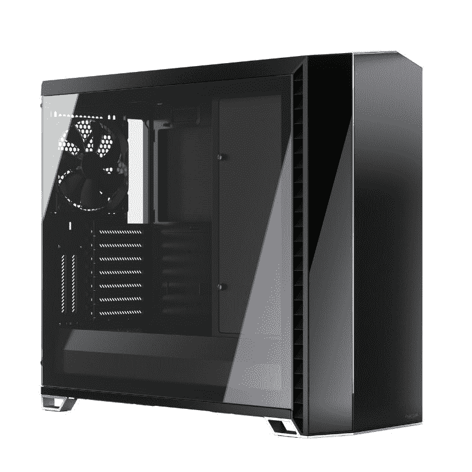

# 2023 年最佳分形设计电脑案例

> 原文：<https://www.xda-developers.com/best-fractal-cases/>

在[建造计算机](https://www.xda-developers.com/how-to-build-a-computer-beginners/)时，你必须做出的最大决定之一是从[为你的设备挑选最好的 PC 机箱](https://www.xda-developers.com/best-pc-cases/)。有大量的电脑案件选择从不同的制造商，如海盗船，NZXT 等。我们认为分形设计也是社区中 PC 机箱的最佳选择。该公司生产大量优质橱柜，所以你很有可能会找到一款符合你需求的。然而，挑选最好的分形设计电脑机箱可能会有点令人生畏，因为有很多可用的选项。在本指南中，我们将看看一些最好的分形设计电脑案例，这些案例值得你在下一部电脑中考虑。

## 最佳个人电脑案例:分形设计定义 7

现在市场上有几种不同的分形设计 Define 7 机箱，但我们认为最初的 Define 7 是你能买到的最好的整体分形设计 PC 机箱。这款中塔式电脑机箱适用于各种机型，无论是入门级电脑还是高端游戏设备。这也恰好是市场上最好看的案例之一。分形设计 Define 7 有黑色和白色两种颜色。对于那些想要购买白色电脑机箱的人来说，这是一个很好的选择。

分形设计 Define 7 配有阳极氧化铝前面板和拉丝铝饰面。前面板和顶部面板都有通风孔，便于空气流通。您还可以选择实心或钢化玻璃面板。如果你想展示你的建筑内部，我们建议你拿起钢化玻璃面板。这款电脑机箱最大的优点之一就是它的机箱可以完全暴露机箱内部。这样你就更容易在箱子里组装了。

Define 7 在设计上并不是一个气流机箱，但你确实有很多空间来添加机箱风扇和散热器进行冷却。该机箱附带三个预装的动态 X2 GP-14 风扇。这些是 140 毫米的风扇，非常适合空气进出机箱。有空间添加更多的风扇，但你会有单独的。除了已经安装的两个风扇之外，您可以在前面再安装一个 140 毫米的风扇。顶部面板也有空间添加三个 120 毫米或 140 毫米风扇。您也可以在底部安装两个 120 毫米或 140 毫米的风扇，而背面已经预装了一个 140 毫米的风扇。

至于散热器安装选项，您可以在前面安装高达 360 毫米的散热器，在顶部安装高达 420 毫米的散热器。您也可以在背面安装一个 120 毫米的小型散热器，在底部安装一个 240 毫米的散热器。还值得指出的是，所有的通风口都覆盖着灰尘过滤器，以防止灰尘和污垢接触内部组件。

分形设计 Define 7 在机箱内部有足够的空间放置所有组件。您可以获得最大长度达 491 毫米的 GPU 和最大高度达 185 毫米的 CPU 冷却器的许可。分形设计还可以更容易地管理机箱内的电缆，因为有专门的空间来布置电缆。考虑到所有的事情，分形设计 Define 7 是一个值得考虑的可靠例子。它适用于各种构建。这也是一个价格合理的电脑机箱，它提供了所有的功能。

##### 分形设计定义 7

分形设计定义 7 是一个坚实的中塔电脑案件，适合各种不同的建设。

## 亚军:分形设计 Meshify 2 紧凑型

Meshify 2 Compact 是市场上最受欢迎的分形设计案例之一，这是理所当然的。这是我们挑选的你能买到的第二好的分形设计，仅次于 Define 7。Meshify 2 Compact 有很多令人喜欢的地方，包括其大胆的、受隐身启发的美学。Meshify 2 Compact 是一款坚固的气流机箱，配有网状前面板和大量安装机箱风扇的空间。Meshify 2 Compact 配有标志性的角形网状前面板，可过滤气流。

Meshify 2 Compact 的顶部面板也有通风孔，便于空气流通。您还可以选择实心或钢化玻璃侧板。钢化玻璃面板将让您看到机箱的内部，并增加建筑的整体美感。在这个前面板的后面有安装风扇的空间，以帮助更多的空气进出机箱。

Meshify 2 Compact 是一款中塔式电脑机箱，支持 ATX、mATX 和迷你 ITX 主板。它配备了两个动态 X2 GP-14 140 毫米风扇安装在前面，以及一个 140 毫米动态 X2 GP-14 风扇在后面。你可以在前面再安装一个 140mm 的风扇，顶部有更多的空间安装两个 120mm 或 140mm 的风扇，底部安装一个 120mm 的风扇。可以肯定地说，在这个机箱上有足够的空间来安装机箱风扇，以获得最佳的气流。至于散热器支架，您可以在前面安装多达 360 毫米的散热器，在顶板上安装多达 240 毫米的散热器，在后面和底板上安装多达 120 毫米的散热器。

Meshify 2 Compact 内部有足够的空间来放置您计划用于构建的所有高端组件。机箱为最大长度达 360 毫米的 GPU 和最大高度达 169 毫米的 CPU 冷却器留出了空间。机箱内还有线缆布线空间，便于您轻松管理线缆。Meshify 2 Compact 有七个扩展槽，用于 GPU 和其他扩展卡等设备。然而，与 Define 7 不同的是，它没有让您垂直安装 GPU 的垂直插槽。也就是说，机箱有两个 3.5 英寸和多达 4 个 2.5 英寸驱动器支架用于存储驱动器。您可以在机箱中安装一个 ATX PSU，最大长度可达 200 毫米。

总的来说，我们认为 Meshify 2 Compact 是目前市场上最好的 ATX 电脑机箱之一。这种情况下还带有 5 年的保修，以防出现问题。这种情况下，适合各种不同的建设，这就是为什么它是我们的第二个最好的整体分形设计电脑案件。您可以点击以下链接，立即在线查找此案例的最佳价格。

##### 分形设计网格 2 紧凑

分形设计 Meshify 2 Compact 是一款出色的 ATX 机箱，机箱内部空间充足，前面板采用网状设计，便于空气流通。

## 爱好者的最佳电脑案例:分形设计矢量 RS

向量遥感是唯一的情况下，在分形设计的案件阵容，看起来完全不同。它有一个完全不同的设计，与我们在这个系列中提到的其他包完全不同。而另一个分形设计提供了一个更小和静音，矢量遥感出来作为一个闪亮的案件与 RGB 灯。它以一种其他产品没有的方式突出了性能和游戏性。这对向量 RS 有意义，因为它是一个。我们推荐 Vector RS 给那些希望用强大的组件构建高性能 PC 的人。

Vector RS 是一个全塔式机箱，空间充足。如果你正在寻找一个高性能的建筑，比如说，一个定制的水冷回路，这就是你想要购买的情况。Vector RS PC 机箱正面有一块实心面板，侧面有一些通风孔，便于空气流通。侧面还有一块烟熏钢化玻璃，让你展示你的电脑内部。这种情况下，不同于其他分形设计的情况下，也有 RGB 灯。

顶部有钢化玻璃面板和带透气孔的网板。根据使用的类型，您可以很容易地在两者之间进行切换。这使它成为一个多功能的情况。坚固的钢化玻璃面板有助于抑制内部噪音，而带通风装置的面板可以改善空气流通。值得指出的是，其他分形设计的电脑机箱不提供这种功能。

Vector RS PC 机箱还配有三个用于通风的动态 X2 GP-14 140 毫米风扇。其中一个安装在前面，而最后一个安装在后面板上。除此之外，机箱内还有大量空间来添加更多风扇和散热器。您可以在前面再安装一个 140 毫米的风扇，在顶部面板最多安装三个 120 毫米或 140 毫米的风扇。底部有更多的空间来添加两个 120 毫米或 140 毫米的风扇。至于散热器支架，您可以在前面板上安装多达 360 毫米的散热器，在顶板上安装多达 360 毫米的散热器，在底板上安装多达 240 毫米的散热器。

Vector RS 也有足够的空间来容纳一个完全水冷的系统，配有一个泵、蓄水池等。也有足够的空间来运行冷却剂管道。这种情况下，您可以使用 E-ATX、ATX、mATX 或迷你 ITX 主板。您可以获得最大长度达 440 米的 GPU 和最大高度达 185 毫米的 CPU 冷却器的许可。借助垂直扩展槽，您还可以将 GPU 垂直安装在机箱内。分形设计向量 RS 的成本比列表中提到的其他一些案例稍高，但我们认为它非常值得要价。

 <picture></picture> 

Fractal Design Vector RS

##### 分形设计向量 RS

分形设计向量 RS 是一个全塔的情况下，有足够的空间进行高性能的建设。

## 最佳预算 PC 案例:分形设计 Meshify C

分形设计 Meshify C 在许多方面与 Meshify 2 Compact 相似。Meshify C 比 Meshify 2 Compact 更实惠，但它提供的功能几乎相同。它还采用了有利于气流的设计，即使对于相对高端的建筑也是一个很好的选择。前面板是具有角形网格图案的相同网格面板。它与您在 Meshify 2 Compact case 上得到的一模一样。

Meshify C 顶部有通风孔，便于空气流通。您可以在顶板上安装风扇和散热器，以获得更多冷却。关于这种情况的事情是，尽管价格合理，但它配备了所有通风口的灰尘过滤器。拥有一个灰尘过滤器是至关重要的，因为它可以防止电脑的内部组件因灰尘或污垢颗粒而堵塞。你可以选择强化玻璃或实心侧板。机箱的整体尺寸也足够大，可以容纳您所需要的所有高质量组件。

你总共有七个扩展槽，用于你的 GPU 和其他可能想要添加到你的钻机的扩展卡。遗憾的是，没有垂直安装 GPU 的选项。考虑到这种情况下相对可承受的价格标签，这不是一个交易破坏者。这种特殊的情况下有空间要么 ATX mATX 或迷你 ITX 主板。至于组件间隙，可以安装最大长度可达 315mm 的 GPU 和最大高度可达 170mm 的 CPU 冷却器。机箱内部也有专门的空间用于布线。

Meshify C 自带两个 120 毫米预装风扇。你得到一个动态 X2 GP-12 安装在前面以及后面的面板。前面板上有空间再安装两个 120 毫米风扇，顶部板上有两个 120 毫米或 140 毫米风扇，底部有一个 120 毫米风扇。此外，您还可以在前面板上安装多达 360 毫米的散热器，在顶部板上安装多达 240 毫米的散热器，在后面板上安装单个 120 毫米的散热器。这是市场上为数不多的提供这么多散热器安装选项的经济型机箱之一。

前面板 IO 带有两个 USB 3.0 端口、音频端口和一个电源按钮。机箱还配备了两个 3.5 英寸和三个专用 2.5 英寸驱动器托架，以增加钻机的存储空间。Meshify C 配备了市场上高档、高品质电脑外壳的所有功能。对 Meshify C 没有太多抱怨，尤其是它是市场上最实惠的中塔式机箱之一。如果你想要更好的功能和更大的空间，你可以随时升级到更大的 Meshify 2 Compact case，但我们认为 Meshify C 对大多数寻求构建 PC 的用户来说已经足够了。

##### 分形设计网格 C

分形设计 Meshify C 是 Meshify 2 Compact 更实惠的版本。它看起来与标准变型相同，并提供几乎相同的功能集。

## 最佳气流电脑案例:分形设计洪流

许多分形设计的电脑机箱因其气流能力而闻名，但我们认为分形设计的 Torrent 机箱目前做得最好。这是一款从你看到它的那一刻起就发出气流尖叫的电脑机箱。机箱的前部实质上是一个格栅，让机箱内的空气量最大化。您也可以在前面板上安装风扇，以改善空气流通。前面有空间安装三个 120 毫米或 140 毫米风扇。您可以获得两个动态 GP-18 或两个 Prisma AL-18 140 毫米风扇，这取决于您获得的机箱版本。

此外，您可以在机箱底部安装多达三个 120 毫米、三个 140 毫米或两个 180 毫米的风扇。后面还有空间增加一个 120 毫米的排气箱。Torrent case 还配备了前面和底部面板的灰尘过滤器，这很好。如果在顶部面板上也有通风口就更好了，但你会在顶部看到一个实心面板。也就是说，Torrent 仍然有大量的通风口将空气排出机箱，所以没有抱怨。

分形设计 Torrent 案例带有钢化玻璃侧板。它让你看到内部组件。有一吨的空间内底盘的所有高的部分，你计划安装在你的钻机。这是一款中塔式电脑机箱，您可以使用 ATX、mATX 或迷你 ITX 主板。您可以查看我们收集的[最佳主板](https://www.xda-developers.com/best-motherboard/)，找到目前市场上的一些最佳主板。Torrent 外壳有多种不同的颜色可供选择，包括 RGB 风扇附带的 RGB 变体。

您可以获得两个 3.5 英寸和最多四个 2.5 英寸硬盘托架的空间，满足您的所有存储需求。你也可以在机箱内安装一个全尺寸的 ATX PSU。在组件间隙方面，可以安装最大长度可达 461mm 的 GPU 和最大高度可达 188mm 的 CPU 冷却器。机箱内部也有足够的空间放置大量的散热器。您可以在前面板上安装高达 420 毫米的散热器，在底部安装高达 420 毫米的散热器。后面板还可以容纳一个 140 毫米的小型散热器。您还可以获得专用的电缆布线空间，这一点我们已经在其他分形设计的电脑机箱上看到过。

总的来说，可以肯定的说分形设计 Torrent PC 是一个很好的选择。它对于中端的构建和高端的 PC 一样好。如果你打算将它用于高端构建，比如说，英特尔酷睿 i9-12900K，我们建议选择一款优质的 AIO 液体冷却器。

##### 分形设计洪流

分形设计洪流是一个坚实的 PC 机箱，机箱内有足够的空间和许多通风孔。

## 最佳迷你 ITX 案例:分形设计节点 304

虽然分形设计定义迷你 C 是一个很好的选择，考虑作为一个小尺寸的 PC，我们认为节点 304 是 SFF PC 情况下的真正赢家。因此，这是我们挑选的最佳分形设计电脑机箱中的最佳迷你 ITX 机箱。Node 304 有黑色和白色两种颜色，我们认为这两种颜色看起来都一样好。这是一个紧凑的模块化外壳，非常容易使用。也就是说，这是严格为那些谁想要小而紧凑的东西，以适应他们的设置。

当谈到功能时，SFF PC 机箱不是最佳选择，但我们认为 Node 304 取得了良好的平衡。分形设计已经设法添加了大量的功能，使其成为市场上那些寻求购买小型 PC 外壳的人的可行选择。节点 304 带有阳极氧化铝面板的所有方面。这个箱子上没有很多通风孔，但你可以在侧面找到一个风扇。所有的通风口都覆盖了灰尘过滤器，这是一个很好的补充。许多外壳制造商倾向于避免这种情况。

节点 304 是 SFF 情况，这意味着气流将受到限制。然而，在这种情况下，它管理得很好。您可以获得多达三个系列的 R2 液压轴承风扇，以及一个风扇控制器。你只能在这个机箱内部安装总共三个风扇，所以很高兴看到你不必花更多的钱来添加更多的额外风扇。其中两个预装风扇在前面，另一个在后面。这个机箱内部没有空间安装散热器，所以最好为 CPU 安装一个风扇冷却器。

谈到组件间隙，您可以安装最大长度高达 310 毫米的 GPU 和最大高度高达 165 毫米的 CPU 冷却器。您可以将 ATX PSU 与最大长度达 160 毫米的表壳搭配使用。至于主板兼容性，你只能在这个小机箱里面安装一个迷你 ITX 板。分形设计节点 304 带有两个扩展槽和六个驱动器机架。可以肯定地说，在存储驱动器和安装在主板上的 M.2 固态硬盘之间，您不会耗尽存储空间。

分形设计节点 304 是一个优秀的 miniITX PC 外壳，但不言而喻，它并不适合所有人。SFF 电脑机箱很难使用，并且不是高端产品的最佳选择。这些小型机箱在机箱内安装高性能组件的空间往往非常有限。保持适当的气流也非常困难。但是，如果你执意购买 miniITX 机箱，那么这是最好的选择。

##### 分形设计节点 304

分形设计节点 304 是一个迷你 ITX 电脑机箱，非常适合空间有限的小型设置。

## 最佳分形设计电脑案例:最终想法

分形设计在它的投资组合中有相当多的电脑案例，我们认为你一定会找到适合你需要的东西。分形设计 Define 7 对于大多数想要构建中端至高端 PC 的人来说是一个不错的选择。如果你想让你的包里有更多的气流，Meshify 2 Compact 也值得考虑。如果你倾向于一个高性能的构建，那么我们建议看看 Vector RS。这是一个相当大的机箱，有足够的空间来放置所有高性能组件和定制的水冷回路。我们还增加了几个值得考虑的微 ATX 和迷你 ITX 选项。

挑选电脑外壳只是电脑制造过程的一部分。如果你正在建造一台新的电脑，那么你可能想看看我们的其他收藏，包括[最佳 CPU](https://www.xda-developers.com/best-cpus/)和[最佳 DDR5 RAM](https://www.xda-developers.com/best-ddr5-ram/) 模块列表。一如既往，我们也鼓励您加入我们的 [XDA 计算论坛](https://forum.xda-developers.com/c/xda-computing.12289/)，在这里您可以讨论您的构建并获得更多产品推荐。