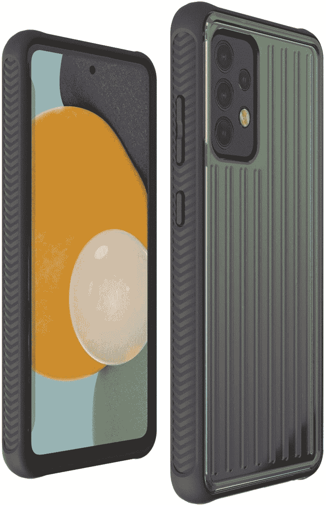
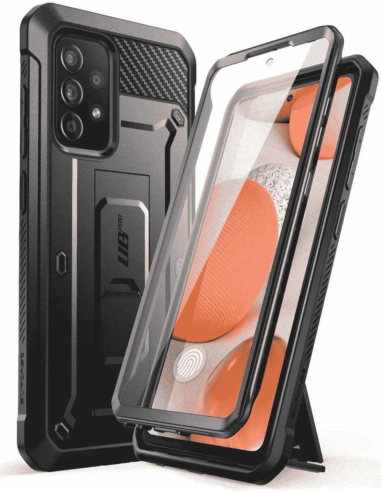
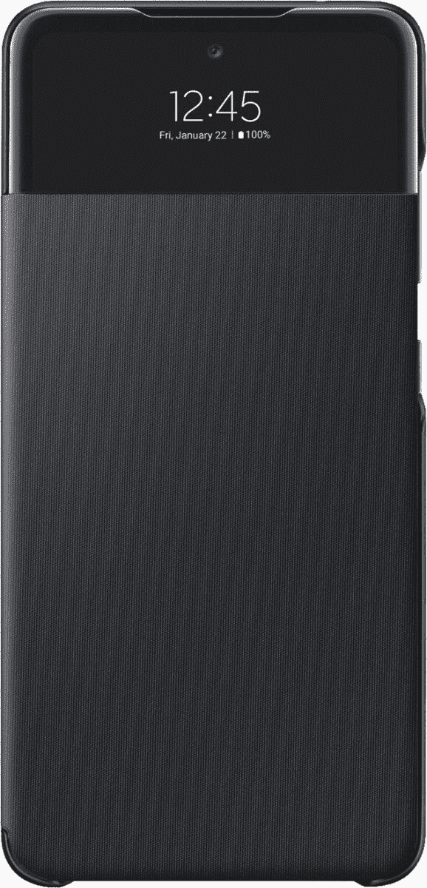
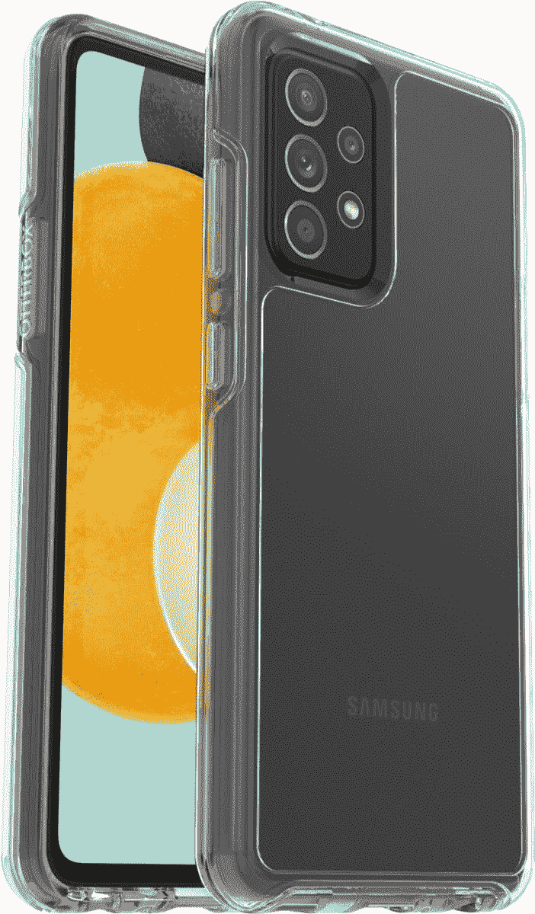
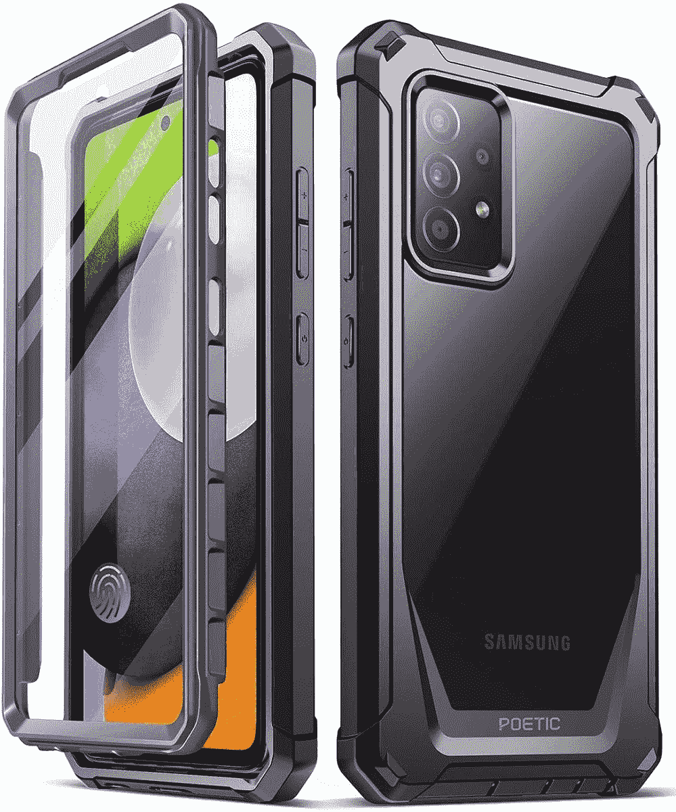

# 2023 年三星 Galaxy A52 和 A52s 的最佳案例

> 原文：<https://www.xda-developers.com/best-galaxy-a52-cases/>

# 2023 年三星 Galaxy A52 和 A52s 的最佳案例

使用这些保护套，为您的 Galaxy A52 系列手机增添一些保护和个性。

三星 Galaxy A51 和 Galaxy S21 Ultra

三星 Galaxy A52 5G 仍然是你在美国能买到的最好的中档手机之一。该公司甚至推出了 Galaxy A52s 5G 型号，处理器略好。在我们的 [Galaxy A52 5G 评测](http://www.xda-developers.com/samsung-galaxy-a52-5g-review/)中，我们对它赞不绝口，所以如果你现在打算购买它，请务必阅读这篇文章。关于这款手机，我们唯一要改变的是它的塑料背面和框架，它不断提醒我们这不是一款旗舰手机。值得庆幸的是，你可以买一个最好的外壳来改变你的设备的整体外观和感觉，同时也为它增加一些保护。如果你想知道为 Galaxy A52 5G 或 Galaxy A52s 5G 购买哪个外壳，那么这里有一些可靠的选择供你考虑。

Galaxy A52 系列中的所有三款机型 Galaxy A52 5G、Galaxy A52s 5G 和 Galaxy A52 4G——都采用了相同的设计和尺寸。这意味着下面提到的情况将适合所有三款手机。

*   <picture></picture>

    case ology Parallax

    ##### case ology Parallax Galaxy A52 case

    编辑推荐

    case ology Parallax case 是几乎任何手机的有力竞争者，Galaxy A52 也不例外。它有三种不同的颜色可供选择，为手机增加了大量的保护，而不会使手机变得沉重。

*   ##### KIOMY clear case

    Best Value

    这款简单明了的 Galaxy A52 手机保护套配有混合防黄硬亚克力和 TPU 保护套来保护手机。你可以买这个透明的盒子，但是也有背面有漂亮图案的。

*   <picture></picture>

    XCover Rugged Clear

    ##### XCover Rugged Galaxy A52 Case

    Premium Pick

    XCover Rugged variant 是你可以为你的 Galaxy A52 购买的最超值的保护套之一。它为手机增加了很好的保护，两侧和背面都有纹理。

    T44
*   <picture></picture>

    sup case 独角兽甲壳虫 Pro

    ##### sup case UB Pro Galaxy A52 case

    赞助商

    sup case UB Pro for The Galaxy A52 是一款非常坚固耐用的外壳，带有一些精心设计的额外配件，包括一个皮带夹、一个支架和一个内置支架

*   ##### Spigen 超薄电脑包

    如果你想买一个不会给你的 Galaxy A52 设备增加太多体积的超薄电脑包，那么就看看 Spigen 超薄电脑包吧。虽然它只提供了最低限度的保护，所以请记住这一点。

*   <picture></picture>

    三星钱包封面

    ##### 三星钱包 Galaxy A52 保护套

    这款来自三星的官方钱包封面里面有一个隐藏的口袋用来放卡片。显示屏顶部甚至有一个小窗口，让你不用打开外壳就可以查看来电、报警和事件。

    T34
*   ##### TUCCH 皮套

    Galaxy A52 型号的 TUCCH folio 皮套由皮革制成，可为您的手机提供 360 度全方位保护。它有许多不同的颜色，并且有足够的空间存放三张卡和一些现金。

*   <picture></picture>

    OtterBox Symmetry

    ##### OtterBox Symmetry Galaxy A52 保护套

    在这个列表中有更便宜的透明保护套，但是如果你是 OtterBox 经久耐用的智能手机保护套的粉丝，这款可能就是你想要的它由超过 60%的回收塑料制成。

*   <picture></picture>

    诗意守护保险杠保护套

    ##### 诗意守护 Galaxy A52 保护套

    诗意的坚固保护套最棒的地方在于它带有一个透明背板，可以让你炫耀你手机的颜色。它相对便宜，还带有内置屏幕保护装置。

这就结束了我们收集的三星 Galaxy A52 系列的最佳案例。正如我们之前提到的，所有情况下，无论你拥有的 Galaxy A52 型号如何，都将适合，所以请随意选择你喜欢的型号。如果我们要选择一个，那么我们会选择 Caseology Parallax case，因为它看起来很棒，也为你的手机提供了很好的保护。或者，你也可以考虑购买 Spigen Thin Fit 或 Xcore Rugged case，这取决于你的喜好和你想要的保护程度。

 <picture></picture> 

Samsung Galaxy A52 5G

##### 三星 Galaxy A52 5G

Galaxy A52 是三星的一款不错的中档智能手机，提供 5G 连接、功能强大的芯片组和 120Hz 显示屏。

那么，你打算为你的 Galaxy A52 手机购买哪种外壳呢？请在下面的评论中留言告诉我们。如果你仍然对购买 Galaxy A52 智能手机犹豫不决，那么请查看我们的 [Galaxy A53 5G 与 Galaxy A52 系列](https://www.xda-developers.com/samsung-galaxy-a53-vs-samsung-galaxy-a52-5g-4g-a52s/)对比，找出哪一款适合你。