# 2023 年最佳三星 Galaxy Buds+案例

> 原文：<https://www.xda-developers.com/best-galaxy-buds-cases/>

如果你已经在没有外壳的情况下使用你的[三星 Galaxy Buds+](https://www.xda-developers.com/samsung-galaxy-buds-plus-review/) 有一段时间了，你可能已经注意到在顶部、底部和侧面有一些划痕，甚至可能在耳塞上也有。我们创建了这个列表，向您展示最好的三星 Galaxy Buds+保护套，并帮助您防止因意外跌落和磨损而损坏无线耳塞。

Galaxy Buds+由塑料制成，非常容易划伤，特别是如果你是那种喜欢在早上高峰时把它们扔在包里或放在口袋里的人——我肯定是那种人，因此，我自己的 Galaxy Buds 在侧面和顶部都有一些划痕。Galaxy Buds+仍然是今天市场上[最好的无线耳塞](https://www.xda-developers.com/best-wireless-earbuds/)之一，它与[三星设备](https://www.xda-developers.com/best-samsung-phones/)配合得最好，但幸运的是，该公司使它非常容易和兼容地连接到[其他伟大的设备](https://www.xda-developers.com/best-phones/)——而不仅仅是运行 Android 的设备。

以下列表包括硅胶、坚固、纤薄和透明外壳。如果你感兴趣的话，有些箱子还有多种颜色可供选择。请注意，这些外壳适用于 Galaxy Buds 和 Galaxy Buds+，因为设备和外壳尺寸相同。

 <picture>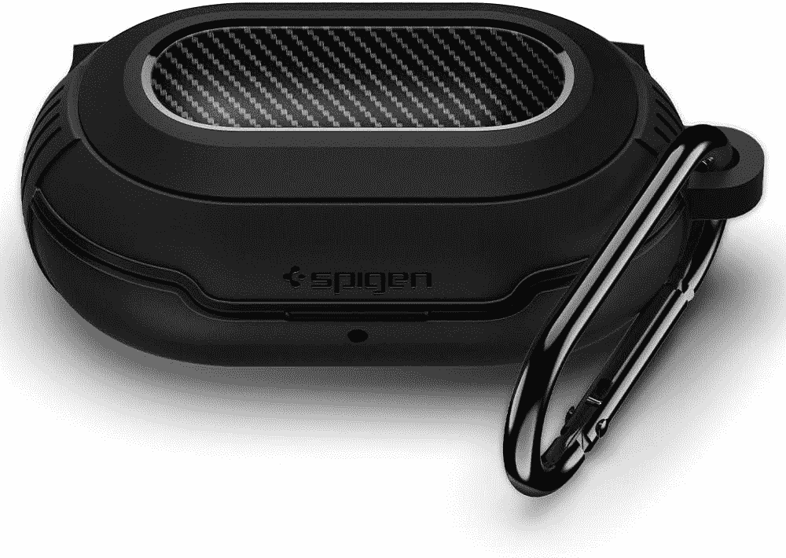</picture> 

Spigen Rugged Armor

##### 斯皮根坚固的装甲银河芽盒

Spigen 坚固耐用的哑光黑色外壳有助于防止意外跌落，为您的 Galaxy Buds+提供最佳保护。它甚至配有一个钩环，这样你就可以把它挂在你的包和其他日常携带物品上。

 <picture>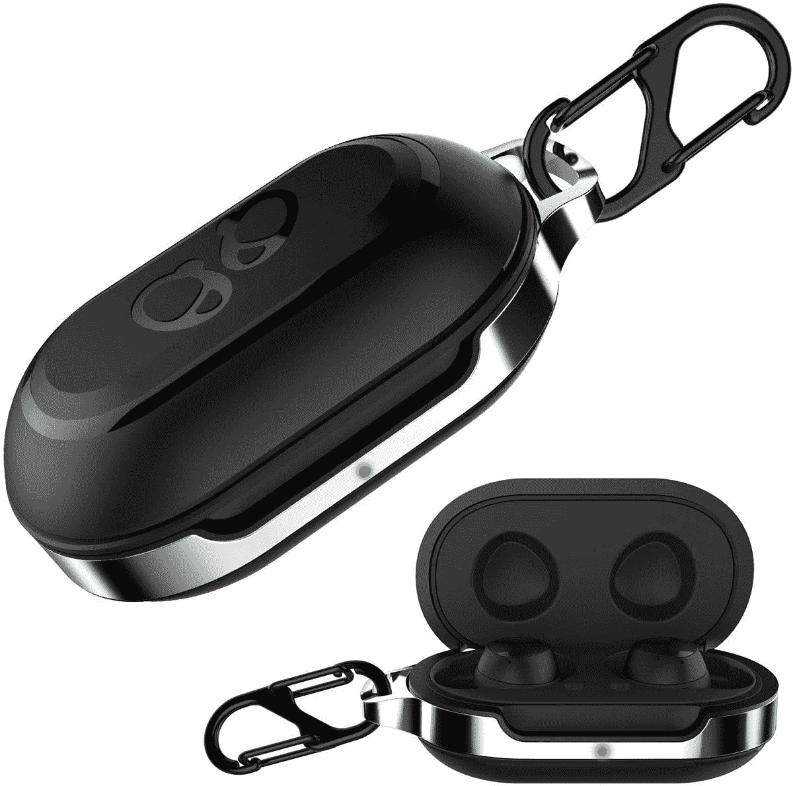</picture> 

Halleast TPU Full Protective Carrying Case

##### 哈雷 TPU 银河花蕾案

安装只需几分钟，如果你想要更多的定制选项，它有 5 种颜色可供选择。TPU 贴在充电盒的底部和顶部，为跌落和刮擦提供全面保护。

 <picture>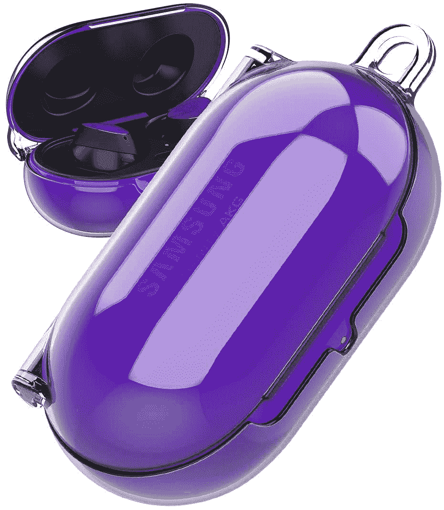</picture> 

Araree Polycarbonate Clear Case

##### Araree 聚碳酸酯透明银河芽盒

这显然不会影响 Galaxy Buds+的外观。它不需要任何粘合剂，因为坚固的外壳会自己留在箱子上。

 <picture>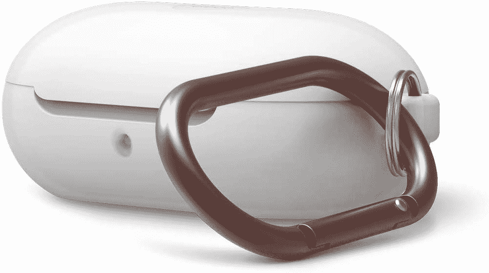</picture> 

Elago Silicone Case

##### Elago 硅银河芽案件

它无缝地粘在充电盒的顶部和底部，提供全身保护。

 <picture>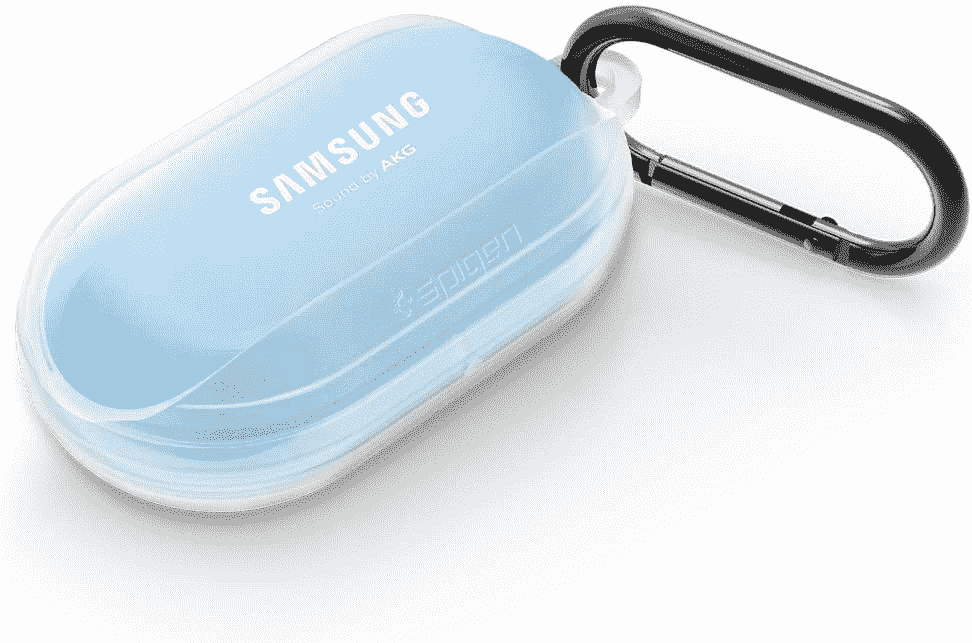</picture> 

Spigen Liquid Air

##### Spigen 液态空气银河芽盒

这款简洁轻巧的保护套来自最受信赖和喜爱的品牌之一——sp igen。它提供精确的断路器、无线充电支持和您期望的保护。

 <picture>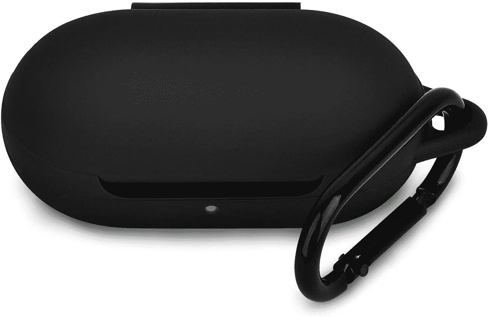</picture> 

Airspo Silicone Case

##### Arspo 硅胶银河芽盒

它有多种不同的颜色可供选择，所以如果你想让你的 Galaxy Buds+有不同的颜色，同时还能保护它，这是一个非常棒的廉价保护套。

 <picture>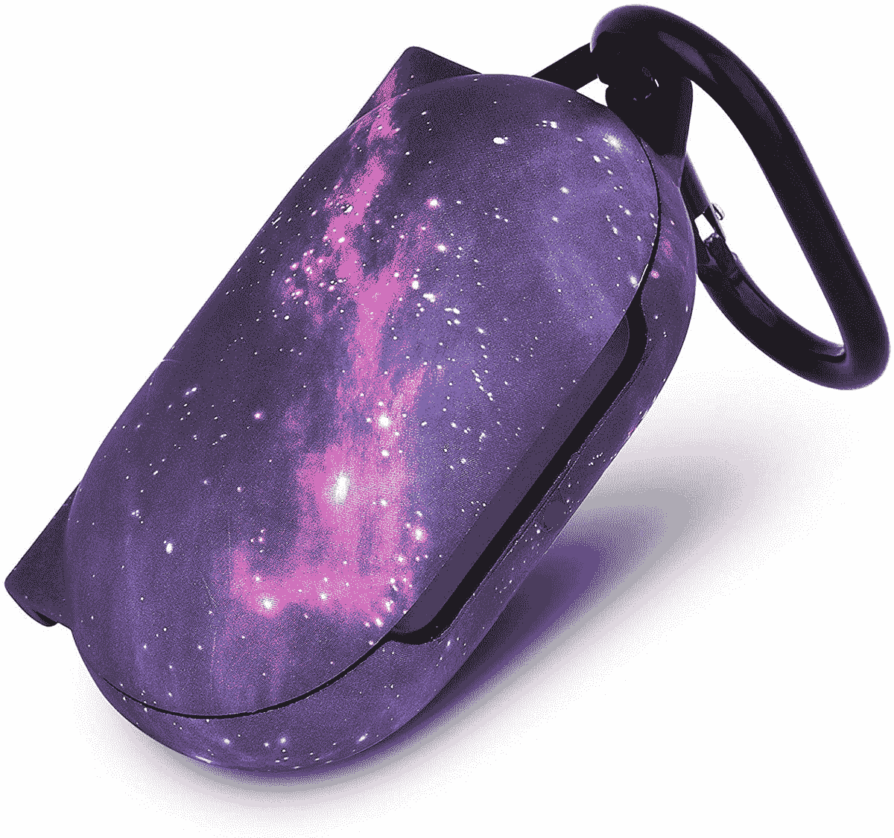</picture> 

Mofree Hard Case

##### 莫弗里硬银河芽案件

有许多可供选择的变体，每一个都比其他的更好看。它不需要粘合剂，可以覆盖整个充电盒，提供更多保护。

 <picture>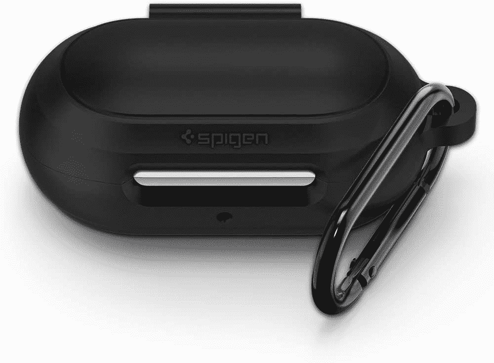</picture> 

Spigen Silicone Fit

##### Spigen Silcone Fit Galaxy Buds 表壳

全方位覆盖，简约外观。它使用粘合剂粘在外壳上，防止划伤和掉落。

 <picture>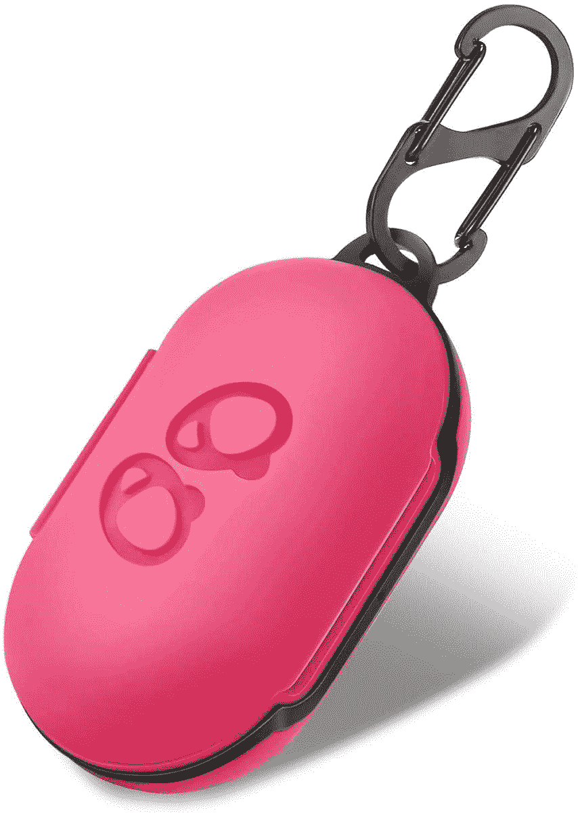</picture> 

LiZHi Silicone Case

##### 丽致硅胶银河蓓蕾保护套

它采用修身剪裁，有 9 种颜色可供选择。它还有一个钩环，所以你可以把它钩在你的包上。

 <picture>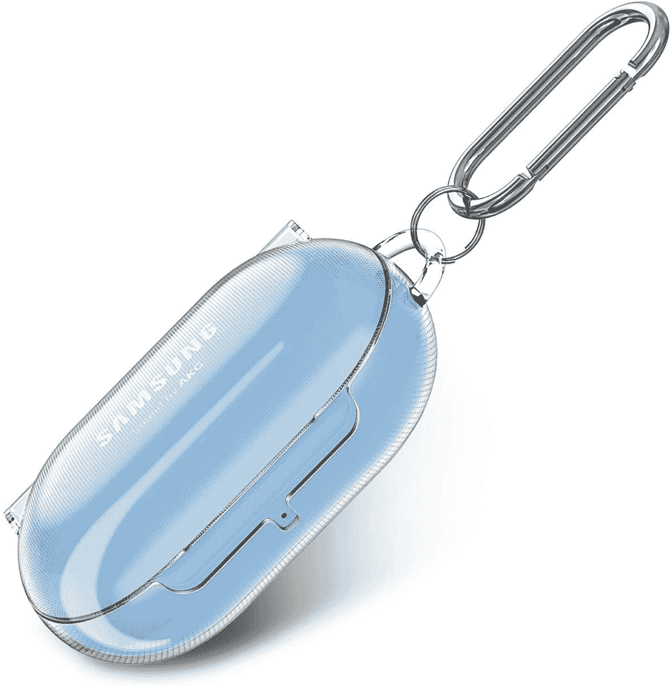</picture> 

Fintie Transparent Hard Case

##### Fintie 透明硬银河芽盒

如果你想给你的 Galaxy Buds+一个透明的外壳，同时也给它足够的保护，这里有一个好的外壳可以考虑。

 <picture>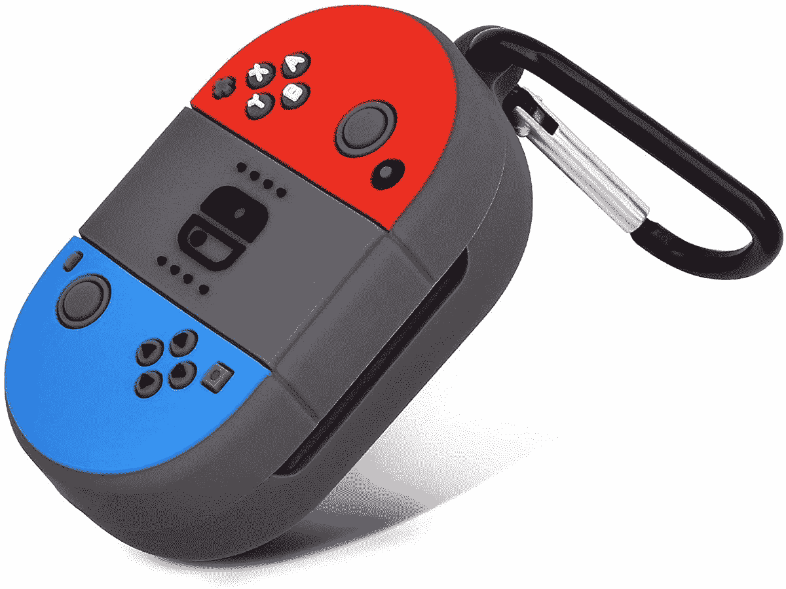</picture> 

Silicone Switch Case

##### 青青开关银河芽案件

如果你有一台任天堂 Switch 或者你是它设计的粉丝，这款 Galaxy Buds+肯定会吸引你！

 <picture>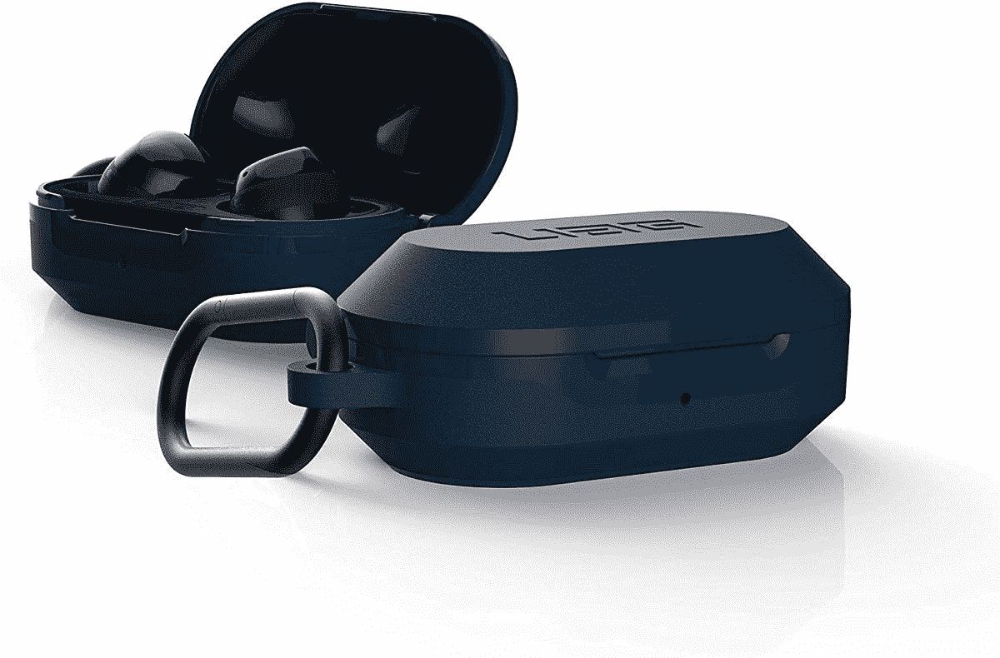</picture> 

UAG Rugged Case

##### UAG 野鸭银河芽案件

众所周知，UAG 案例提供了一流的保护。这种情况下增加了一些体积，但提供了大量的保护。

综述包括许多选项，可帮助您保护您的三星 Galaxy Buds+。它包括普通的硅胶保护套、坚固的保护套、超薄的保护套，甚至是彩色的保护套。有些情况下可以直接应用，而另一些可能需要粘合剂和其他材料来粘贴到您的芽+充电外壳。

虽然每个产品都经过仔细检查，但有些产品可能比其他产品有更大的差距，所以建议一次检查更多的产品，看看哪个适合您和您的需求。许多情况下还支持或有一个钩，你可以用它来连接你的腰带，包和其他配件芽。

如果你想要最好的保护，Spigen 坚固装甲和 UAG 保护套应该是你的主要选择。如果你正在寻找一款既能提供相当程度的保护又不会增加太多体积的轻薄外壳，Airspo 硅胶外壳和 Spigen Slim Fit 是你应该考虑的选择。

 <picture></picture> 

Samsung Galaxy Buds+

##### 三星 Galaxy Buds+

三星 Galaxy Buds+仍然是当今市场上最好的无线耳塞之一。它以实惠的价格提供了最佳的声音体验和话筒质量。它还兼容几乎所有设备，因为大多数安卓设备甚至 iPhone 上都可以使用该应用程序。