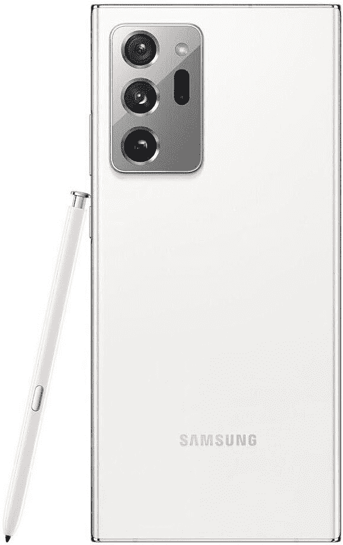

# 最佳 Galaxy Note 20 交易:三星，美国电话电报公司，等等！

> 原文：<https://www.xda-developers.com/best-galaxy-note-20-deals/>

Galaxy Note 20 在这一点上已经存在了一段时间。这是三星最后一款 Note 系列手机，因为整个产品线被取消，取而代之的是支持 S-Pen 的新款 [Galaxy Z Fold 3](https://www.xda-developers.com/samsung-galaxy-z-fold-3/) 。如果你是触控笔的粉丝，Galaxy Note 20 仍然是一款不错的设备。这些优惠将让你以更低的价格获得这款手机。

## 美国最佳解锁版 Galaxy Note 20 交易

解锁版 Galaxy Note 20 在三大零售商处有售——亚马逊、三星和百思买。他们都提供不同的交易-看看下面！

## 亚马孙

想着在亚马逊抢 [Galaxy Note 20？如果你有亚马逊 Prime Rewards 签证，你可以注册一个 18 个月的付款计划。当然，当你在那里的时候，你也可以拿起一个 Galaxy Note 20 保护套(并且](https://www.amazon.com/Samsung-Factory-Unlocked-Smartphone-Long-Lasting/dp/B08BX8BZ1P?tag=xda-6l99khl-20&ascsubtag=UUxdaUeUpU3845&asc_refurl=https%3A%2F%2Fwww.xda-developers.com%2Fbest-galaxy-note-20-deals%2F&asc_campaign=Short-Term)[我们已经总结了最好的保护套](https://www.xda-developers.com/best-galaxy-note-20-ultra-cases/))。

 <picture></picture> 

Samsung Galaxy Note 20

##### 三星 Galaxy Note 20

如果你想要最简单的结账方式，以及通过你现有的亚马逊账户订购的安全性，不用再找了。如果你有亚马逊 Prime Rewards 签证，你也可以注册一个付款计划。

## 三星电子

如果你最近有一部手机以旧换新，你会想从三星那里得到你的 [Note 20。以旧换新最多可获得 400 美元的折扣，使手机总价降至 600 美元。通常你最多只能得到 400 美元的折扣。此外，在假期，你可以从三星商店独家获得特别的红色版本的 Galaxy Note 20。](http://xda.tv/GalaxyNote20Samsung)

 <picture></picture> 

Samsung Galaxy Note 20

##### 三星 Galaxy Note 20

忘记其他的交易吧——如果你想在解锁的 Galaxy Note 20 上节省一大笔钱，并拥有一部最新的手机，三星的以旧换新优惠是最好的。通过正确的以旧换新，你可以获得高达 400 美元的信贷，使 Note 20 非常实惠。

## 百思买集团

如果你想从百思买拿回你的 Note 20，你有几个选择。如果你拿着解锁的手机，你会节省 50 美元。如果你去威瑞森或美国电话电报公司，折扣高达 400 美元！

 <picture></picture> 

Samsung Galaxy Note 20

##### 三星 Galaxy Note 20

你能在百思买得到一些折扣。你可以从解锁的手机中获得 50 美元，或者从威瑞森或美国电话电报公司的手机中获得 400 美元。

## 美国最佳运营商 Galaxy Note 20 交易

当然，各大运营商也在销售 Galaxy Note 20。以下是对他们每个人来说最好的交易。

## 威瑞森

威瑞森通常有很多促销活动可以利用他们的手机，Galaxy Note 20 也不例外。这里只是其中的几个提议。

*   买一个，送一个 1000 块。
*   以旧换新可以节省 800 美元，即使手机已经损坏。
*   转换并节省高达 200 美元。

 <picture></picture> 

Samsung Galaxy Note 20

##### 三星 Galaxy Note 20

获得威瑞森 5G 毫米波网络的全部功能，同时享受各种优惠。无论你选择哪一个，当你在一个毫米波 5G 区域时，期待巨大的覆盖范围和极快的速度！

## 美国电话电报公司(American Telephone and Telegraph Company)

在美国电话电报公司，购买 Note 20，你可以以每月 5 美元的价格获得 Galaxy Tab S5e。

 <picture></picture> 

Samsung Galaxy Note 20

##### 三星 Galaxy Note 20

如果你最近有一部手机可以折价，并且不介意在美国电话电报公司，这可能是适合你的交易。符合条件的以旧换新最高可获得 700 美元！

如果你正在寻找一款现在价格稍低但仍是一款出色旗舰产品的话，Note 20 是一款不错的设备。如果你在寻找顶级产品，你会想看看三星的最新旗舰产品，Galaxy S21 系列！