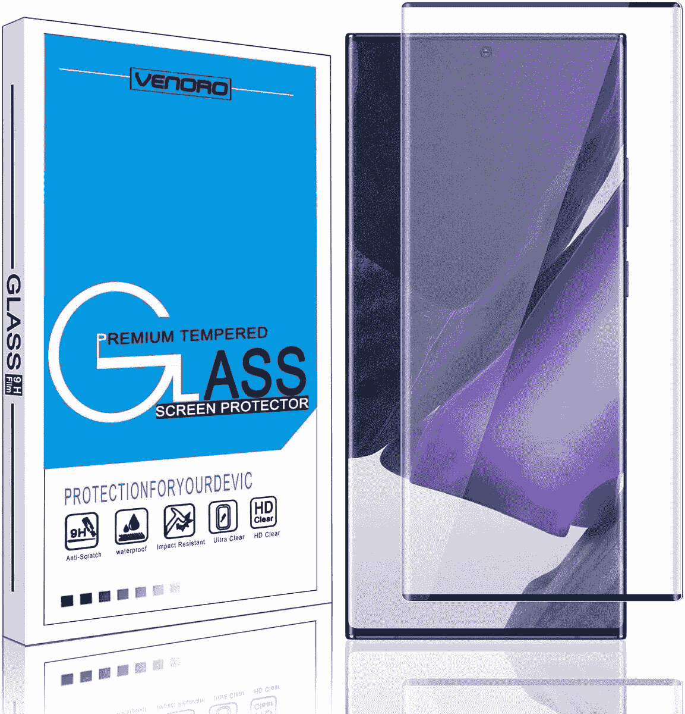
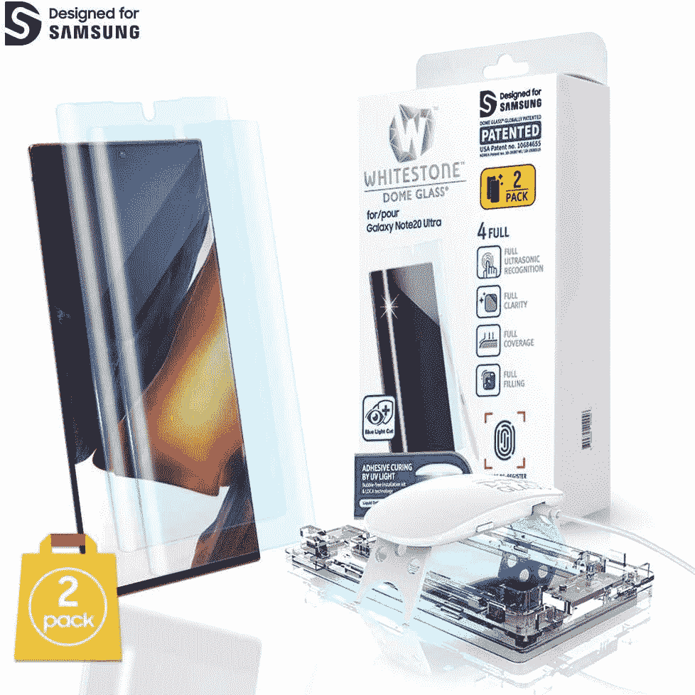
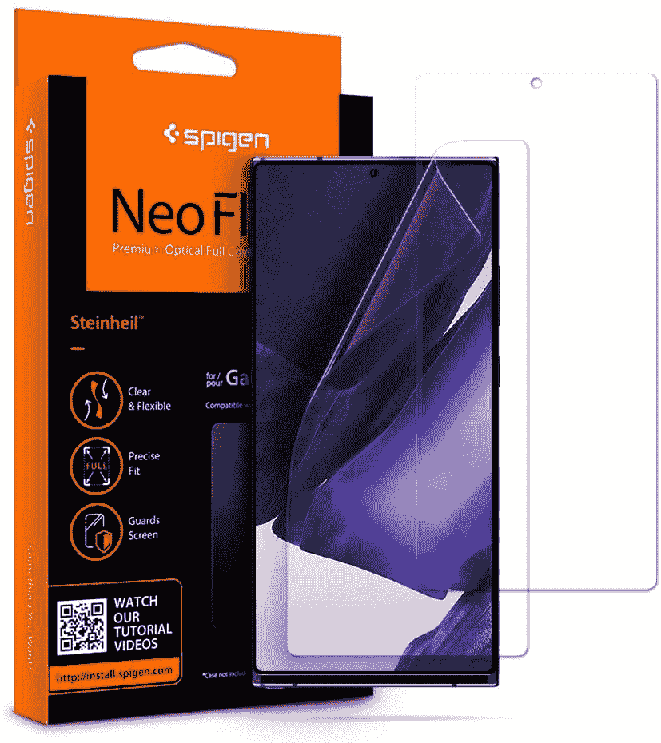
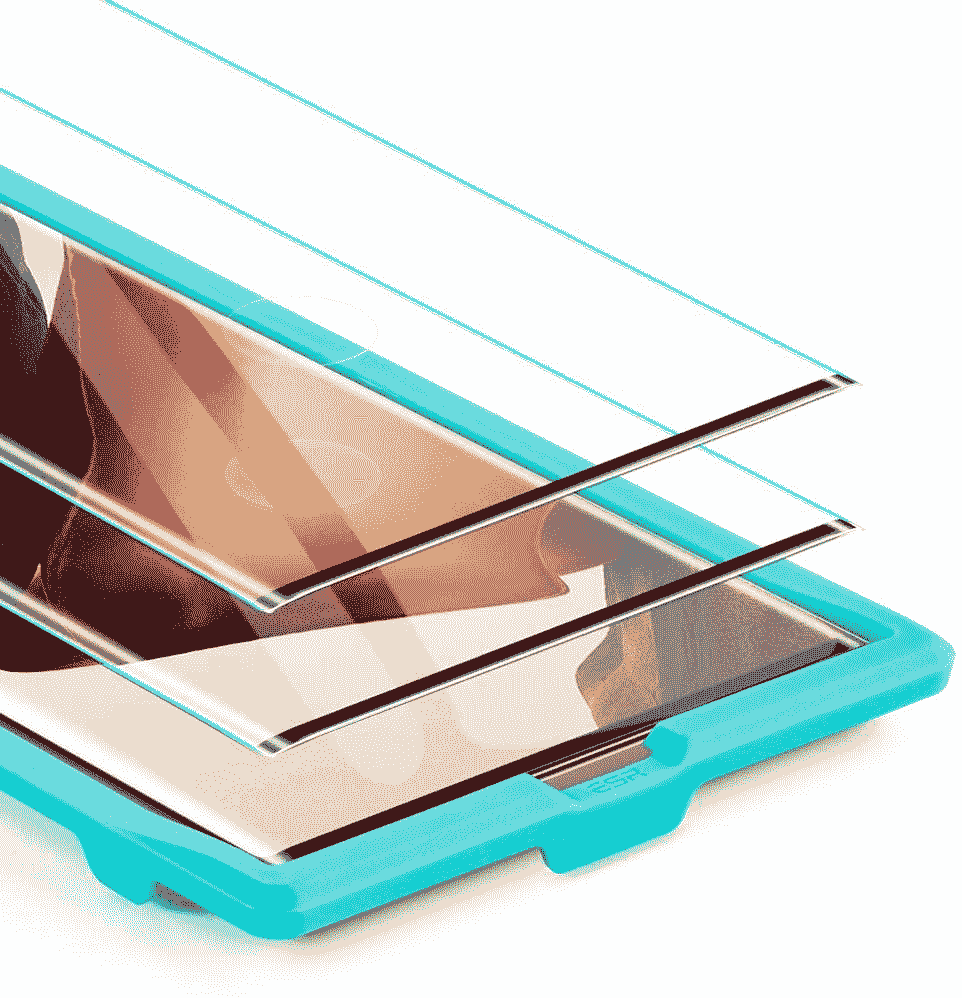
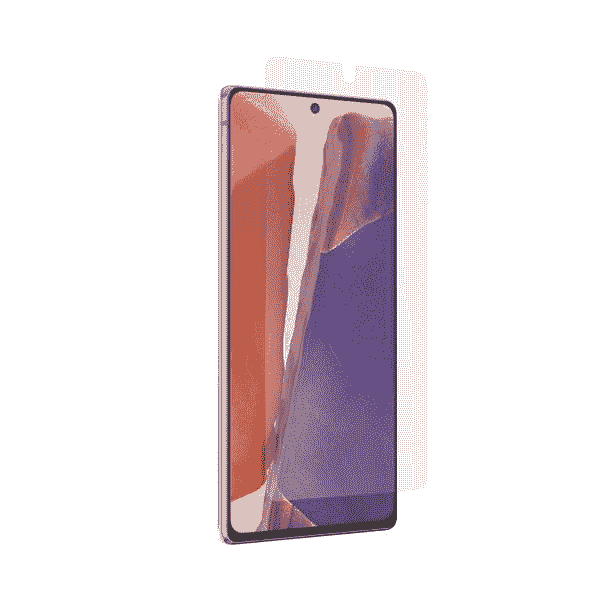
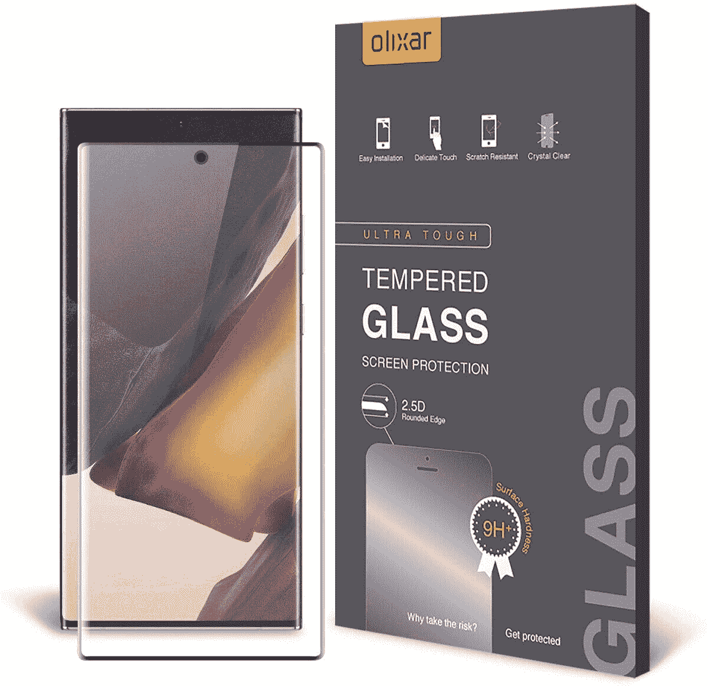
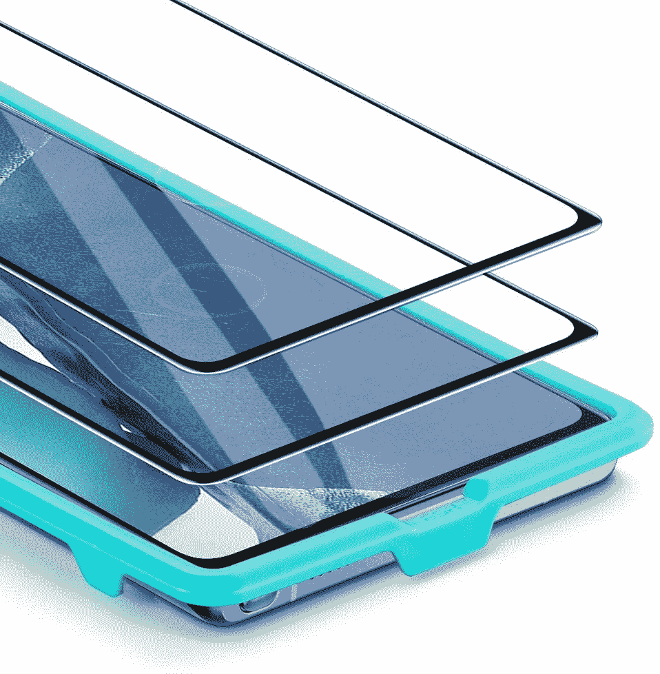
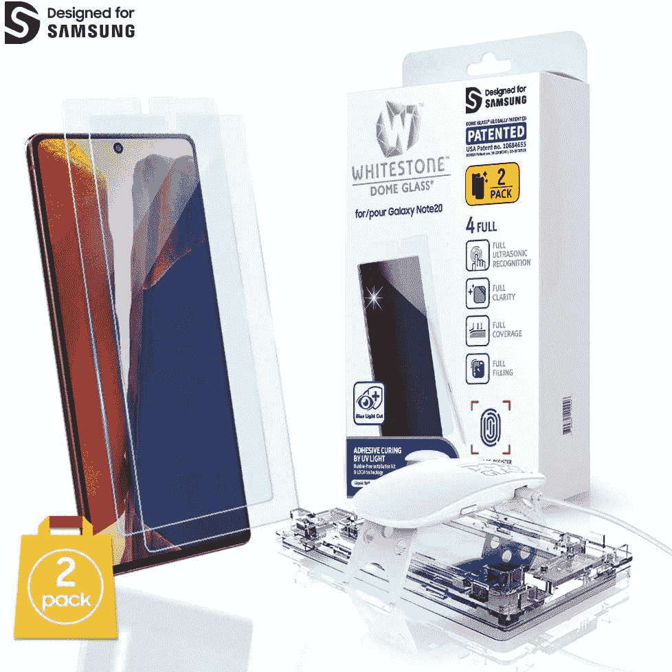
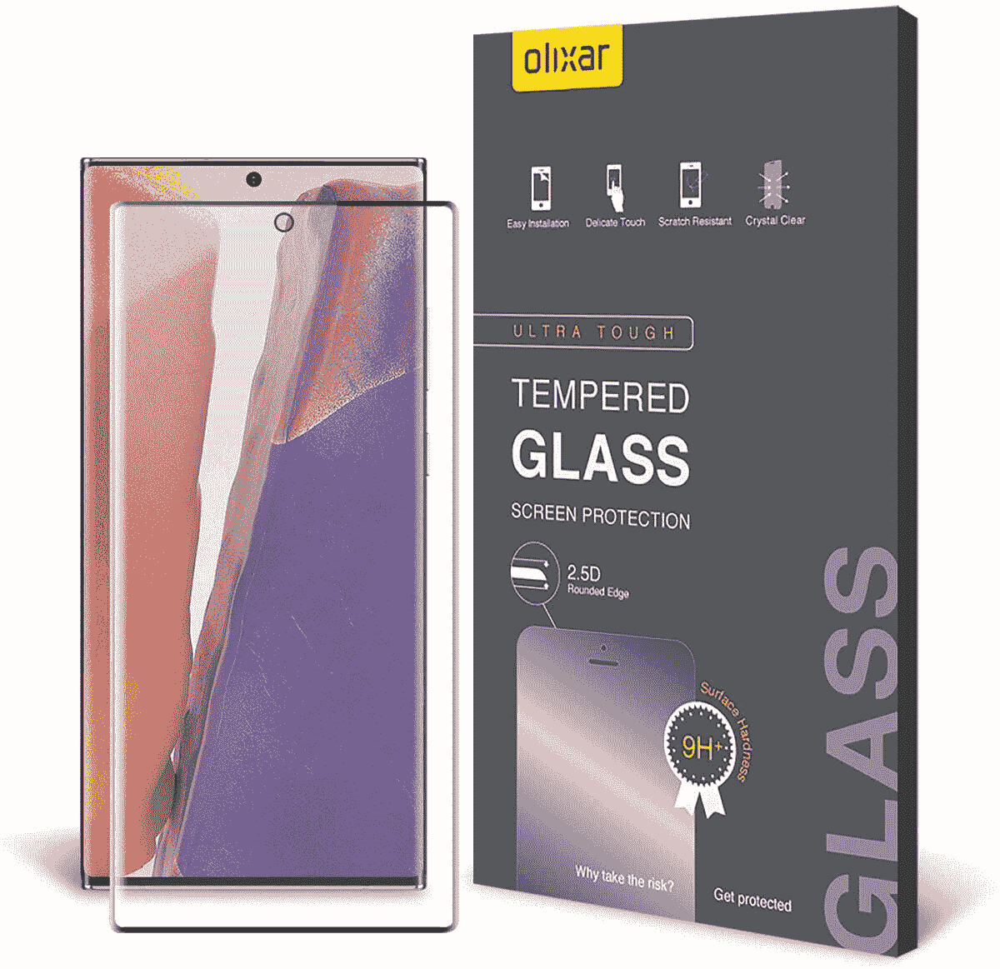

# 2020 年最佳 Galaxy Note 20 和 Note 20 Ultra 屏幕保护器

> 原文：<https://www.xda-developers.com/best-galaxy-note-20-ultra-screen-protectors/>

# 这些是最好的 Galaxy Note 20 和 Note 20 Ultra 屏幕保护器

拿起一部三星 Galaxy Note 20 想保护屏幕？我们挑选了几款你能在网上买到的最好的 Galaxy Note 20 屏幕保护器。

手机屏幕很脆弱，无论如何，一次不幸的摔落很容易打碎屏幕，不管一家公司声称他们的玻璃有多防摔。玻璃就是玻璃，玻璃受冲击会碎。即使你非常小心你的智能手机屏幕，玻璃也很容易划伤。如果阳光直射，即使是微小的划痕也很容易吸引你的眼球。

三星 Galaxy Note 20 系列刚刚推出，你不会希望你漂亮的新手机屏幕破裂或被划伤吧？这些是我们为三星 Galaxy Note 20 系列挑选的一些屏幕保护器，你目前可以买到。钢化玻璃和塑料完美结合，让你得到你想要的东西。

## 三星 Galaxy Note 20 超屏幕保护器

 <picture></picture> 

Venoro Tempered Glass

##### Venoro 钢化玻璃 Galaxy Note 20 屏幕保护器

Venoro 是一个声誉良好的品牌，这种钢化玻璃屏幕保护器应该可以非常好地保护您的 Galaxy Note 20。它也有一层疏油涂层，所以它不会感觉和你的普通屏幕有什么不同。

 <picture></picture> 

Whitestone Dome Protectors

##### 白石圆顶玻璃银河 Note 20 超屏幕保护器

这可能看起来很贵，但白石穹顶是一个优质品牌。它内置了指纹传感器，还配有一个特殊的涂抹器来防止气泡，因为我们都知道涂抹它们有多困难。

 <picture></picture> 

Spigen NeoFlex Protector

##### Spigen NeoFlex Galaxy Note 20 超屏幕保护器

Spigen 是智能手机保护领域最知名的公司之一。Spigen NeoFlex 保护器配有两个保护器，如果其中一个损坏，您可以更换。9.99 美元太便宜了！

 <picture></picture> 

ESR Tempered Glass 2 Pack

##### ESR 钢化玻璃 Galaxy Note 20 屏幕保护器

钢化玻璃屏幕保护器是你能得到的最好的保护。它们是你手机屏幕的额外一块玻璃。你甚至有两个，以防其中一个坏了。

 <picture></picture> 

ZAGG InvisibleShield

##### ZAGG invisible shield glass fusion+Galaxy Note 20 超屏保护器

ZAGG invisible shield glass fusion+可能有点贵，但它提供了一种抗菌涂层，可以杀死屏幕上大多数与手机有关的细菌。Zagg 也因出色的保护而闻名！

 <picture></picture> 

Olixar Glass Protector

##### Olixar 玻璃银河 Note 20 超屏幕保护

Olixar 是另一个声誉良好的屏幕保护器品牌，现在您可以为三星 Galaxy Note 20 Ultra 挑选一个他们的钢化玻璃保护器！

## 三星 Galaxy Note 20 屏幕保护器

 <picture></picture> 

ESR Tempered Glass 2 Pack

##### ESR 钢化玻璃 Galaxy Note 20 屏幕保护器

钢化玻璃屏幕保护器是你能得到的最好的保护。它们是你手机屏幕的额外一块玻璃。你甚至有两个，以防其中一个坏了。

 <picture></picture> 

Whitestone Dome Protectors

##### 白石圆顶玻璃银河 Note 20 超屏幕保护器

这可能看起来很贵，但白石穹顶是一个优质品牌。它内置了指纹传感器，并配有一个特殊的涂抹器来防止气泡。

 <picture></picture> 

Olixar Glass Protector

##### Olixar 玻璃银河 Note 20 超屏幕保护

Olixar 是屏幕保护器中另一个声誉良好的品牌，现在你可以为三星 Galaxy Note 20 挑选一个他们的钢化玻璃保护器！

三星 Galaxy Note 20 和 Note 20 Ultra 都是功能强大的手机，尽管它们也很贵。你肯定想用钢化玻璃屏幕保护器来保护他们的屏幕。

虽然对于白石圆顶屏幕保护装置来说，70 美元看起来很贵，但考虑到更换屏幕的成本可能会高得多，这并不算多。现在花 70 美元来保护你的屏幕，或者以后可能花数百美元来更换屏幕本身。

如果你想真正便宜，Note 20 Ultra 的 [Spigen NeoFlex 是一个便宜货。2](https://www.amazon.com/dp/B08CZ15HZR?tag=xda-6un7p33-20&ascsubtag=UUxdaUeUpU29407&asc_refurl=https%3A%2F%2Fwww.xda-developers.com%2Fbest-galaxy-note-20-ultra-screen-protectors%2F&asc_campaign=Short-Term) 的 [ESR 封装对于普通 Note 20 也很棒，因为你以 1 的价格得到 2。如果它坏了，就换一个吧！](https://www.amazon.com/dp/B08C59M2CQ?tag=xda-6un7p33-20&ascsubtag=UUxdaUeUpU29407&asc_refurl=https%3A%2F%2Fwww.xda-developers.com%2Fbest-galaxy-note-20-ultra-screen-protectors%2F&asc_campaign=Short-Term)