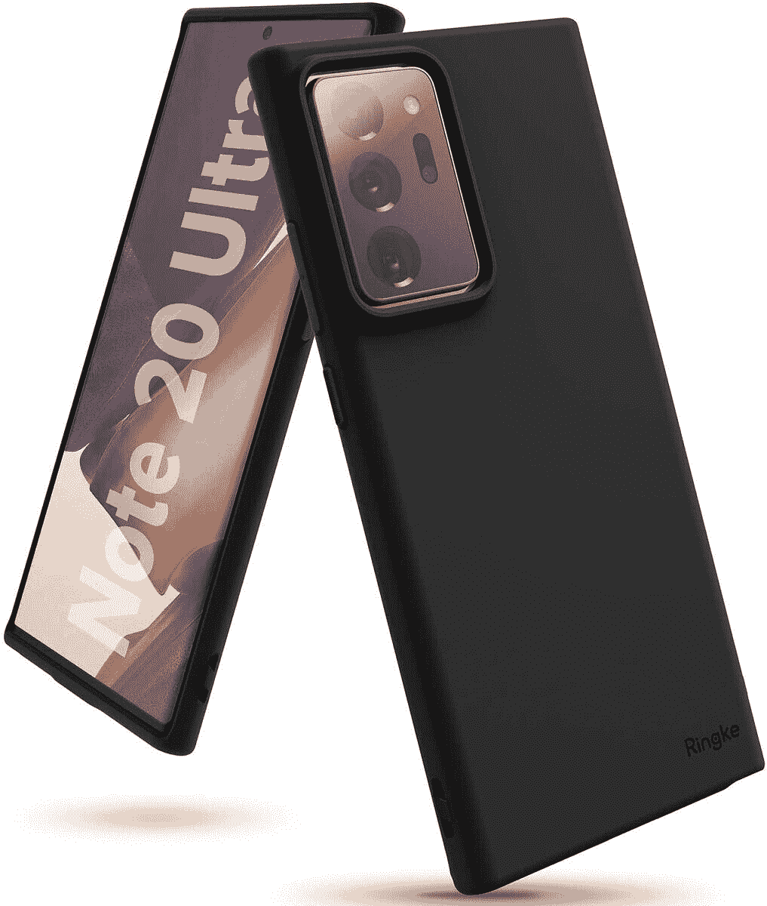
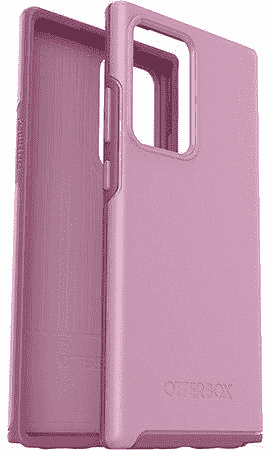
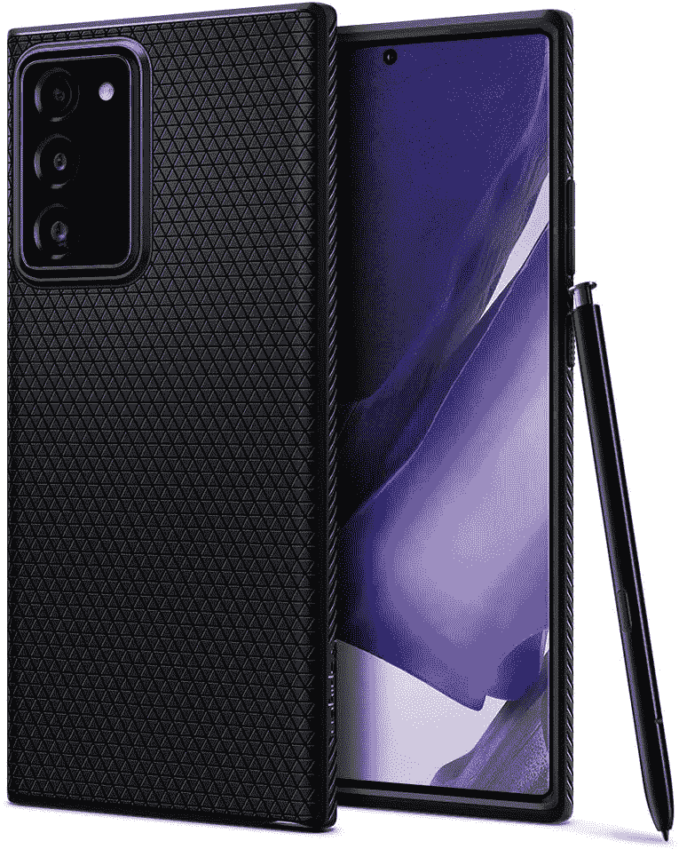
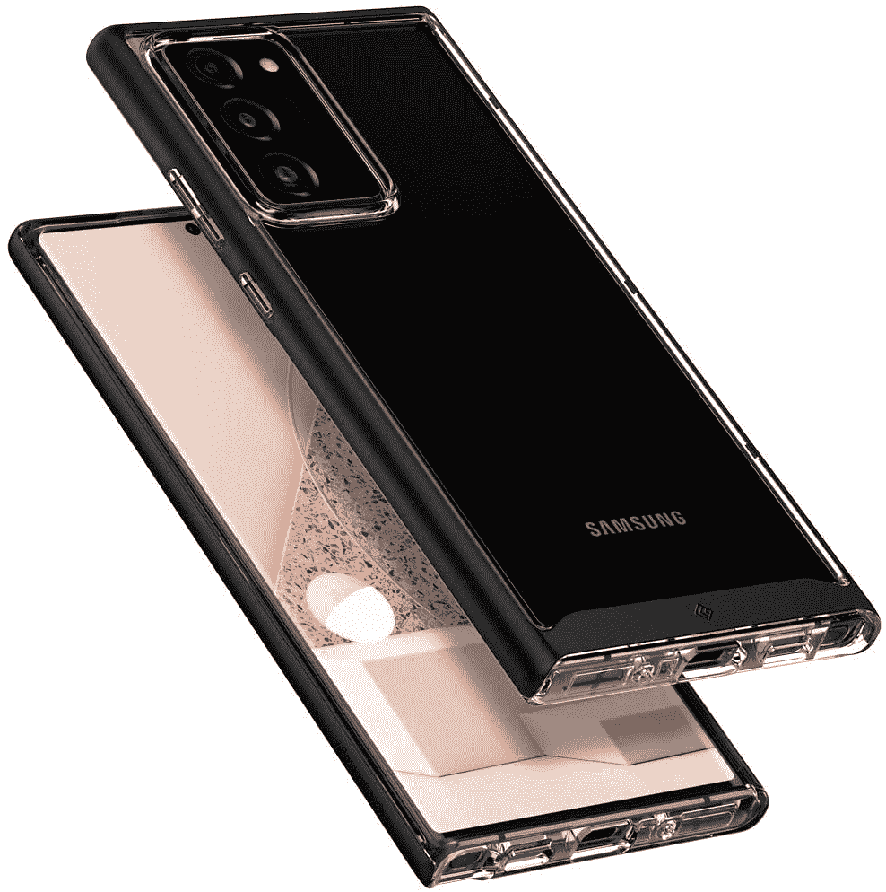
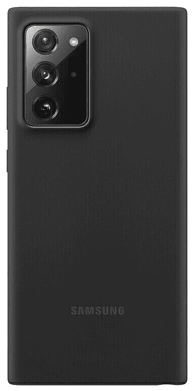
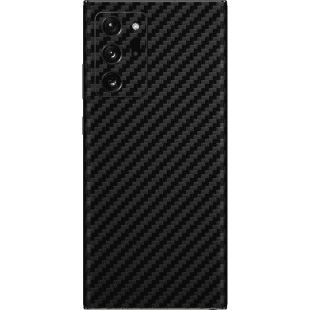
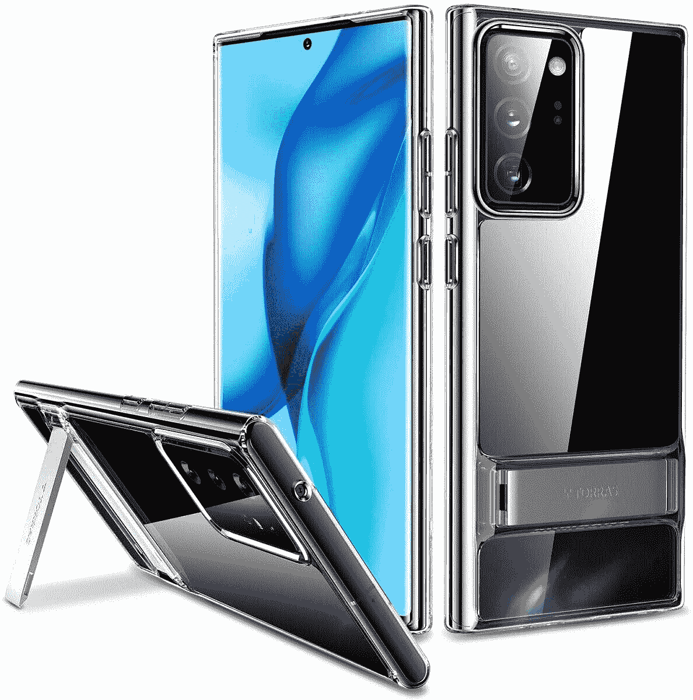
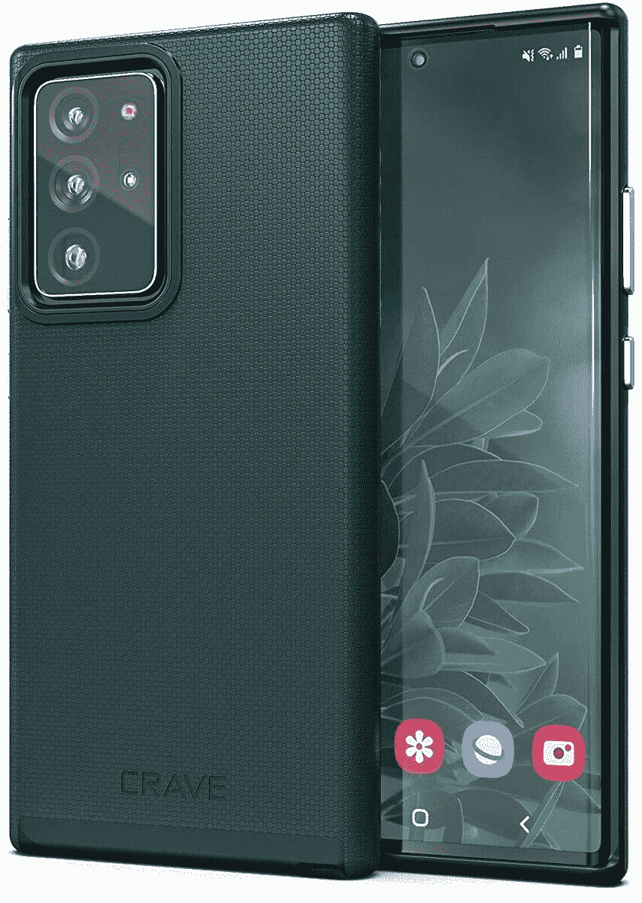

# 2023 年最佳 Galaxy Note 20 超薄保护套

> 原文：<https://www.xda-developers.com/best-galaxy-note-20-ultra-thin-cases/>

# 2023 年最佳 Galaxy Note 20 超薄保护套

拿起一部 Galaxy Note 20 Ultra，想要没有体积的保护？我们挑选了几款最好的 Galaxy Note 20 超薄外壳。

Galaxy Note 20 Ultra 是三星的最后一款 Note 系列手机，由 Galaxy Z Fold 3 取代。如果你想在智能手机上完成严肃的工作，S-Pen 增加了一些有用的功能。这意味着即使 Galaxy S21 系列现在是三星的旗舰产品，一些用户也可能会选择 Note 20 Ultra 而不是 S1 Ultra 作为 S-Pen。此外，随着[三星 Galaxy S21](https://www.xda-developers.com/samsung-galaxy-s21/) 现已上市几个月，你将看到 Note 20 Ultra 上的许多交易，尽管 Galaxy Note 20 不再是三星的最新旗舰，但它绝不是过时的。

然而，任何智能手机仍然是一种投资，你会想保护它免受正常使用中的正常碰撞和跌落。也许你不一定需要*最好的*保护，但只要能给它一点额外的抓地力就行了。下面显示的一些 Galaxy Note 20 超薄外壳将在不增加任何额外体积的情况下增加一点保护。

 <picture></picture> 

Ringke Air-S Case

##### 林克空气银河 Note 20 超盒

为什么要在 Galaxy Note 20 这样的薄手机上放一个厚壳？使用 Ringke 的这款简约外壳，保持光滑的曲线并防止刮擦，保护而不太笨重。

 <picture></picture> 

Supcase Unicron Beetle Exo Pro

##### SUPCASE UB Exo Pro Galaxy Note 20 表壳

这是一个比普通外壳略厚的外壳，但有一个透明的背面和一个坚固的保险杠，可以防止跌落。

 <picture></picture> 

Otterbox Symmetry Case

##### OtterBox 对称银河 Note 20 表壳

Otterbox 是坚韧的代名词。如果你正在寻找一个保护与风格暗示的情况下，这是给你的。这款表壳还有黑色、透明和浅灰色可选。

 <picture></picture> 

Spigen Liquid Armor Case

##### Spigen 液体装甲银河 Note 20 超盒

说到案例，你可能听说过 Spigen。该公司有许多受欢迎的产品，但液态空气带来了更多的抓地力和美丽的对称性和一致性，真正吸引了我们。

 <picture></picture> 

ESR Metal Kickstand Case

##### ESR 金属支架 Galaxy Note 20 Ultra 外壳

能够在外出时支撑你的手机是这款手机的一大卖点。其他产品包括凸起的屏幕和摄像头挡板，以防止划伤，以及额外的手柄。

 <picture></picture> 

Caseology Skyfall case

##### 案例学天降银河 Note 20 超案例

这款漂亮的 Caseology Skyfall 手机套有 3 种颜色可供选择，不仅可以展示您手机的自然美，还可以保护它。我以前用过一个，它是一个奇妙的案例！

 <picture></picture> 

Ancerr Ultra Thin Slim cover

##### Anccer 超薄超薄 Galaxy Note 20 超盒

如果你想要的只是一个超薄的箱子，那就别再找了。这不会为你提供很多保护，但你的手机仍然会保持光滑。它还有华丽的红色和蓝色可选。

 <picture></picture> 

Spigen Ultra Hybrid Case

##### Spigen 超混合银河 Note 20 盒

另一款 Spigen 产品，Spigen Ultra Hybrid 提供良好的保护，同时不影响设备的美观。用这款透明保护套展示自己的风格——没有任何体积！

 <picture></picture> 

Samsung Silicone Cover

##### 三星硅胶 Galaxy Note 20 Ultra 外壳

想要一个与你的手机颜色完美搭配的手机套吗？看看三星官方的硅胶外壳就知道了，它有黑色、白色和“棕色”三种颜色，实际上是粉红色。

 <picture></picture> 

DBrand Ultra Grip Case

##### dbrand Grip Galaxy Note 20 Ultra 表壳

DBrand 是一个值得信赖的案例和皮肤品牌，他们拥有大多数竞争对手没有的东西——定制您的案例的能力。DBrand 为您的后壳提供了一系列不同的颜色，同时仍然保持您的设备纤薄。

 <picture></picture> 

TORRAS Freedom Designed

##### 托拉斯自由设计的银河 Note 20 超盒

这种 Torras 外壳可以支撑您的手机，同时提供一个简单的塑料外壳，以保持您的 Note 20 超安全。它还有三年的保修期，所以如果有任何问题，你可以免费更换。

 <picture></picture> 

Crave Dual Guard Protection Series

##### 渴望双护银河 Note 20 超盒

这些案件有独特的优势是非常丰富多彩，有时你只是想要一些不同的外观。Dual Guard Protection 系列有六种颜色可供选择，美观纤薄，甚至兼容 PowerShare。

以上案例之外，应该有一款 Galaxy Note 20 超薄套适合大家。还想看看你的 Note 20 Ultra 的背面设计吗？一定要带上 [Spigen Ultra Hybrid](https://www.amazon.com/Spigen-Hybrid-Designed-Samsung-Galaxy/dp/B089CQPDYT/?tag=xda-54qlb4n-20&ascsubtag=UUxdaUeUpU2796&asc_refurl=https%3A%2F%2Fwww.xda-developers.com%2Fbest-galaxy-note-20-ultra-thin-cases%2F&asc_campaign=Short-Term) ，这样你的智能手机会得到一些保护，同时确保它不会被划伤。想要一些独特的东西来支撑你的手机吗？抓住那个 [ESR 金属支架盒](https://www.amazon.com/Note-20-Ultra/dp/B08C5BCJRG/?tag=xda-54qlb4n-20&ascsubtag=UUxdaUeUpU2796&asc_refurl=https%3A%2F%2Fwww.xda-developers.com%2Fbest-galaxy-note-20-ultra-thin-cases%2F&asc_campaign=Short-Term)，不用自己拿着手机就能使用那个 S Pen。如果你只是想用三星提供的产品，用[三星硅胶套](https://shop-links.co/1743505763946842328?u1=cfc0b54c-d74c-45fb-94c7-e2ddfb4d623e)也没什么不好。它一点也不贵，如果你从三星商店买 Note 20 Ultra，你可以把它们放在一起。

 <picture></picture> 

Samsung Galaxy Note 20 Ultra

##### 三星 Galaxy Note 20 Ultra

Galaxy Note 20 Ultra 是三星最后一批配备大显示屏和 S Pen 的 Note 系列设备之一。