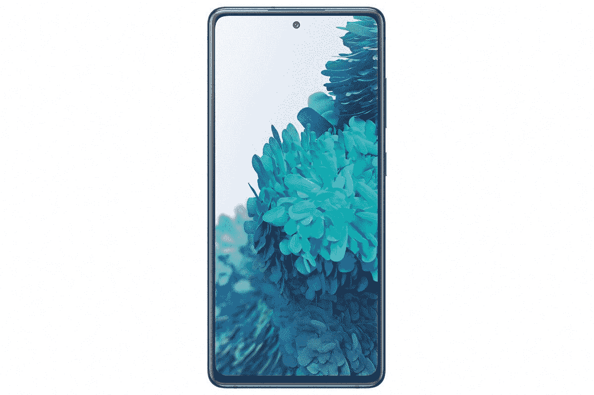
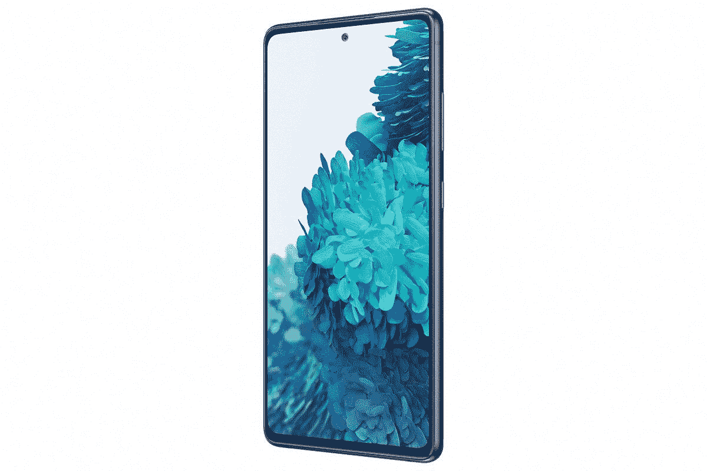

# 最佳三星 Galaxy S20 FE 交易:三星，亚马逊，等等！

> 原文：<https://www.xda-developers.com/best-galaxy-s20-fe-deals/>

三星 Galaxy S20 FE 是 2020 年更多产的产品之一，尽管不是旗舰产品。Galaxy S20 FE 的售价仅为 700 美元，介于实惠和高端之间。我们的 [Galaxy S20 FE 评论](https://www.xda-developers.com/samsung-galaxy-s20-fe-review/)指出，这款手机“将 Galaxy S20 的最佳功能融入了一个更实惠的包中”，无论你是 4G 还是 5G 型号，你都知道你正在获得质量。

Galaxy S20 FE 与更昂贵的同类产品有很多相同的功能，包括华丽的 6.5 英寸 Super AMOLED 显示屏，120Hz 刷新率，骁龙 865 处理器，以及高达 256GB 的存储空间。在我们的 [iPhone 12 与三星 Galaxy S20 FE](https://www.xda-developers.com/apple-iphone-12-vs-samsung-galaxy-s20-fe/) 对比中，我们对比了两款平价旗舰，看看哪一款最好，而在屏幕和续航方面，三星的手机胜出。

虽然 700 美元比大多数三星旗舰机都要便宜，但对大多数人来说，这仍然是一大笔钱。不过不要担心，因为我们已经收集了最好的交易，包括通过以旧换新或购买多种设备来节省大量资金的方法。这也是三星最近推出的最好玩的设备之一，有许多不同的颜色供你选择。

## 在哪里订购 Galaxy S20 FE

现在在美国，你可以从普通的零售商那里买到 Galaxy S20 FE。如果你正在寻找一款解锁的 Galaxy S20 FE，你可以从亚马逊、三星或百思买(Best Buy)挑选一款。如果被锁定在一个运营商不是一个问题，你也可以前往威瑞森，T-Mobile 或 AT&T

## 最佳银河 S20 FE 解锁版

如果你想买一部解锁的 Galaxy S20 FE，你有三个可靠的选择:亚马逊、百思买或三星。

### 三星电子

三星在 S20 FE 的发布价格上提供了 100 美元的折扣。此外，如果你有一部符合条件的手机以旧换新，那么你可以通过符合条件的以旧换新节省多达 150 美元，这款彩色智能手机的价格仅为 449.99 美元。你也可以注册一个 36 个月的付款计划，这大大降低了购买新手机的门槛。

 <picture></picture> 

Galaxy S20 FE 5G

##### 三星 Galaxy S20 FE

除了无锁版 Galaxy S20 FE，Samsung.com 还提供这款手机的运营商版本。

### 百思买集团

百思买目前没有对 Galaxy S20 FE 提供任何价格折扣。但如果你是百思买的信用卡会员，你可以使用它的三个融资选项中的一个来避免在购买时支付全额。

 <picture></picture> 

Samsung Galaxy S20 FE 5G

##### 三星 Galaxy S20 FE

百思买也在销售 Galaxy S20 FE 的解锁版和运营商版。

### 亚马孙

如果你有一部旧智能手机以旧换新，在亚马逊购买 Galaxy S20 FE 可以节省高达 511 美元。此外，根据卖家和颜色变化，您可能会获得高达 80 美元的价格折扣。

 <picture></picture> 

Galaxy S20 FE 5G

##### 三星 Galaxy S20 FE

不幸的是，零售商目前只有 128GB 版本的手机。

## 最佳银河 S20 FE 运营商锁定变体交易

如果你不介意被锁定在一家运营商，你可以前往美国电话电报公司、T-Mobile 或威瑞森，获得一些不错的 Galaxy S20 FE 交易。

### 美国电话电报公司(American Telephone and Telegraph Company)

在美国电话电报公司，无论你是新客户还是已经在使用运营商，你都可以在 36 个月内每月只花 10 美元获得 Galaxy S20 FE。

 <picture></picture> 

Galaxy S20 FE 5G

##### 三星 Galaxy S20 FE

美国电话电报公司只提供 S20 FE 的一种颜色选择和一种存储方式。

### T-Mobile

在 T-Mobile 购买 Galaxy S20 FE 的 128GB 版本可以节省 600 美元，方法是按月付款计划购买手机，并在符合条件的计划中激活一条新线路。节省下来的钱将在 24 个月内以账单信用的形式转给你。

 <picture></picture> 

Samsung Galaxy S20 FE

##### 三星 Galaxy S20 FE

T-Mobile 正在销售 128GB 的 Galaxy S20 FE 和云海军色选项。

### 威瑞森

威瑞森正在免费出售 Galaxy S20 FE，如果你有一个选择无限计划的新线路。此外，如果你用手机购买 Galaxy Tab S7 FE 和 Galaxy Watch，该运营商还提供折扣。

 <picture></picture> 

Samsung Galaxy S20 FE

##### 三星 Galaxy S20 FE

威瑞森只提供云藏青色的 128GB 型号。

* * *

这些是银河 S20 FE 上最好的交易。你打算买这部手机吗？你用的是哪种交易？请在评论区告诉我们。