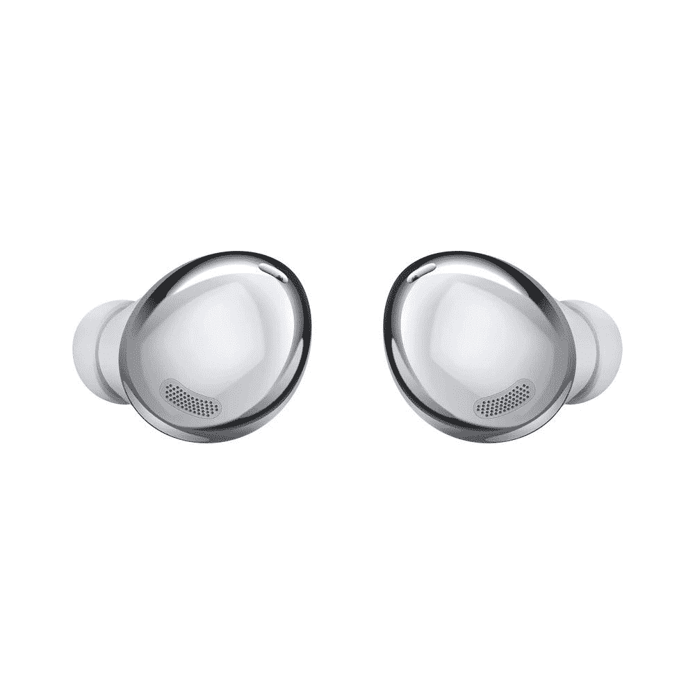

# 最佳 Galaxy S21 和 S21 Plus 交易:2022 年在哪里购买三星的平价旗舰

> 原文：<https://www.xda-developers.com/best-galaxy-s21-deals/>

是时候拿起三星旗舰智能手机的下一个系列了！三星 Galaxy S21 系列已经推出一段时间了，但仍然为那些想要一台的人提供了一套很好的规格和旗舰体验。你可能想知道，[你应该买哪个银河 S21](https://www.xda-developers.com/which-galaxy-s21-should-you-buy/)。常规的 Galaxy S21 型号当然是最实惠的，并且仍然提供一些升级，如更新的 SoC，而不会以 800 美元的价格打破银行。与此同时，Galaxy S21 Plus 将提供额外的升级，如略大的屏幕和大猩猩玻璃背，价格为 1000 美元。Galaxy S21 Ultra 是高端旗舰产品，提供了你想要的 2021 年旗舰产品的一切，但它的价格更高，高达 1200 美元。

如果你在这里，那么你可能会选择一款更便宜的 Galaxy S21 手机。如果你想要三星提供的最好的东西，请查看下面一些伟大的 Galaxy S21 交易，并查看我们的[最佳 Galaxy S21 Ultra 交易综述](https://www.xda-developers.com/best-galaxy-s21-ultra-deals/)。或者，如果你想要一部由不同制造商生产的手机，我们也有一份最佳 Galaxy S21 替代品列表。

## 解锁三星 Galaxy S21 交易

如果你正在寻找一个未锁定的 Galaxy S21，你最好的选择是直接从三星商店购买。你也可以选择百思买和亚马逊。

### 三星商店

在三星，以旧换新时，Galaxy S21 可以节省高达 700 美元。如果你能得到最大金额，那么你的智能手机将只有 100 美元。你也可以注册一个 36 个月的付款计划。

 <picture></picture> 

Samsung Galaxy S21

以旧手机折价并获得高达 700 美元的信用额度。你也可以注册一个 36 个月的付款计划。

### 百思买集团

想去百思买吗？如果您选择一台未锁定的 Galaxy S21 并在今天激活它，您将节省 150 美元。目前没有运营商交易，但无论如何解锁手机更好。也有大量的配色方案可供选择。

 <picture></picture> 

Samsung Galaxy S21

立即在百思买激活解锁的 Galaxy S21，节省 150 美元。

### 亚马孙

你不能否认亚马逊的便利。你不仅可以在 Galaxy S21 上节省 150 美元，还可以享受简单的 Prime shipping。如果你有 Prime Rewards 签证，你也可以注册一个 18 个月的付款计划。

 <picture></picture> 

Samsung Galaxy S21

在亚马逊节省 150 美元，如果你有，享受两天的主要运输。如果你有亚马逊 Prime Rewards 签证，你也可以注册一个 18 个月的付款计划。

## 运营商三星 Galaxy S21 交易

如果你不介意被锁定到一个运营商，你可以节省大。你可以选择威瑞森或者美国电话电报公司

### 威瑞森

威瑞森有许多不同的银河 S21 交易可以利用。这完全取决于你是换到威瑞森还是升级到新的线路。当你以旧换新时，节省高达 800 美元，即使是旧的或损坏的手机(如果升级为 440 美元)。在威瑞森，Galaxy S21 的 24 个月年利率为 0%，售价为 33.33 美元

 <picture></picture> 

Samsung Galaxy S21

有旧的或损坏的手机吗？在威瑞森交易，用一条新的线得到 800 美元。

### 美国电话电报公司(American Telephone and Telegraph Company)

像威瑞森一样，你也可以在 AT&T 以旧换新节省高达 800 美元。不管你是新客户还是正在升级，但你可能无法典当一部坏手机或旧手机。

 <picture></picture> 

Samsung Galaxy S21

如果你是美国电话电报公司的一部分，你可以在这里找到你的 S21。符合条件的以旧换新最高可节省 800 美元，Galaxy Buds Pro 可节省 50%的费用。

## 解锁三星 Galaxy S21 Plus 交易

找 Galaxy S21 Plus 而不是普通型号？你可以在三星商店、百思买和亚马逊找到解锁的。

### 三星商店

在三星，以旧换新时，Galaxy S21 Plus 可以节省高达 700 美元。如果你能得到最大金额，那么你的智能手机将只有 300 美元。你也可以注册一个 36 个月的付款计划。别忘了 Galaxy S21 Plus 的两种定制颜色——幻影金和幻影红。两者都只在三星专卖店有售。

 <picture></picture> 

Samsung Galaxy S21 Plus

##### 三星 Galaxy S21 Plus

以旧手机换购，获得高达 700 美元的信用额度。你也可以注册一个 36 个月的付款计划。

### 百思买集团

在百思买，挑选一台未锁定的 Galaxy S21 Plus 并立即激活，即可节省 250 美元。目前没有运营商交易，但无论如何解锁手机更好。也有大量的配色方案可供选择。

 <picture></picture> 

Samsung Galaxy S21 Plus

##### 三星 Galaxy S21 Plus

立即激活，在百思买省钱！使用解锁的 Galaxy S21 Plus

### 亚马孙

像标准的 Galaxy S21 一样，你可以在亚马逊用 S21 Plus 省钱。在这里，它是 250 美元的固定折扣，这种型号是 800 美元。不过，它只有幻影黑。

 <picture></picture> 

Samsung Galaxy S21 Plus

##### 三星 Galaxy S21 Plus

购买 Galaxy S21 Plus 可节省 250 美元，还可享受 Prime shipping。

## 运营商三星 Galaxy S21 Plus 交易

不想处理拿一个 Galaxy S21 Plus 解锁并让它与您的 SIM 卡配合使用的麻烦吗？你可以从威瑞森或美国电话电报公司买到 Galaxy S21 Plus

### 威瑞森

威瑞森有许多不同的 Galaxy S21 Plus 交易可以利用。这完全取决于你是换到威瑞森还是升级到新的线路。当你以旧换新时，节省高达 800 美元，即使是旧的或损坏的手机(如果升级为 440 美元)。对于 Galaxy S21 Plus，您可以在 24 个月内每月支付 41.66 美元，或者在 30 个月内每月支付 33.33 美元。

 <picture></picture> 

Samsung Galaxy S21 Plus

##### 三星 Galaxy S21 Plus

有旧的或损坏的手机吗？在威瑞森交易，用一条新的线得到 800 美元。

### 美国电话电报公司(American Telephone and Telegraph Company)

你选择的航空公司是美国电话电报公司吗？在下面获取您的 Galaxy S21 Plus！新老美国电话电报公司用户都可以通过符合条件的以旧换新从 Galaxy S21 中获得高达 800 美元的优惠。那是价格的很大一部分。

 <picture></picture> 

Samsung Galaxy S21 Plus

##### 三星 Galaxy S21 Plus

如果您是美国电话电报公司的一部分，您可以在这里获得您的 S21 Plus！通过符合条件的以旧换新，无论是购买新系列还是升级，都可以节省高达 800 美元的费用。

* * *

你会选择 Galaxy S21、S21 Plus 还是 S21 Ultra？请在评论中告诉我们。还有，别忘了买一双新款 Galaxy Bros Pro。

 <picture></picture> 

Galaxy Buds Pro

##### 三星 Galaxy Buds Pro

获得 Galaxy S21？为您的设备配备一些令人惊叹的新耳塞。