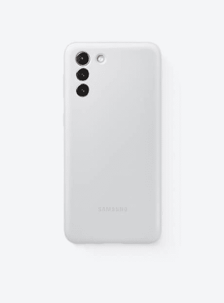
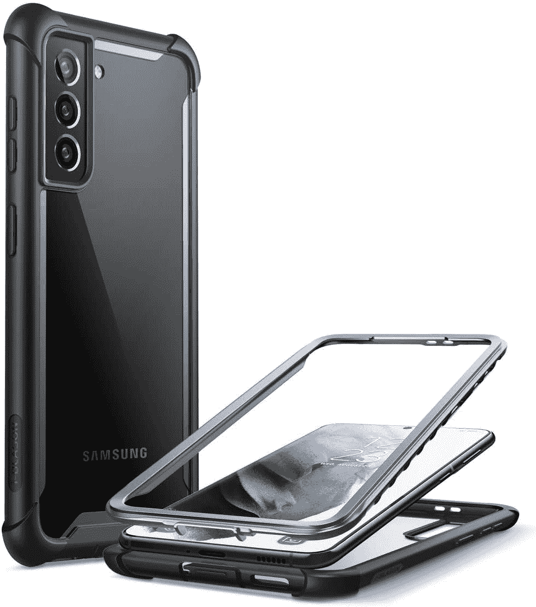
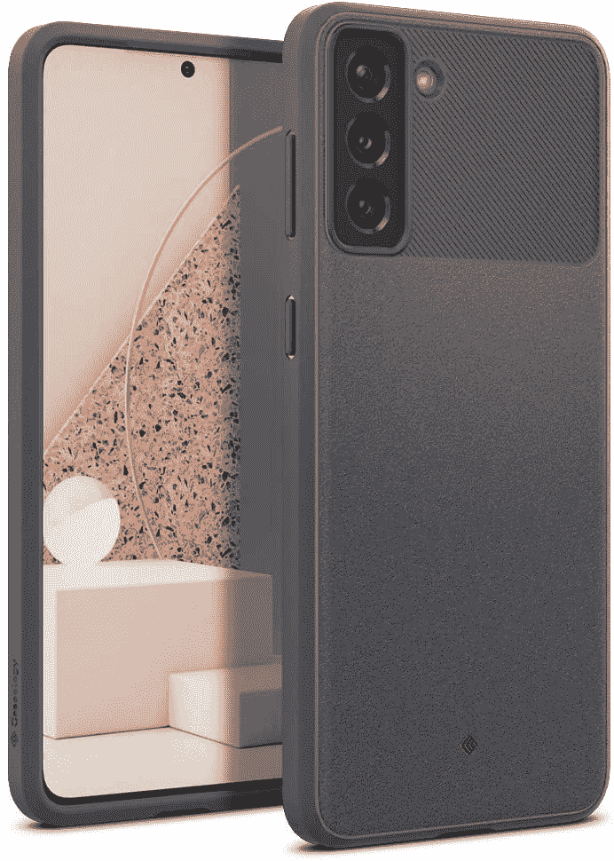
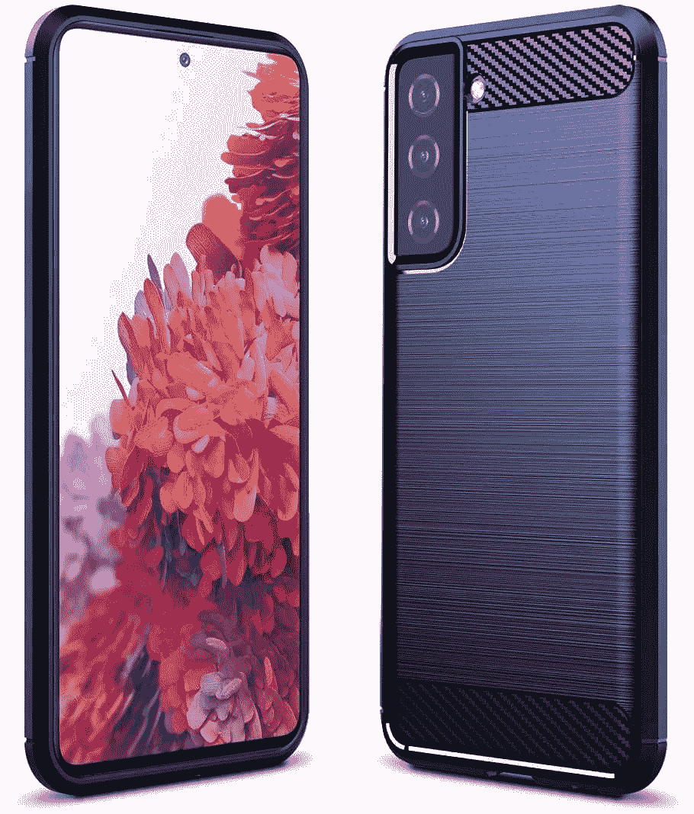
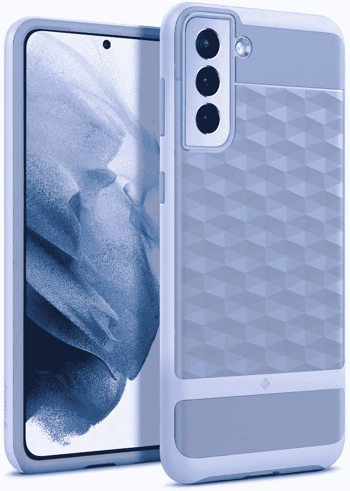
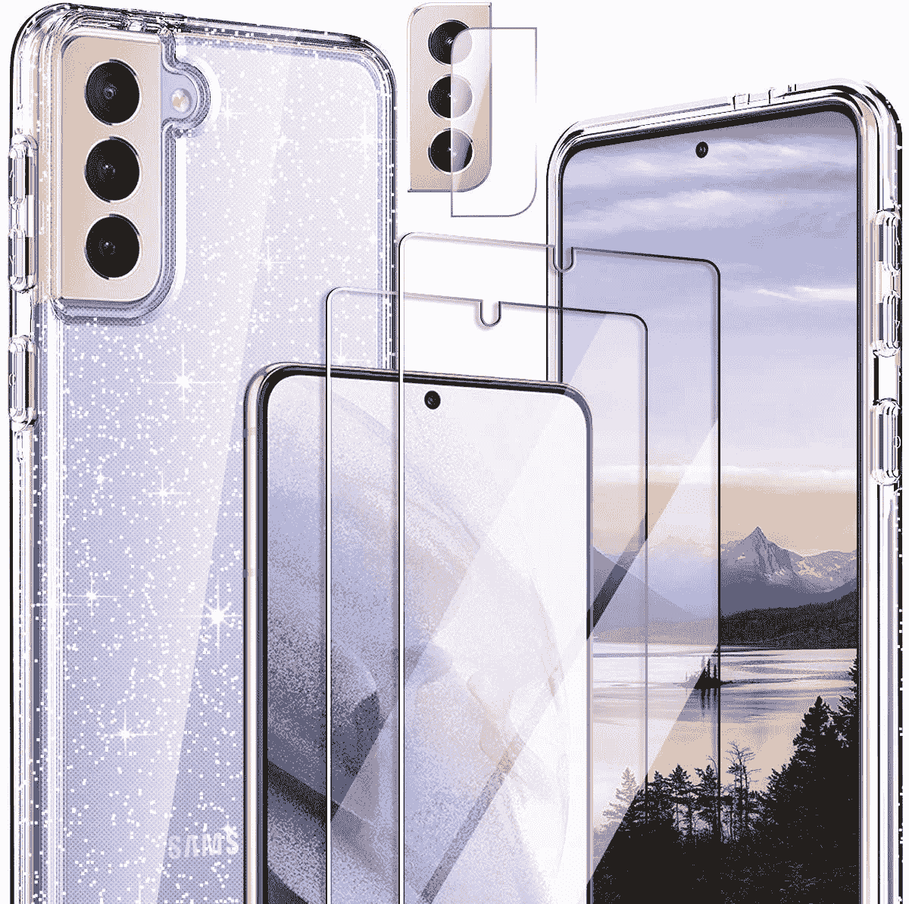

# 2023 年最佳三星 Galaxy S21 Plus 保护套

> 原文：<https://www.xda-developers.com/best-galaxy-s21-plus-cases/>

随着 [Galaxy S21 系列](https://www.xda-developers.com/samsung-galaxy-s21/)的发布，三星将其旗舰系列提升到了一个新的水平。这是三星提供的最好的产品，当然，除了独特的 [Galaxy Z Fold 3](https://www.xda-developers.com/samsung-galaxy-z-fold-3-review/) 。你有骁龙 888(或 Exynos 2100，国际用户将不幸获得)，相机是惊人的，电池应该可以持续一整天。Galaxy S21 Plus 是这一系列产品中的佼佼者，规格介于两款旗舰产品之间。

基本上，如果你想要比标准 S21 更强大的东西，以及更大的屏幕来观看内容，但又不想支付超高的价格，这款设备是你的最佳选择。这确实让它总体上有点难以销售，因为大多数想要更好规格的人只会选择 S21 Ultra，这是 T4 最好的安卓手机之一。但不管你的理由是什么，你都需要用 Galaxy S21 Plus 保护你的智能手机。

从[轻薄外壳](https://www.xda-developers.com/best-galaxy-s21-plus-thin-cases/)到透明外壳，再到更厚的全覆盖外壳，甚至是为了耐用性而牺牲薄度的[坚固外壳](https://www.xda-developers.com/best-galaxy-s21-plus-rugged-cases/)，我们有官方选项和第三方选项，也值得一看。每一位想要为智能手机拿一个保护套的 Galaxy S21 Plus 用户都有多种选择。

 <picture></picture> 

Supcase Unicorn Beetle Pro

##### SUPCASE UB Pro Galaxy S21 Plus 外壳

如果您想要最好的全面保护，防止刮擦和硬摔，这款带支架的坚固外壳是最佳选择。

 <picture></picture> 

Samsung Galaxy S21 Plus Official Silicone Cover

##### 三星硅胶 Galaxy S21 Plus 外壳

三星的官方硅胶保护套也是 S21 的一个好选择，也适用于 Galaxy S21 Plus，提供跌落保护，让你的手机保持时尚。

 <picture></picture> 

Samsung Galaxy S21 Plus Official Clear Standing Cover

##### 三星清晰站立式 Galaxy S21 Plus 外壳

三星的官方透明支架盖包括一个支架，允许您将手机放在桌子上轻松观看内容，还具有清晰的设计，不会隐藏您设备的风格和颜色。

 <picture></picture> 

Samsung Galaxy S21 Plus Official Rugged Case

##### 三星加固型 Galaxy S21 Plus 外壳

不介意给你的设备增加一点体积吧？那么你绝对应该考虑三星官方的坚固外壳，带有纹理的背面和侧面以及附带的支架。绝对是最值得考虑的选择之一。

 <picture></picture> 

i-Blason Ares Rugged Clear Case

##### i-Blason 战神银河 S21 Plus 表壳

如果你想展示你的新 Galaxy S21+的背面，但又想保护它免受跌落，这款保护套可以让你两全其美。

 <picture></picture> 

Caseology Vault S21 Case

##### 案例库银河 S21 Plus 案例

Caseology Vault 保险杠保护套也是我们为 Galaxy S21 推出的产品，它提供了时尚的设计和充分的保护，包括一个额外的保护唇，可以在预算内防止跌落。

 <picture></picture> 

Sucnakp Bumper Case for Galaxy S21 Plus

##### Sucnakp Bumper Galaxy S21 Plus 表壳

这个 Sucnakp 案例提供了与我们之前展示的案例学案例非常相似的设计，但是有两种颜色，稍微便宜一些，并且有两种颜色——黑色和蓝色。

 <picture></picture> 

Restoo Clear Case for Galaxy S21 Plus

##### Restoo Clear Galaxy S21 Plus 表壳

Restoo 的透明外壳提供了一个透明的硬塑料外壳，让您可以展示您的手机设计，同时保护它。这也是列表中最便宜的选择之一。

 <picture></picture> 

PhuLok Galaxy S21 Plus Case

##### PhuLok Galaxy S21 Plus 表壳

PhuLok 第三方 Galaxy S21 Plus 保护套采用时尚坚固的设计，可以保护您的手机免受任何东西的损坏。像这个列表中的其他选项一样，它也有一个支架，可以完全无手柄地观看内容。

 <picture></picture> 

Caseology Parallax Case

##### Caseology 视差星系 S21 Plus 案例

Caseology 的视差案例在我们的综述中出现很多是有原因的——它们提供了很好的保护，同时看起来很酷！背面的立方体图案不仅仅是为了展示，它实际上是一个把手！

 <picture></picture> 

Hocase Clear Glitter Case

##### Hocase 透明闪光银河 S21 Plus 盒

想展示您 S21 Plus 的背面，但又想保留一点风格？拿起这个闪光盒！你的特殊智能手机颜色将会显现出来，但也有一些漂亮的闪光斑点给它额外的魅力。

 <picture></picture> 

WWW Wallet Case

##### WWW 钱包 Galaxy S21 Plus 保护套

当你能得到一个好看的钱夹时，为什么只得到一个钱夹呢？WWW 的钱包盒模仿了手拿包的外观，看起来很棒。当然，你也可以把你的卡和钱放在里面。唯一的缺点是，你不能使用皮瓣作为一个立场。

这些是我们根据价格点和它们提供的内容挑选的最佳 Galaxy S21 Plus 保护套，从三星自己的内部产品到知名配件制造商的其他第三方选项，应有尽有。无论您只是想要一层薄薄的保护，使您的手机不会因轻微跌落而完全损坏，还是想要坚固的外壳，以提供额外的抓握力，以及对跌落和刮擦的实质性保护，您都可以放心，您可以在收到 Galaxy S21 Plus 的第一天就开始运行，把它放在您的家门口，然后继续运行。

 <picture></picture> 

Samsung Galaxy S21 Plus

##### 三星 Galaxy S21 Plus

三星 Galaxy S21 Plus 是 2021 年新旗舰系列中的老二，集旗舰 SoC 和高级构建于一身，配有体面的显示屏和摄像头设置。

如果你有一部带颜色的手机，官方的透明保护套是一个很好的选择，而官方的坚固外壳将提供急需的保护。如果你想要在跌落方面得到最好的保护，并且如果你喜欢这种东西，那么你应该考虑 Supcase Unicorn Beetle Pro，尽管它增加了相当大的体积，这是为了更好的保护而需要做出的牺牲。