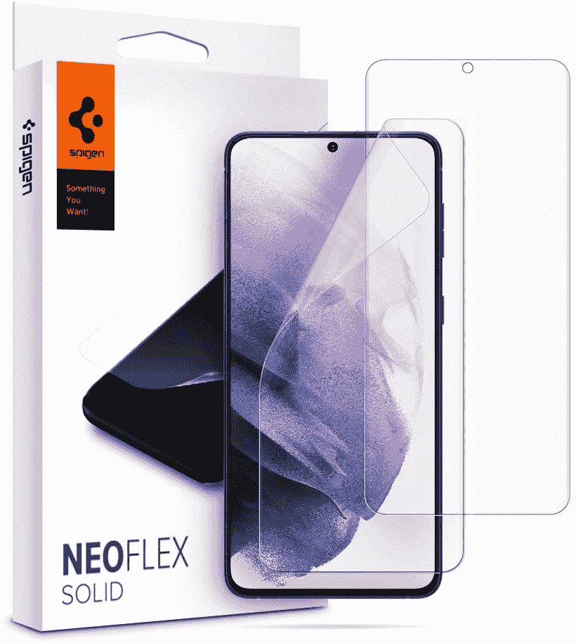
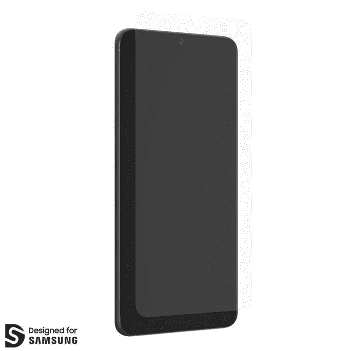
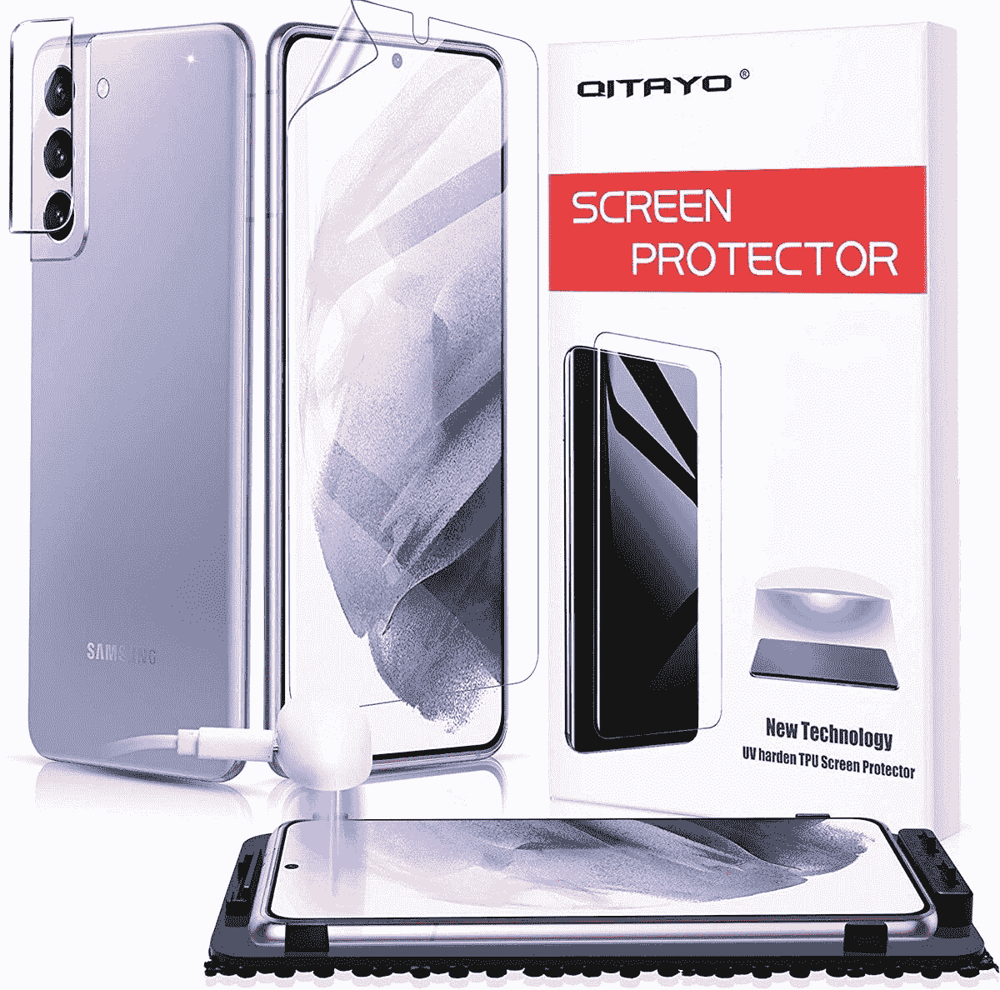
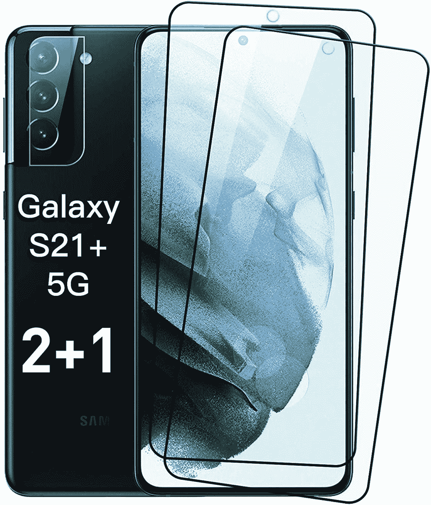
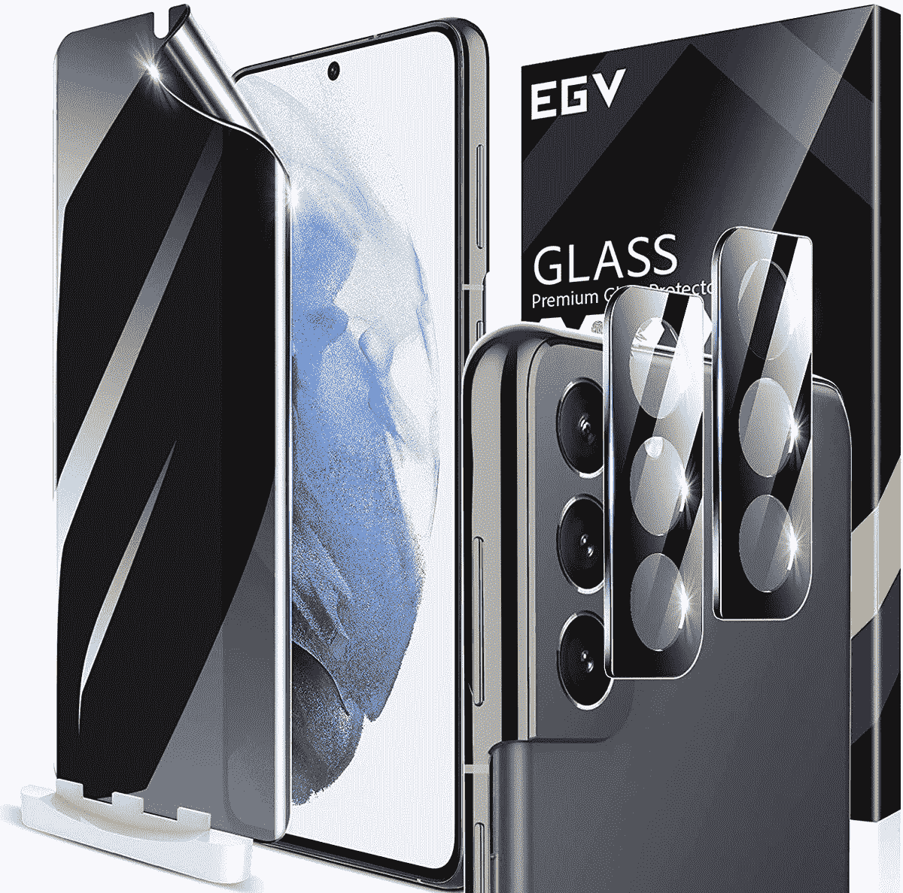

# 2023 年 Galaxy S21 Plus 最佳屏幕保护器

> 原文：<https://www.xda-developers.com/best-galaxy-s21-plus-screen-protectors/>

# 2023 年 Galaxy S21 Plus 最佳屏幕保护器

我们这里有最好的三星 Galaxy S21 Plus 屏幕保护器给你。

Galaxy S21 Plus 的显示屏是一个值得一看的景观，你最不希望看到的就是一个意外的刮擦或跌落破坏它的美丽。幸运的是，有很多屏幕保护器可以保护你的设备安全。有如此多的选项可供选择，为您的设备选择合适的屏幕保护器可能会非常困难。为了方便起见，我们收集了一些目前市场上最好的 Galaxy S21 Plus 屏幕保护器。从钢化玻璃到隐私保护器，甚至是蓝光阻隔玻璃，我们的清单上有各种需求。

确保你的手机有合适的屏幕保护。Galaxy S21、Galaxy S21 Plus 和 Galaxy S21 Ultra 的尺寸都略有不同，因此每套屏幕保护器都只能与 Galaxy S21 的特定型号配合使用。以下推荐的是 Galaxy S21 Plus 屏幕保护器——如果你正在购买这些手机，我们还有其他标准 [Galaxy S21 屏幕保护器](https://www.xda-developers.com/best-galaxy-s21-screen-protectors/)和 [Galaxy S21 Ultra 屏幕保护器](https://www.xda-developers.com/best-galaxy-s21-ultra-screen-protectors/)的指南。

*   <picture></picture>

    Spigen NeoFlex 屏幕保护器

    ##### Spigen neo flex Galaxy S21 Plus 屏幕保护器

    作为 ESR 屏幕保护器的替代产品，您可以抢到 Spigen 的 neo flex 屏幕保护器！这种柔软的屏幕保护装置使用起来很方便，可以保护您的触摸屏。

*   <picture></picture>

    ESR 液肤屏幕保护器

    ##### ESR 液肤银河 S21 加屏幕保护器

    不是钢化玻璃保护器的粉丝吗？那么 ESR 的 Liquid Skin S21 Plus screen protector 就是你想要的。它易于使用，并提供近乎隐形的保护，防止刮伤和擦伤。感觉也很棒！

*   ##### Supershieldz 三星 Galaxy S21 Plus 屏幕保护器

    super shieldz 的这款钢化玻璃保护器提供了出色的防刮擦保护，并具有疏水疏油涂层，可减少指纹和污迹。

*   <picture></picture>

    GlassFusion VisionGuard+搭配 D3O

    ##### glass fusion vision guard+Galaxy S21 Plus 屏幕保护器

    如果你在寻找高级保护，ZAGG 的 glass fusion vision guard+绝对不会错。这种屏幕保护器可以阻挡蓝光而不变色，并被宣传为牢不可破。贵了一点，但是你的手机不值得吗？

*   <picture></picture>

    齐塔约 Galaxy S21 Plus 屏幕保护器

    ##### 齐塔约 Galaxy S21 Plus 屏幕保护器

    齐塔约的屏幕保护器有点独特！包装盒中包含的紫外线灯可使保护物硬化，因此您可以获得坚固、卓越的保护，而无需使用钢化玻璃。

*   <picture></picture>

    Galaxy S21 Plus 钢化玻璃屏幕保护器

    ##### 三星钢化玻璃 Galaxy S21 Plus 屏幕保护器

    有时候，你也想保护好手机的摄像头。这种钢化玻璃屏幕保护器包括对屏幕和相机模块的保护，同时仍与手机壳兼容。

*   <picture></picture>

    EGV 隐私屏幕保护器

    ##### EGV 银河 S21 隐私屏幕保护器

    在公共场所访问智能手机时担心自己的数据？抓住一个屏幕保护，保护你的隐私！有了这个隐私屏，你就能保证个人信息的安全。

你可能会看着列表，想知道，那么，什么是绝对最好的 Galaxy S21 屏幕保护装置呢？嗯，简而言之，这真的取决于你的生活方式。我个人不太喜欢钢化玻璃的手感，所以喜欢 ESR 液肤屏护。我在目前的手机上安装了这款屏幕保护器，它的效果非常好，不会捕捉到太多的指纹。然而，乐浪隐私屏幕保护也是一个好主意，因为你永远不知道谁会在你身后看着你。如果你经常乘坐公共交通工具上下班，拥有这个保护装置有很多好处。最后，Spigen 和 Supershieldz 是安全的赌注，两者都有

你对 Galaxy S21 Plus 的哪个屏幕保护装置感兴趣？请在评论中告诉我们！

 <picture></picture> 

Galaxy S21 Ultra

##### 三星 Galaxy S21 Plus

三星 Galaxy S21 Plus 是新 S21 系列的中档产品——比标准 S21 更强大，但不像 Ultra 那样矫枉过正。今天就抓住你的！