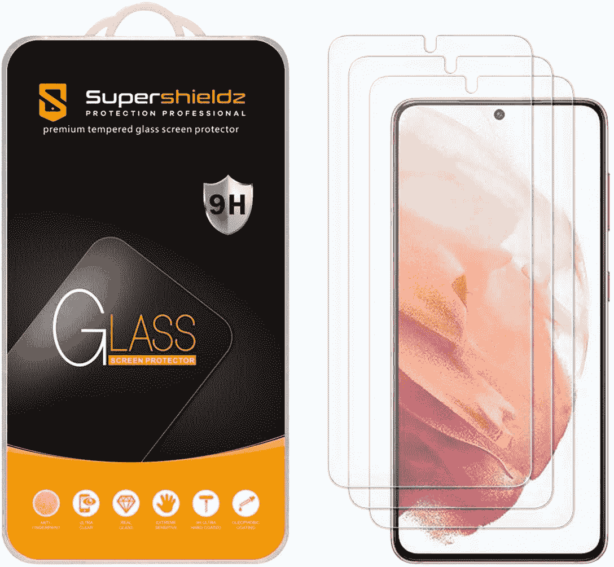
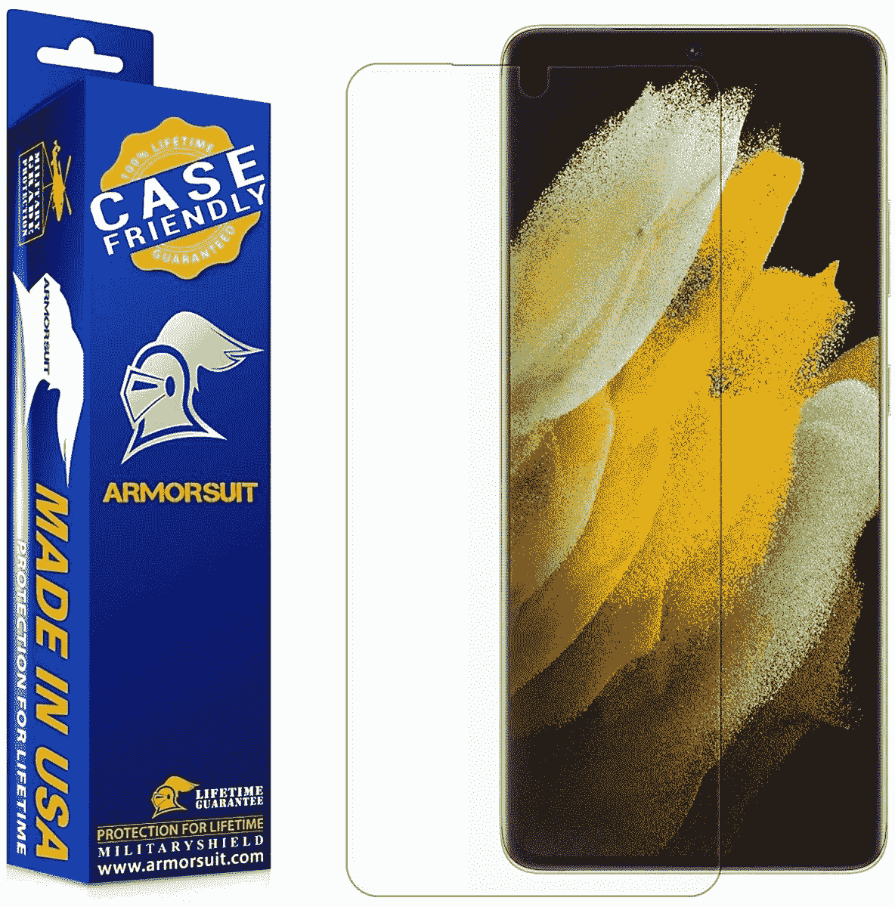
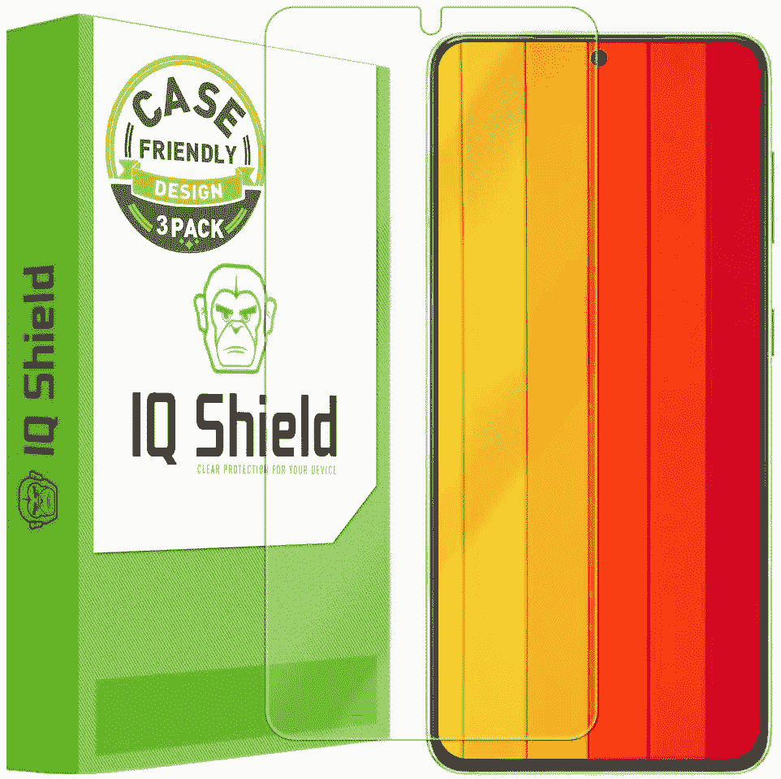
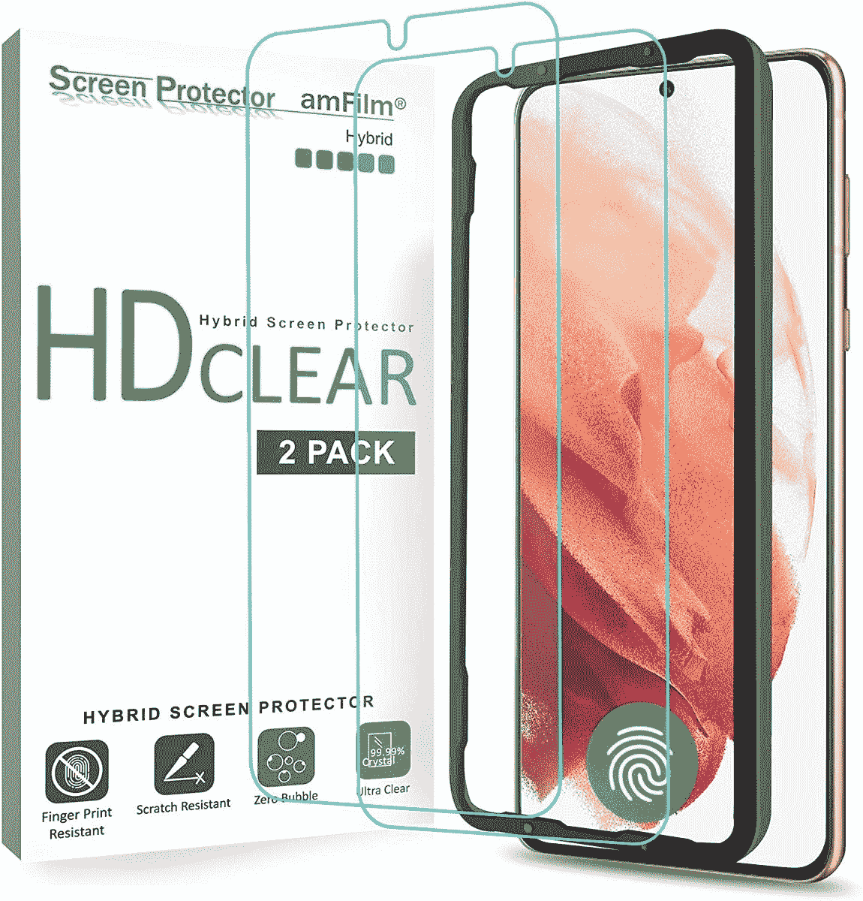
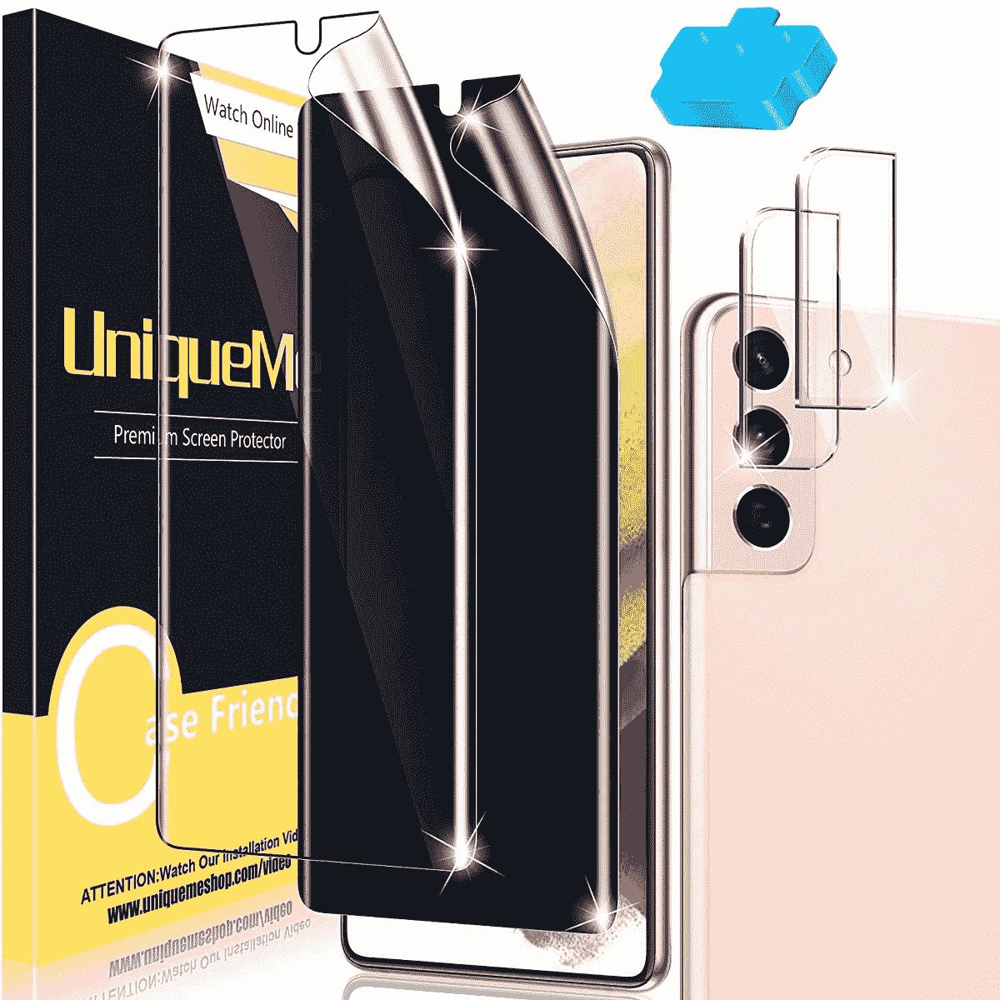
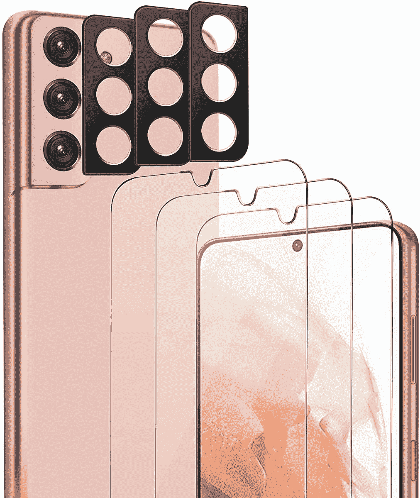

# 2023 年最佳 Galaxy S21 屏幕保护器

> 原文：<https://www.xda-developers.com/best-galaxy-s21-screen-protectors/>

# 2023 年最佳 Galaxy S21 屏幕保护器

您有了新的 Galaxy S21，现在是时候保护您的购买了！我们这里有最好的三星 Galaxy S21 屏幕保护器给你。

所以你已经买了三星 2021 年的旗舰手机之一 [Galaxy S21](https://www.xda-developers.com/samsung-galaxy-s21/) ？太好了！虽然这款手机是今年早些时候推出的，但对于那些想要一款既不太大也不太贵的旗舰手机的人来说，它仍然是一个不错的选择。现在你有了手机，是时候确保你新买的昂贵手机保持完好无损了。是否需要保护套取决于你的手机习惯，但你可以通过选择 Galaxy S21 屏幕保护器来防止屏幕上的划痕和瑕疵。你永远不知道什么时候一个走失的键会刮伤你的屏幕。我们收集了市场上最好的 Galaxy S21 屏幕保护器，让你的手机保持崭新状态。

确保你的手机有合适的屏幕保护！Galaxy S21、S21 Plus 和 S21 Ultra 的尺寸都略有不同，因此每套屏幕保护器只能与 Galaxy S21 的一种型号配合使用。以下推荐的是标准的 Galaxy S21 屏幕保护器——如果你正在购买这些手机，我们还有其他关于 [Galaxy S21 Plus 屏幕保护器](https://www.xda-developers.com/best-galaxy-s21-plus-screen-protectors/)和 [Galaxy S21 Ultra 屏幕保护器](https://www.xda-developers.com/best-galaxy-s21-ultra-screen-protectors/)的指南。

 <picture></picture> 

Supershieldz Tempered Glass Screen Protector

##### SuperShieldz 钢化玻璃 Galaxy S21 屏幕保护器

Supershieldz 屏幕保护器耐刮擦，并配有疏油涂层，可排斥那些指纹污迹。包里有三个屏幕保护器。

 <picture></picture> 

ArmorSuit MilitaryShield Screen Protector

##### 盔甲军装盾牌银河 S21 屏幕保护

ArmorSuit MilitaryShield 屏幕保护器采用自我修复技术，可以不断消除轻微划痕。它也很快，很容易申请。

 <picture></picture> 

IQ Shield Screen Protector

##### 智商盾 Galaxy S21 屏幕保护器

正在寻找一款能与手机壳完美搭配的屏幕保护套？那么这个智商盾屏幕保护器可以帮忙。它被设计成大小写友好的。它也非常适合你的手机。

 <picture></picture> 

amFilm Screen Protector

##### amFilm 钢化玻璃 Galaxy S21 屏幕保护器

amFilm 品牌的屏幕保护器在提供良好体验方面有着良好的记录，这款 Galaxy S21 屏幕保护器也不例外。

 <picture></picture> 

UniqueMe Privacy Screen Protector

##### UniqueMe Privacy Galaxy S21 屏幕保护器

UniqueMe 隐私屏幕保护程序可以确保您的手机屏幕上的内容只有您自己可以看到，而不会被任何窃听者看到。您还可以获得一个捆绑的相机镜头保护。

 <picture></picture> 

Sparin Screen Protector

##### Sparin 钢化玻璃 Galaxy S21 屏幕保护器

如果你不想在屏幕保护上花太多钱，这款 Sparin 保护非常适合你。它超级实惠，而且仍然提供了很好的体验。

 <picture></picture> 

QHOHQ Tempered Glass Screen Protector

##### QHOHQ 钢化玻璃 Galaxy S21 屏幕保护器

有时候，经典的钢化玻璃屏幕保护器就是你所需要的。QHOHQ 的三包屏幕保护器旨在无气泡和防水，同时不会给手机的触摸屏带来任何问题。

 <picture></picture> 

ESR Liquid Skin Screen Protector

##### ESR 液体皮肤银河 S21 屏幕保护

如果你不是钢化玻璃的粉丝，电影屏幕也会很棒。薄膜屏幕提供的整体保护较少，但总体上看起来和感觉上也比钢化玻璃好。

 <picture></picture> 

Spigen NeoFlex Screen Protector

##### Spigen NeoFlex Galaxy S21 屏幕保护器

另一个保护膜选项，Spigen 的 NeoFlex 保护膜将为您的 Galaxy S21 屏幕提供近乎隐形的保护，防止轻微划痕和损坏。

这些是市场上最好的 Galaxy S21 屏幕保护器。ArmorSuit MilitaryShield 和 IQ Shield 屏幕保护器承诺提供最佳体验。在其他选项中，Spigen 和 amFilm 屏幕保护器也相当不错。需要注意的一件重要事情是，大多数钢化玻璃屏幕保护器无法与显示器内的指纹传感器一起正常工作。因此，如果你想继续使用手机的指纹传感器，你应该坚持使用塑料屏幕保护器。

 <picture></picture> 

Samsung Galaxy S21

Galaxy S21 是三星 2021 年旗舰系列的起点，集旗舰 SoC、出色的显示屏和相机设置于一身。

你打算为你的 Galaxy S21 买哪个屏幕保护？请在评论区告诉我们。同时，如果你正在为你的 Galaxy S21 寻找一个外壳，我们也有一个关于手机的[最佳外壳的指南。如果你有更大的 Galaxy S21 Ultra，我们也为这款手机编辑了一份](https://www.xda-developers.com/best-galaxy-s21-cases/)[最佳屏幕保护器](https://www.xda-developers.com/best-galaxy-s21-ultra-screen-protectors/)。