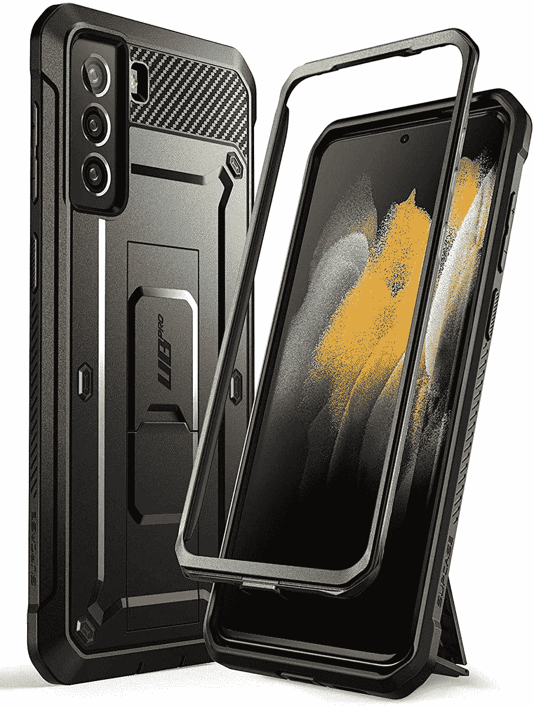
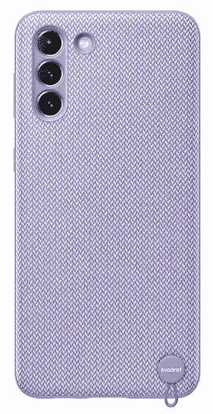
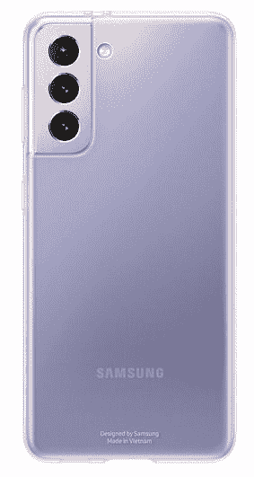
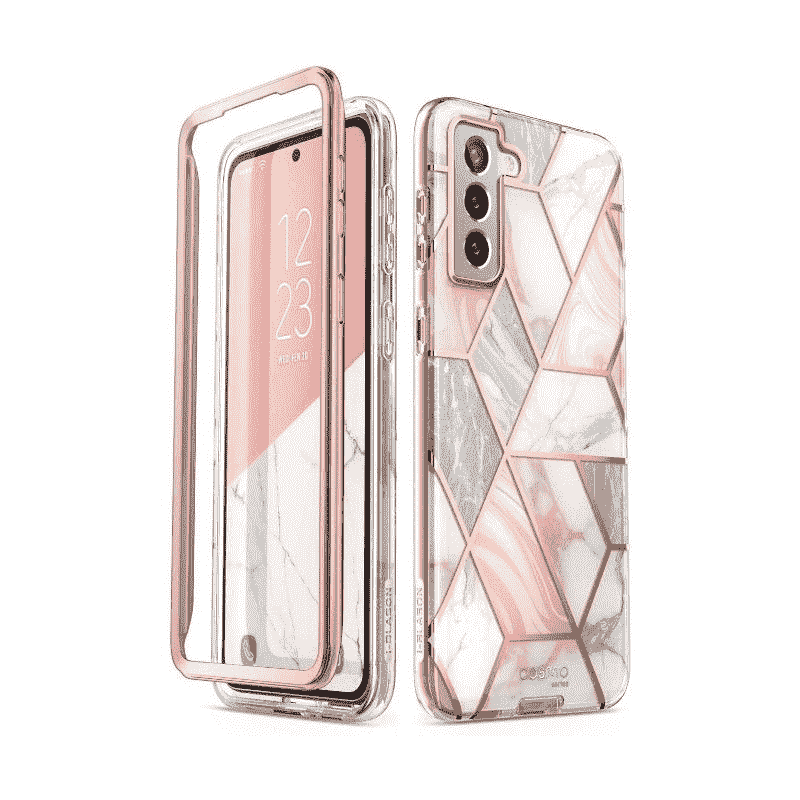
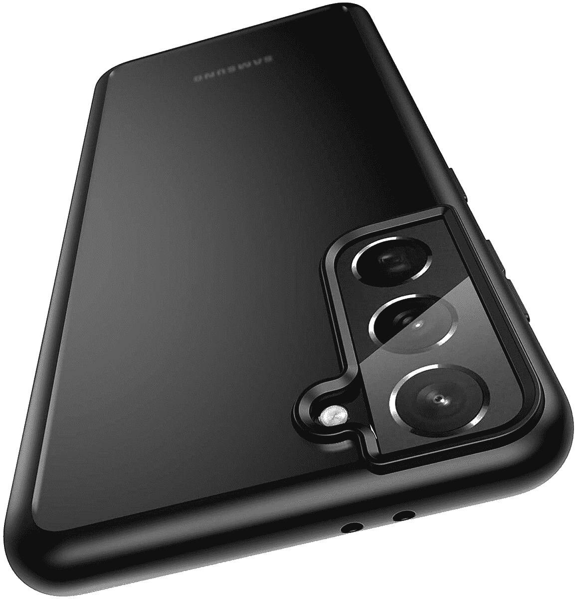
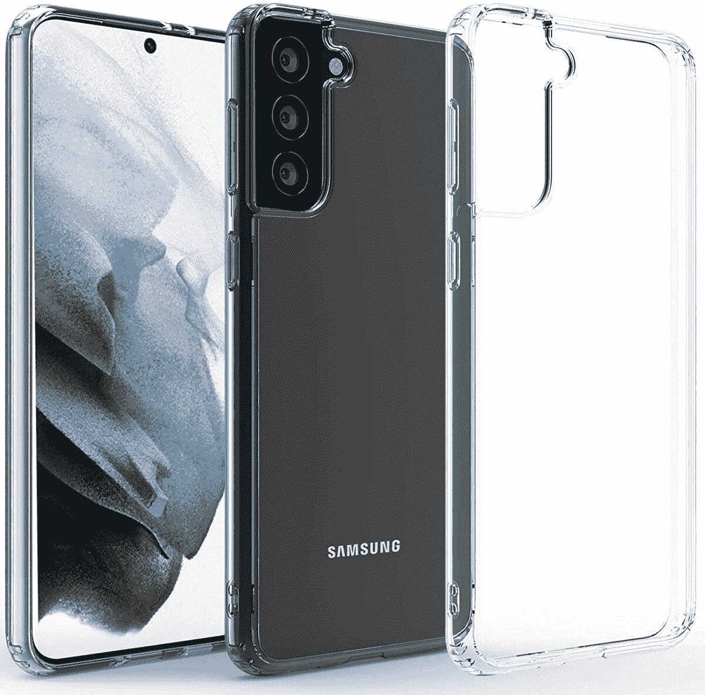
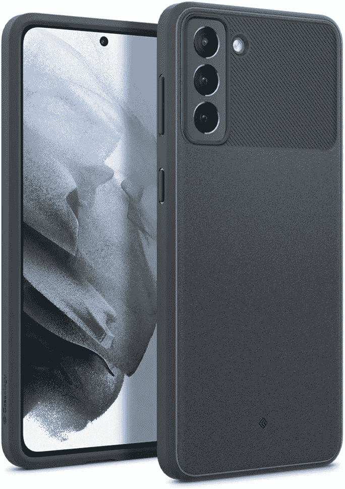
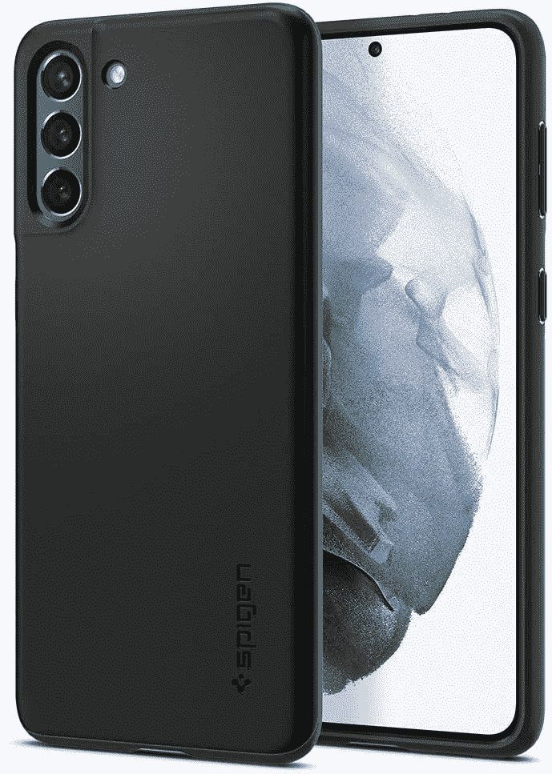
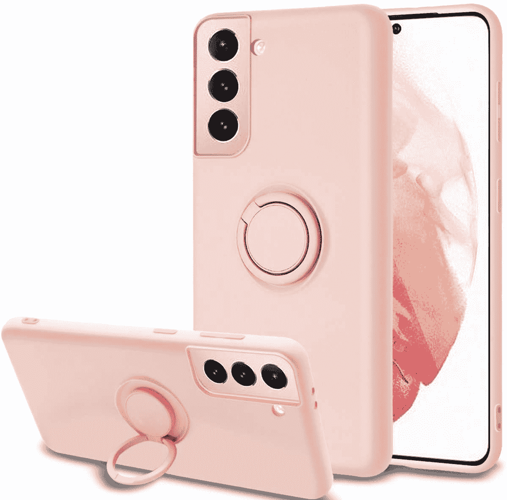

# 2023 年最佳 Galaxy S21 薄款

> 原文：<https://www.xda-developers.com/best-galaxy-s21-thin-cases/>

# 2023 年最佳 Galaxy S21 薄款

祝贺您购买 S21 产品！我们收集了最好的 Galaxy S21 超薄保护套，这样您就可以保护您的设备，而不会让它变得笨重。

三星 Galaxy S21 是一款非常好看的手机，但由于有玻璃背面，它也很滑。这当然不是一件坏事——谁不喜欢一部外观漂亮、手感出众的手机呢？然而，玻璃背板在掉落时容易破碎。你会想要保护你的 Galaxy S21，但如果你不想增加手机的体积，那么买一个薄的外壳将是一个好主意。为了帮助你进行搜索，我们收集了一些你现在可以购买的 Galaxy S21 的最佳轻薄外壳。

Galaxy S21 与最近的其他一些手机相比相对较小，所以很容易拿。不过，增加一个外壳会使它更容易握在手中，如果你想保持纤薄的外形，薄外壳是一个不错的选择。这里有一些 Galaxy S21 的最佳薄保护套，可以为你的手机提供最低限度的保护，防止划伤和轻微跌落。明智的做法是为一个薄盒子搭配一个好的[屏幕保护器](https://www.xda-developers.com/best-galaxy-s21-screen-protectors/)，以确保你的显示器也能保持安全。

*   <picture></picture>

    Supcase 独角甲虫 Pro

    ##### sup Case UB Pro Galaxy S21 Case

    虽然轻薄的保护套为你的手机增加了一些保护，但这款 sup Case 可以让你完全安心。它为日常事故提供了增强的保护。此外，它有一个纹理的手柄，包一个支架以及一个可拆卸的旋转皮套。

*   <picture></picture>

    三星 Kvadrat 盖

    ##### 三星 Kvadrat Galaxy S21 外壳

    说起柔软与轻巧，三星 Kvadrat 盖是轻薄与坚固的完美结合。箱子由回收材料制成，质地良好，底部有一个挂钩，因此您可以系上一根带子，方便携带。

*   <picture></picture>

    三星透明保护盖

    ##### 三星透明 Galaxy S21 保护套

    三星透明保护盖采用透明设计，让您在欣赏 Galaxy S21 设计的同时也能保护它。它还包括一个额外的安全抓地力侧防滑图案。

*   <picture></picture>

    I-blas on Cosmo 系列

    ##### I-blas on Cosmo Galaxy S21 表壳

    I-blas on Cosmo 系列表壳看起来很有趣，它的后盖一定会引人注目。该外壳由 TPU 制成，以增强保护，并具有凸起的边缘，以保护您的 Galaxy S21 的正面。你可以买三种颜色的。

*   <picture></picture>

    meifgno 保护套

    ##### meifgno Defender Galaxy S21 保护套

    meifgno 保护套采用军用级保护，边缘凸起以保护您的屏幕和相机镜头安全，并采用纳米疏油涂层的耐用设计。

*   <picture></picture>

    贪图苗条的护卫

    ##### 贪图苗条的护卫星系 S21 案

    贪图苗条的护卫星系 S21 是一个伟大的瘦身案。它由 TPU、橡胶和聚碳酸酯制成，可以提供很好的保护，防止刮擦、跌落和其他日常事故。该保护套还在摄像头模块周围和前面有凸起的边缘。

*   <picture></picture>

    Restoo Slim Clear 保护套

    ##### Restoo Slim Clear Galaxy S21 保护套

    想要一个保护套来保护你的手机同时还炫耀它的设计和颜色？Restoo Clear 表壳采用透明坚硬的设计，与众多华丽的 Galaxy S21 颜色完美搭配。

*   <picture></picture>

    案件学金库案件

    ##### 案件学金库星系 S21 案件

    案件学金库对于星系 S21 来说也没有什么不同。它采用了防震设计和感觉轻薄的材料，所以这款设备在你手中不会感觉笨重。

*   <picture></picture>

    托拉斯钻石系列表壳

    ##### 托拉斯钻石系列银河 S21 表壳

    如果你想要一个透明清晰又不笨重的表壳，托拉斯就为银河 S21 打造了钻石系列表壳。这是一个艰难的情况，让你看到你的手机背面，同时仍然给予一些保护。

*   <picture></picture>

    Spigen 薄贴合保护套

    ##### Spigen 薄贴合 Galaxy S21 保护套

    想让你的手机尽可能的受到保护而不显得臃肿？斯皮根是来拯救世界的。这种柔软的橡胶外壳可以防止震动和跌落，同时还易于握持。

*   <picture></picture>

    fin gic Galaxy S21 表壳

    ##### fin gic Ring Galaxy S21 表壳

    Fingic 的表壳对于纤薄的表壳来说几乎是太厚了，但这仍然是相当纤薄的，而且这款表壳相对于其他的表壳有一个明显的优势——一枚戒指！橡胶外壳还可以防震，防指纹。

对于一部新手机来说，最糟糕的事情就是它被损坏。但是你也不想在一个大案件中报道它。一个薄的外壳将保护 Galaxy S21，同时确保它保持苗条，几乎就像外壳甚至不存在一样。我们挑选的许多产品风格相似，所以你需要找到最适合你的功能和设计的平衡点。

如果你不介意你的外壳超薄，三星硅胶外壳是一个很好的选择。它将为您的设备提供额外的保护，而不会增加太多体积。如果你只是想要尽可能多的保护，试试 Spigen 薄款。还有其他几种选择。

 <picture></picture> 

Samsung Galaxy S21

三星 Galaxy S21 是 2021 年新旗舰系列的起点，包装在一个旗舰 SoC 中，以及一个体面的显示器和相机设置。

你打算为你的手机买哪一款超薄手机套？请在评论区告诉我们。