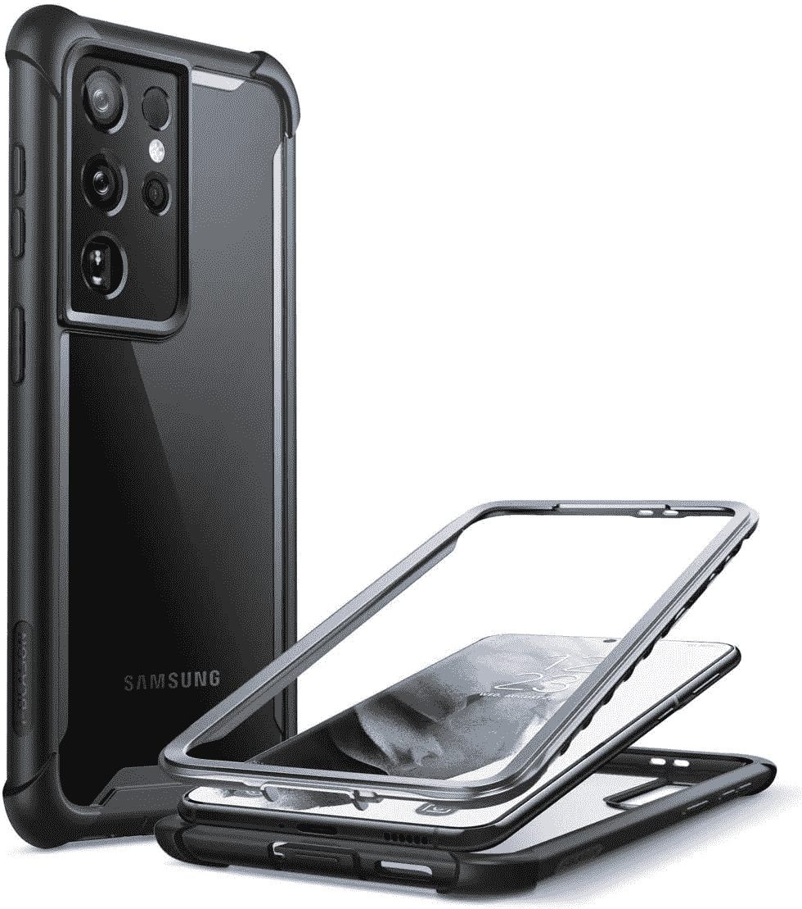

# 2023 年三星 Galaxy S21 Ultra 最佳坚固外壳

> 原文：<https://www.xda-developers.com/best-galaxy-s21-ultra-rugged-cases/>

三星今年早些时候推出了 Galaxy S21 Ultra，如果你已经有了一部或者打算很快就有一部，你肯定不想扔掉它，最终花一大笔钱去维修——尤其是当你已经在手机本身上花了一大笔钱的时候。Galaxy S21 Ultra 的起价为 1200 美元，是迄今为止三星最贵的手机之一。虽然它的玻璃夹层设计看起来很漂亮，但它绝对不够耐用，无法承受跌落。你有时可能会走运，但正如人们所说的，安全总比后悔好。

因此，为了保护您的投资，我们建议您选择以下 Galaxy S21 超坚固外壳。如果你喜欢最小的保护而不增加太多的体积，我们也为 Galaxy S21 Ultra 列出了一个[最佳轻薄外壳的列表。但是，如果你经常摔手机，想要最好的保护，坚固的外壳是一个不错的选择。](https://www.xda-developers.com/best-galaxy-s21-ultra-thin-cases/)

 <picture></picture> 

S21 Ultra Clear Rugged xCover

##### 三星清晰坚固的 xCover Galaxy S21 Ultra 外壳

如果你正在寻找一个坚固的外壳，提供出色的保护，同时也有一个清晰的背部，展示你的手机的实际颜色和外观，看看三星的这款官方外壳就知道了。边缘和角落都有厚厚的保险杠，即使在摔落时也能保护手机，所以你不必担心刮伤或弄凹金属边。正面有一个凸起的凸缘，当面朝下放在表面上时，可以保护屏幕。

 <picture></picture> 

SUPCASE Unicorn Beetle Pro

##### SUPCASE UB Pro Galaxy S21 Ultra Case

SUPCASE Unicorn Beetle Pro 是 Galaxy S21 Ultra 的一款经济实惠的坚固外壳，可提供全面保护。它具有多层 TPU 和聚碳酸酯结构，以保护您的手机免受跌落，支架可帮助您在横向和纵向支撑它，精确的切口便于访问端口，可旋转的皮套可将您的手机固定在腰带上。

 <picture></picture> 

Ringke Onyx

##### Ringke Onyx Galaxy S21 表壳

如果你不想为你 1200 美元的手机多花 40 美元买一个保护套，那么林克缟玛瑙 TPU 保护套是你最好的选择。虽然软壳外壳不能提供与这里提到的一些替代品相同的保护水平，但它足以保护你的手机免受偶尔跌落的影响。该保护套的特点是有防滑边，所有边缘和摄像头模块周围都有凸起的边缘，甚至在背板上有小支脚，以防止摄像头模块接触任何表面并产生划痕。

 <picture></picture> 

Spigen Rugged Armor

##### Spigen 坚固装甲银河 S21 超盒

对于那些不想给手机增加太多体积的人来说，Spigen Rugged Armor 外壳是一个很好的选择。柔软的 TPU 外壳加固了侧面，在屏幕和相机模块周围有一个凸起的边缘，可以在手机放在表面上时保护它们。纤薄的外形和实惠的价格使 Spigen 坚固装甲外壳成为我的首选。Spigen 在市场上也有很好的口碑。

 <picture></picture> 

i-Blason Ares Series for S21 Ultra

##### i-Blason 战神银河 S21 超盒

i-Blason 的这款保护套加固了边角，为您提供坚固的保护，防止跌落。它也有一个清晰的背部来展示你的手机的实际外观。

 <picture></picture> 

Urban Armor Gear Pathfinder

##### UAG 探路者银河 S21 超盒

Urban Armor Gear Pathfinder 是 Galaxy S21 Ultra 的一款轻薄外壳，尽管设计纤薄，但仍能提供充分的保护。由于独特的蜂窝设计，它超过了 MIL-STD 810G 的冲击保护等级。这款保护套还兼容无线功能，因此在保护套打开的情况下，您将不会遇到任何无线充电或使用 NFC 支付的问题。

 <picture></picture> 

Otterbox Defender Series

##### OtterBox Defender Galaxy S21 Ultra 表壳

Defender 系列是 Otterbox 最棘手的案例。它有一个聚碳酸酯外壳来保护你的手机免受冲击，一个合成橡胶沙发套来缓冲你的设备，它配有一个聚碳酸酯皮套来帮助你轻松地将其夹在你的腰带上。它还有一个端口盖，以防止灰尘和棉绒进入设备的 USB Type-C 端口，抗菌涂层和 MIL-STD 810G X4 评级。

 <picture></picture> 

Nillkin CamShield Armor

##### Nillkin CamShield Galaxy S21 Ultra 表壳

如果你正在寻找一个不使用时完全覆盖相机模块的坚固外壳，Nillkin CamShield Armor 就是你要的。该案件提供了一个 0.2 毫米的影响和划伤保护唇 TPU 建设。它具有独特的相机护罩，您可以在相机模块上滑动，以保护它免受刮擦。此外，该保护套还配有防滑支架，可兼作手机握柄。

 <picture></picture> 

Nillkin CamShield Pro

##### Nillkin CamShield Galaxy S21 Ultra 表壳

Nillkin 还提供 CamShield Pro，这是 Armor 系列的一个明显更薄的替代产品。它具有相同的摄像头护罩，坚硬的聚碳酸酯背面，边缘周围有柔软的硅胶保险杠。遗憾的是，它不像另一个版本那样有支架。

 <picture></picture> 

SPIDERCASE Waterproof Case

##### 蜘蛛保护套防水 Galaxy S21 Ultra 保护套

想要为您的 Galaxy S21 Ultra 提供一个坚固耐用的外壳，还能提供额外的防水层吗？从蜘蛛盒里拿防水盒。这款保护套通过了 IP68 认证，内置了防刮擦的屏幕保护装置，边缘带有橡胶缓冲垫以提供冲击保护，透明的后面板不会隐藏您手机的精美外观。

 <picture></picture> 

AICase Tough+

##### AICase Tough+ Galaxy S21 外壳

这份清单上的大多数箱子不仅坚固，而且看起来也很坚固。如果你在寻找更简单的东西，你应该选择 AICase Tough+ case。它为您的 Galaxy S21 Ultra 提供了相同水平的冲击和刮擦保护，但没有令人讨厌的粗糙外观。这款保护套配有两个屏幕保护器，所以这是另一个额外的好处。

 <picture></picture> 

Poetic Spartan Case

##### 诗意的斯巴达银河 S22 Plus 表壳

诗意的斯巴达式外壳为您的 Galaxy S21 Ultra 提供军用级保护。它采用双层设计，坚固的后面板具有优质皮革纹理，内置屏幕保护器与显示器内指纹扫描仪兼容。最重要的是，它具有一个可以在纵向和横向工作的支架，一个用于 USB Type-C 端口的精确切口和触觉按钮。

这就完成了我们的最佳 Galaxy S21 超坚固外壳列表。这些保护套不仅可以保护您的设备免受跌落，让您无忧无虑地使用它，还可以确保它不会在玻璃背面留下任何微小的划痕。正如您所看到的，我们在所有价位中都包含了机箱，因此您可以选择符合您预算的机箱。我们还考虑了不同的设计选择，因此您至少可以找到一种适合您的情况。你最不想做的事情就是买一部漂亮的手机，然后给它装上一个丑陋的外壳。

如果你仍然不知道该选择哪种保护套，我们建议选择 Spigen Rugged Armor 保护套，因为它提供了充分保护和最小化设计的完美融合。它也比这份名单上的其他坚固外壳更薄。这对手小的人来说很重要，因为 Galaxy S21 Ultra 已经是一部大手机，笨重的外壳最终会使它变得难以管理。如果你想要最好的保护，你应该选择 Supcase Unicorn Beetle Pro，因为它提供了坚实的保护，可以相对轻松地处理偶尔的跌落。

 <picture></picture> 

Galaxy S21 Ultra

三星 Galaxy S21 Ultra 是 2021 年新旗舰系列中的终极杀手锏，集旗舰 SoC、高级构建、出色的显示屏和令人惊叹的相机设置于一身，以及高级旗舰上预期的所有额外功能。

那么你更喜欢前面提到的哪种情况呢？请在下面的评论区告诉我们。如果你不是专门寻找某一类别的案例，你也可以看看一些[最佳 Galaxy S21 Ultra 案例](https://www.xda-developers.com/best-galaxy-s21-ultra-cases/)。此外，如果我们错过了一个很好的案例，请在评论中添加一个链接，以便我们可以将它添加到我们的列表中，并帮助其他 Galaxy S21 Ultra 用户。