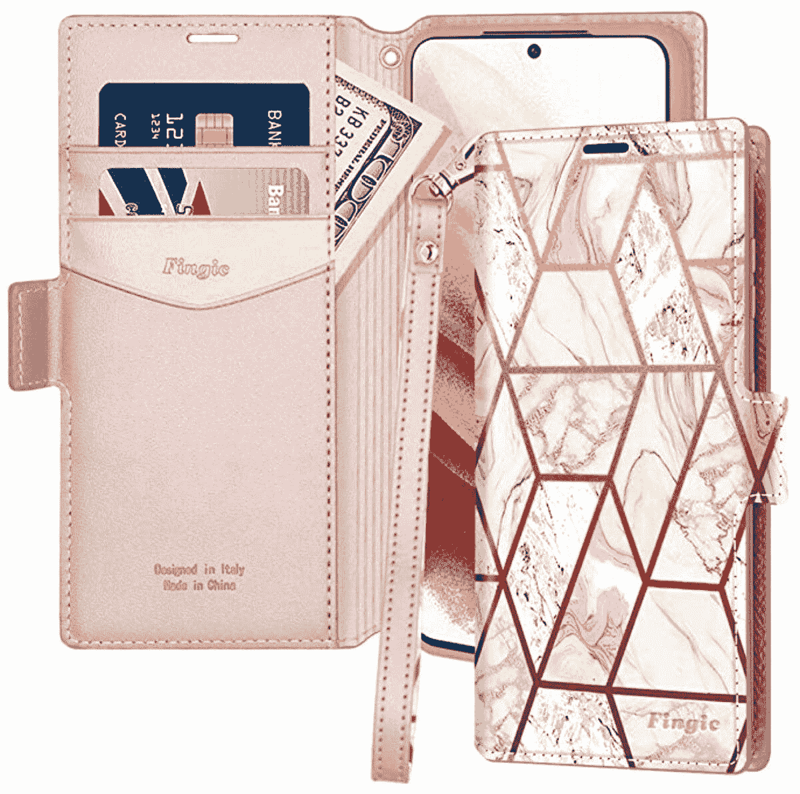

# 2023 年最佳 Galaxy S21 钱包保护套

> 原文：<https://www.xda-developers.com/best-galaxy-s21-wallet-cases/>

如果你正在寻找一部新的智能手机，三星 Galaxy S21 会是一个不错的选择。这是市场上最好的安卓手机之一，尽管它已经上市有一段时间了，它提供了 6.1 英寸的显示屏，120 赫兹的刷新率，4000 毫安时的电池，骁龙 888 处理器，三摄像头系统，令人惊叹的设计等等。如果你在 Galaxy S21 上花了 799 美元，你最不想做的事情就是做一个标记或打破它。保护您闪亮的新手机免受刮擦、碰撞和其他类型损坏的最佳方式是将它放在盒子里。

自从一月份推出以来，各种各样的 [Galaxy S21 外壳](https://www.xda-developers.com/best-galaxy-s21-cases)已经上市。其中许多是钱包式的包，通常提供全方位的保护，信用卡槽和现金口袋。为了帮助你挑选一个，我们收集了最好的 Galaxy S21 钱包。这些手机套有两个用途——保护你的手机免受刮伤和跌落，并存放一些额外的卡或现金。

 <picture></picture> 

Galaxy S21 5G LED Wallet Cover

##### 三星 LED Galaxy S21 钱包盒

三星的 LED 钱夹外壳具有抗菌涂层，可防止微生物生长，触摸控制可接听和拒绝电话，个性化图标，LED 通知和卡袋。你可以买到黑色、粉色、紫色和灰色的箱子。

 <picture></picture> 

Supcase Unicorn Beetle Pro

##### SUPCASE UB Pro Galaxy S21 外壳

当您在查看 Galaxy S21 的一些钱包保护套时，您可能会对一款坚固耐用的保护套感兴趣，这款保护套可以提供额外的保护，防止摔落。它装不下你的钱，但肯定会防止你因为破损而花更多的钱！

 <picture></picture> 

WWW Wallet Case

##### WWW 钱包 Galaxy S21 保护套

如果你是一个时尚的死忠，你会喜欢这款 Galaxy S21 的钱包。它提供了 PU 皮革设计，令人惊叹的激光雕刻花卉图案，精确的切口，卡槽，钱袋，化妆镜和磁性关闭。你可以买到黑色或玫瑰金的。

 <picture></picture> 

Olixar Wallet Stand Case

##### Olixar 钱包 Galaxy S21 包

Olixar 是智能手机配件领域的主要参与者，这个声誉良好的品牌为 Galaxy S21 提供了一个很好的钱包。它由真皮制成，提供信用卡插槽、支架功能、精确的切口、磁性关闭机制和无线充电支持。

 <picture></picture> 

TUCCH Galaxy S21 Wallet Case

##### TUCCH 皮革钱包 Galaxy S21 包

TUCCH 钱包盒采用皮革设计，TPU 内盒，磁性封口，RFID 阻挡技术，三个卡槽，一个现金袋，精确的切口和支架功能。它有各种各样的颜色。

 <picture></picture> 

Fingic Wallet Case

##### 金融钱包 Galaxy S21 保护套

Fingic 钱夹采用时尚的皮革设计和大理石印花，提供了一个坚固的聚碳酸酯保险杠、两个卡槽、一个现金箱、一个翻盖支架、一个磁性封口和一个腕带。

 <picture></picture> 

VRS Design Wallet Case

##### VRS 设计钱包 Galaxy S21 保护套

如果你不想要一个笨重的皮夹，看看这个选项。这是一款时尚的 Galaxy S21 保护套，带有一个可滑动打开的隔层，可以存放两张信用卡。该案件也有一个强大的 TPU 设计，提高了额外的保护边缘，和精确的切口。

 <picture></picture> 

Arae Wallet Case

##### Arae 钱包 Galaxy S21 包

这款钱夹盒来自 Arae，采用 PU 皮革设计，四个卡槽，一个现金袋，支架功能，精确的切口，TPU 内盒，时尚的设计。你可以在亚马逊上买到黑色、玫瑰金和酒红色。

 <picture></picture> 

Goospery Canvas Wallet Case

##### 古斯佩里帆布钱包银河 S21 盒

Goospbery 钱包由帆布面料和合成革制成，外观时尚，为 Galaxy S21 提供 360 度保护。它有一个 TPU 内壳，一个支架功能，一个耳机孔，信用卡槽，一个钱袋，和无线充电支持。

正如你所看到的，三星的新 Galaxy S21 有很多很棒的钱包。在大多数情况下，你可以保护你的 Galaxy S21 的所有方面，存储几张卡，随时随身携带现金，并使用方便的支架。但是你应该选择哪一个呢？如果你愿意在钱包上多花一点钱，那就值得考虑三星的 LED 钱包套。它提供了一个超薄的设计和一些非常酷的功能。

你可以在那里找到很多更便宜的 Galaxy S21 钱包。其中包括 Fingic 钱夹套和 TUCCH 钱夹套。事实上，在亚马逊上快速搜索一个 S21 钱包，就会找到很多价格合理的选择。当然，不是每个人都想要对开风格的皮夹盒。对于这些用户来说，VRS Design 钱包盒是那些想要一个光滑、轻便、最多可存储两张信用卡的包的人的绝佳选择。

 <picture></picture> 

Samsung Galaxy S21

三星 Galaxy S21 是 2021 年新旗舰系列的起点，包装在一个旗舰 SoC 中，以及一个体面的显示器和相机设置。