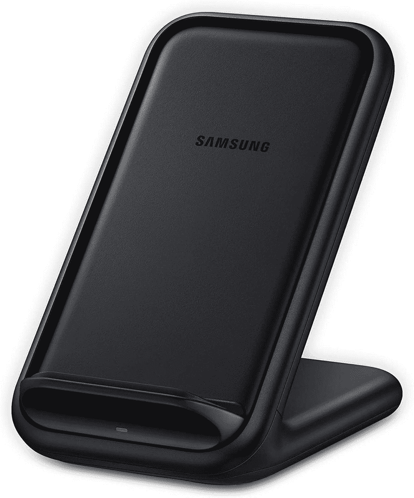

# 2023 年最佳三星 Galaxy S21 无线充电器

> 原文：<https://www.xda-developers.com/best-galaxy-s21-wireless-chargers/>

在过去的几年里，无线充电技术取得了长足的进步。你可以把手机放在[无线充电垫](https://www.xda-developers.com/best-qi-wireless-charger/)上，不用一直把它插在墙上的电源插座上，回来时手机已经充满电了。

像许多其他顶级安卓智能手机一样，[三星 Galaxy S21](https://www.xda-developers.com/samsung-galaxy-s21) ，Galaxy S21 Plus 和 Galaxy S21 Ultra 都支持 15W Qi 无线充电。然而，为了充分利用这项技术，你需要一个与 Galaxy S21 系列兼容的无线充电器。为了帮助你找到一个，我们收集了最好的 Galaxy S21 无线充电器。请注意，所有这些充电器都经过 Qi 认证，因此它们可以与任何支持 Qi 无线充电的设备配合使用。

*   <picture></picture>

    三星 15W 无线充电垫

    ##### 三星 15W 无线充电垫

    三星更新的 15W 无线充电器采用了圆滑的设计，并自带风扇散热系统，可以带走过多的热量，避免充电速度节流。

*   <picture></picture>

    三星 15W 无线充电器 Duo

    ##### 三星 15W 无线充电器 Duo

    三星新款 15W 无线充电器 Duo 支持 15W 快速无线充电，这意味着它非常适合您的 Galaxy S21。它还可以让你同时为另一个设备充电，无论是你的 Galaxy 手表、Buds 还是任何其他支持 Qi 充电并附带旅行适配器的配件。

*   ##### 三星无线充电器三重奏

    如果你拥有一部 Galaxy S21、一对 Galaxy Buds 和一块 Galaxy Watch，你就可以在三星无线充电器三重奏上同时为它们充电。它拥有时尚现代的设计，LED 充电状态灯，支持厚度高达 3 毫米的手机壳。

*   <picture></picture>

    三星无线充电座

    ##### 三星 15W 无线充电座

    使用三星的这款无线充电座，您可以在充电时以风景或肖像模式使用 Galaxy S21。Qi 兼容的支架配备了冷却风扇、LED 指示灯和 USB-C 壁式充电器。

*   <picture></picture>

    Anker

    ##### Anker 15W 无线充电器

    这款来自 Anker 的充电板提供了 15W 的最大功率输出，可以为您的 Galaxy S21 和您拥有的其他 Qi 兼容设备进行无线充电。充电器采用铝制底座，散热效果更好，防滑硅胶垫可在充电过程中保护您的设备。

*   <picture></picture>

    Spigen 15W 无线充电板

    ##### Spigen 15W 无线充电板

    Spigen 无线充电板是一款价格实惠的充电板，可与各种设备配合使用。它支持支持智能手机的 15W 快速充电，这意味着它非常适合您的 Galaxy S21。它不仅价格相对实惠，而且还配有 USB-C 到 USB-C 电缆和两年保修。

*   <picture></picture>

    mophie 无线充电板

    ##### 摩尔菲无线 15W 充电板

    mophie 无线充电板采用麂皮表面，外观时尚。凭借 15W 最大无线充电输出，您将获得 Galaxy S21 的最高充电速度。此外，您还可以获得一个捆绑的电源适配器。

*   <picture></picture>

    三星无线便携电池

    ##### 三星无线便携电池

    与本列表中的其他无线充电器不同，三星无线便携电池是一个 10，000 mAh 的电源库，支持 25W 快速有线充电和 7.5W 无线充电，帮助您在移动中为设备充电。电源银行可以同时为 3 个设备充电，有足够的电量为你的 Galaxy Note 20 充电两次以上。

虽然无线充电已经存在很长时间了，但今天市场上的无线充电器比以往任何时候都多。很高兴看到他们中的许多人将与三星的新 Galaxy S21 系列一起工作。

这些无线充电器都可以胜任，但三星的 15W 无线充电器将是大多数 Galaxy S21 用户的最佳选择。但是如果你有几个三星设备，那就值得看看三星的无线充电器三重奏。如果你不想花那么多钱，Anker 和 Spigen 的 15W 充电垫是可靠的选择。与此同时，如果你想在外出时给 Galaxy S21 的电池充电，三星的便携式无线充电器是很好的选择。更多推荐，请查看[最佳 Qi 无线充电器](https://www.xda-developers.com/best-qi-wireless-charger/)。

注意，Galaxy S21 系列的包装盒内没有充电砖，所以你需要依赖现有的电源砖或单独购买一个。如果你正在寻找一个，我们为 Galaxy S21 推荐[快速充电器。但是，如果你已经有了一个兼容的电源模块，投资一个无线充电器确实是有意义的，即使只是为了看看有什么大惊小怪的。他们非常方便，所以给他们一个镜头！](https://www.xda-developers.com/best-galaxy-s21-fast-chargers/)

 <picture></picture> 

Samsung Galaxy S21

三星 Galaxy S21 提供了优质的智能手机体验，封装在旗舰 SoC 中，以及体面的显示器和相机设置。