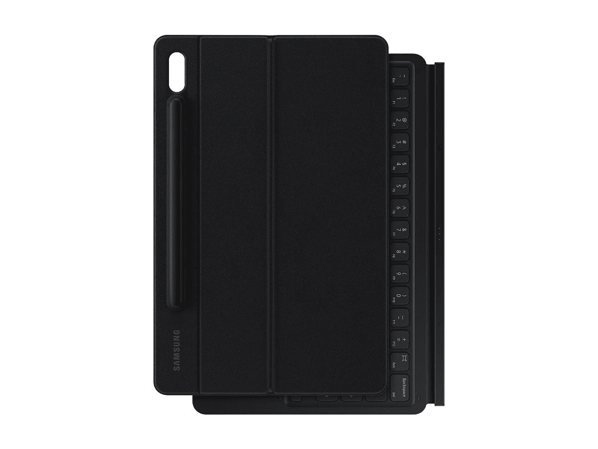
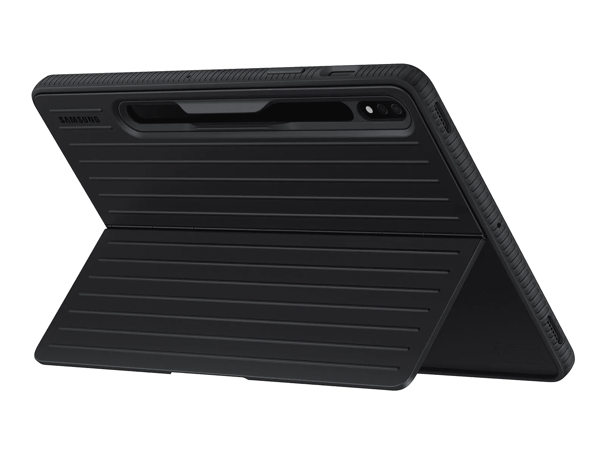
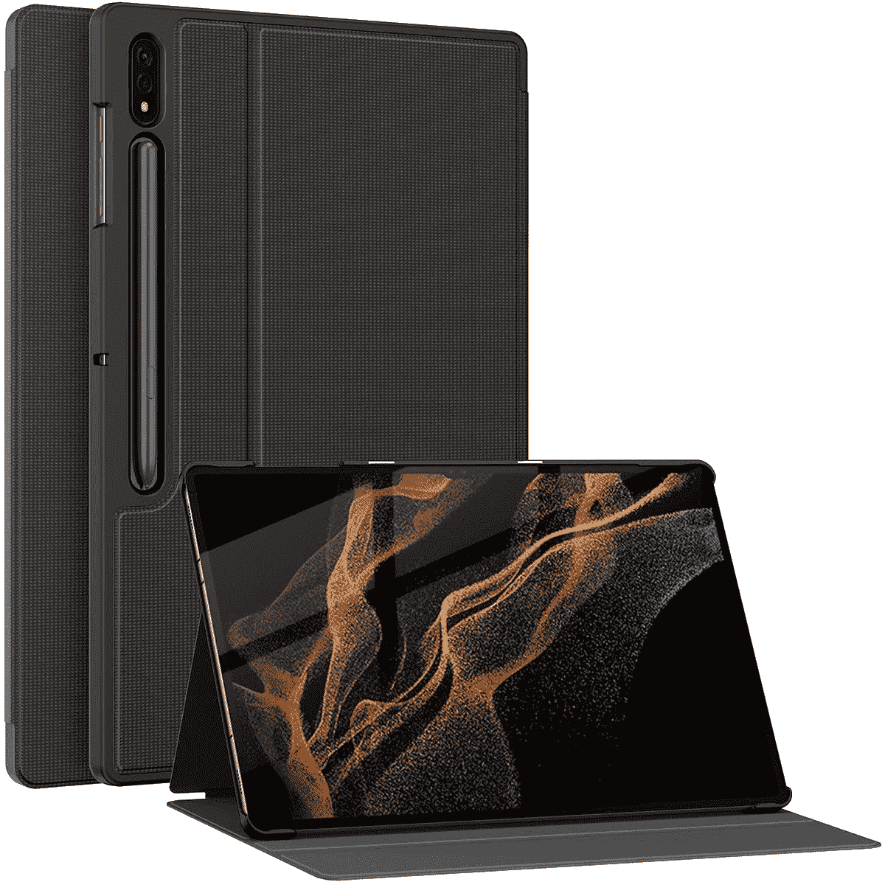
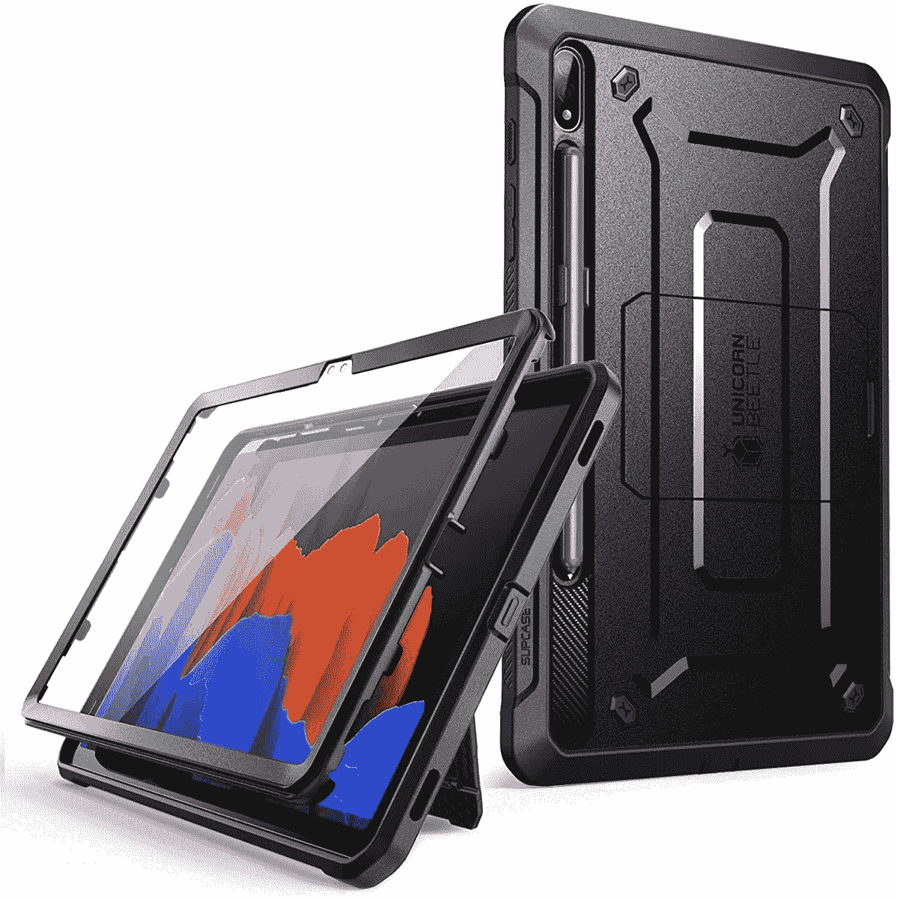
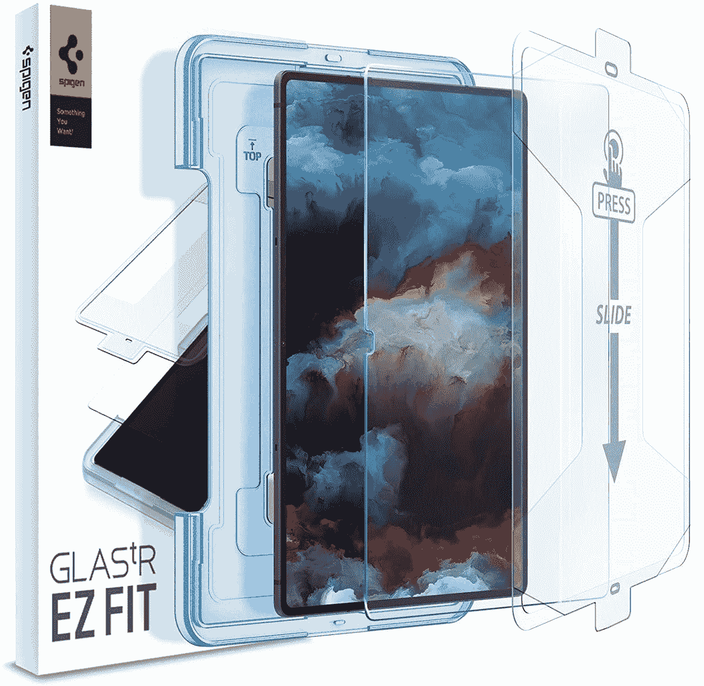

# 最佳 Galaxy Tab S8 系列配件

> 原文：<https://www.xda-developers.com/best-galaxy-tab-s8-series-accessories/>

三星在 2022 年 2 月公布了 Galaxy Tab S8 系列。平板电脑阵容由普通的 Galaxy Tab S8、更高端的 Galaxy Tab S8 Plus 和顶级的 [Galaxy Tab S8 Ultra](https://www.xda-developers.com/samsung-galaxy-tab-s8-ultra-review/) 组成。这三款平板电脑都有华丽的显示屏，高通的旗舰产品骁龙 8 代 1 芯片组，以及内置的 S-Pen。虽然它们本身很棒，但合适的附件可以为这些平板电脑增添更多功能、风格和保护。在本文中，我们将了解 Galaxy Tab S8 系列的一些最佳配件。

## 案例

如果你想保持 Galaxy Tab S8 的原始外观，保护它免受划痕和其他损坏，保护壳是必不可少的。我们在下面的列表中突出了一些最佳选项。

*   <picture></picture>

    fin tie 对开本

    ##### fin tie 对开本 Galaxy Tab S8 case

    这款对开本有一个 TPU 背面，正面有一种很好的皮革般的纹理。它看起来很高档，而且价格实惠。

*   <picture></picture>

    Galaxy Tab S8 书皮键盘

    ##### 三星 Galaxy Tab S8 书皮键盘

    Galaxy Tab S8 的书皮键盘提供了全方位的保护，加上键盘和触摸板，可以像笔记本电脑一样使用。它还包括一个支架。

*   <picture></picture>

    Galaxy Tab S8 保护套

    ##### 三星 Galaxy Tab S8 保护套

    这款基本款保护套可以保护你的 Galaxy Tab S8 免受跌落和碰撞，但让屏幕始终可见。它还有一个支架。

*   <picture></picture>

    Spigen Tough Armor Pro

    ##### Spigen Tough Armor Pro Galaxy Tab S8 Plus case

    这是另一款提供出色保护的坚固外壳。它具有侵略性的外观，背面还有一个支架。

*   ##### 三星 Galaxy Tab S8 Plus Book Cover 键盘超薄

    Galaxy Tab S8 Plus 的官方键盘盖采用了圆滑轻巧的设计。内置磁铁将键盘牢牢固定，而内置蓝牙键盘可将您的平板电脑变成一台微型笔记本电脑。该保护套还有一个专用插槽，用于安全存放 S-Pen。

    T36
*   <picture></picture>

    Otterbox Defender

    ##### Otterbox Defender Galaxy Tab S8 Plus 案

    Otterbox 因制作了一些最好的保护性案例而闻名，Galaxy Tab S8 Plus 的这个 Defender 案也不例外。它的边缘有厚厚的保险杠，用于跌落保护，端口盖和 S-Pen 的切口。

*   <picture></picture>

    Soke Premium 支架保护套

    ##### Soke Premium 支架 Galaxy Tab S8 Ultra 保护套

    这款全机身保护套为您的设备提供了全面的保护，为相机、S-Pen 和充电端口提供了精确的开孔。磁性外壳还具有自动唤醒/睡眠功能，让您在保护设备的同时轻松使用设备。

*   <picture></picture>

    sup case 独角甲虫 Pro

    ##### sup case UB Pro Galaxy Tab S8 Ultra case

    这款坚固耐用的保护套包含内置屏幕保护器。它还有一个 S 笔筒和一个支架。对于那些更看重安全性和功能性而非外形的人来说，它是理想之选。

*   <picture></picture>

    Galaxy Tab S8 Ultra Book Cover

    ##### 三星 Galaxy Tab S8 Ultra Book Cover

    官方 Book Cover case 外观时尚，为显示屏和背部提供了良好的保护，而不会增加额外的体积。它还有一个 S-Pen 磁条的切口和一个免提观看的支架。

寻找更多推荐？查看我们专门的综述。

## 屏幕保护器

所有三款 Galaxy Tab S8 平板电脑都受到大猩猩玻璃 5 的保护。但是，即使是最好的玻璃和材料也可能被划伤和损坏。为了保护平板电脑的显示屏，我们建议使用以下列表中的钢化玻璃屏幕保护器。"

*   ##### Spigen 钢化玻璃 Galaxy Tab S8 屏幕保护器

    Spigen 的钢化玻璃屏幕保护器额定硬度为 9H，并带有防眩光和防指纹的疏油涂层。自动校准套件提供防故障安装。

    

*   <picture></picture>

    Ringke 隐形防卫者玻璃

    ##### Ringke 隐形防卫者 Galaxy Tab S8 Plus Screen Protector

    此款价格实惠，Ringke 的钢化玻璃屏幕保护者采用优质材料制成，防刮擦。

*   <picture></picture>

    Spigen 钢化玻璃屏幕保护器

    ##### Spigen 钢化玻璃 Galaxy Tab S8 超屏幕保护器

    Spigen 以其优质的产品而闻名，备受信赖。该公司的这款钢化玻璃屏幕保护器便于携带，具有疏油涂层，可以抵御强光和指纹。

请查看我们的专用中心获取建议:

## 充电器、电缆和其他配件

Galaxy Tab S8、S8 Plus 和 S8 Ultra 支持 45W 快速有线充电。然而，三星没有在盒子里捆绑充电器——你只有一根 USB-C 到 USB-C 的电缆。如果你想买一个快速充电器，我们在下面收集了几个不错的选择。

*   <picture></picture>

    Belkin 68W 充电器

    ##### Belkin 65W GaN 双端口 USB 充电器

    这款基于 GaN 的充电器来自 Belkin，提供 65W 功率输出，有两个 USB-C 端口，让您可以同时为 Galaxy Tab S8 和笔记本电脑快速充电。

*   ##### Anker 511 Nano 3

    Anker 511 Nano 3 是目前市场上最小的 30W 充电器之一，支持 USB 供电(PD)和可编程电源(PPS)。这种 GaN 充电器只有 1.12 英寸厚，比市场上许多其他 30W 充电器小 70%。T

*   <picture></picture>

    三星 USB C 转 HDMI 线用于 DeX

    ##### 三星 USB C 转 HDMI 线用于 DeX

    三星官方 USB C 转 HDMI 线可以让您将 Galaxy Tab S8 连接到电视或显示器等外部显示器。

    T34
*   ##### 安科尼龙 USB-C 转 USB-C 编织电缆

    此包 USB-C 转 USB-C 电缆包含三根 6 英尺编织电缆。它们支持高达 60W 的快速充电，有三种颜色可供选择。

*   Galaxy Buds 2 Pro 是最新上架的 TWS 之一。与旧的 Buds Pro 相比，这些高端耳塞的设计略有不同，更小。它们还支持降噪、3D 音频等功能。
*   <picture></picture>

    三星 Pro Plus microSDXC 卡

    ##### 三星 Pro Plus microSD 卡

    Pro Plus 是三星性能最好的 microSD 卡之一，有望达到 160MB/s 的读取速度，并获得 U3、A2 和 V30 认证。它有高达 512GB 的大小，应该足以满足您的几乎所有需求。

三星 Galaxy Tab S8、Galaxy S8 Plus 和 Galaxy Tab S8 Ultra 是出色的 Android 平板电脑，这些配件可以帮助您充分利用它们。无论您是需要一个键盘保护套来打字，还是需要一个保护套来增加保护，还是需要一副无线耳塞，我们的产品都能满足您的需求。

*   ##### 三星 Galaxy Tab S8

    三星 Galaxy Tab S8 是该公司 2022 年旗舰平板电脑阵容的入门级设备，配备 S Pen 和 11 英寸显示屏。

    

*   ##### 三星 Galaxy Tab S8 Plus

    三星 Galaxy Tab S8 Plus 是一款 12.4 英寸的 Android 平板电脑，采用高通骁龙 8 Gen 1 SoC，8GB RAM，支持 S Pen。

*   三星 Galaxy Tab S8 Ultra 是该公司最新旗舰阵容中最高端的平板电脑，采用 14.6 英寸屏幕。